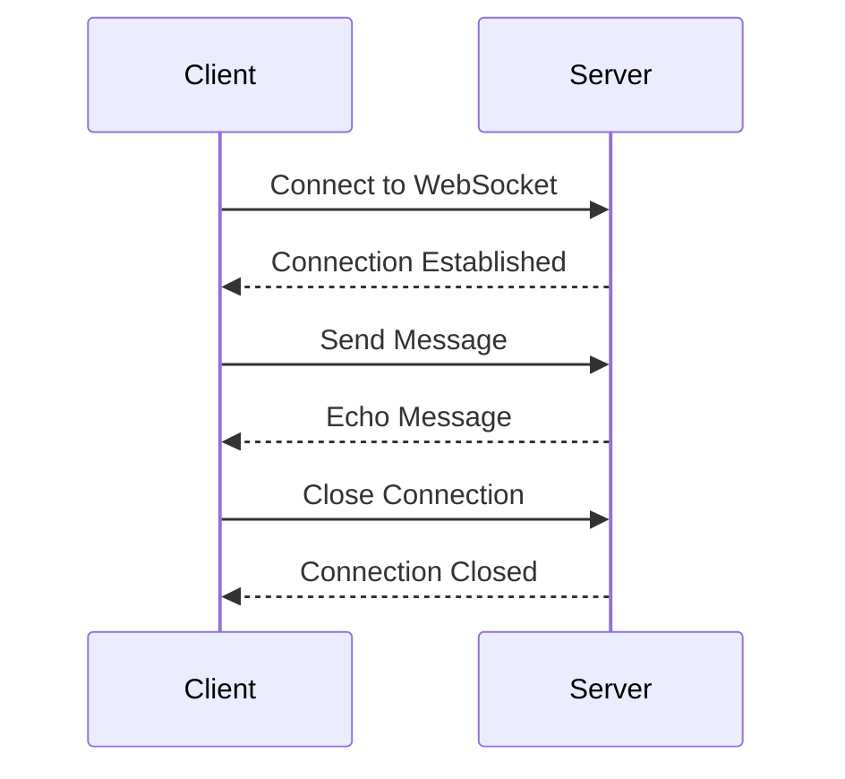

## 13.6 WebSockets and Real-Time Communication

In today's fast-paced digital world, real-time communication has become a cornerstone for interactive web applications. WebSockets provide a powerful protocol for enabling two-way communication between clients and servers over a single, long-lived connection. This section will guide you through the implementation of WebSockets in Haxe, leveraging its cross-platform capabilities to create responsive, real-time applications.

### Understanding WebSockets

**WebSockets** are a protocol that enables full-duplex communication channels over a single TCP connection. Unlike traditional HTTP requests, which are unidirectional and require a new connection for each request/response cycle, WebSockets maintain a persistent connection, allowing for continuous data exchange between the client and server.

#### Key Features of WebSockets

- **Full-Duplex Communication:** Allows simultaneous two-way data exchange.
- **Low Latency:** Reduces the overhead of establishing new connections, resulting in faster data transmission.
- **Persistent Connection:** Maintains a single connection for ongoing communication, reducing server load.
- **Cross-Platform Support:** Compatible with various platforms and languages, including Haxe.

### Implementing WebSockets in Haxe

Haxe's versatility allows us to target multiple platforms, making it an excellent choice for implementing WebSockets. We'll explore both server-side and client-side implementations using Haxe.

#### Server-Side Implementation with Node.js

For the server-side, we can target Node.js using Haxe. Node.js provides robust WebSocket libraries that can be easily integrated with Haxe.

1. **Setting Up the Haxe Project:**

   First, ensure you have Haxe and Node.js installed. Create a new Haxe project targeting Node.js:

   ```bash
   haxelib install hxnodejs
   haxelib install websocket
   ```

2. **Creating the WebSocket Server:**

   Here's a simple WebSocket server using Haxe and Node.js:

   ```haxe
   import js.node.http.Server;
   import js.node.websocket.WebSocketServer;
   import js.node.websocket.WebSocket;

   class WebSocketServerExample {
       static function main() {
           var server = new Server();
           var wss = new WebSocketServer({ server: server });

           wss.on("connection", function(ws: WebSocket) {
               trace("Client connected");

               ws.on("message", function(message: String) {
                   trace("Received: " + message);
                   ws.send("Echo: " + message);
               });

               ws.on("close", function() {
                   trace("Client disconnected");
               });
           });

           server.listen(8080, function() {
               trace("WebSocket server running on ws://localhost:8080");
           });
       }
   }
   ```

   - **Explanation:** This code sets up a WebSocket server that listens for connections on port 8080. When a client connects, it logs the connection and listens for messages. Upon receiving a message, it echoes the message back to the client.

#### Client-Side Implementation with JavaScript

On the client side, we can use Haxe to compile to JavaScript and interact with the WebSocket API.

1. **Setting Up the Client:**

   Create a new Haxe project targeting JavaScript:

   ```bash
   haxelib install hxjs
   ```

2. **Creating the WebSocket Client:**

   Here's a simple WebSocket client using Haxe:

   ```haxe
   import js.Browser;
   import js.html.WebSocket;

   class WebSocketClientExample {
       static function main() {
           var ws = new WebSocket("ws://localhost:8080");

           ws.onopen = function(_) {
               trace("Connected to server");
               ws.send("Hello, server!");
           };

           ws.onmessage = function(event) {
               trace("Received from server: " + event.data);
           };

           ws.onclose = function(_) {
               trace("Disconnected from server");
           };
       }
   }
   ```

   - **Explanation:** This client connects to the WebSocket server at `ws://localhost:8080`. Upon connection, it sends a greeting message to the server and logs any messages received from the server.

### Use Cases and Examples

WebSockets are ideal for applications requiring real-time updates and interactions. Let's explore some common use cases:

#### Live Updates

WebSockets are perfect for implementing real-time notifications and live feeds. For example, a news website can use WebSockets to push breaking news alerts to users instantly.

#### Collaborative Tools

In collaborative applications like shared workspaces or multiplayer games, WebSockets enable seamless real-time communication between users. This allows for instant updates and interactions, enhancing user experience.

### Visualizing WebSocket Communication

To better understand the flow of WebSocket communication, let's visualize the interaction between the client and server.



- **Diagram Explanation:** This sequence diagram illustrates the lifecycle of a WebSocket connection. The client initiates a connection, sends a message, receives an echo from the server, and finally closes the connection.

### Design Considerations

When implementing WebSockets, consider the following:

- **Scalability:** Ensure your server can handle multiple concurrent connections efficiently.
- **Security:** Use secure WebSockets (wss://) to encrypt data and protect against eavesdropping.
- **Error Handling:** Implement robust error handling to manage connection drops and retries.
- **Cross-Platform Compatibility:** Leverage Haxe's cross-platform capabilities to ensure your application works seamlessly across different environments.

### Differences and Similarities with Other Protocols

WebSockets are often compared to other communication protocols like HTTP and SSE (Server-Sent Events). Here's how they differ:

- **WebSockets vs. HTTP:** WebSockets provide full-duplex communication, whereas HTTP is request-response based.
- **WebSockets vs. SSE:** WebSockets support two-way communication, while SSE is one-way (server to client).

### Try It Yourself

To deepen your understanding, try modifying the code examples:

- **Experiment with Different Messages:** Change the messages sent between the client and server.
- **Add More Clients:** Simulate multiple clients connecting to the server simultaneously.
- **Implement a Chat Application:** Extend the examples to create a simple chat application.

### Further Reading

For more information on WebSockets, consider the following resources:

- [MDN Web Docs: WebSockets](https://developer.mozilla.org/en-US/docs/Web/API/WebSockets_API)
- [WebSocket.org](https://www.websocket.org/)
- [Node.js WebSocket Libraries](https://www.npmjs.com/package/ws)

### Knowledge Check

Before moving on, let's summarize the key takeaways:

- WebSockets enable two-way communication over a persistent connection.
- Haxe can target both server-side (Node.js) and client-side (JavaScript) for WebSocket implementation.
- WebSockets are ideal for real-time applications like live updates and collaborative tools.

Remember, mastering WebSockets in Haxe opens up a world of possibilities for creating dynamic, interactive web applications. Keep experimenting, stay curious, and enjoy the journey!

## Quiz Time!



### What is the primary advantage of using WebSockets over HTTP?

- [x] Full-duplex communication
- [ ] Lower latency
- [ ] Easier to implement
- [ ] Better security

> **Explanation:** WebSockets allow full-duplex communication, enabling simultaneous two-way data exchange, unlike HTTP's request-response model.

### Which Haxe target is used for server-side WebSocket implementation?

- [x] Node.js
- [ ] JavaScript
- [ ] Python
- [ ] C++

> **Explanation:** Node.js is the target used for server-side WebSocket implementation in Haxe.

### What is the purpose of the `onmessage` event in a WebSocket client?

- [x] To handle incoming messages from the server
- [ ] To send messages to the server
- [ ] To establish a connection
- [ ] To close the connection

> **Explanation:** The `onmessage` event is triggered when the client receives a message from the server.

### How can you secure WebSocket communication?

- [x] Use secure WebSockets (wss://)
- [ ] Use HTTP instead
- [ ] Disable encryption
- [ ] Use plain text communication

> **Explanation:** Secure WebSockets (wss://) encrypt data, protecting against eavesdropping and ensuring secure communication.

### What is a common use case for WebSockets?

- [x] Real-time notifications
- [ ] Static web pages
- [ ] Batch processing
- [ ] File storage

> **Explanation:** WebSockets are commonly used for real-time notifications due to their ability to push updates instantly.

### Which event is triggered when a WebSocket connection is closed?

- [x] `onclose`
- [ ] `onopen`
- [ ] `onmessage`
- [ ] `onerror`

> **Explanation:** The `onclose` event is triggered when a WebSocket connection is closed.

### What is a key consideration when implementing WebSockets?

- [x] Scalability
- [ ] Simplicity
- [ ] Cost
- [ ] Color scheme

> **Explanation:** Scalability is crucial to ensure the server can handle multiple concurrent WebSocket connections efficiently.

### How does WebSockets differ from SSE?

- [x] WebSockets support two-way communication
- [ ] WebSockets are one-way
- [ ] SSE supports two-way communication
- [ ] SSE is faster

> **Explanation:** WebSockets support two-way communication, while SSE is one-way (server to client).

### What is the role of the `onopen` event in a WebSocket client?

- [x] To indicate that the connection is established
- [ ] To send a message
- [ ] To receive a message
- [ ] To close the connection

> **Explanation:** The `onopen` event is triggered when the WebSocket connection is successfully established.

### True or False: WebSockets can only be used in web browsers.

- [ ] True
- [x] False

> **Explanation:** WebSockets can be used in various environments, not just web browsers, including server-side applications.


