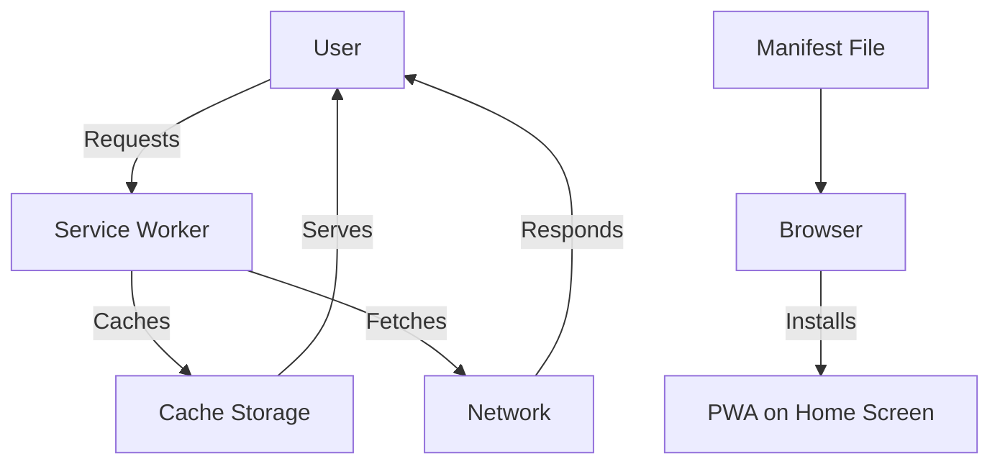

## 13.7 Progressive Web Apps (PWAs)

Progressive Web Apps (PWAs) represent a paradigm shift in web development, combining the best of web and mobile applications to deliver a seamless, app-like experience directly through the browser. With Haxe, a versatile cross-platform language, you can harness the power of PWAs to create robust, efficient, and engaging applications. In this section, we will delve into the core components of PWAs, explore their implementation using Haxe, and provide practical examples to guide you through the process.

### Understanding Progressive Web Apps

**Definition:** Progressive Web Apps are web applications that leverage modern web technologies to provide users with an experience akin to native apps. They are characterized by their ability to work offline, load quickly, and be installable on a user's device.

#### Key Features of PWAs

- **Offline Functionality:** PWAs can function without an internet connection, thanks to service workers that cache resources.
- **Responsive Design:** They adapt to various screen sizes and devices, ensuring a consistent user experience.
- **Installability:** Users can add PWAs to their home screens, making them easily accessible.
- **Fast Loading:** By utilizing caching and efficient resource management, PWAs load quickly, even on slow networks.
- **Secure:** PWAs are served over HTTPS, ensuring secure data transmission.

### Implementing PWAs with Haxe

Haxe's cross-platform capabilities make it an excellent choice for developing PWAs. Let's explore how to implement the essential components of a PWA using Haxe.

#### Service Workers

Service workers are at the heart of a PWA's offline capabilities. They act as a proxy between the web application and the network, intercepting requests and serving cached resources when the network is unavailable.

**Implementing Service Workers in Haxe:**

```haxe
// ServiceWorker.hx
import js.Browser;
import js.html.ServiceWorkerGlobalScope;

class ServiceWorker {
    public static function main() {
        if (Browser.window.navigator.serviceWorker != null) {
            Browser.window.navigator.serviceWorker.register("/service-worker.js").then(function(registration) {
                trace("Service Worker registered with scope: " + registration.scope);
            }).catch(function(error) {
                trace("Service Worker registration failed: " + error);
            });
        }
    }
}
```

**Service Worker Script (service-worker.js):**

```javascript
self.addEventListener('install', function(event) {
    event.waitUntil(
        caches.open('my-cache').then(function(cache) {
            return cache.addAll([
                '/',
                '/index.html',
                '/styles.css',
                '/app.js'
            ]);
        })
    );
});

self.addEventListener('fetch', function(event) {
    event.respondWith(
        caches.match(event.request).then(function(response) {
            return response || fetch(event.request);
        })
    );
});
```

**Explanation:**

- **Registration:** The `ServiceWorker` class registers the service worker script (`service-worker.js`) with the browser.
- **Caching:** During the `install` event, the service worker caches essential resources.
- **Fetch Handling:** The `fetch` event intercepts network requests, serving cached resources if available.

#### Responsive Design

Responsive design ensures that your PWA looks and functions well on devices of all sizes. Haxe can be used to create responsive layouts by leveraging CSS and JavaScript.

**Responsive Design with Haxe:**

```haxe
// ResponsiveLayout.hx
import js.Browser;
import js.html.Document;
import js.html.Element;

class ResponsiveLayout {
    public static function main() {
        var container:Element = Browser.document.getElementById("container");
        container.style.width = "100%";
        container.style.maxWidth = "1200px";
        container.style.margin = "0 auto";
    }
}
```

**CSS for Responsive Design:**

```css
body {
    font-family: Arial, sans-serif;
    margin: 0;
    padding: 0;
}

#container {
    padding: 20px;
}

@media (max-width: 768px) {
    #container {
        padding: 10px;
    }
}
```

**Explanation:**

- **Container Styling:** The `ResponsiveLayout` class sets the container's width and margin to ensure it is centered and responsive.
- **Media Queries:** CSS media queries adjust the padding based on the screen width.

#### Manifest File

The web app manifest is a JSON file that provides metadata about your PWA, such as its name, icons, and start URL. It enables the app to be installed on a user's device.

**Creating a Manifest File:**

```json
{
    "name": "My PWA",
    "short_name": "PWA",
    "start_url": "/index.html",
    "display": "standalone",
    "background_color": "#ffffff",
    "theme_color": "#000000",
    "icons": [
        {
            "src": "/icons/icon-192x192.png",
            "sizes": "192x192",
            "type": "image/png"
        },
        {
            "src": "/icons/icon-512x512.png",
            "sizes": "512x512",
            "type": "image/png"
        }
    ]
}
```

**Explanation:**

- **Name and Short Name:** The `name` and `short_name` are used to identify the app.
- **Start URL:** The `start_url` specifies the initial page to load when the app is launched.
- **Display Mode:** The `display` property determines how the app is presented (e.g., `standalone`).
- **Icons:** The `icons` array provides images for different device resolutions.

### Use Cases and Examples

PWAs are versatile and can be applied in various scenarios. Let's explore some common use cases and examples.

#### Offline Functionality

PWAs are ideal for applications that need to function without an internet connection. For example, a note-taking app can allow users to create and edit notes offline, syncing changes when connectivity is restored.

**Example: Offline Note-Taking App**

```haxe
// NoteApp.hx
import js.Browser;
import js.html.LocalStorage;

class NoteApp {
    public static function main() {
        var notes:Array<String> = LocalStorage.getItem("notes") != null ? JSON.parse(LocalStorage.getItem("notes")) : [];
        // Display notes and provide functionality to add/edit notes
    }
}
```

**Explanation:**

- **Local Storage:** The `NoteApp` class uses `LocalStorage` to persist notes locally, enabling offline access.

#### Mobile-Friendly Applications

PWAs provide a native app experience through the browser, making them suitable for mobile-friendly applications. For instance, a weather app can offer real-time updates and notifications.

**Example: Mobile Weather App**

```haxe
// WeatherApp.hx
import js.Browser;
import js.html.Notification;

class WeatherApp {
    public static function main() {
        if (Notification.permission != "granted") {
            Notification.requestPermission();
        }
        // Fetch weather data and display notifications
    }
}
```

**Explanation:**

- **Notifications:** The `WeatherApp` class requests permission to send notifications, enhancing user engagement.

### Visualizing PWA Architecture

To better understand the architecture of a PWA, let's visualize its components and interactions.



**Diagram Explanation:**

- **User Requests:** The user interacts with the PWA, triggering requests.
- **Service Worker:** Intercepts requests, serving cached resources or fetching from the network.
- **Cache Storage:** Stores cached resources for offline access.
- **Manifest File:** Provides metadata for installation, enabling the PWA to be added to the home screen.

### References and Links

- [MDN Web Docs: Progressive Web Apps](https://developer.mozilla.org/en-US/docs/Web/Progressive_web_apps)
- [Google Developers: PWAs](https://developers.google.com/web/progressive-web-apps)
- [W3C: Service Workers](https://www.w3.org/TR/service-workers/)

### Knowledge Check

- **Question:** What is the primary role of a service worker in a PWA?
- **Challenge:** Modify the `service-worker.js` script to cache additional resources.

### Embrace the Journey

Remember, building Progressive Web Apps is an exciting journey that combines the best of web and mobile technologies. As you continue to explore and experiment with PWAs using Haxe, you'll unlock new possibilities for creating engaging, efficient, and cross-platform applications. Keep pushing the boundaries, stay curious, and enjoy the process!

## Quiz Time!



### What is a Progressive Web App (PWA)?

- [x] A web application that uses modern web capabilities to deliver an app-like experience.
- [ ] A native mobile application.
- [ ] A desktop application.
- [ ] A command-line tool.

> **Explanation:** PWAs are web applications that leverage modern web technologies to provide a native app-like experience.

### Which component is essential for offline functionality in a PWA?

- [x] Service Worker
- [ ] Manifest File
- [ ] Responsive Design
- [ ] WebSocket

> **Explanation:** Service workers enable offline functionality by caching resources and intercepting network requests.

### What is the purpose of a web app manifest?

- [x] To provide metadata about the PWA for installation.
- [ ] To handle network requests.
- [ ] To style the application.
- [ ] To manage user authentication.

> **Explanation:** The web app manifest is a JSON file that provides metadata, enabling the app to be installed on a user's device.

### How does a PWA ensure fast loading?

- [x] By utilizing caching and efficient resource management.
- [ ] By using larger images.
- [ ] By increasing server response time.
- [ ] By disabling JavaScript.

> **Explanation:** PWAs use caching and efficient resource management to load quickly, even on slow networks.

### What is the role of responsive design in a PWA?

- [x] To ensure the app works across various devices and screen sizes.
- [ ] To handle offline functionality.
- [ ] To manage user authentication.
- [ ] To provide metadata for installation.

> **Explanation:** Responsive design ensures that the PWA looks and functions well on devices of all sizes.

### Which of the following is a key feature of PWAs?

- [x] Installability
- [ ] High server load
- [ ] Complex setup
- [ ] Limited device compatibility

> **Explanation:** PWAs are installable, allowing users to add them to their home screens for easy access.

### What is the primary benefit of using Haxe for PWA development?

- [x] Cross-platform capabilities
- [ ] Limited language support
- [ ] Complex syntax
- [ ] Lack of community support

> **Explanation:** Haxe's cross-platform capabilities make it an excellent choice for developing PWAs.

### What is the purpose of the `fetch` event in a service worker?

- [x] To intercept network requests and serve cached resources.
- [ ] To provide metadata for installation.
- [ ] To style the application.
- [ ] To manage user authentication.

> **Explanation:** The `fetch` event intercepts network requests, serving cached resources if available.

### How can a PWA enhance user engagement?

- [x] By sending notifications
- [ ] By increasing server response time
- [ ] By using larger images
- [ ] By disabling JavaScript

> **Explanation:** PWAs can enhance user engagement by sending notifications, keeping users informed and engaged.

### True or False: PWAs are only suitable for mobile devices.

- [ ] True
- [x] False

> **Explanation:** PWAs are suitable for both mobile and desktop devices, providing a consistent experience across platforms.


