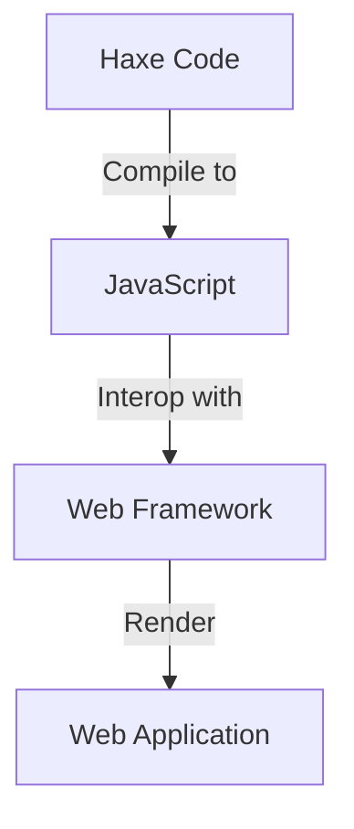

## 13.8 Integrating Haxe with Web Frameworks

In the realm of web development, integrating Haxe with popular web frameworks can unlock a plethora of opportunities for creating robust, scalable, and maintainable applications. This section delves into the strategies and techniques for effectively integrating Haxe with web frameworks, focusing on the use of externs, framework wrappers, and practical use cases.

### Strategies for Integration

Integrating Haxe with web frameworks involves several strategies that leverage Haxe's unique features, such as its powerful type system and cross-platform capabilities. Let's explore these strategies in detail.

#### Externs and Interop

Externs in Haxe are a powerful feature that allows you to define external classes and interfaces for JavaScript libraries. This enables seamless interaction between Haxe and JavaScript, allowing you to leverage existing JavaScript libraries while maintaining the benefits of Haxe's type safety and compile-time checks.

- **Define Extern Classes:** Extern classes in Haxe map JavaScript objects and functions to Haxe types. This mapping is crucial for interacting with JavaScript libraries and frameworks.
- **Interop with JavaScript:** By defining externs, you can call JavaScript functions and access JavaScript objects directly from Haxe code, enabling smooth interoperation between the two languages.

#### Framework Wrappers

Framework wrappers are Haxe libraries that encapsulate the functionality of popular web frameworks like Angular, React, or Vue.js. These wrappers provide a Haxe-friendly API, allowing developers to use these frameworks without leaving the Haxe ecosystem.

- **Use Existing Wrappers:** Many community-driven projects provide Haxe wrappers for popular frameworks, which can be used to quickly integrate Haxe into your web development workflow.
- **Create Custom Wrappers:** If a wrapper doesn't exist for a specific framework, you can create your own by defining externs and providing a Haxe-friendly API.

### Implementing Externs

Implementing externs is a critical step in integrating Haxe with web frameworks. This involves defining types and ensuring type safety, which are essential for leveraging Haxe's compiler to catch errors at compile time.

#### Defining Types

When defining externs, you map JavaScript types and functions to Haxe types. This mapping allows you to use JavaScript libraries as if they were native Haxe libraries.

```haxe
// Define an extern for a JavaScript library
@:jsRequire("some-library")
extern class SomeLibrary {
  static function doSomething(param: String): Void;
}
```

- **Annotate with `@:jsRequire`:** Use the `@:jsRequire` metadata to specify the JavaScript library.
- **Define Static Functions:** Map JavaScript functions to static functions in the extern class.

#### Type Safety

Haxe's strong type system ensures that any type mismatches are caught at compile time, reducing runtime errors and improving code reliability.

- **Leverage Type Inference:** Haxe's type inference can automatically deduce types, reducing the need for explicit type annotations.
- **Use Type Parameters:** Define generic externs with type parameters to handle a variety of JavaScript types.

### Use Cases and Examples

Integrating Haxe with web frameworks opens up numerous possibilities for leveraging existing libraries and creating hybrid applications. Let's explore some practical use cases and examples.

#### Leverage Existing Libraries

By using externs, you can leverage mature JavaScript libraries while maintaining Haxe's advantages, such as type safety and cross-platform compilation.

```haxe
// Example of using a JavaScript library with Haxe externs
@:jsRequire("lodash")
extern class Lodash {
  static function map<T>(array: Array<T>, iteratee: T -> T): Array<T>;
}

class Main {
  static function main() {
    var numbers = [1, 2, 3];
    var doubled = Lodash.map(numbers, n -> n * 2);
    trace(doubled); // Output: [2, 4, 6]
  }
}
```

- **Integrate with Lodash:** Use the Lodash library to perform operations on arrays, demonstrating the power of externs.
- **Maintain Type Safety:** Ensure that all operations are type-safe, leveraging Haxe's compiler.

#### Hybrid Applications

Combine Haxe code with existing JavaScript projects to create hybrid applications that benefit from both ecosystems.

- **Use Haxe for Business Logic:** Implement core business logic in Haxe, taking advantage of its type safety and cross-platform capabilities.
- **Integrate with JavaScript UI Frameworks:** Use JavaScript frameworks for the user interface, ensuring a seamless integration with Haxe.

### Visualizing Integration

To better understand the integration process, let's visualize how Haxe interacts with web frameworks using Mermaid.js diagrams.



**Diagram Description:** This diagram illustrates the flow of Haxe code being compiled to JavaScript, which then interoperates with a web framework to render a web application.

### References and Links

For further reading and deeper dives into the topics covered in this section, consider exploring the following resources:

- [MDN Web Docs: JavaScript](https://developer.mozilla.org/en-US/docs/Web/JavaScript)
- [Haxe Manual: Externs](https://haxe.org/manual/lf-externs.html)
- [Haxe and JavaScript Interop](https://haxe.org/manual/target-javascript.html)

### Knowledge Check

To reinforce your understanding of integrating Haxe with web frameworks, consider the following questions and exercises:

- **Question:** What are externs in Haxe, and how do they facilitate integration with JavaScript libraries?
- **Exercise:** Create an extern for a simple JavaScript library and use it in a Haxe project.
- **Challenge:** Develop a small web application using Haxe and a JavaScript framework of your choice.

### Embrace the Journey

Remember, integrating Haxe with web frameworks is just the beginning. As you progress, you'll discover more ways to leverage Haxe's unique features to build powerful web applications. Keep experimenting, stay curious, and enjoy the journey!

## Quiz Time!



### What is the primary purpose of externs in Haxe?

- [x] To define external classes and interfaces for JavaScript libraries
- [ ] To compile Haxe code to JavaScript
- [ ] To create user interfaces
- [ ] To manage dependencies

> **Explanation:** Externs in Haxe are used to define external classes and interfaces for JavaScript libraries, enabling seamless interaction between Haxe and JavaScript.

### How do you specify a JavaScript library in a Haxe extern class?

- [x] Using the `@:jsRequire` metadata
- [ ] Using the `@:extern` keyword
- [ ] By importing the library in Haxe
- [ ] By defining a static function

> **Explanation:** The `@:jsRequire` metadata is used to specify the JavaScript library in a Haxe extern class.

### What advantage does Haxe's type system provide when integrating with JavaScript?

- [x] It ensures type safety and catches errors at compile time
- [ ] It allows dynamic typing
- [ ] It simplifies syntax
- [ ] It improves runtime performance

> **Explanation:** Haxe's type system ensures type safety and catches errors at compile time, reducing runtime errors.

### What is a framework wrapper in the context of Haxe?

- [x] A Haxe library that encapsulates the functionality of a web framework
- [ ] A JavaScript library for Haxe
- [ ] A tool for compiling Haxe code
- [ ] A method for debugging Haxe applications

> **Explanation:** A framework wrapper is a Haxe library that encapsulates the functionality of a web framework, providing a Haxe-friendly API.

### Which of the following is a benefit of using Haxe for business logic in hybrid applications?

- [x] Type safety and cross-platform capabilities
- [ ] Simplified user interface design
- [ ] Faster rendering of web pages
- [ ] Easier integration with databases

> **Explanation:** Using Haxe for business logic provides type safety and cross-platform capabilities, which are beneficial for hybrid applications.

### What is the role of the `@:jsRequire` metadata in Haxe?

- [x] To specify the JavaScript library required for an extern class
- [ ] To define a new Haxe class
- [ ] To import Haxe modules
- [ ] To manage dependencies

> **Explanation:** The `@:jsRequire` metadata is used to specify the JavaScript library required for an extern class in Haxe.

### How can you leverage existing JavaScript libraries in Haxe?

- [x] By defining externs for the libraries
- [ ] By rewriting the libraries in Haxe
- [ ] By using Haxe's native functions
- [ ] By importing the libraries directly

> **Explanation:** You can leverage existing JavaScript libraries in Haxe by defining externs for the libraries.

### What is a key benefit of using framework wrappers in Haxe?

- [x] They provide a Haxe-friendly API for popular web frameworks
- [ ] They improve the performance of web applications
- [ ] They simplify the deployment process
- [ ] They reduce the size of the compiled code

> **Explanation:** Framework wrappers provide a Haxe-friendly API for popular web frameworks, making it easier to integrate Haxe with these frameworks.

### Which of the following is a common use case for integrating Haxe with web frameworks?

- [x] Creating hybrid applications that combine Haxe and JavaScript
- [ ] Developing standalone desktop applications
- [ ] Building command-line tools
- [ ] Designing graphics for games

> **Explanation:** A common use case for integrating Haxe with web frameworks is creating hybrid applications that combine Haxe and JavaScript.

### True or False: Haxe can only be used for server-side web development.

- [ ] True
- [x] False

> **Explanation:** False. Haxe can be used for both client-side and server-side web development, as well as for cross-platform applications.


