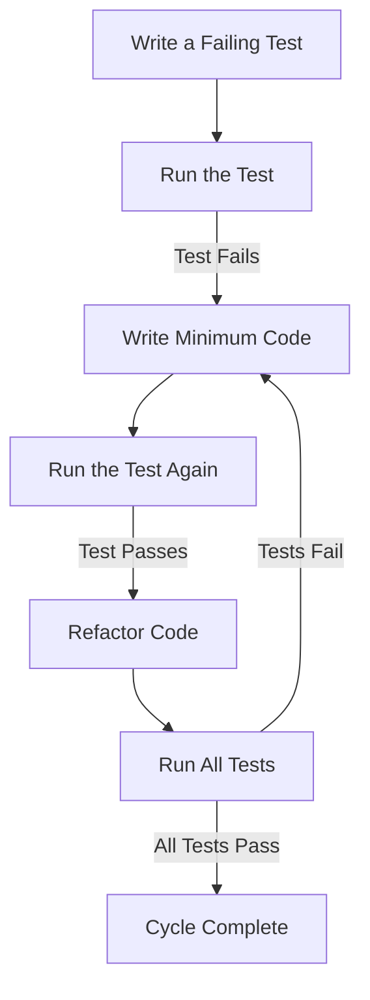

## 14.1 Test-Driven Development (TDD)

Test-Driven Development (TDD) is a software development approach that emphasizes writing tests before writing the actual code. This methodology not only ensures that the code meets its requirements but also encourages simplicity and comprehensive test coverage. In this section, we will delve into the principles of TDD, its implementation in Haxe, and the benefits it brings to cross-platform software engineering.

### Understanding Test-Driven Development

**Definition:** TDD is a development process where tests are written before the code that fulfills them. This approach encourages developers to think about the requirements and design of their code upfront, leading to more robust and maintainable software.

**Key Concepts:**

- **Red-Green-Refactor Cycle:** This is the core cycle of TDD. It involves writing a failing test (Red), writing the minimum code necessary to pass the test (Green), and then refactoring the code to improve its structure while ensuring all tests still pass.
- **Continuous Testing:** TDD promotes integrating tests into the development workflow, ensuring that code changes are continuously validated against the requirements.

### Implementing TDD in Haxe

Haxe, with its cross-platform capabilities and strong typing system, is well-suited for TDD. Let's explore how to implement TDD in Haxe effectively.

#### Setting Up a Haxe Testing Environment

Before diving into TDD, it's crucial to set up a testing environment. Haxe offers several testing frameworks, such as [utest](https://lib.haxe.org/p/utest/) and [munit](https://lib.haxe.org/p/munit/), which provide the necessary tools to write and run tests.

**Example Setup with utest:**

1. **Install utest via Haxelib:**

   ```bash
   haxelib install utest
   ```

2. **Create a Test Class:**

   ```haxe
   import utest.Test;
   import utest.Assert;

   class MyTest extends Test {
       function new() {
           super();
       }

       function testAddition() {
           Assert.equals(4, 2 + 2);
       }
   }
   ```

3. **Run the Tests:**

   Compile and run the tests using the Haxe command line:

   ```bash
   haxe -lib utest -main MyTest -js test.js
   node test.js
   ```

#### The Red-Green-Refactor Cycle in Haxe

Let's illustrate the Red-Green-Refactor cycle with a simple example in Haxe.

**Step 1: Write a Failing Test (Red)**

Start by writing a test for a function that checks if a number is even.

```haxe
import utest.Test;
import utest.Assert;

class NumberTest extends Test {
    function new() {
        super();
    }

    function testIsEven() {
        Assert.isTrue(isEven(4));
        Assert.isFalse(isEven(3));
    }
}
```

**Step 2: Implement the Minimum Code to Pass the Test (Green)**

Implement the `isEven` function to make the test pass.

```haxe
function isEven(n: Int): Bool {
    return n % 2 == 0;
}
```

**Step 3: Refactor the Code**

Refactor the code if necessary, ensuring that all tests still pass. In this simple example, the code is already optimal, but in more complex scenarios, refactoring might involve improving code readability or performance.

### Benefits of TDD in Haxe

Implementing TDD in Haxe offers several advantages:

- **Confidence in Changes:** TDD ensures that new code doesn't break existing functionality, providing developers with confidence when making changes.
- **Improved Design:** Writing tests first can lead to better-designed code, as it forces developers to consider the requirements and design upfront.
- **Comprehensive Test Coverage:** TDD encourages comprehensive test coverage, reducing the likelihood of bugs and regressions.
- **Documentation:** Tests serve as documentation for the code, making it easier for new developers to understand the codebase.

### Visualizing the TDD Workflow

To better understand the TDD workflow, let's visualize the Red-Green-Refactor cycle using a Mermaid.js flowchart.



**Diagram Description:** This flowchart illustrates the TDD cycle, starting with writing a failing test, implementing code to pass the test, and then refactoring the code while ensuring all tests pass.

### Try It Yourself

To deepen your understanding of TDD in Haxe, try modifying the `isEven` function to handle edge cases, such as negative numbers or zero. Write additional tests to cover these scenarios and ensure your implementation passes all tests.

### References and Further Reading

- [Haxe Manual](https://haxe.org/manual/)
- [utest Documentation](https://lib.haxe.org/p/utest/)
- [Test-Driven Development by Example](https://www.amazon.com/Test-Driven-Development-Kent-Beck/dp/0321146530) by Kent Beck

### Knowledge Check

- What are the three steps in the TDD cycle?
- How does TDD improve code design?
- Why is it important to refactor code in the TDD cycle?

### Embrace the Journey

Remember, mastering TDD is a journey. As you practice, you'll develop a deeper understanding of your code and its requirements. Keep experimenting, stay curious, and enjoy the process of building robust, maintainable software with Haxe.

## Quiz Time!



### What is the first step in the TDD cycle?

- [x] Write a failing test
- [ ] Write the code
- [ ] Refactor the code
- [ ] Run all tests

> **Explanation:** The first step in the TDD cycle is to write a failing test that defines the desired functionality.

### What does the "Green" phase in TDD involve?

- [ ] Writing a failing test
- [x] Writing the minimum code to pass the test
- [ ] Refactoring the code
- [ ] Running all tests

> **Explanation:** The "Green" phase involves writing the minimum code necessary to pass the failing test.

### How does TDD improve code design?

- [x] By encouraging developers to think about requirements upfront
- [ ] By allowing developers to skip testing
- [ ] By focusing only on performance
- [ ] By eliminating the need for refactoring

> **Explanation:** TDD improves code design by encouraging developers to consider requirements and design upfront, leading to more robust and maintainable code.

### What is the purpose of refactoring in TDD?

- [ ] To add new features
- [ ] To write more tests
- [x] To improve code structure without changing functionality
- [ ] To remove tests

> **Explanation:** Refactoring in TDD is done to improve the code structure while ensuring that all tests still pass, maintaining functionality.

### Which Haxe library is commonly used for testing?

- [ ] Haxelib
- [x] utest
- [ ] HaxeUI
- [ ] OpenFL

> **Explanation:** utest is a commonly used library in Haxe for writing and running tests.

### What is a key benefit of TDD?

- [x] Confidence in code changes
- [ ] Faster development without tests
- [ ] Less code documentation
- [ ] Ignoring edge cases

> **Explanation:** A key benefit of TDD is that it provides confidence in code changes, ensuring new code doesn't break existing functionality.

### What role do tests play in TDD?

- [ ] They are optional
- [x] They define the requirements and serve as documentation
- [ ] They are written after the code
- [ ] They are only for debugging

> **Explanation:** In TDD, tests define the requirements and serve as documentation, guiding the development process.

### What is the main goal of the "Red" phase in TDD?

- [ ] To refactor the code
- [ ] To run all tests
- [x] To write a test that fails
- [ ] To write the final code

> **Explanation:** The main goal of the "Red" phase is to write a test that fails, defining the desired functionality.

### How does TDD ensure comprehensive test coverage?

- [x] By requiring tests to be written before code
- [ ] By focusing on performance
- [ ] By skipping edge cases
- [ ] By writing tests after code

> **Explanation:** TDD ensures comprehensive test coverage by requiring tests to be written before the code, covering all scenarios.

### TDD is primarily used for:

- [x] Ensuring code quality and maintainability
- [ ] Speeding up development without tests
- [ ] Writing code without requirements
- [ ] Ignoring refactoring

> **Explanation:** TDD is primarily used to ensure code quality and maintainability by writing tests before code.


