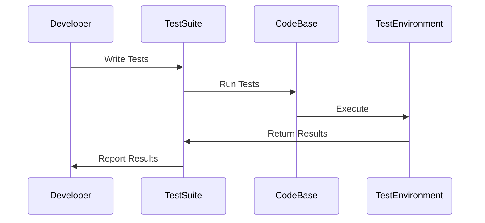

## 14.10 Best Practices for Testing

In the realm of software development, testing is a cornerstone of quality assurance. For Haxe developers, mastering testing practices is crucial to ensure that applications are robust, reliable, and maintainable across multiple platforms. This section delves into best practices for testing in Haxe, providing insights into writing effective tests, avoiding common pitfalls, and leveraging Haxe's unique features to enhance testing strategies.

### Guidelines for Effective Testing

#### Write Tests Early

One of the fundamental principles of effective testing is to integrate testing from the beginning of the project. This approach, often referred to as Test-Driven Development (TDD), involves writing tests before the actual code. By doing so, you can:

- **Clarify Requirements:** Writing tests early helps clarify the requirements and expected behavior of the software.
- **Guide Design:** Tests can guide the design of the software, ensuring that it is modular and testable.
- **Detect Bugs Early:** Early testing helps catch bugs at the inception stage, reducing the cost and effort of fixing them later.

**Example:**

```haxe
// Define a test case before implementing the function
class TestMath {
    public static function testAdd():Void {
        var result = Math.add(2, 3);
        assert(result == 5, "Expected 5, got " + result);
    }
}

// Implement the function to pass the test
class Math {
    public static function add(a:Int, b:Int):Int {
        return a + b;
    }
}
```

#### Keep Tests Independent

Ensure that each test is independent and does not rely on the outcome of other tests. Independent tests are easier to maintain and debug. They also allow for parallel execution, which can significantly speed up the testing process.

- **Setup and Teardown:** Use setup and teardown methods to prepare the test environment and clean up afterward.
- **Avoid Shared State:** Tests should not share state or data, as this can lead to unpredictable results.

**Example:**

```haxe
class TestUser {
    public static function setup():Void {
        // Setup code here
    }

    public static function teardown():Void {
        // Cleanup code here
    }

    public static function testCreateUser():Void {
        var user = new User("Alice");
        assert(user.name == "Alice", "User name should be Alice");
    }

    public static function testDeleteUser():Void {
        var user = new User("Bob");
        user.delete();
        assert(!user.exists(), "User should be deleted");
    }
}
```

#### Test Public Interfaces

Focus on testing the external behavior of components rather than their internal implementation. This approach ensures that tests remain stable even if the internal implementation changes, as long as the public interface remains the same.

- **Black-Box Testing:** Treat the component as a black box and test its inputs and outputs.
- **Behavior-Driven Testing:** Write tests that describe the behavior of the component from the user's perspective.

**Example:**

```haxe
class Calculator {
    public function add(a:Int, b:Int):Int {
        return a + b;
    }
}

class TestCalculator {
    public static function testAdd():Void {
        var calc = new Calculator();
        assert(calc.add(2, 3) == 5, "2 + 3 should equal 5");
    }
}
```

### Common Pitfalls to Avoid

#### Flaky Tests

Flaky tests are tests that fail intermittently without any changes to the code. They can erode confidence in the test suite and make it difficult to identify real issues.

- **Stabilize Test Environment:** Ensure that the test environment is consistent and isolated.
- **Avoid Timing Dependencies:** Tests should not rely on specific timing or order of execution.

**Example:**

```haxe
class TestNetwork {
    public static function testFetchData():Void {
        // Avoid relying on network conditions
        var data = Network.fetchData();
        assert(data != null, "Data should not be null");
    }
}
```

#### Over-Testing Implementation Details

Over-testing implementation details can lead to brittle tests that break with internal changes, even if the external behavior remains the same.

- **Focus on Behavior:** Test the behavior and outcomes rather than the specific steps taken to achieve them.
- **Refactor Tests with Code:** When refactoring code, ensure that tests are updated to reflect changes in behavior, not implementation.

**Example:**

```haxe
class TestSorting {
    public static function testSort():Void {
        var list = [3, 1, 2];
        var sortedList = Sorting.sort(list);
        assert(sortedList == [1, 2, 3], "List should be sorted");
    }
}
```

### Leveraging Haxe's Features for Testing

Haxe offers unique features that can be leveraged to enhance testing strategies:

#### Conditional Compilation

Use Haxe's conditional compilation to include or exclude code for testing purposes. This can be useful for testing platform-specific code.

**Example:**

```haxe
#if js
    // JavaScript-specific test code
#end
```

#### Macros for Test Generation

Haxe's macro system can be used to generate test cases dynamically, reducing boilerplate and ensuring comprehensive coverage.

**Example:**

```haxe
import haxe.macro.Context;
import haxe.macro.Expr;

class TestGenerator {
    public static macro function generateTests():Expr {
        // Macro code to generate test cases
    }
}
```

### Visualizing Testing Strategies

To better understand the flow of testing strategies, let's visualize the process using a sequence diagram.



**Diagram Description:** This sequence diagram illustrates the interaction between the developer, test suite, codebase, and test environment during the testing process. The developer writes tests, which are then run against the codebase in a controlled test environment. Results are reported back to the developer.

### Knowledge Check

- **What is the benefit of writing tests early in the development process?**
- **Why is it important to keep tests independent?**
- **How can flaky tests be avoided?**
- **What is the risk of over-testing implementation details?**

### Try It Yourself

Encourage experimentation by modifying the code examples provided. Try adding new test cases, refactoring existing tests, or using Haxe's macro system to generate tests dynamically. Experiment with conditional compilation to test platform-specific code.

### Embrace the Journey

Remember, testing is an ongoing process that evolves with your project. As you progress, you'll develop more sophisticated testing strategies that ensure the quality and reliability of your software. Keep experimenting, stay curious, and enjoy the journey!

## Quiz Time!



### What is the primary benefit of writing tests early in the development process?

- [x] Clarifies requirements and guides design
- [ ] Reduces the need for documentation
- [ ] Increases code complexity
- [ ] Delays project timelines

> **Explanation:** Writing tests early helps clarify requirements and guides the design of the software, ensuring it is modular and testable.

### Why is it important to keep tests independent?

- [x] To allow for parallel execution and easier maintenance
- [ ] To increase the number of test cases
- [ ] To ensure tests are more complex
- [ ] To reduce the need for setup and teardown

> **Explanation:** Independent tests can be executed in parallel and are easier to maintain and debug.

### What is a common cause of flaky tests?

- [x] Timing dependencies and inconsistent environments
- [ ] Too many assertions
- [ ] Overuse of macros
- [ ] Lack of comments in code

> **Explanation:** Flaky tests often result from timing dependencies and inconsistent test environments.

### What is the risk of over-testing implementation details?

- [x] Tests become brittle and break with internal changes
- [ ] Tests become too simple
- [ ] Tests are more reliable
- [ ] Tests require less maintenance

> **Explanation:** Over-testing implementation details can lead to brittle tests that break with internal changes, even if the external behavior remains the same.

### How can Haxe's conditional compilation be used in testing?

- [x] To include or exclude platform-specific test code
- [ ] To increase test execution speed
- [ ] To simplify test logic
- [ ] To reduce the number of test cases

> **Explanation:** Conditional compilation allows for the inclusion or exclusion of platform-specific test code, ensuring comprehensive coverage across different targets.

### What is the purpose of using macros for test generation in Haxe?

- [x] To reduce boilerplate and ensure comprehensive coverage
- [ ] To increase code complexity
- [ ] To simplify test logic
- [ ] To reduce the number of test cases

> **Explanation:** Macros can generate test cases dynamically, reducing boilerplate and ensuring comprehensive coverage.

### What is the benefit of focusing on testing public interfaces?

- [x] Ensures tests remain stable despite internal changes
- [ ] Increases test complexity
- [ ] Reduces the number of test cases
- [ ] Simplifies test logic

> **Explanation:** Testing public interfaces ensures that tests remain stable even if the internal implementation changes, as long as the public interface remains the same.

### How can flaky tests erode confidence in the test suite?

- [x] By failing intermittently without code changes
- [ ] By increasing test execution speed
- [ ] By simplifying test logic
- [ ] By reducing the number of test cases

> **Explanation:** Flaky tests fail intermittently without any changes to the code, making it difficult to identify real issues and eroding confidence in the test suite.

### What is the role of setup and teardown methods in testing?

- [x] To prepare the test environment and clean up afterward
- [ ] To increase test complexity
- [ ] To reduce the number of test cases
- [ ] To simplify test logic

> **Explanation:** Setup and teardown methods are used to prepare the test environment and clean up afterward, ensuring tests are independent and isolated.

### True or False: Over-testing implementation details leads to more reliable tests.

- [ ] True
- [x] False

> **Explanation:** Over-testing implementation details can lead to brittle tests that break with internal changes, reducing reliability.


