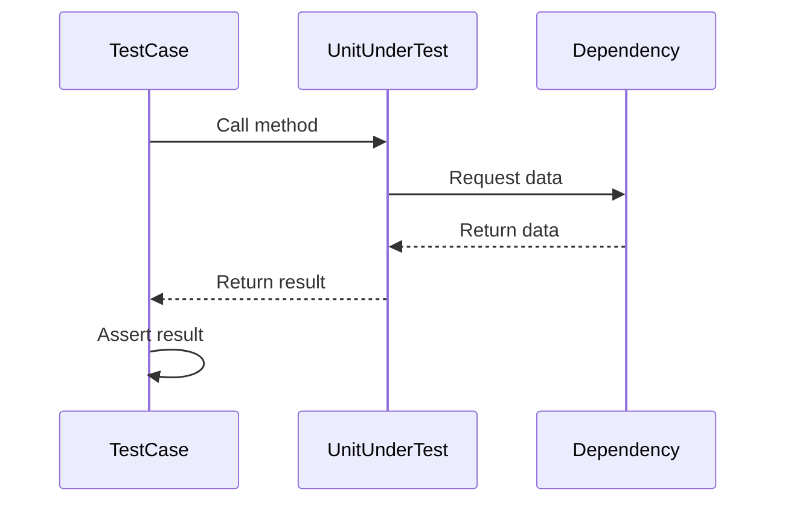

## 14.2 Unit Testing Frameworks in Haxe

Unit testing is a fundamental practice in software development that ensures individual components of a program work as expected. In Haxe, a versatile language known for its cross-platform capabilities, unit testing is crucial for maintaining code quality across different target platforms. This section explores the popular unit testing frameworks available in Haxe, their features, and how to effectively use them to write robust tests.

### Popular Frameworks

Haxe offers several unit testing frameworks, each with unique features and capabilities. Let's delve into the most popular ones:

#### utest

**utest** is a simple and portable testing framework for Haxe. It is designed to be lightweight and easy to use, making it an excellent choice for developers who need a straightforward testing solution.

- **Installation:** You can install utest using Haxelib, the Haxe package manager, with the following command:
  ```bash
  haxelib install utest
  ```

- **Basic Usage:** Here's a simple example of how to use utest to create a test case:
  ```haxe
  import utest.Test;
  import utest.Assert;

  class MyTest extends Test {
      public function new() {
          super();
      }

      public function testAddition() {
          var result = 2 + 3;
          Assert.equals(5, result, "2 + 3 should equal 5");
      }
  }
  ```

- **Features:** utest provides basic assertion methods and supports asynchronous testing, making it suitable for a wide range of applications.

#### munit

**munit** is a more feature-rich testing framework that offers advanced capabilities such as parameterized tests and asynchronous testing. It is ideal for projects that require more complex testing scenarios.

- **Installation:** Install munit using Haxelib:
  ```bash
  haxelib install munit
  ```

- **Basic Usage:** Here's an example of a test case using munit:
  ```haxe
  import munit.TestCase;
  import munit.Assert;

  class MyTestCase extends TestCase {
      public function new() {
          super();
      }

      public function testMultiplication() {
          var result = 3 * 4;
          Assert.equals(12, result, "3 * 4 should equal 12");
      }
  }
  ```

- **Advanced Features:** munit supports parameterized tests, allowing you to run the same test with different inputs. It also provides asynchronous testing capabilities, which are essential for testing code that involves asynchronous operations.

#### Buddy

**Buddy** is a behavior-driven development (BDD) testing framework for Haxe. It allows you to write tests in a style that emphasizes the behavior of the application, making tests more readable and expressive.

- **Installation:** Install Buddy using Haxelib:
  ```bash
  haxelib install buddy
  ```

- **Basic Usage:** Here's an example of a BDD-style test using Buddy:
  ```haxe
  import buddy.Spec;
  import buddy.expect.Expect;

  class MySpec extends Spec {
      public function new() {
          super();
      }

      public function testDivision() {
          describe("Division") {
              it("should divide two numbers correctly") {
                  var result = 10 / 2;
                  expect(result).toBe(5);
              }
          }
      }
  }
  ```

- **Behavior-Driven Development:** Buddy's BDD approach encourages writing tests that describe the behavior of the application, making it easier to understand the purpose of each test.

### Features of Unit Testing Frameworks

Unit testing frameworks in Haxe offer several features that enhance the testing process. Let's explore these features in detail:

#### Assertions

Assertions are the backbone of unit testing. They verify that certain conditions hold true during the execution of a test. Common assertion methods include:

- **equals:** Checks if two values are equal.
- **notEquals:** Checks if two values are not equal.
- **isTrue:** Verifies that a condition is true.
- **isFalse:** Verifies that a condition is false.

Example of using assertions in Haxe:
```haxe
import utest.Assert;

class AssertionExample {
    public static function main() {
        var a = 10;
        var b = 20;
        Assert.equals(30, a + b, "a + b should equal 30");
        Assert.isTrue(a < b, "a should be less than b");
    }
}
```

#### Fixtures

Fixtures are used to set up and tear down test environments. They ensure that each test runs in a clean state, preventing side effects from affecting other tests.

- **Setup:** Code that runs before each test.
- **Teardown:** Code that runs after each test.

Example of using fixtures in Haxe:
```haxe
import munit.TestCase;

class FixtureExample extends TestCase {
    var resource:Resource;

    override function setup() {
        resource = new Resource();
    }

    override function teardown() {
        resource.dispose();
    }

    public function testResourceUsage() {
        resource.use();
        Assert.isTrue(resource.isUsed, "Resource should be used");
    }
}
```

#### Mocking Support

Mocking is a technique used to simulate dependencies in a test. It allows you to isolate the unit being tested by replacing its dependencies with mock objects.

- **Creating Mocks:** Use a mocking library to create mock objects.
- **Defining Behavior:** Specify how the mock should behave during the test.
- **Verifying Interactions:** Check if the mock was used as expected.

Example of mocking in Haxe:
```haxe
import munit.TestCase;
import mock.Mock;

class MockExample extends TestCase {
    public function testMocking() {
        var mockDependency = new Mock();
        mockDependency.expect().method("doSomething").returns("mocked result");

        var result = mockDependency.doSomething();
        Assert.equals("mocked result", result, "Mock should return 'mocked result'");
    }
}
```

### Visualizing Unit Testing Workflow

To better understand the unit testing process, let's visualize the workflow using a sequence diagram. This diagram illustrates the interaction between the test case, the unit under test, and any dependencies.



**Diagram Description:** This sequence diagram shows the flow of a unit test. The `TestCase` initiates a call to the `UnitUnderTest`, which interacts with a `Dependency`. The `Dependency` returns data to the `UnitUnderTest`, which then returns the result to the `TestCase`. Finally, the `TestCase` asserts the result to verify correctness.

### Try It Yourself

To deepen your understanding of unit testing in Haxe, try modifying the code examples provided. Here are some suggestions:

- **Modify Assertions:** Change the expected values in assertions to see how the test framework reports failures.
- **Add More Tests:** Create additional test cases to cover edge cases and different scenarios.
- **Experiment with Fixtures:** Add setup and teardown logic to manage resources used in your tests.
- **Use Mocks:** Create mock objects for different dependencies and define their behavior.

### References and Links

For further reading on unit testing in Haxe, consider exploring the following resources:

- [Haxe Manual - Testing](https://haxe.org/manual/testing.html)
- [utest GitHub Repository](https://github.com/ufront/utest)
- [munit GitHub Repository](https://github.com/massiveinteractive/MassiveUnit)
- [Buddy GitHub Repository](https://github.com/ciscoheat/buddy)

### Knowledge Check

To reinforce your understanding of unit testing frameworks in Haxe, consider the following questions:

- What are the key differences between utest, munit, and Buddy?
- How do assertions help in verifying the correctness of a program?
- Why are fixtures important in unit testing?
- How does mocking support enhance the testing process?

### Embrace the Journey

Unit testing is an essential skill for any software developer. By mastering unit testing frameworks in Haxe, you'll be well-equipped to write reliable and maintainable code across different platforms. Remember, this is just the beginning. As you continue to explore Haxe and its capabilities, you'll discover new ways to improve your testing practices. Keep experimenting, stay curious, and enjoy the journey!

## Quiz Time!



### Which Haxe unit testing framework is known for its simplicity and portability?

- [x] utest
- [ ] munit
- [ ] Buddy
- [ ] JUnit

> **Explanation:** utest is designed to be a simple and portable testing framework for Haxe.

### What feature does munit offer that allows running the same test with different inputs?

- [ ] Mocking
- [x] Parameterized tests
- [ ] BDD-style tests
- [ ] Fixtures

> **Explanation:** munit supports parameterized tests, which allow running the same test with different inputs.

### Which framework is best suited for behavior-driven development (BDD) in Haxe?

- [ ] utest
- [ ] munit
- [x] Buddy
- [ ] NUnit

> **Explanation:** Buddy is a BDD testing framework for Haxe, emphasizing behavior-driven development.

### What is the purpose of assertions in unit testing?

- [x] To verify that conditions hold true
- [ ] To simulate dependencies
- [ ] To set up test environments
- [ ] To tear down test environments

> **Explanation:** Assertions are used to verify that certain conditions hold true during the execution of a test.

### What is the role of fixtures in unit testing?

- [x] To set up and tear down test environments
- [ ] To verify conditions
- [ ] To simulate dependencies
- [ ] To run tests with different inputs

> **Explanation:** Fixtures are used to set up and tear down test environments, ensuring tests run in a clean state.

### How does mocking support enhance the testing process?

- [x] By simulating dependencies
- [ ] By verifying conditions
- [ ] By setting up test environments
- [ ] By running tests with different inputs

> **Explanation:** Mocking support allows you to simulate dependencies, isolating the unit being tested.

### Which assertion method checks if two values are equal?

- [x] equals
- [ ] notEquals
- [ ] isTrue
- [ ] isFalse

> **Explanation:** The `equals` assertion method checks if two values are equal.

### What is the main advantage of using BDD-style tests?

- [x] They make tests more readable and expressive
- [ ] They allow running tests with different inputs
- [ ] They simulate dependencies
- [ ] They set up test environments

> **Explanation:** BDD-style tests emphasize the behavior of the application, making tests more readable and expressive.

### Which framework provides asynchronous testing capabilities?

- [ ] utest
- [x] munit
- [ ] Buddy
- [ ] JUnit

> **Explanation:** munit provides asynchronous testing capabilities, essential for testing code with asynchronous operations.

### True or False: Fixtures are used to simulate dependencies in unit testing.

- [ ] True
- [x] False

> **Explanation:** Fixtures are used to set up and tear down test environments, not to simulate dependencies.


