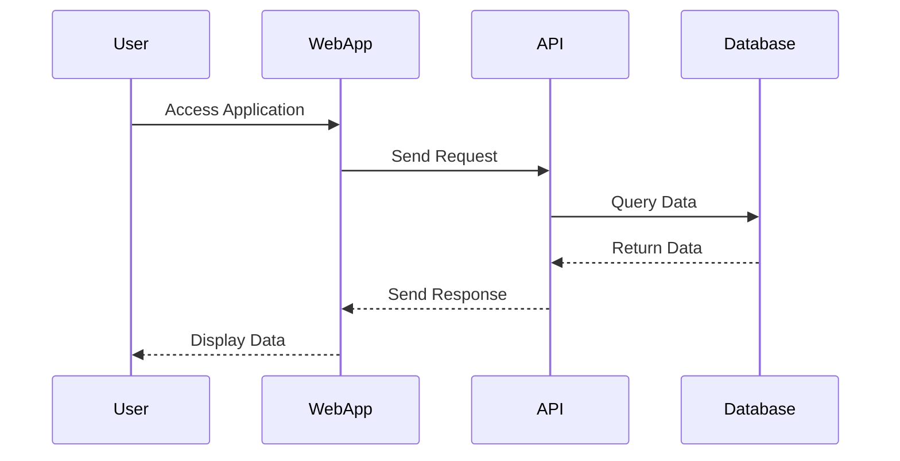

## 14.3 Integration and End-to-End Testing

In the realm of software development, ensuring that individual components work seamlessly together is crucial. Integration and end-to-end testing are pivotal in achieving this goal. These testing methodologies help validate the interactions between various components and external systems, ensuring that the application functions as a cohesive unit. In this section, we will delve into the specifics of implementing integration and end-to-end testing in Haxe, leveraging its cross-platform capabilities.

### Understanding Integration and End-to-End Testing

**Integration Testing** focuses on verifying the interactions between different modules or services within an application. It ensures that combined parts of an application work together as expected. This type of testing is crucial for identifying issues that may arise when integrating new code with existing systems.

**End-to-End Testing** (E2E) simulates real user scenarios to validate the entire application flow from start to finish. It tests the application in its entirety, including interactions with external systems such as databases, APIs, and user interfaces. E2E testing is essential for ensuring that the application behaves correctly in a production-like environment.

### Implementing Integration Tests in Haxe

Integration testing in Haxe involves testing the interactions between different components of your application. This can include interactions with databases, APIs, and other services. Here are some key steps and strategies for implementing integration tests in Haxe:

#### Setting Up the Testing Environment

1. **Choose a Testing Framework:** Haxe offers several testing frameworks such as [MUnit](https://github.com/massiveinteractive/MassiveUnit) and [utest](https://github.com/ufront/ufront-ufront). These frameworks provide the necessary tools for writing and executing tests.

2. **Configure Test Dependencies:** Ensure that all necessary dependencies, such as databases or external services, are available and configured correctly for testing. This may involve setting up mock services or using test databases.

3. **Use Dependency Injection:** Implement dependency injection to make it easier to swap out real services with mock implementations during testing. This approach allows you to isolate components and test their interactions without relying on external systems.

#### Writing Integration Tests

- **Test Interactions with Databases:** Verify that your application correctly interacts with the database. This includes testing CRUD operations and ensuring data integrity.

```haxe
import haxe.unit.TestCase;

class DatabaseIntegrationTest extends TestCase {
    public function new() {
        super();
    }

    public function testDatabaseConnection() {
        var db = new MockDatabase();
        db.connect();
        assertTrue(db.isConnected());
    }

    public function testDatabaseInsert() {
        var db = new MockDatabase();
        db.connect();
        db.insert("test_data");
        assertEquals("test_data", db.getLastInserted());
    }
}
```

- **Test API Interactions:** Ensure that your application correctly communicates with external APIs. This includes testing request and response handling, as well as error scenarios.

```haxe
import haxe.unit.TestCase;

class ApiIntegrationTest extends TestCase {
    public function new() {
        super();
    }

    public function testApiRequest() {
        var api = new MockApi();
        var response = api.sendRequest("GET", "/endpoint");
        assertEquals(200, response.status);
        assertEquals("success", response.data);
    }
}
```

### Implementing End-to-End Tests in Haxe

End-to-end testing in Haxe involves testing the entire application flow, from the user interface to the backend services. This type of testing is crucial for ensuring that the application behaves correctly in a production-like environment.

#### Tools for End-to-End Testing

- **Selenium:** Selenium is a popular tool for automating web browsers. It can be used to simulate user interactions with a web application, testing the entire application flow.

- **Puppeteer:** Puppeteer is a Node library that provides a high-level API for controlling headless Chrome or Chromium browsers. It can be used for testing web applications by simulating user interactions.

- **Haxe Externs:** Use Haxe externs to integrate with these tools, allowing you to write end-to-end tests in Haxe.

#### Writing End-to-End Tests

- **Simulate User Flows:** Test common user scenarios, such as logging in, navigating through the application, and performing specific actions.

```haxe
import puppeteer.Puppeteer;

class EndToEndTest {
    public static function main() {
        var browser = Puppeteer.launch();
        var page = browser.newPage();
        page.goto("http://localhost:3000");
        
        // Simulate user login
        page.type("#username", "testuser");
        page.type("#password", "password");
        page.click("#loginButton");
        
        // Verify successful login
        page.waitForSelector("#welcomeMessage");
        var welcomeMessage = page.$eval("#welcomeMessage", (el) -> el.textContent);
        assertEquals("Welcome, testuser!", welcomeMessage);
        
        browser.close();
    }
}
```

- **Test API Endpoints:** Ensure that API endpoints behave correctly under various conditions, such as different input data or error scenarios.

```haxe
import puppeteer.Puppeteer;

class ApiEndToEndTest {
    public static function main() {
        var browser = Puppeteer.launch();
        var page = browser.newPage();
        page.goto("http://localhost:3000/api/test");

        // Verify API response
        var response = page.evaluate(() -> {
            return fetch("/api/test")
                .then(response -> response.json());
        });

        assertEquals("success", response.status);
        assertEquals("data", response.data);

        browser.close();
    }
}
```

### Use Cases and Examples

#### Web Applications

For web applications, integration and end-to-end testing are essential for validating user flows and interfaces. These tests ensure that the application behaves correctly from the user's perspective, covering scenarios such as logging in, navigating through pages, and interacting with forms.

#### APIs

For APIs, integration and end-to-end testing are crucial for ensuring that endpoints behave correctly under various conditions. These tests validate the API's functionality, performance, and error handling, ensuring that it meets the expected requirements.

### Visualizing the Testing Process

To better understand the integration and end-to-end testing process, let's visualize the flow using a sequence diagram. This diagram illustrates the interactions between different components during testing.



### Best Practices for Integration and End-to-End Testing

1. **Automate Tests:** Automate integration and end-to-end tests to ensure consistency and efficiency. Automated tests can be run frequently, providing quick feedback on the application's behavior.

2. **Use Mock Services:** Use mock services to simulate external dependencies during testing. This approach allows you to isolate components and test their interactions without relying on external systems.

3. **Test in a Production-Like Environment:** Run tests in an environment that closely resembles the production environment. This ensures that the tests accurately reflect the application's behavior in real-world scenarios.

4. **Focus on Critical Paths:** Prioritize testing critical user flows and interactions. These are the scenarios that are most important to the application's functionality and user experience.

5. **Monitor Test Results:** Continuously monitor test results and address any issues promptly. This helps maintain the quality and reliability of the application.

### Try It Yourself

To get hands-on experience with integration and end-to-end testing in Haxe, try modifying the code examples provided in this section. Experiment with different scenarios, such as testing additional user flows or API endpoints. This will help reinforce your understanding of the testing process and its importance in software development.

### References and Further Reading

- [Selenium Documentation](https://www.selenium.dev/documentation/)
- [Puppeteer Documentation](https://pptr.dev/)
- [Haxe Externs for Puppeteer](https://github.com/haxiomic/haxe-puppeteer)
- [MUnit Testing Framework](https://github.com/massiveinteractive/MassiveUnit)
- [utest Framework](https://github.com/ufront/ufront-ufront)

### Knowledge Check

- What is the primary purpose of integration testing?
- How does end-to-end testing differ from integration testing?
- What tools can be used for end-to-end testing in Haxe?
- Why is it important to test in a production-like environment?
- How can mock services be used in integration testing?

### Embrace the Journey

Remember, mastering integration and end-to-end testing is a journey. As you progress, you'll gain a deeper understanding of how to ensure your applications work seamlessly across different platforms and environments. Keep experimenting, stay curious, and enjoy the process of building robust, high-quality software!

## Quiz Time!



### What is the primary purpose of integration testing?

- [x] To verify the interactions between different modules or services within an application.
- [ ] To test individual components in isolation.
- [ ] To simulate real user scenarios.
- [ ] To test the application's performance under load.

> **Explanation:** Integration testing focuses on verifying the interactions between different modules or services within an application to ensure they work together as expected.

### How does end-to-end testing differ from integration testing?

- [x] End-to-end testing simulates real user scenarios to validate the entire application flow.
- [ ] End-to-end testing focuses on testing individual components.
- [ ] End-to-end testing is only concerned with backend services.
- [ ] End-to-end testing does not involve user interfaces.

> **Explanation:** End-to-end testing simulates real user scenarios to validate the entire application flow, including interactions with external systems and user interfaces.

### Which tool can be used for end-to-end testing in Haxe?

- [x] Selenium
- [ ] JUnit
- [ ] Mockito
- [ ] Mocha

> **Explanation:** Selenium is a popular tool for automating web browsers and can be used for end-to-end testing in Haxe.

### Why is it important to test in a production-like environment?

- [x] To ensure that the tests accurately reflect the application's behavior in real-world scenarios.
- [ ] To reduce the cost of testing.
- [ ] To simplify the testing process.
- [ ] To eliminate the need for unit tests.

> **Explanation:** Testing in a production-like environment ensures that the tests accurately reflect the application's behavior in real-world scenarios, providing more reliable results.

### How can mock services be used in integration testing?

- [x] To simulate external dependencies during testing.
- [ ] To replace the need for real services in production.
- [ ] To increase the complexity of tests.
- [ ] To reduce the number of test cases.

> **Explanation:** Mock services can be used to simulate external dependencies during testing, allowing you to isolate components and test their interactions without relying on external systems.

### What is a key benefit of automating integration and end-to-end tests?

- [x] Consistency and efficiency in testing.
- [ ] Reducing the need for manual testing.
- [ ] Increasing the complexity of the testing process.
- [ ] Eliminating the need for unit tests.

> **Explanation:** Automating integration and end-to-end tests ensures consistency and efficiency, allowing tests to be run frequently and providing quick feedback on the application's behavior.

### What should be prioritized in end-to-end testing?

- [x] Critical user flows and interactions.
- [ ] All possible user scenarios.
- [ ] Only backend services.
- [ ] Only frontend interfaces.

> **Explanation:** In end-to-end testing, it is important to prioritize critical user flows and interactions, as these are the scenarios that are most important to the application's functionality and user experience.

### What is the role of dependency injection in integration testing?

- [x] To make it easier to swap out real services with mock implementations during testing.
- [ ] To increase the complexity of the codebase.
- [ ] To eliminate the need for external services.
- [ ] To simplify the deployment process.

> **Explanation:** Dependency injection allows you to easily swap out real services with mock implementations during testing, making it easier to isolate components and test their interactions.

### What is a common tool used for automating web browsers in end-to-end testing?

- [x] Puppeteer
- [ ] JUnit
- [ ] Mockito
- [ ] Mocha

> **Explanation:** Puppeteer is a Node library that provides a high-level API for controlling headless Chrome or Chromium browsers and is commonly used for automating web browsers in end-to-end testing.

### True or False: End-to-end testing only involves testing backend services.

- [ ] True
- [x] False

> **Explanation:** False. End-to-end testing involves testing the entire application flow, including interactions with external systems and user interfaces, not just backend services.


