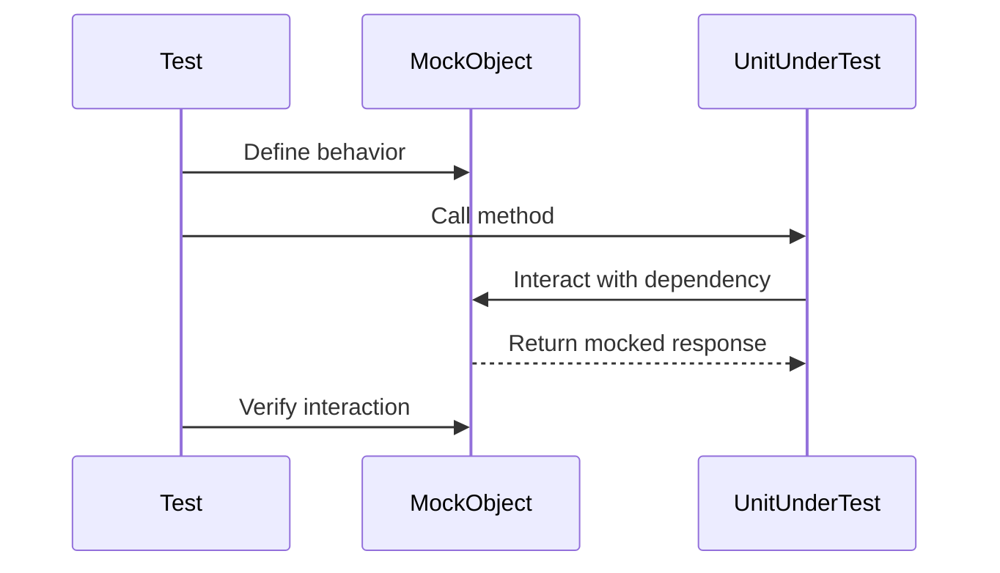

## 14.4 Mocking and Stubbing Techniques

In the realm of software testing, particularly unit testing, mocking and stubbing are indispensable techniques. They allow developers to simulate parts of an application to isolate the units under test. This section will delve into the intricacies of mocking and stubbing within the Haxe programming environment, providing you with the knowledge to implement these techniques effectively.

### Understanding Mocking and Stubbing

**Mocking** refers to creating objects that mimic the behavior of real objects. These mock objects are used to test the interactions between components in isolation, without relying on the actual implementations. **Stubbing**, on the other hand, involves replacing a method or function with a pre-defined response to simulate specific scenarios or conditions.

#### Key Concepts

- **Isolation:** By using mocks and stubs, we can isolate the unit of code being tested from its dependencies, ensuring that tests are focused and reliable.
- **Control:** These techniques allow us to simulate various scenarios, including edge cases, without the need for complex setup or external dependencies.

### Implementing Mocking and Stubbing in Haxe

Haxe, with its cross-platform capabilities and powerful type system, offers several ways to implement mocking and stubbing. Let's explore these methods in detail.

#### Manual Mocks

Creating manual mocks involves writing mock classes or objects by hand. This approach gives you complete control over the behavior of the mock objects but can be time-consuming for complex systems.

```haxe
// Define an interface for a service
interface IService {
    public function fetchData():String;
}

// Create a manual mock class
class MockService implements IService {
    public function fetchData():String {
        return "Mocked Data";
    }
}

// Usage in a test
class Test {
    static function main() {
        var service:IService = new MockService();
        trace(service.fetchData()); // Output: Mocked Data
    }
}
```

In this example, `MockService` implements the `IService` interface, providing a mocked response for the `fetchData` method.

#### Mocking Libraries

To streamline the process of creating mocks, you can use libraries like `Mockatoo`, or leverage Haxe's macro system to generate mocks automatically.

##### Using Mockatoo

`Mockatoo` is a popular mocking library in the Haxe ecosystem. It simplifies the creation of mock objects and provides a fluent API for defining expectations and verifying interactions.

```haxe
import mockatoo.Mockatoo;

class Test {
    static function main() {
        var mockService = Mockatoo.mock<IService>();
        
        // Define behavior
        Mockatoo.when(mockService.fetchData()).thenReturn("Mocked Data");
        
        // Use the mock
        trace(mockService.fetchData()); // Output: Mocked Data
        
        // Verify interaction
        Mockatoo.verify(mockService).fetchData();
    }
}
```

In this example, `Mockatoo` is used to create a mock of the `IService` interface, define its behavior, and verify that the `fetchData` method was called.

##### Writing Macros for Mock Generation

Haxe's macro system can be employed to automate the generation of mock classes. This approach can be particularly useful for large projects with numerous interfaces.

```haxe
import haxe.macro.Context;
import haxe.macro.Expr;

class MockGenerator {
    public static macro function generateMock(typeName:String):Expr {
        var type = Context.getType(typeName);
        // Logic to generate mock class based on the type
        return macro null; // Placeholder for generated code
    }
}
```

This macro can be expanded to dynamically create mock classes based on the provided type name, reducing boilerplate code.

### Benefits of Mocking and Stubbing

Mocking and stubbing offer several advantages in the context of software testing:

- **Isolation:** By isolating the unit under test, you can ensure that tests are not affected by external dependencies or side effects.
- **Control:** Mocks and stubs allow you to simulate specific scenarios, including error conditions and edge cases, that may be difficult to reproduce with real objects.
- **Speed:** Tests that use mocks and stubs are typically faster because they do not involve complex setup or interaction with external systems.

### Visualizing Mocking and Stubbing

To better understand the flow of mocking and stubbing, let's visualize the interaction between a test, a mock object, and the unit under test.



This sequence diagram illustrates how a test defines the behavior of a mock object, interacts with the unit under test, and verifies the interactions.

### Practical Considerations

When implementing mocking and stubbing, consider the following:

- **Complexity:** While manual mocks provide flexibility, they can become complex and hard to maintain for large systems. Consider using libraries or macros to simplify the process.
- **Overuse:** Avoid overusing mocks and stubs, as they can lead to brittle tests that are tightly coupled to the implementation details.
- **Balance:** Strive for a balance between testing real interactions and using mocks to isolate units.

### Try It Yourself

Experiment with the provided code examples by modifying the behavior of the mock objects or adding new methods to the interfaces. Try creating a mock for a different interface and see how it affects your tests.

### References and Further Reading

- [Mockatoo Documentation](https://github.com/clemos/mockatoo)
- [Haxe Macros Guide](https://haxe.org/manual/macro.html)
- [Unit Testing Best Practices](https://martinfowler.com/articles/mocksArentStubs.html)

### Knowledge Check

Before moving on, consider the following questions:

- What are the key differences between mocking and stubbing?
- How can Haxe's macro system be used to generate mocks?
- What are the potential pitfalls of overusing mocks in tests?

### Embrace the Journey

Remember, mastering mocking and stubbing techniques is a journey. As you gain experience, you'll develop a deeper understanding of when and how to use these techniques effectively. Keep experimenting, stay curious, and enjoy the process of refining your testing skills!

## Quiz Time!



### What is the primary purpose of mocking in unit testing?

- [x] To simulate the behavior of real objects
- [ ] To replace the entire application logic
- [ ] To generate random data for tests
- [ ] To compile code faster

> **Explanation:** Mocking is used to simulate the behavior of real objects to test interactions in isolation.

### Which Haxe feature can be used to automate mock generation?

- [x] Macros
- [ ] Enums
- [ ] Abstract types
- [ ] Conditional compilation

> **Explanation:** Haxe's macro system can be used to automate the generation of mock classes.

### What is a potential downside of overusing mocks in tests?

- [x] Tests become tightly coupled to implementation details
- [ ] Tests run slower
- [ ] Tests become more reliable
- [ ] Tests require more hardware resources

> **Explanation:** Overusing mocks can lead to tests that are tightly coupled to the implementation details, making them brittle.

### How does stubbing differ from mocking?

- [x] Stubbing replaces a method with a pre-defined response
- [ ] Stubbing simulates the entire object behavior
- [ ] Stubbing is used for performance testing
- [ ] Stubbing generates random data

> **Explanation:** Stubbing involves replacing a method or function with a pre-defined response to simulate specific scenarios.

### Which library is commonly used for mocking in Haxe?

- [x] Mockatoo
- [ ] Haxelib
- [ ] HaxeUI
- [ ] Lime

> **Explanation:** Mockatoo is a popular library for mocking in Haxe.

### What is a benefit of using mocks in unit tests?

- [x] Isolation of the unit under test
- [ ] Increased code complexity
- [ ] Slower test execution
- [ ] More hardware requirements

> **Explanation:** Mocks help isolate the unit under test from its dependencies, ensuring focused and reliable tests.

### What is the role of a mock object in a test?

- [x] To mimic the behavior of a real object
- [ ] To execute the main application logic
- [ ] To generate random test data
- [ ] To compile the code

> **Explanation:** A mock object mimics the behavior of a real object to test interactions in isolation.

### What should be avoided when using mocks and stubs?

- [x] Overuse leading to brittle tests
- [ ] Using them for unit testing
- [ ] Simulating edge cases
- [ ] Isolating dependencies

> **Explanation:** Overuse of mocks and stubs can lead to brittle tests that are tightly coupled to implementation details.

### Which of the following is a key advantage of using stubs?

- [x] Simulating specific scenarios
- [ ] Increasing test execution time
- [ ] Compiling code faster
- [ ] Generating random data

> **Explanation:** Stubs allow you to simulate specific scenarios, including error conditions and edge cases.

### True or False: Mocking and stubbing can help speed up test execution.

- [x] True
- [ ] False

> **Explanation:** Mocking and stubbing can speed up test execution by avoiding complex setup and interaction with external systems.


