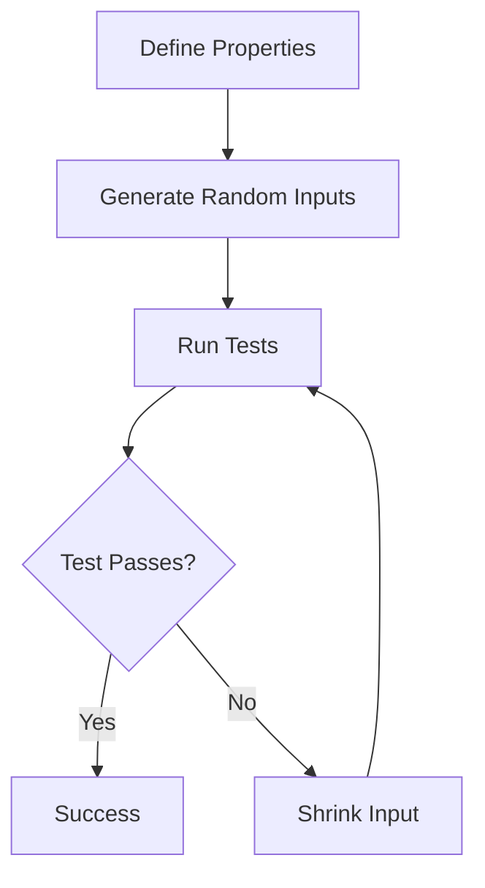

## 14.5 Property-Based Testing

In the realm of software testing, **Property-Based Testing (PBT)** stands out as a powerful technique that shifts the focus from testing specific examples to validating general properties of the code. This approach is particularly beneficial in ensuring that your Haxe applications are robust, reliable, and capable of handling a wide array of input scenarios. In this section, we will delve into the intricacies of property-based testing, its implementation in Haxe, and the myriad benefits it offers.

### Understanding Property-Based Testing

**Property-Based Testing** is a testing methodology where the properties or invariants of a function or system are specified, and then a wide range of inputs are automatically generated to test these properties. Unlike traditional example-based testing, which checks specific cases, property-based testing explores the entire input space to uncover edge cases and unexpected behaviors.

#### Key Concepts

- **Properties:** These are the expected behaviors or invariants that your code should satisfy. For instance, a sorting function should always return a list where each element is less than or equal to the next.
- **Randomized Input Generation:** Inputs are generated randomly, allowing the testing framework to explore a vast range of scenarios.
- **Shrinking:** When a test fails, the framework attempts to simplify the input to the smallest case that still causes the failure, making it easier to diagnose the issue.

### Implementing Property-Based Testing in Haxe

Haxe, with its cross-platform capabilities and strong typing system, is well-suited for property-based testing. To implement PBT in Haxe, we can leverage libraries that provide QuickCheck-like functionality, which is a popular property-based testing framework originally developed for Haskell.

#### QuickCheck Implementations

Several libraries in the Haxe ecosystem offer property-based testing capabilities. These libraries provide tools to define properties, generate random inputs, and perform shrinking. One such library is **HaxeCheck**, which offers a comprehensive suite of tools for property-based testing.

#### Defining Properties

To effectively use property-based testing, you need to define the properties that your code should satisfy. This involves specifying the invariants and expected behaviors across a range of inputs.

**Example: Testing a Sorting Function**

Let's consider a simple sorting function. We want to ensure that the function always returns a sorted list and that the output list contains the same elements as the input list.

```haxe
import haxeCheck.Property;
import haxeCheck.Generator;

class SortingTest {
    static function main() {
        // Define a property for the sorting function
        var property = new Property<Array<Int>>(
            "Sorting should return a sorted list",
            Generator.array(Generator.int()),
            function(input) {
                var sorted = sort(input);
                return isSorted(sorted) && containsSameElements(input, sorted);
            }
        );

        // Run the property-based test
        property.check();
    }

    static function sort(arr: Array<Int>): Array<Int> {
        // Simple sorting implementation
        return arr.sort();
    }

    static function isSorted(arr: Array<Int>): Bool {
        for (i in 0...arr.length - 1) {
            if (arr[i] > arr[i + 1]) return false;
        }
        return true;
    }

    static function containsSameElements(arr1: Array<Int>, arr2: Array<Int>): Bool {
        return arr1.sort() == arr2.sort();
    }
}
```

In this example, we define a property that checks whether the sorting function returns a sorted list and whether the output contains the same elements as the input. The `Generator.array(Generator.int())` generates random arrays of integers to test the property.

### Benefits of Property-Based Testing

Property-based testing offers several advantages over traditional testing methods:

#### Discover Edge Cases

By generating a wide range of inputs, property-based testing can uncover edge cases that might not be considered in example-based tests. This helps in identifying unexpected behaviors and potential bugs.

#### Comprehensive Testing

Property-based testing systematically explores the input space, providing a more comprehensive testing approach. This ensures that your code is robust and can handle a variety of scenarios.

#### Simplified Debugging

The shrinking feature of property-based testing simplifies debugging by reducing complex failing cases to the simplest form. This makes it easier to identify the root cause of the failure.

### Visualizing Property-Based Testing

To better understand the flow of property-based testing, let's visualize the process using a flowchart.



**Figure 1:** The flow of property-based testing involves defining properties, generating random inputs, running tests, and shrinking inputs in case of failures.

### Try It Yourself

To get hands-on experience with property-based testing in Haxe, try modifying the code example provided. Experiment with different properties, such as testing a function that reverses a list or a function that calculates the factorial of a number. Observe how the property-based testing framework handles various input scenarios and shrinks failing cases.

### References and Further Reading

- [HaxeCheck Documentation](https://github.com/haxeCheck/haxeCheck): Explore the official documentation for HaxeCheck to learn more about its features and capabilities.
- [QuickCheck: A Lightweight Tool for Random Testing of Haskell Programs](https://www.cse.chalmers.se/~rjmh/QuickCheck/): The original paper on QuickCheck, providing insights into the principles of property-based testing.
- [Property-Based Testing with PropEr, Erlang, and Elixir](https://pragprog.com/titles/fhproper/property-based-testing-with-proper-erlang-and-elixir/): A book that delves into property-based testing in the context of Erlang and Elixir, offering valuable insights applicable to Haxe.

### Knowledge Check

To reinforce your understanding of property-based testing, consider the following questions and challenges:

- What are the key differences between property-based testing and example-based testing?
- How does the shrinking feature aid in debugging failing tests?
- Define a property for a function that calculates the greatest common divisor (GCD) of two numbers.
- Experiment with different input generators in HaxeCheck and observe their impact on test coverage.

### Embrace the Journey

Remember, mastering property-based testing is a journey. As you continue to explore this powerful testing methodology, you'll gain deeper insights into your code's behavior and robustness. Keep experimenting, stay curious, and enjoy the process of building high-quality software with Haxe.

## Quiz Time!



### What is the primary focus of property-based testing?

- [x] Validating general properties of the code
- [ ] Testing specific examples
- [ ] Ensuring code compiles without errors
- [ ] Measuring code performance

> **Explanation:** Property-based testing focuses on validating general properties or invariants of the code across a wide range of inputs.

### Which feature of property-based testing helps simplify debugging?

- [x] Shrinking
- [ ] Randomized Input Generation
- [ ] Property Definition
- [ ] Test Coverage

> **Explanation:** Shrinking reduces complex failing cases to the simplest form, making it easier to identify the root cause of the failure.

### What library in Haxe offers QuickCheck-like functionality?

- [x] HaxeCheck
- [ ] HaxeTest
- [ ] QuickHaxe
- [ ] HaxeVerify

> **Explanation:** HaxeCheck is a library that provides property-based testing capabilities similar to QuickCheck.

### What is a key benefit of property-based testing?

- [x] Discovering edge cases
- [ ] Reducing code size
- [ ] Improving code readability
- [ ] Enhancing user interface

> **Explanation:** Property-based testing helps discover edge cases by generating a wide range of inputs.

### In property-based testing, what are properties?

- [x] Expected behaviors or invariants
- [ ] Specific test cases
- [ ] Randomly generated inputs
- [ ] Code comments

> **Explanation:** Properties are the expected behaviors or invariants that the code should satisfy.

### What does the `Generator.array(Generator.int())` in HaxeCheck do?

- [x] Generates random arrays of integers
- [ ] Sorts an array of integers
- [ ] Checks if an array is sorted
- [ ] Reverses an array of integers

> **Explanation:** `Generator.array(Generator.int())` generates random arrays of integers for testing.

### How does property-based testing differ from example-based testing?

- [x] It tests a wide range of inputs
- [ ] It focuses on specific examples
- [ ] It requires more code
- [ ] It is faster to execute

> **Explanation:** Property-based testing explores a wide range of inputs, unlike example-based testing which focuses on specific cases.

### What is the purpose of defining properties in property-based testing?

- [x] To specify the expected behavior across a range of inputs
- [ ] To generate random inputs
- [ ] To compile the code
- [ ] To measure performance

> **Explanation:** Defining properties specifies the expected behavior or invariants that the code should satisfy.

### What is the role of randomized input generation in property-based testing?

- [x] To explore a vast range of scenarios
- [ ] To simplify the code
- [ ] To improve performance
- [ ] To enhance readability

> **Explanation:** Randomized input generation allows the testing framework to explore a vast range of scenarios, uncovering potential edge cases.

### True or False: Property-based testing can only be used for functional programming languages.

- [ ] True
- [x] False

> **Explanation:** Property-based testing can be used in various programming paradigms, including object-oriented and functional programming.




