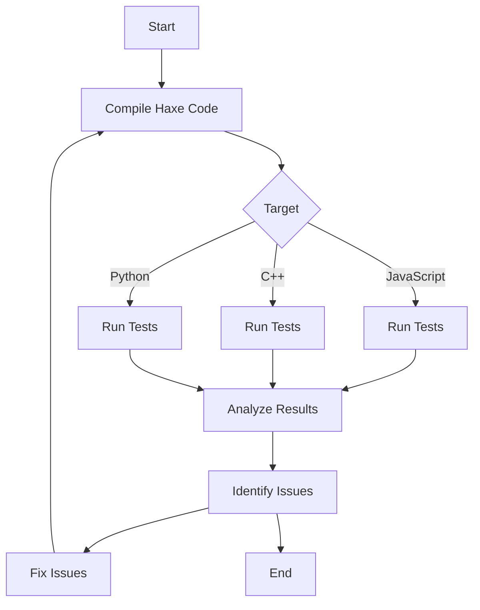

## 14.6 Automated Testing Across Targets

In the realm of cross-platform development, ensuring that your application behaves consistently across different environments is crucial. Haxe, with its ability to compile to multiple languages, offers unique opportunities for automated testing across various targets. This section delves into strategies for implementing automated testing in Haxe, leveraging continuous integration, and utilizing testing frameworks to maintain consistency and efficiency.

### Understanding Automated Testing Across Targets

Automated testing is a critical component of modern software development, allowing developers to verify that their code behaves as expected without manual intervention. When dealing with cross-platform applications, automated testing becomes even more vital, as it helps identify platform-specific issues early in the development process.

#### Key Concepts

- **Target-Specific Tests:** These are tests designed to run on each specific compilation target, such as JavaScript, C++, or Python. They ensure that the application behaves correctly in each environment.
- **Cross-Compilation Testing:** By compiling the same codebase to different languages, you can test the application in various environments, catching issues that may arise due to differences in language semantics or platform-specific behaviors.

### Strategies for Automated Testing Across Targets

#### Target-Specific Tests

To effectively implement target-specific tests, follow these steps:

1. **Identify Critical Paths:** Determine the most critical functionalities of your application that need to be tested across all targets.
2. **Develop Target-Specific Test Suites:** Create test suites tailored to each target, ensuring they cover the identified critical paths.
3. **Utilize Target-Specific Features:** Leverage features unique to each target to enhance your tests. For example, use browser-specific testing tools for JavaScript targets.

#### Cross-Compilation Testing

Cross-compilation testing involves compiling your Haxe code to different targets and running tests in each environment. This approach helps uncover issues related to language-specific behaviors or platform differences.

1. **Set Up a Cross-Compilation Environment:** Configure your development environment to support compilation to all desired targets.
2. **Automate Compilation and Testing:** Use scripts or CI pipelines to automate the process of compiling and running tests across all targets.
3. **Analyze Results:** Compare test results across targets to identify inconsistencies or platform-specific issues.

### Implementing Automated Testing in Haxe

#### Continuous Integration

Continuous Integration (CI) is a practice where developers frequently integrate their code into a shared repository, followed by automated builds and tests. Implementing CI for cross-platform testing in Haxe involves:

1. **Setting Up CI Pipelines:** Use CI tools like Jenkins, Travis CI, or GitHub Actions to automate the build and test process.
2. **Configuring Multi-Target Builds:** Ensure your CI pipeline can compile your Haxe code to all desired targets.
3. **Automating Test Execution:** Integrate test execution into your CI pipeline, running tests on each target automatically.

#### Testing Frameworks

Choosing the right testing framework is crucial for effective automated testing. Ensure your framework supports multiple targets and provides the necessary tools for writing and executing tests.

1. **Select a Suitable Framework:** Consider frameworks like MUnit or uTest, which are compatible with Haxe and support multiple targets.
2. **Write Comprehensive Tests:** Develop tests that cover all critical functionalities and edge cases.
3. **Leverage Framework Features:** Utilize features like mocking, stubbing, and assertions to enhance your tests.

### Benefits of Automated Testing Across Targets

Automated testing across targets offers several benefits:

- **Consistency:** By running tests on each target, you can identify platform-specific issues early, ensuring consistent behavior across all environments.
- **Efficiency:** Automating repetitive testing tasks saves time and resources, allowing developers to focus on more complex issues.
- **Confidence:** Automated tests provide confidence that your application will perform as expected, regardless of the target platform.

### Code Example: Cross-Platform Testing with Haxe

Let's explore a simple example of setting up automated tests for a Haxe application targeting both JavaScript and C++.

```haxe
// Define a simple function to test
class MathUtils {
    public static function add(a:Int, b:Int):Int {
        return a + b;
    }
}

// Test class using MUnit framework
import munit.TestCase;

class MathUtilsTest extends TestCase {
    public function new() {
        super();
    }

    public function testAdd() {
        // Test addition functionality
        assertEquals(MathUtils.add(2, 3), 5, "2 + 3 should equal 5");
        assertEquals(MathUtils.add(-1, 1), 0, "-1 + 1 should equal 0");
    }
}

// Main entry point
class Main {
    static function main() {
        // Run tests
        var runner = new munit.TestRunner();
        runner.add(new MathUtilsTest());
        runner.run();
    }
}
```

In this example, we define a simple `add` function and a corresponding test case using the MUnit framework. The test case verifies the correctness of the `add` function by checking expected outcomes. This test can be run on both JavaScript and C++ targets, ensuring consistent behavior across platforms.

### Visualizing the Testing Process

To better understand the automated testing process across targets, let's visualize it using a flowchart.



This flowchart illustrates the process of compiling Haxe code to different targets, running tests on each target, analyzing results, and identifying issues. The process is iterative, with fixes being applied and tests rerun until all issues are resolved.

### Try It Yourself

To deepen your understanding, try modifying the code example above:

- **Add More Tests:** Extend the `MathUtilsTest` class with additional test cases for other mathematical operations.
- **Target Additional Platforms:** Configure your Haxe environment to compile and test on additional targets, such as Java or Python.
- **Integrate with CI:** Set up a CI pipeline to automate the compilation and testing process across all targets.

### References and Further Reading

- [Haxe Manual: Testing](https://haxe.org/manual/testing.html)
- [MUnit Documentation](https://github.com/massiveinteractive/MassiveUnit)
- [Continuous Integration with GitHub Actions](https://docs.github.com/en/actions)

### Knowledge Check

Before we wrap up, let's reinforce what we've learned with a few questions and challenges:

- **What are the benefits of automated testing across targets?**
- **How can you set up a CI pipeline for cross-platform testing in Haxe?**
- **What are some challenges you might face when testing across multiple targets?**

### Embrace the Journey

Remember, mastering automated testing across targets is a journey. As you progress, you'll build more robust and reliable applications that perform consistently across all platforms. Keep experimenting, stay curious, and enjoy the process!

## Quiz Time!



### What is the primary benefit of automated testing across targets?

- [x] Consistency in application behavior across platforms
- [ ] Faster code compilation
- [ ] Reduced code complexity
- [ ] Increased application size

> **Explanation:** Automated testing across targets ensures that the application behaves consistently across different platforms, identifying platform-specific issues early.

### Which Haxe feature is crucial for cross-compilation testing?

- [x] Ability to compile to multiple languages
- [ ] Dynamic typing
- [ ] Inline functions
- [ ] Reflection

> **Explanation:** Haxe's ability to compile to multiple languages allows for cross-compilation testing, ensuring the application works across various environments.

### What is a key component of setting up CI for cross-platform testing?

- [x] Multi-target builds
- [ ] Manual code reviews
- [ ] Static code analysis
- [ ] Code obfuscation

> **Explanation:** Multi-target builds are essential for CI pipelines in cross-platform testing, as they allow the application to be compiled and tested on all desired targets.

### Which testing framework is mentioned as suitable for Haxe?

- [x] MUnit
- [ ] JUnit
- [ ] Mocha
- [ ] Jasmine

> **Explanation:** MUnit is a testing framework compatible with Haxe and supports multiple targets, making it suitable for cross-platform testing.

### What should you do if tests fail on a specific target?

- [x] Analyze results and identify issues
- [ ] Ignore the failure
- [ ] Recompile without changes
- [ ] Increase test coverage

> **Explanation:** Analyzing results and identifying issues is crucial when tests fail on a specific target, allowing developers to address platform-specific problems.

### How can you enhance your tests using a testing framework?

- [x] Utilize features like mocking and assertions
- [ ] Write longer test cases
- [ ] Avoid edge cases
- [ ] Use only manual testing

> **Explanation:** Utilizing features like mocking and assertions enhances tests by providing tools to simulate and verify application behavior.

### What is the first step in target-specific testing?

- [x] Identify critical paths
- [ ] Write documentation
- [ ] Optimize code
- [ ] Deploy application

> **Explanation:** Identifying critical paths is the first step in target-specific testing, ensuring that the most important functionalities are covered.

### Which CI tool is NOT mentioned in the article?

- [x] CircleCI
- [ ] Jenkins
- [ ] Travis CI
- [ ] GitHub Actions

> **Explanation:** CircleCI is not mentioned in the article; Jenkins, Travis CI, and GitHub Actions are discussed as CI tools for cross-platform testing.

### What is a challenge of cross-compilation testing?

- [x] Language-specific behaviors
- [ ] Increased code readability
- [ ] Simplified debugging
- [ ] Reduced testing time

> **Explanation:** Cross-compilation testing can reveal challenges related to language-specific behaviors, which may cause inconsistencies across targets.

### True or False: Automated testing across targets can save time and resources.

- [x] True
- [ ] False

> **Explanation:** Automated testing saves time and resources by automating repetitive tasks, allowing developers to focus on more complex issues.


