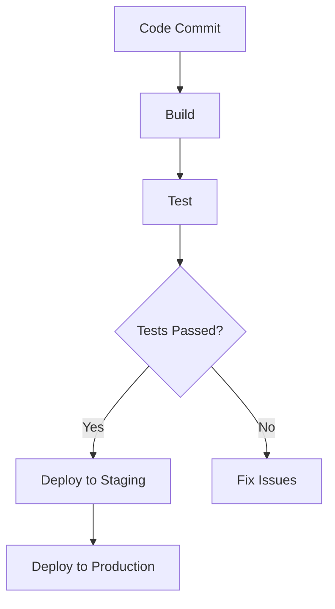

## 14.7 Continuous Integration and Delivery (CI/CD)

Continuous Integration and Delivery (CI/CD) are essential practices in modern software development, enabling teams to deliver high-quality software efficiently and reliably. In this section, we will delve into the concepts of CI/CD, explore how to implement these practices in Haxe projects, and highlight the benefits they bring to cross-platform development.

### Understanding Continuous Integration and Delivery

**Continuous Integration (CI)** is the practice of automatically integrating code changes from multiple contributors into a shared repository several times a day. This process involves automated testing to ensure that new code does not break existing functionality.

**Continuous Delivery (CD)** extends CI by automating the release process, allowing code to be deployed to production environments at any time. This practice ensures that software can be released quickly and reliably.

### Implementing CI/CD in Haxe Projects

Implementing CI/CD in Haxe projects involves several key components: build automation, test automation, and deployment automation. Let's explore each of these components in detail.

#### Build Automation

Build automation is the process of automatically compiling and packaging code. In Haxe projects, this involves compiling Haxe code into target languages such as JavaScript, C++, or Python.

- **Tools for Build Automation:**
  - **Jenkins:** An open-source automation server that supports building, deploying, and automating software projects.
  - **Travis CI:** A cloud-based CI service that integrates with GitHub repositories.
  - **GitHub Actions:** A CI/CD platform that allows you to automate workflows directly from your GitHub repository.

**Example: Setting Up a Build Pipeline with GitHub Actions**

```yaml
name: Haxe CI

on:
  push:
    branches:
      - main
  pull_request:
    branches:
      - main

jobs:
  build:
    runs-on: ubuntu-latest

    steps:
    - name: Checkout code
      uses: actions/checkout@v2

    - name: Set up Haxe
      uses: haxe/setup-haxe@v1
      with:
        haxe-version: '4.2.4'

    - name: Build project
      run: haxe build.hxml
```

In this example, we define a GitHub Actions workflow that triggers on pushes and pull requests to the `main` branch. It checks out the code, sets up Haxe, and builds the project using a specified `build.hxml` file.

#### Test Automation

Test automation involves running automated tests to verify the functionality of the code. In Haxe projects, this can be achieved using testing frameworks such as **utest** or **munit**.

- **Running Tests Automatically:**
  - Configure your CI pipeline to run tests whenever code is committed or a pull request is opened.
  - Use test reports to identify and address failures quickly.

**Example: Adding Test Automation to the GitHub Actions Workflow**

```yaml
jobs:
  build:
    runs-on: ubuntu-latest

    steps:
    - name: Checkout code
      uses: actions/checkout@v2

    - name: Set up Haxe
      uses: haxe/setup-haxe@v1
      with:
        haxe-version: '4.2.4'

    - name: Build project
      run: haxe build.hxml

    - name: Run tests
      run: haxelib run munit test
```

This example extends the previous workflow by adding a step to run tests using the **munit** framework. The `haxelib run munit test` command executes the tests defined in the project.

#### Deployment Automation

Deployment automation is the process of automatically releasing software to staging or production environments. This can be achieved using deployment tools and scripts.

- **Automating Deployment:**
  - Use deployment scripts to automate the release process.
  - Integrate with cloud platforms or hosting services for seamless deployment.

**Example: Automating Deployment with GitHub Actions**

```yaml
jobs:
  deploy:
    runs-on: ubuntu-latest
    needs: build

    steps:
    - name: Checkout code
      uses: actions/checkout@v2

    - name: Deploy to server
      run: |
        scp -r ./build user@server:/path/to/deploy
        ssh user@server 'systemctl restart myapp'
```

In this example, we define a deployment job that runs after the build job. It uses `scp` to copy the build artifacts to a remote server and `ssh` to restart the application.

### Benefits of CI/CD

Implementing CI/CD in Haxe projects offers several benefits:

- **Rapid Feedback:** Developers receive immediate feedback on code changes, allowing them to address issues quickly.
- **Consistency:** Automated processes ensure that builds and deployments are consistent, reducing the risk of human error.
- **Improved Collaboration:** CI/CD fosters collaboration by integrating code changes frequently and providing a shared understanding of the project's status.
- **Faster Time to Market:** By automating testing and deployment, teams can release software more frequently and with greater confidence.

### Visualizing the CI/CD Pipeline

To better understand the CI/CD process, let's visualize a typical pipeline using a flowchart.



**Description:** This flowchart represents a typical CI/CD pipeline. Code commits trigger a build process, followed by automated testing. If tests pass, the code is deployed to a staging environment and then to production. If tests fail, issues are addressed before proceeding.

### Try It Yourself

Experiment with the provided GitHub Actions workflow by modifying the build and test steps. Try integrating additional tools or frameworks to enhance your CI/CD pipeline.

### References and Links

- [Jenkins Documentation](https://www.jenkins.io/doc/)
- [Travis CI Documentation](https://docs.travis-ci.com/)
- [GitHub Actions Documentation](https://docs.github.com/en/actions)
- [Haxe Setup Action](https://github.com/haxe/setup-haxe)

### Knowledge Check

- What are the key components of a CI/CD pipeline?
- How does CI/CD improve collaboration among developers?
- What tools can be used for build automation in Haxe projects?

### Embrace the Journey

Remember, mastering CI/CD is a journey. As you implement these practices in your Haxe projects, you'll gain valuable insights into automating and streamlining your development process. Keep experimenting, stay curious, and enjoy the journey!

## Quiz Time!



### What is the primary goal of Continuous Integration (CI)?

- [x] To automatically integrate code changes and run tests
- [ ] To manually deploy code to production
- [ ] To write code without testing
- [ ] To manage project documentation

> **Explanation:** Continuous Integration (CI) aims to automatically integrate code changes and run tests to ensure code quality.

### Which tool is commonly used for build automation in Haxe projects?

- [x] Jenkins
- [ ] Microsoft Word
- [ ] Adobe Photoshop
- [ ] Google Sheets

> **Explanation:** Jenkins is a popular tool for build automation in software projects, including Haxe.

### What is the purpose of test automation in CI/CD?

- [x] To verify the functionality of the code automatically
- [ ] To manually check code syntax
- [ ] To design user interfaces
- [ ] To write project documentation

> **Explanation:** Test automation in CI/CD is used to verify the functionality of the code automatically.

### What does a deployment script do in a CI/CD pipeline?

- [x] Automates the release process to staging or production environments
- [ ] Writes code documentation
- [ ] Designs user interfaces
- [ ] Manually tests code

> **Explanation:** Deployment scripts automate the release process to staging or production environments in a CI/CD pipeline.

### Which of the following is a benefit of CI/CD?

- [x] Rapid feedback on code changes
- [ ] Increased manual testing
- [ ] Slower release cycles
- [ ] More complex code

> **Explanation:** CI/CD provides rapid feedback on code changes, allowing developers to address issues quickly.

### What is the role of GitHub Actions in CI/CD?

- [x] To automate workflows directly from a GitHub repository
- [ ] To design user interfaces
- [ ] To write project documentation
- [ ] To manually test code

> **Explanation:** GitHub Actions is a CI/CD platform that automates workflows directly from a GitHub repository.

### What happens if tests fail in a CI/CD pipeline?

- [x] Issues are addressed before proceeding
- [ ] Code is deployed to production
- [ ] Code is deleted
- [ ] Documentation is updated

> **Explanation:** If tests fail in a CI/CD pipeline, issues are addressed before proceeding to deployment.

### What is the purpose of a staging environment in CI/CD?

- [x] To test code in a production-like environment before deployment
- [ ] To write project documentation
- [ ] To design user interfaces
- [ ] To manually test code

> **Explanation:** A staging environment is used to test code in a production-like environment before deployment.

### How does CI/CD improve consistency in software development?

- [x] By automating processes and reducing human error
- [ ] By increasing manual testing
- [ ] By slowing down release cycles
- [ ] By making code more complex

> **Explanation:** CI/CD improves consistency by automating processes and reducing the risk of human error.

### True or False: CI/CD can help teams release software more frequently and with greater confidence.

- [x] True
- [ ] False

> **Explanation:** CI/CD automates testing and deployment, allowing teams to release software more frequently and with greater confidence.


