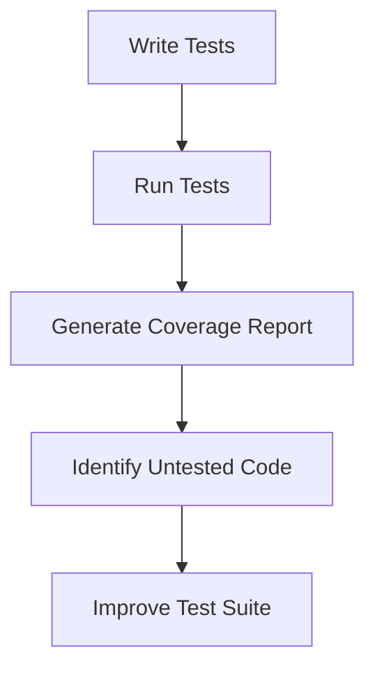
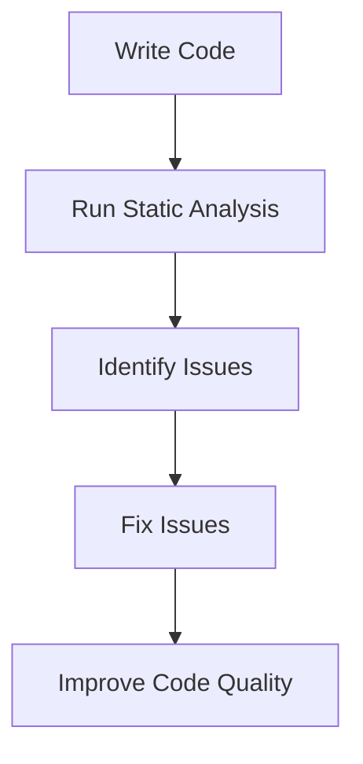

## 14.8 Code Coverage and Static Analysis

In the realm of software development, ensuring the quality and reliability of your code is paramount. Two critical techniques that aid in achieving this goal are code coverage and static analysis. These methodologies help developers identify untested code paths and potential issues in the codebase without executing the program. In this section, we will delve into these concepts, explore their importance, and demonstrate how to implement them effectively in Haxe.

### Understanding Code Coverage

**Code Coverage** is a measure used to describe the degree to which the source code of a program is tested by a particular test suite. It provides insights into which parts of the code are being exercised during testing, helping developers identify untested areas that may harbor bugs.

#### Types of Code Coverage

1. **Line Coverage:** Measures the percentage of executed lines of code.
2. **Branch Coverage:** Evaluates whether each branch (e.g., `if` and `else` statements) has been executed.
3. **Function Coverage:** Checks if each function in the code has been called.
4. **Path Coverage:** Ensures all possible paths through the code are tested.

### Implementing Code Coverage in Haxe

Haxe, being a versatile language, can be compiled to multiple targets, which means the approach to code coverage might vary depending on the target platform. Here are some strategies:

#### Using `hxscout` for Flash Targets

`hxscout` is a tool that can be used for profiling and code coverage analysis in Flash applications. It provides insights into performance bottlenecks and untested code areas.

```haxe
// Sample Haxe code for a simple Flash application
class Main {
    static function main() {
        trace("Hello, Haxe!");
    }
}
```

To use `hxscout`, integrate it into your build process and run your test suite. The tool will generate a report highlighting the coverage metrics.

#### Integrating with Platform-Specific Tools

For other targets like JavaScript, C++, or Java, you can leverage platform-specific tools. For instance, you can use `Istanbul` for JavaScript to measure code coverage.

```bash
npx nyc --reporter=html --reporter=text mocha
```

### Understanding Static Analysis

**Static Analysis** involves examining the code for potential errors and code smells without executing it. This process helps in identifying issues such as syntax errors, type mismatches, and potential security vulnerabilities early in the development cycle.

#### Benefits of Static Analysis

- **Early Detection of Errors:** Identify issues before runtime, reducing debugging time.
- **Improved Code Quality:** Enforce coding standards and best practices.
- **Security Assurance:** Detect vulnerabilities and ensure secure coding practices.

### Implementing Static Analysis in Haxe

Haxe provides several built-in features and third-party tools to facilitate static analysis:

#### Compiler Warnings

The Haxe compiler itself is a powerful tool for static analysis. It provides warnings and errors for common issues such as type mismatches and unused variables.

```haxe
// Example Haxe code with a potential type mismatch
class Example {
    static function main() {
        var number:Int = "This is not a number"; // Compiler will warn about this
    }
}
```

#### Third-Party Tools

Tools like `Haxe Checkstyle` can be used to enforce coding standards and detect code smells. These tools analyze the codebase and provide reports on potential issues.

```bash
haxelib run checkstyle src
```

### Use Cases and Examples

#### Improving Test Suites

By using code coverage tools, you can identify untested areas in your codebase. This information is invaluable for improving your test suites and ensuring comprehensive testing.

```haxe
// Example of a function that might be untested
function calculateSum(a:Int, b:Int):Int {
    return a + b;
}
```

Focus on writing tests for functions and branches that are not covered by your existing test suite.

#### Code Quality Metrics

Static analysis tools provide metrics that help in assessing code quality. These metrics can include cyclomatic complexity, code duplication, and adherence to coding standards.

```haxe
// Example of a complex function that might need refactoring
function complexFunction(x:Int):Int {
    if (x > 10) {
        return x * 2;
    } else if (x < 5) {
        return x / 2;
    } else {
        return x + 2;
    }
}
```

### Visualizing Code Coverage and Static Analysis

To better understand the flow and impact of code coverage and static analysis, let's visualize these concepts using Mermaid.js diagrams.

#### Code Coverage Flow



**Diagram Description:** This flowchart illustrates the process of using code coverage to improve test suites. It starts with writing tests, running them, generating a coverage report, identifying untested code, and finally improving the test suite.

#### Static Analysis Workflow



**Diagram Description:** This flowchart represents the static analysis workflow. It begins with writing code, running static analysis, identifying issues, fixing them, and ultimately improving code quality.

### References and Links

- [Haxe Compiler Documentation](https://haxe.org/documentation/)
- [Istanbul Code Coverage Tool](https://istanbul.js.org/)
- [Haxe Checkstyle](https://github.com/HaxeCheckstyle/haxe-checkstyle)

### Knowledge Check

Let's reinforce our understanding with some questions and exercises:

1. **What is the primary purpose of code coverage?**
   - To measure the extent to which the codebase is tested.

2. **How can static analysis improve code quality?**
   - By identifying potential issues and enforcing coding standards.

3. **Try It Yourself:** Modify the `complexFunction` example to reduce its cyclomatic complexity.

### Embrace the Journey

Remember, mastering code coverage and static analysis is a continuous journey. As you integrate these practices into your workflow, you'll find that your code becomes more robust, maintainable, and secure. Keep experimenting, stay curious, and enjoy the process of creating high-quality software!

## Quiz Time!



### What is the primary purpose of code coverage?

- [x] To measure the extent to which the codebase is tested
- [ ] To execute the code and find runtime errors
- [ ] To compile the code without errors
- [ ] To optimize the code for performance

> **Explanation:** Code coverage measures how much of the codebase is exercised by the test suite, helping identify untested areas.

### Which type of code coverage ensures all possible paths through the code are tested?

- [ ] Line Coverage
- [ ] Function Coverage
- [ ] Branch Coverage
- [x] Path Coverage

> **Explanation:** Path coverage ensures that all possible execution paths in the code are tested.

### What is a benefit of static analysis?

- [x] Early detection of errors
- [ ] Faster code execution
- [ ] Reduced memory usage
- [ ] Increased code complexity

> **Explanation:** Static analysis helps identify potential issues early in the development process, before runtime.

### Which tool can be used for code coverage in JavaScript targets?

- [ ] hxscout
- [x] Istanbul
- [ ] Haxe Checkstyle
- [ ] Mocha

> **Explanation:** Istanbul is a tool used for measuring code coverage in JavaScript applications.

### How does static analysis improve security?

- [x] By detecting vulnerabilities and ensuring secure coding practices
- [ ] By encrypting the codebase
- [ ] By obfuscating the code
- [ ] By reducing code size

> **Explanation:** Static analysis can identify security vulnerabilities and enforce secure coding practices.

### What does the Haxe compiler provide for static analysis?

- [x] Compiler warnings and errors
- [ ] Code execution reports
- [ ] Performance metrics
- [ ] Memory usage statistics

> **Explanation:** The Haxe compiler provides warnings and errors for common issues, aiding in static analysis.

### Which tool can enforce coding standards in Haxe?

- [ ] hxscout
- [ ] Istanbul
- [x] Haxe Checkstyle
- [ ] Mocha

> **Explanation:** Haxe Checkstyle is a tool used to enforce coding standards and detect code smells in Haxe.

### What is the first step in the code coverage flowchart?

- [x] Write Tests
- [ ] Run Tests
- [ ] Generate Coverage Report
- [ ] Identify Untested Code

> **Explanation:** The first step in the code coverage process is writing tests.

### What is the final step in the static analysis workflow?

- [ ] Write Code
- [ ] Run Static Analysis
- [ ] Identify Issues
- [x] Improve Code Quality

> **Explanation:** The final step in the static analysis workflow is improving code quality by fixing identified issues.

### True or False: Static analysis requires executing the program.

- [ ] True
- [x] False

> **Explanation:** Static analysis examines the code without executing it, identifying potential issues early.


