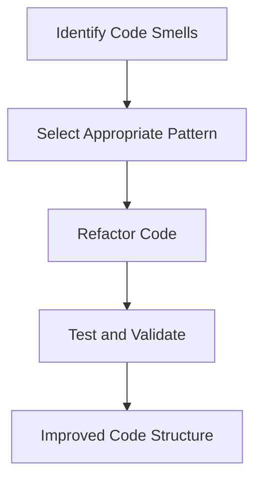

## 14.9 Refactoring with Design Patterns

Refactoring is a crucial process in software development that involves restructuring existing code without changing its external behavior. By applying design patterns during refactoring, we can enhance the maintainability, clarity, and adaptability of our code. In this section, we will delve into the strategies and benefits of refactoring with design patterns in Haxe, providing practical examples and insights for expert cross-platform software engineers.

### Understanding Refactoring and Design Patterns

**Refactoring** is the process of improving the internal structure of code while preserving its functionality. It aims to make the code more readable, flexible, and easier to maintain. **Design patterns** are proven solutions to common software design problems. They provide templates for solving specific issues in a way that promotes code reuse and scalability.

#### Key Concepts

- **Code Smells:** Indicators of potential problems in the code, such as duplication, large classes, or tight coupling.
- **Incremental Changes:** Making small, manageable changes to the codebase, ensuring that tests pass after each modification.
- **Pattern Application:** Selecting and applying design patterns that address identified code issues.

### Strategies for Refactoring with Design Patterns

Refactoring with design patterns involves several key strategies:

#### 1. Identify Code Smells

Detecting code smells is the first step in the refactoring process. Common code smells include:

- **Duplicated Code:** Repeated code blocks that can be consolidated.
- **Long Methods:** Methods that are too lengthy and complex.
- **Large Classes:** Classes that have too many responsibilities.
- **Tight Coupling:** Classes that are overly dependent on each other.

#### 2. Apply Patterns Appropriately

Once code smells are identified, apply design patterns that address these issues. Some common patterns include:

- **Singleton Pattern:** For managing global state or resources.
- **Factory Method Pattern:** For creating objects without specifying the exact class.
- **Observer Pattern:** For implementing event-driven systems.
- **Decorator Pattern:** For adding responsibilities to objects dynamically.

#### 3. Incremental Changes

Refactor in small steps to minimize risk and ensure code stability. After each change, run tests to verify that the code behaves as expected.

### Benefits of Refactoring with Design Patterns

Refactoring with design patterns offers several advantages:

- **Code Clarity:** Design patterns provide a clear structure, making the code easier to understand and extend.
- **Adaptability:** The code becomes more flexible and prepared for future changes or requirements.
- **Reduced Complexity:** Patterns help manage complexity by breaking down large problems into smaller, manageable components.

### Practical Examples in Haxe

Let's explore some practical examples of refactoring with design patterns in Haxe.

#### Example 1: Refactoring with the Singleton Pattern

Suppose we have a class that manages a global configuration:

```haxe
class ConfigManager {
    public var settings:Map<String, String>;

    public function new() {
        settings = new Map<String, String>();
    }

    public function getSetting(key:String):String {
        return settings.get(key);
    }

    public function setSetting(key:String, value:String):Void {
        settings.set(key, value);
    }
}
```

We can refactor this class using the Singleton pattern to ensure a single instance:

```haxe
class ConfigManager {
    private static var instance:ConfigManager;
    public var settings:Map<String, String>;

    private function new() {
        settings = new Map<String, String>();
    }

    public static function getInstance():ConfigManager {
        if (instance == null) {
            instance = new ConfigManager();
        }
        return instance;
    }

    public function getSetting(key:String):String {
        return settings.get(key);
    }

    public function setSetting(key:String, value:String):Void {
        settings.set(key, value);
    }
}
```

**Key Points:**

- The `ConfigManager` class now ensures a single instance through the `getInstance` method.
- The constructor is private, preventing direct instantiation.

#### Example 2: Refactoring with the Observer Pattern

Consider a simple event system where multiple components need to react to changes:

```haxe
class EventManager {
    private var listeners:Array<Dynamic>;

    public function new() {
        listeners = [];
    }

    public function subscribe(listener:Dynamic):Void {
        listeners.push(listener);
    }

    public function notify(event:String):Void {
        for (listener in listeners) {
            listener(event);
        }
    }
}
```

We can refactor this using the Observer pattern:

```haxe
interface Observer {
    function update(event:String):Void;
}

class EventManager {
    private var observers:Array<Observer>;

    public function new() {
        observers = [];
    }

    public function addObserver(observer:Observer):Void {
        observers.push(observer);
    }

    public function notifyObservers(event:String):Void {
        for (observer in observers) {
            observer.update(event);
        }
    }
}

class ConcreteObserver implements Observer {
    public function new() {}

    public function update(event:String):Void {
        trace("Received event: " + event);
    }
}
```

**Key Points:**

- The `Observer` interface defines the `update` method.
- `EventManager` manages a list of `Observer` instances and notifies them of events.
- `ConcreteObserver` implements the `Observer` interface and reacts to events.

### Visualizing the Refactoring Process

To better understand the refactoring process, let's visualize the transformation of a codebase using design patterns.



**Diagram Description:** This flowchart illustrates the refactoring process, starting with identifying code smells, selecting an appropriate pattern, refactoring the code, testing and validating changes, and achieving an improved code structure.

### Try It Yourself

Experiment with the provided code examples by:

- Modifying the `ConfigManager` to include additional settings.
- Implementing additional observers in the `EventManager` example.
- Creating your own refactoring scenarios using other design patterns.

### References and Further Reading

- [Refactoring: Improving the Design of Existing Code](https://refactoring.com/)
- [Design Patterns: Elements of Reusable Object-Oriented Software](https://www.amazon.com/Design-Patterns-Elements-Reusable-Object-Oriented/dp/0201633612)
- [Haxe Manual: Design Patterns](https://haxe.org/manual/)

### Knowledge Check

Let's reinforce your understanding with some questions and exercises.

## Quiz Time!



### What is the primary goal of refactoring?

- [x] Improving the internal structure of code without changing its external behavior
- [ ] Adding new features to the code
- [ ] Fixing bugs in the code
- [ ] Optimizing code for performance

> **Explanation:** Refactoring focuses on enhancing the code's internal structure while maintaining its existing functionality.

### Which design pattern ensures a class has only one instance?

- [x] Singleton Pattern
- [ ] Factory Method Pattern
- [ ] Observer Pattern
- [ ] Decorator Pattern

> **Explanation:** The Singleton pattern restricts a class to a single instance and provides a global access point to it.

### What is a code smell?

- [x] An indicator of potential problems in the code
- [ ] A type of design pattern
- [ ] A method for optimizing code
- [ ] A tool for debugging

> **Explanation:** Code smells are signs that there may be deeper issues in the code that need addressing.

### Which pattern is suitable for implementing event-driven systems?

- [x] Observer Pattern
- [ ] Singleton Pattern
- [ ] Factory Method Pattern
- [ ] Decorator Pattern

> **Explanation:** The Observer pattern is ideal for event-driven systems, allowing objects to be notified of changes.

### What is the benefit of applying design patterns during refactoring?

- [x] Enhancing code clarity and maintainability
- [ ] Increasing code execution speed
- [ ] Reducing code size
- [ ] Simplifying debugging

> **Explanation:** Design patterns improve the structure and readability of the code, making it easier to maintain.

### What should be done after each refactoring step?

- [x] Run tests to verify code behavior
- [ ] Add new features
- [ ] Remove comments
- [ ] Optimize for performance

> **Explanation:** Testing ensures that the refactoring process does not alter the code's functionality.

### Which pattern allows adding responsibilities to objects dynamically?

- [x] Decorator Pattern
- [ ] Singleton Pattern
- [ ] Observer Pattern
- [ ] Factory Method Pattern

> **Explanation:** The Decorator pattern enables dynamic addition of responsibilities to objects.

### What is the first step in the refactoring process?

- [x] Identify code smells
- [ ] Apply design patterns
- [ ] Write new tests
- [ ] Optimize code

> **Explanation:** Identifying code smells is crucial to understanding what needs refactoring.

### True or False: Refactoring can change the external behavior of the code.

- [ ] True
- [x] False

> **Explanation:** Refactoring should not alter the external behavior of the code; it focuses on internal improvements.

### Which pattern is used for creating objects without specifying the exact class?

- [x] Factory Method Pattern
- [ ] Singleton Pattern
- [ ] Observer Pattern
- [ ] Decorator Pattern

> **Explanation:** The Factory Method pattern provides an interface for creating objects, allowing subclasses to alter the type of objects that will be created.



Remember, refactoring with design patterns is a journey towards cleaner, more maintainable code. As you continue to apply these techniques, you'll find your codebase becoming more robust and adaptable to future changes. Keep experimenting, stay curious, and enjoy the process of refining your craft!
