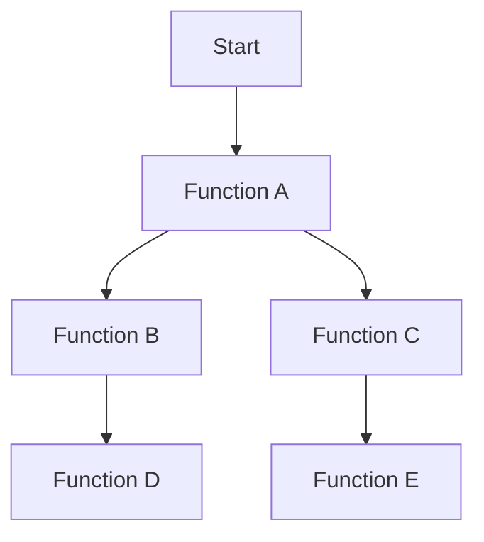

## 15.1 Profiling Haxe Applications

In the realm of software development, performance optimization is a crucial aspect that can significantly impact the user experience and efficiency of an application. Profiling is the process of measuring various aspects of an application's performance to locate bottlenecks and inefficiencies. In this section, we will delve into the intricacies of profiling Haxe applications, exploring both platform-specific tools and Haxe-specific techniques to ensure your applications run smoothly across all target platforms.

### Understanding Profiling

Profiling involves collecting data about an application's execution to identify areas that require optimization. This data can include information about CPU usage, memory consumption, function call frequency, and execution time. By analyzing this data, developers can pinpoint performance bottlenecks and make informed decisions about where to focus optimization efforts.

#### Key Profiling Metrics

- **CPU Usage:** Measures the amount of processing power consumed by the application.
- **Memory Usage:** Tracks the application's memory allocation and identifies potential leaks.
- **Execution Time:** Records the time taken by functions or processes to execute.
- **Function Call Frequency:** Counts how often functions are called, helping to identify hotspots.

### Implementing Profiling in Haxe

Profiling Haxe applications can be approached using a combination of platform-specific tools and Haxe-specific techniques. Let's explore these methods in detail.

#### Platform-Specific Tools

1. **Chrome DevTools (JavaScript):** For applications targeting JavaScript, Chrome DevTools provides a comprehensive suite of profiling tools. Use the Performance tab to record and analyze CPU usage, memory consumption, and function call stacks.

2. **VisualVM (JVM):** For applications running on the Java Virtual Machine, VisualVM offers powerful profiling capabilities. It provides insights into memory usage, CPU performance, and thread activity.

3. **Instruments (iOS):** For iOS applications, Instruments is a versatile tool that allows developers to profile CPU, memory, and energy usage, among other metrics.

4. **Xcode Profiler (macOS):** Use Xcode's built-in profiler to analyze macOS applications, focusing on CPU, memory, and disk usage.

5. **Valgrind (Linux):** For Linux applications, Valgrind is a robust tool for detecting memory leaks and profiling CPU usage.

#### Haxe-Specific Techniques

While platform-specific tools are invaluable, Haxe developers can also leverage Haxe-specific techniques to gain deeper insights into their applications' performance.

1. **Custom Logging:** Implement custom logging to track function execution times and memory usage. This can be achieved by inserting logging statements at strategic points in the code.

   ```haxe
   class Profiler {
       public static function logExecutionTime(func:Void->Void, label:String):Void {
           var start = Date.now().getTime();
           func();
           var end = Date.now().getTime();
           trace(label + " executed in " + (end - start) + " ms");
       }
   }

   // Usage
   Profiler.logExecutionTime(function() {
       // Code to profile
   }, "MyFunction");
   ```

2. **Haxe Macros:** Utilize Haxe's powerful macro system to automate profiling tasks. Macros can be used to inject profiling code into functions at compile time.

   ```haxe
   macro function profileFunction(func:Function):Function {
       // Inject profiling code
   }
   ```

3. **Memory Profiling:** Use Haxe's reflection capabilities to monitor memory usage and detect leaks. This involves tracking object creation and destruction.

### Use Cases and Examples

Profiling is essential for identifying and resolving performance issues in Haxe applications. Let's explore some common use cases and examples.

#### Identifying Slow Functions

One of the primary goals of profiling is to identify slow functions that may be causing performance bottlenecks. By analyzing function execution times, developers can pinpoint areas that require optimization.

**Example:**

Suppose you have a function that processes a large dataset. Profiling reveals that this function is consuming a significant amount of CPU time. By optimizing the algorithm or using more efficient data structures, you can reduce the execution time and improve overall performance.

```haxe
function processData(data:Array<Int>):Void {
    // Inefficient algorithm
    for (i in 0...data.length) {
        for (j in 0...data.length) {
            if (data[i] > data[j]) {
                // Process data
            }
        }
    }
}

// Optimized version
function optimizedProcessData(data:Array<Int>):Void {
    // Use a more efficient algorithm
    data.sort();
    for (i in 0...data.length) {
        // Process sorted data
    }
}
```

#### Detecting Memory Leaks

Memory leaks occur when an application fails to release memory that is no longer needed, leading to increased memory consumption over time. Profiling can help detect and fix these leaks.

**Example:**

Consider an application that creates objects in a loop but fails to release them. Profiling reveals that memory usage steadily increases, indicating a leak. By ensuring that objects are properly disposed of, you can prevent memory leaks.

```haxe
class MemoryLeakExample {
    public static function createObjects():Void {
        var objects = [];
        for (i in 0...1000) {
            objects.push(new Object());
        }
        // Fix: Clear the array to release memory
        objects = [];
    }
}
```

### Visualizing Profiling Data

Visualizing profiling data can provide valuable insights into an application's performance. Use diagrams and charts to represent function call hierarchies, memory usage trends, and CPU consumption.



**Diagram Description:** This flowchart represents a function call hierarchy, illustrating how functions are invoked during execution. By analyzing such diagrams, developers can identify critical paths and optimize performance.

### References and Links

- [Chrome DevTools Documentation](https://developer.chrome.com/docs/devtools/)
- [VisualVM Official Site](https://visualvm.github.io/)
- [Instruments User Guide](https://developer.apple.com/library/archive/documentation/DeveloperTools/Conceptual/InstrumentsUserGuide/)
- [Valgrind Documentation](http://valgrind.org/docs/manual/manual.html)

### Knowledge Check

To reinforce your understanding of profiling Haxe applications, consider the following questions:

1. What are the key metrics to track during profiling?
2. How can custom logging be used to profile Haxe applications?
3. What are the benefits of using Haxe macros for profiling?
4. How can memory leaks be detected and fixed in Haxe applications?
5. What tools can be used to profile Haxe applications targeting JavaScript?

### Embrace the Journey

Remember, profiling is an ongoing process that requires continuous monitoring and optimization. As you gain experience, you'll develop a keen eye for identifying performance bottlenecks and implementing effective solutions. Keep experimenting, stay curious, and enjoy the journey of optimizing your Haxe applications!

### Quiz Time!



### What is the primary goal of profiling in Haxe applications?

- [x] To identify performance bottlenecks
- [ ] To increase code complexity
- [ ] To add more features
- [ ] To reduce code readability

> **Explanation:** Profiling aims to identify performance bottlenecks to optimize application efficiency.

### Which tool is recommended for profiling Haxe applications targeting JavaScript?

- [x] Chrome DevTools
- [ ] VisualVM
- [ ] Instruments
- [ ] Valgrind

> **Explanation:** Chrome DevTools provides comprehensive profiling tools for JavaScript applications.

### How can custom logging be implemented in Haxe?

- [x] By inserting logging statements at strategic points in the code
- [ ] By using external libraries only
- [ ] By modifying the Haxe compiler
- [ ] By disabling all logs

> **Explanation:** Custom logging involves adding logging statements to track performance metrics.

### What is a common symptom of a memory leak?

- [x] Increased memory consumption over time
- [ ] Decreased CPU usage
- [ ] Faster execution times
- [ ] Reduced memory allocation

> **Explanation:** Memory leaks result in increased memory consumption as memory is not released.

### How can Haxe macros assist in profiling?

- [x] By automating the injection of profiling code
- [ ] By reducing code size
- [ ] By enhancing graphics rendering
- [ ] By improving network latency

> **Explanation:** Haxe macros can automate the injection of profiling code at compile time.

### What is the benefit of using diagrams in profiling?

- [x] To visualize function call hierarchies and performance data
- [ ] To increase code complexity
- [ ] To reduce application size
- [ ] To enhance user interface design

> **Explanation:** Diagrams help visualize function call hierarchies and performance data for better analysis.

### Which tool is suitable for profiling Haxe applications on iOS?

- [x] Instruments
- [ ] Chrome DevTools
- [ ] VisualVM
- [ ] Valgrind

> **Explanation:** Instruments is a versatile tool for profiling iOS applications.

### What is a key advantage of using platform-specific tools for profiling?

- [x] They provide detailed insights into platform-specific performance metrics
- [ ] They reduce application size
- [ ] They simplify code syntax
- [ ] They enhance graphics rendering

> **Explanation:** Platform-specific tools offer detailed insights into performance metrics relevant to the target platform.

### What is the purpose of function call frequency analysis?

- [x] To identify hotspots in the code
- [ ] To increase code complexity
- [ ] To enhance user interface design
- [ ] To reduce memory usage

> **Explanation:** Function call frequency analysis helps identify hotspots that may require optimization.

### True or False: Profiling is a one-time process.

- [ ] True
- [x] False

> **Explanation:** Profiling is an ongoing process that requires continuous monitoring and optimization.


