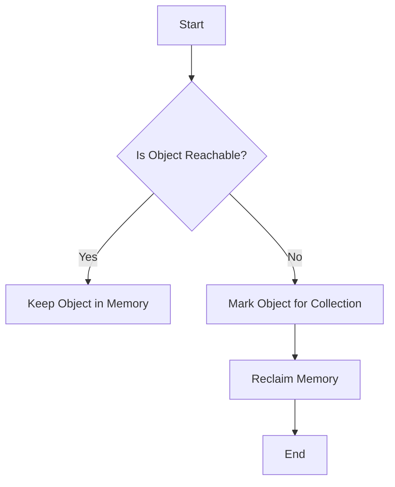

## 15.2 Memory Management and Garbage Collection

In the realm of software development, efficient memory management is crucial for optimizing performance, especially in cross-platform environments like Haxe. Understanding how memory is managed and how garbage collection (GC) operates across different targets can significantly impact the performance and reliability of your applications. In this section, we will delve into the intricacies of memory management and garbage collection in Haxe, explore optimization techniques, and provide practical examples to illustrate these concepts.

### Understanding Garbage Collection

Garbage collection is an automatic memory management feature that reclaims memory occupied by objects that are no longer in use. This process is essential for preventing memory leaks and ensuring that applications do not consume more memory than necessary. However, the behavior and efficiency of garbage collection can vary significantly across different platforms and targets.

#### Automatic Memory Management

Haxe compiles to multiple targets, each with its own garbage collection mechanism. Understanding these differences is key to optimizing memory usage:

- **JavaScript:** Uses the garbage collector of the JavaScript engine (e.g., V8, SpiderMonkey). It employs a generational garbage collection strategy, which is efficient for web applications but can introduce latency.
- **C++:** Typically relies on manual memory management, though libraries like Boehm GC can be used for automatic garbage collection.
- **C# and Java:** Utilize their respective runtime environments' garbage collectors (CLR for C# and JVM for Java), which are sophisticated and handle memory management efficiently.
- **Python:** Uses reference counting with a cyclic garbage collector to handle memory, which can be less efficient in certain scenarios.

#### Impact on Real-Time Systems

Garbage collection can introduce pauses in application execution, known as "GC pauses," which can be detrimental to real-time systems such as games and interactive applications. These pauses occur because the garbage collector needs to stop the application to reclaim memory, which can lead to noticeable lags.

To mitigate the impact of GC pauses:

- **Minimize Object Creation:** Reduce the frequency of object creation and destruction, as this can trigger garbage collection more often.
- **Use Object Pools:** Reuse objects instead of creating new ones, which can help in reducing the load on the garbage collector.
- **Profile and Monitor:** Use profiling tools to monitor memory usage and identify bottlenecks.

### Optimization Techniques

Optimizing memory management involves both reducing the need for garbage collection and managing resources efficiently. Here are some techniques to consider:

#### Reduce Object Allocation

One of the most effective ways to optimize memory usage is to reduce the number of objects allocated during the application's lifecycle. This can be achieved by:

- **Reusing Objects:** Implement object pooling to reuse objects instead of creating new ones. This is particularly useful in scenarios where objects are frequently created and destroyed, such as in game loops or network communication.
  
  ```haxe
  class ObjectPool<T> {
      private var pool:Array<T> = [];
      
      public function new() {}

      public function acquire(create:() -> T):T {
          if (pool.length > 0) {
              return pool.pop();
          }
          return create();
      }

      public function release(obj:T):Void {
          pool.push(obj);
      }
  }
  ```

- **Avoiding Unnecessary Allocations:** Be mindful of creating temporary objects within loops or frequently called functions. Instead, use pre-allocated buffers or arrays.

#### Manage Lifecycles

Properly managing the lifecycle of objects and resources can prevent memory leaks and reduce the burden on the garbage collector:

- **Dispose of Large Resources:** Manually dispose of large resources such as file handles, network connections, or graphical assets when they are no longer needed. This is especially important in environments with limited memory, such as mobile devices.

  ```haxe
  class ResourceManager {
      private var resources:Array<Resource> = [];

      public function addResource(resource:Resource):Void {
          resources.push(resource);
      }

      public function dispose():Void {
          for (resource in resources) {
              resource.dispose();
          }
          resources = [];
      }
  }
  ```

- **Use Weak References:** In some cases, using weak references can help prevent memory leaks by allowing the garbage collector to reclaim objects that are only weakly referenced.

### Use Cases and Examples

Let's explore some practical use cases where memory management and garbage collection optimization are critical:

#### Games

In game development, consistent performance is crucial. Frame rate drops due to GC pauses can ruin the user experience. To address this:

- **Implement Object Pools:** Use object pools for frequently used game objects like bullets, enemies, or particles.
- **Optimize Asset Loading:** Load assets asynchronously and dispose of them when not needed to free up memory.

#### Mobile Applications

Mobile devices often have limited memory resources, making efficient memory management essential:

- **Manage Background Processes:** Ensure that background processes do not consume excessive memory, which can lead to application termination by the operating system.
- **Optimize UI Components:** Reuse UI components and avoid unnecessary redraws to reduce memory usage.

### Visualizing Garbage Collection

To better understand how garbage collection works, let's visualize the process using a flowchart:



**Figure 1:** This flowchart illustrates the basic process of garbage collection, where objects are checked for reachability. If an object is not reachable, it is marked for collection, and its memory is reclaimed.

### References and Links

For further reading on garbage collection and memory management, consider the following resources:

- [MDN Web Docs on Memory Management](https://developer.mozilla.org/en-US/docs/Web/JavaScript/Memory_Management)
- [Java Garbage Collection Basics](https://www.oracle.com/webfolder/technetwork/tutorials/obe/java/gc01/index.html)
- [Python Memory Management](https://docs.python.org/3/c-api/memory.html)

### Knowledge Check

To reinforce your understanding of memory management and garbage collection, consider the following questions:

- How does garbage collection differ across Haxe targets?
- What are some techniques to reduce object allocation?
- Why is managing object lifecycles important in memory optimization?

### Embrace the Journey

Remember, mastering memory management and garbage collection is a journey. As you continue to develop applications in Haxe, keep experimenting with different optimization techniques, stay curious about how memory is managed across different platforms, and enjoy the process of creating efficient and high-performing software.

## Quiz Time!



### What is the primary purpose of garbage collection?

- [x] To reclaim memory occupied by objects that are no longer in use.
- [ ] To allocate memory for new objects.
- [ ] To manage CPU resources.
- [ ] To optimize network bandwidth.

> **Explanation:** Garbage collection is primarily used to reclaim memory that is no longer needed by the program, preventing memory leaks.

### Which Haxe target typically relies on manual memory management?

- [ ] JavaScript
- [x] C++
- [ ] C#
- [ ] Python

> **Explanation:** C++ typically relies on manual memory management, though libraries like Boehm GC can be used for automatic garbage collection.

### What is a common consequence of garbage collection in real-time systems?

- [ ] Increased memory usage
- [x] GC pauses
- [ ] Faster execution
- [ ] Reduced CPU usage

> **Explanation:** GC pauses can occur during garbage collection, which can affect the performance of real-time systems.

### How can object pools help in memory optimization?

- [x] By reusing objects instead of creating new ones
- [ ] By increasing the number of objects
- [ ] By reducing memory allocation time
- [ ] By improving network performance

> **Explanation:** Object pools help in memory optimization by reusing objects, reducing the need for frequent allocations and deallocations.

### What is a weak reference used for?

- [x] To allow garbage collection of objects that are only weakly referenced
- [ ] To prevent objects from being garbage collected
- [ ] To increase object lifespan
- [ ] To improve CPU performance

> **Explanation:** Weak references allow objects to be garbage collected even if they are still referenced, preventing memory leaks.

### Which of the following is a technique to reduce object allocation?

- [x] Reusing objects
- [ ] Increasing object size
- [ ] Using more threads
- [ ] Reducing CPU usage

> **Explanation:** Reusing objects is a technique to reduce the frequency of object allocation, which can help in optimizing memory usage.

### Why is it important to dispose of large resources manually?

- [x] To free up memory and prevent leaks
- [ ] To increase CPU usage
- [ ] To improve network performance
- [ ] To reduce application size

> **Explanation:** Manually disposing of large resources helps free up memory and prevent memory leaks, especially in environments with limited memory.

### What is the impact of GC pauses on mobile applications?

- [x] They can lead to application termination by the OS
- [ ] They improve application performance
- [ ] They reduce memory usage
- [ ] They increase network bandwidth

> **Explanation:** GC pauses can lead to application termination by the operating system if the application consumes too much memory.

### How can asset loading be optimized in games?

- [x] By loading assets asynchronously and disposing of them when not needed
- [ ] By loading all assets at startup
- [ ] By using larger assets
- [ ] By reducing asset quality

> **Explanation:** Loading assets asynchronously and disposing of them when not needed helps optimize memory usage and improve game performance.

### True or False: Garbage collection is the same across all Haxe targets.

- [ ] True
- [x] False

> **Explanation:** Garbage collection mechanisms vary across different Haxe targets, each with its own approach to memory management.


