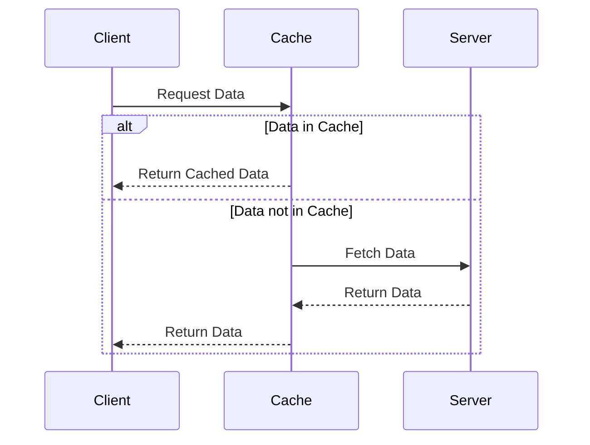

## 15.4 Caching and Memoization Strategies

In the realm of software engineering, especially when dealing with cross-platform development using Haxe, optimizing performance is paramount. One of the most effective ways to achieve this is through caching and memoization. These strategies involve storing the results of expensive operations for later reuse, thereby reducing the need for redundant computations and improving application responsiveness.

### Understanding Caching and Memoization

**Caching** is a technique used to store data temporarily in a storage location called a cache, so that future requests for that data can be served faster. Caches can be implemented at various levels, including hardware, operating systems, web browsers, and application layers.

**Memoization**, on the other hand, is a specific form of caching that involves storing the results of expensive function calls and returning the cached result when the same inputs occur again. It is particularly useful for optimizing recursive functions and computationally intensive tasks.

### Implementing Caching and Memoization in Haxe

Haxe, with its powerful features such as static typing, macros, and cross-platform capabilities, provides an excellent environment for implementing caching and memoization strategies. Let's delve into how we can leverage these features to optimize performance.

#### Function-Level Caching: Memoize Pure Functions

Memoization is most effective when applied to pure functions—functions that always produce the same output for the same input and have no side effects. Here's how you can implement memoization in Haxe:

```haxe
class Memoizer {
    static function memoize<T, R>(func: T -> R): T -> R {
        var cache = new Map<T, R>();
        return function(arg: T): R {
            if (cache.exists(arg)) {
                return cache.get(arg);
            }
            var result = func(arg);
            cache.set(arg, result);
            return result;
        }
    }
}

// Example usage
class Main {
    static function main() {
        var fib = Memoizer.memoize(function(n: Int): Int {
            if (n <= 1) return n;
            return fib(n - 1) + fib(n - 2);
        });

        trace(fib(10)); // Outputs: 55
    }
}
```

In this example, we define a `Memoizer` class with a generic `memoize` function that takes a function `func` as an argument and returns a memoized version of it. The `Map` is used to store previously computed results.

#### Data Caching Layers: Implement Cache Hierarchies

For more complex applications, especially those involving data retrieval from external sources like databases or APIs, implementing a caching layer can significantly enhance performance. This involves creating a hierarchy of caches, such as in-memory caches, disk caches, and distributed caches.

```haxe
class CacheLayer {
    var memoryCache: Map<String, Dynamic> = new Map();
    var diskCache: Map<String, Dynamic> = new Map(); // Simulating disk cache

    function get(key: String): Dynamic {
        if (memoryCache.exists(key)) {
            return memoryCache.get(key);
        } else if (diskCache.exists(key)) {
            var value = diskCache.get(key);
            memoryCache.set(key, value); // Promote to memory cache
            return value;
        }
        return null;
    }

    function set(key: String, value: Dynamic): Void {
        memoryCache.set(key, value);
        diskCache.set(key, value); // Simulate writing to disk
    }
}

// Example usage
class Main {
    static function main() {
        var cache = new CacheLayer();
        cache.set("user_1", {name: "Alice", age: 30});
        trace(cache.get("user_1")); // Outputs: {name: "Alice", age: 30}
    }
}
```

In this example, we simulate a simple cache layer with in-memory and disk caches. The `get` method checks the memory cache first, then the disk cache, promoting data to the memory cache if found on disk.

### Use Cases and Examples

#### Web Applications: Caching API Responses

In web applications, caching API responses can drastically reduce server load and improve response times. This is particularly useful for data that doesn't change frequently.

```haxe
class ApiCache {
    var cache: Map<String, String> = new Map();

    function fetchData(url: String): String {
        if (cache.exists(url)) {
            return cache.get(url);
        }
        // Simulate API call
        var response = "API response for " + url;
        cache.set(url, response);
        return response;
    }
}

// Example usage
class Main {
    static function main() {
        var apiCache = new ApiCache();
        trace(apiCache.fetchData("https://api.example.com/data")); // Outputs: API response for https://api.example.com/data
        trace(apiCache.fetchData("https://api.example.com/data")); // Cached response
    }
}
```

#### Computational Heavy Tasks: Image Processing

For tasks like image processing, where operations can be computationally expensive, caching intermediate results can save significant processing time.

```haxe
class ImageProcessor {
    var cache: Map<String, Dynamic> = new Map();

    function processImage(imageId: String): Dynamic {
        if (cache.exists(imageId)) {
            return cache.get(imageId);
        }
        // Simulate image processing
        var processedImage = {id: imageId, data: "Processed Image Data"};
        cache.set(imageId, processedImage);
        return processedImage;
    }
}

// Example usage
class Main {
    static function main() {
        var processor = new ImageProcessor();
        trace(processor.processImage("img_001")); // Outputs: {id: "img_001", data: "Processed Image Data"}
        trace(processor.processImage("img_001")); // Cached result
    }
}
```

### Visualizing Caching and Memoization

To better understand the flow of caching and memoization, let's visualize the process using a sequence diagram.



**Diagram Description:** This sequence diagram illustrates the interaction between a client, cache, and server. The client requests data from the cache. If the data is available in the cache, it is returned directly to the client. If not, the cache fetches the data from the server, stores it, and then returns it to the client.

### Best Practices for Caching and Memoization

1. **Identify Cacheable Data:** Determine which data or computations are suitable for caching. Focus on data that is expensive to compute or retrieve and does not change frequently.

2. **Choose the Right Cache Strategy:** Depending on your application's needs, choose between in-memory, disk, or distributed caching. Consider the trade-offs between speed, storage, and complexity.

3. **Implement Cache Invalidation:** Ensure that your cache is invalidated or updated when the underlying data changes. This prevents serving stale data to users.

4. **Monitor Cache Performance:** Regularly monitor cache hit rates and performance metrics to ensure your caching strategy is effective. Adjust cache size and eviction policies as needed.

5. **Use Memoization for Pure Functions:** Apply memoization to pure functions to avoid redundant computations. This is particularly useful for recursive algorithms and mathematical computations.

### Try It Yourself

To deepen your understanding of caching and memoization in Haxe, try modifying the examples provided:

- **Experiment with Different Data Types:** Modify the `Memoizer` class to handle different data types and observe how memoization affects performance.
- **Implement a Cache Eviction Policy:** Add a simple eviction policy to the `CacheLayer` class, such as Least Recently Used (LRU), and test its impact on cache performance.
- **Simulate a Real API Call:** Replace the simulated API call in the `ApiCache` class with a real HTTP request using Haxe's HTTP client, and observe how caching improves response times.

### Knowledge Check

- **What is the primary difference between caching and memoization?**
- **How does memoization improve the performance of recursive functions?**
- **What are some common use cases for caching in web applications?**
- **Why is cache invalidation important, and how can it be implemented?**

### Embrace the Journey

Remember, mastering caching and memoization strategies is a journey. As you continue to explore and experiment with these techniques in Haxe, you'll gain a deeper understanding of how to optimize performance in your applications. Stay curious, keep learning, and enjoy the process!

## Quiz Time!



### What is the primary purpose of caching in software applications?

- [x] To store data temporarily for faster access
- [ ] To permanently store data
- [ ] To encrypt data for security
- [ ] To compress data for storage

> **Explanation:** Caching is used to store data temporarily to improve access speed and reduce the need for redundant computations.

### How does memoization differ from general caching?

- [x] Memoization is specific to storing function call results
- [ ] Memoization stores data in hardware caches
- [ ] Memoization is used for compressing data
- [ ] Memoization is a form of data encryption

> **Explanation:** Memoization specifically involves storing the results of function calls to avoid redundant computations, whereas caching can be used for various types of data storage.

### Which of the following is a suitable use case for memoization?

- [x] Optimizing recursive functions
- [ ] Storing user session data
- [ ] Encrypting sensitive information
- [ ] Compressing image files

> **Explanation:** Memoization is particularly useful for optimizing recursive functions by storing previously computed results.

### What is a key consideration when implementing caching strategies?

- [x] Cache invalidation
- [ ] Data encryption
- [ ] Data compression
- [ ] User authentication

> **Explanation:** Cache invalidation is crucial to ensure that stale data is not served to users when the underlying data changes.

### In the context of caching, what does "cache hit rate" refer to?

- [x] The percentage of requests served by the cache
- [ ] The speed at which data is encrypted
- [ ] The amount of data compressed
- [ ] The number of user sessions stored

> **Explanation:** Cache hit rate refers to the percentage of requests that are successfully served by the cache without needing to fetch data from the original source.

### Which Haxe feature is particularly useful for implementing memoization?

- [x] Static typing
- [ ] Dynamic typing
- [ ] Asynchronous programming
- [ ] Multi-threading

> **Explanation:** Static typing in Haxe helps ensure that memoized functions are type-safe and consistent in their behavior.

### What is a potential downside of using caching in applications?

- [x] Serving stale data
- [ ] Increased data encryption
- [ ] Reduced data compression
- [ ] Slower user authentication

> **Explanation:** If not properly managed, caching can lead to serving stale data if the cache is not invalidated or updated when the underlying data changes.

### How can cache performance be monitored effectively?

- [x] By tracking cache hit rates and performance metrics
- [ ] By encrypting all cached data
- [ ] By compressing cached data
- [ ] By increasing user authentication

> **Explanation:** Monitoring cache hit rates and performance metrics helps ensure that the caching strategy is effective and allows for adjustments as needed.

### What is a common strategy for cache eviction?

- [x] Least Recently Used (LRU)
- [ ] Most Recently Used (MRU)
- [ ] First In, First Out (FIFO)
- [ ] Last In, First Out (LIFO)

> **Explanation:** Least Recently Used (LRU) is a common cache eviction strategy that removes the least recently accessed items to make space for new data.

### True or False: Memoization is only applicable to pure functions.

- [x] True
- [ ] False

> **Explanation:** Memoization is most effective when applied to pure functions, as they always produce the same output for the same input and have no side effects.


