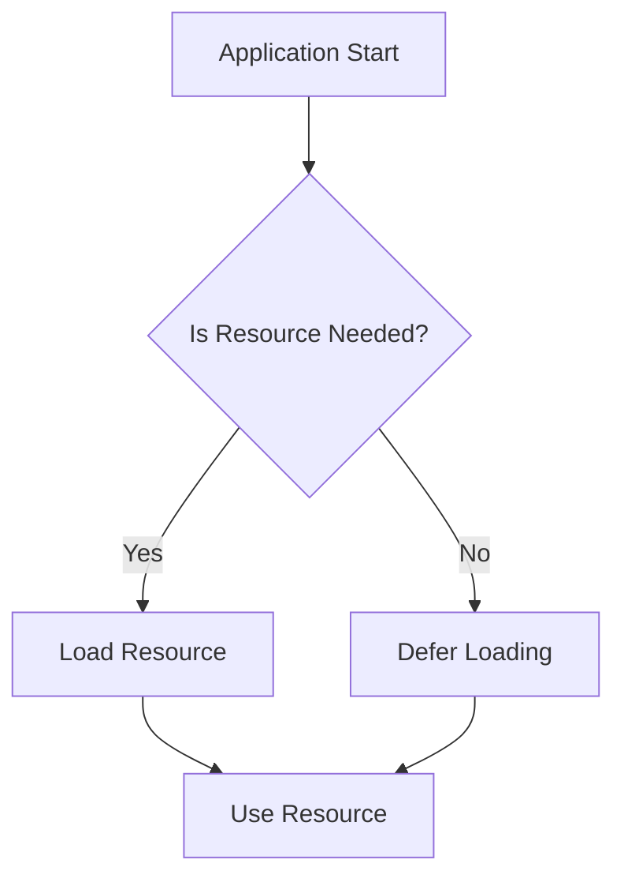

## 15.5 Lazy Loading and Initialization

In the world of software development, especially in cross-platform environments like Haxe, optimizing performance is paramount. One of the most effective strategies for achieving this is through lazy loading and initialization. This technique involves deferring the loading or initialization of resources until they are absolutely necessary, thereby improving startup time and reducing memory usage. In this section, we will delve into the concepts, implementation strategies, and benefits of lazy loading and initialization in Haxe.

### Understanding Lazy Loading and Initialization

**Lazy Loading** is a design pattern commonly used to defer the initialization of an object until it is needed. This can significantly improve the performance of an application by reducing the initial load time and memory consumption. In Haxe, lazy loading can be applied to various resources, including objects, modules, and assets.

**Lazy Initialization** refers to the practice of delaying the creation of an object, the calculation of a value, or some other expensive process until the first time it is needed. This is particularly useful in scenarios where the cost of initialization is high, and the likelihood of needing the resource is low.

### Implementing Lazy Loading in Haxe

#### Lazy Evaluation with `haxe.Lazy`

Haxe provides a built-in `haxe.Lazy` class that facilitates lazy evaluation. This class allows you to define values that are computed only when accessed for the first time.

```haxe
import haxe.Lazy;

class LazyExample {
    static function main() {
        // Define a lazy value
        var lazyValue = Lazy.create(() -> {
            trace("Computing value...");
            return 42;
        });

        // The value is not computed until accessed
        trace("Before accessing lazyValue");
        trace("Lazy value: " + Lazy.get(lazyValue));
        trace("After accessing lazyValue");
    }
}
```

In this example, the message "Computing value..." is only printed when `Lazy.get(lazyValue)` is called, demonstrating the deferred computation.

#### Dynamic Imports for Modules or Assets

Dynamic imports allow you to load modules or assets only when they are needed. This can be particularly beneficial in web applications where loading large modules upfront can slow down the initial page load.

```haxe
class DynamicImportExample {
    static function main() {
        // Simulate a dynamic import
        var module = null;
        if (someCondition()) {
            module = importModule();
        }

        if (module != null) {
            module.doSomething();
        }
    }

    static function importModule() {
        trace("Importing module...");
        return new SomeModule();
    }
}

class SomeModule {
    public function new() {}
    public function doSomething() {
        trace("Module is doing something!");
    }
}
```

In this example, `importModule()` is only called if `someCondition()` is true, demonstrating a simple form of dynamic import.

### Benefits of Lazy Loading and Initialization

#### Improved Startup Time

By deferring the loading of non-critical resources, applications can start up more quickly. This is especially important in environments where startup time is a critical factor, such as mobile applications or web pages.

#### Reduced Memory Usage

Lazy loading ensures that only the necessary resources are loaded into memory, reducing the overall memory footprint of the application. This can lead to more efficient use of system resources and improved application performance.

### Design Considerations

When implementing lazy loading and initialization, consider the following:

- **Identify Critical Resources:** Determine which resources are essential for the initial load and which can be deferred.
- **Balance Performance and Complexity:** While lazy loading can improve performance, it can also introduce complexity. Ensure that the benefits outweigh the added complexity.
- **Monitor Resource Usage:** Use profiling tools to monitor resource usage and ensure that lazy loading is having the desired effect.

### Visualizing Lazy Loading in Haxe

To better understand how lazy loading works, let's visualize the process using a flowchart.



**Figure 1:** This flowchart illustrates the decision-making process in lazy loading. The application checks if a resource is needed before deciding whether to load it immediately or defer the loading.

### Try It Yourself

Experiment with the provided code examples by modifying the conditions under which resources are loaded. Try adding additional resources and see how lazy loading affects the startup time and memory usage of your application.

### References and Links

For further reading on lazy loading and initialization, consider the following resources:

- [MDN Web Docs on Lazy Loading](https://developer.mozilla.org/en-US/docs/Web/Performance/Lazy_loading)
- [Haxe API Documentation](https://api.haxe.org/)
- [W3Schools on Lazy Loading](https://www.w3schools.com/howto/howto_css_lazy_load.asp)

### Knowledge Check

- What is lazy loading, and how does it improve application performance?
- How can you implement lazy evaluation in Haxe?
- What are the benefits of using dynamic imports in a web application?

### Embrace the Journey

Remember, mastering lazy loading and initialization is just one step in optimizing your Haxe applications. As you continue to explore and experiment, you'll discover even more ways to enhance performance and efficiency. Keep pushing the boundaries, stay curious, and enjoy the journey!

## Quiz Time!



### What is lazy loading?

- [x] Deferring the loading of resources until they are needed
- [ ] Loading all resources at application startup
- [ ] Preloading resources before they are needed
- [ ] Caching resources for faster access

> **Explanation:** Lazy loading involves deferring the loading of resources until they are needed, improving performance by reducing initial load time and memory usage.

### How does lazy initialization differ from lazy loading?

- [x] Lazy initialization delays object creation until needed
- [ ] Lazy initialization preloads objects
- [ ] Lazy initialization caches objects
- [ ] Lazy initialization loads all objects at startup

> **Explanation:** Lazy initialization delays the creation of an object until it is needed, whereas lazy loading defers the loading of resources.

### Which Haxe class facilitates lazy evaluation?

- [x] `haxe.Lazy`
- [ ] `haxe.Deferred`
- [ ] `haxe.LazyLoad`
- [ ] `haxe.Evaluation`

> **Explanation:** The `haxe.Lazy` class in Haxe is used to facilitate lazy evaluation, allowing deferred computation of values.

### What is a benefit of using dynamic imports?

- [x] Reduced initial load time
- [ ] Increased memory usage
- [ ] Faster resource access
- [ ] Improved code readability

> **Explanation:** Dynamic imports reduce the initial load time by loading modules or assets only when they are needed.

### What should you consider when implementing lazy loading?

- [x] Identify critical resources
- [x] Balance performance and complexity
- [ ] Load all resources at startup
- [ ] Avoid monitoring resource usage

> **Explanation:** When implementing lazy loading, it's important to identify critical resources and balance performance improvements with added complexity.

### What is the primary goal of lazy loading?

- [x] Improve application performance
- [ ] Simplify code structure
- [ ] Increase resource usage
- [ ] Enhance user interface design

> **Explanation:** The primary goal of lazy loading is to improve application performance by reducing initial load time and memory usage.

### How can lazy loading affect memory usage?

- [x] Reduce memory usage
- [ ] Increase memory usage
- [ ] Have no effect on memory usage
- [ ] Double memory usage

> **Explanation:** Lazy loading reduces memory usage by ensuring that only necessary resources are loaded into memory.

### What is a potential downside of lazy loading?

- [x] Increased complexity
- [ ] Reduced performance
- [ ] Increased startup time
- [ ] Decreased resource efficiency

> **Explanation:** While lazy loading can improve performance, it can also introduce complexity to the codebase.

### What is the role of `Lazy.get()` in Haxe?

- [x] Access a lazily evaluated value
- [ ] Create a lazy value
- [ ] Import a module dynamically
- [ ] Initialize an object eagerly

> **Explanation:** `Lazy.get()` is used to access a lazily evaluated value in Haxe, triggering its computation if it hasn't been computed yet.

### True or False: Lazy loading always improves performance.

- [ ] True
- [x] False

> **Explanation:** While lazy loading often improves performance, it may not always be beneficial, especially if it introduces unnecessary complexity or if the deferred resources are frequently accessed.


