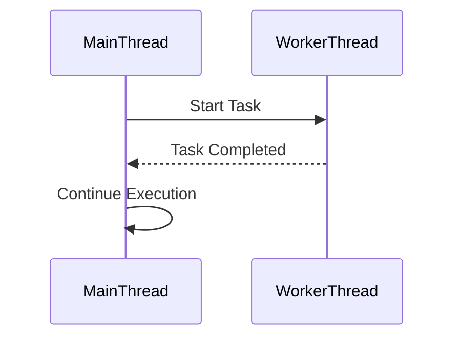

## 15.6 Parallelism and Concurrency Optimization

In the realm of software development, optimizing parallelism and concurrency is crucial for enhancing performance, especially in applications that demand high responsiveness and efficiency. As expert developers and architects, understanding how to leverage Haxe's capabilities for parallelism and concurrency can significantly impact the performance of cross-platform applications. In this section, we will delve into strategies for optimizing parallelism and concurrency in Haxe, explore implementation techniques, and discuss important considerations.

### Understanding Parallelism and Concurrency

Before we dive into optimization strategies, let's clarify the concepts of parallelism and concurrency:

- **Parallelism** involves executing multiple operations simultaneously. It is about performing many tasks at the same time, often using multiple processors or cores.
- **Concurrency** is about dealing with multiple tasks at once, but not necessarily executing them simultaneously. It involves managing the execution of tasks to improve responsiveness and resource utilization.

### Strategies for Parallelism and Concurrency Optimization

#### Multithreading

**Multithreading** is a powerful technique for achieving parallelism. By using threads, we can perform multiple tasks concurrently, which can lead to significant performance improvements. In Haxe, multithreading can be implemented using various libraries and target-specific APIs.

- **Use Threads to Perform Tasks in Parallel:** Threads allow you to divide a program into multiple concurrent execution paths. This is particularly useful for CPU-bound tasks that can be parallelized.

- **Example: Multithreading in Haxe**

```haxe
import sys.thread.Thread;

class MultithreadingExample {
    public static function main() {
        // Create a new thread to execute a task
        var thread = Thread.create(() -> {
            for (i in 0...10) {
                trace("Thread: " + i);
                Thread.sleep(100);
            }
        });

        // Main thread continues execution
        for (i in 0...10) {
            trace("Main: " + i);
            Thread.sleep(100);
        }

        // Wait for the thread to finish
        thread.join();
    }
}
```

In this example, we create a new thread to perform a task concurrently with the main thread. The `Thread.create` function is used to spawn a new thread, and `Thread.join` ensures that the main thread waits for the spawned thread to complete.

#### Asynchronous Programming

**Asynchronous programming** is another approach to concurrency, focusing on non-blocking operations to improve responsiveness. It is particularly useful for I/O-bound tasks, such as network requests or file operations.

- **Non-Blocking Operations to Improve Responsiveness:** Asynchronous programming allows your application to continue executing other tasks while waiting for an operation to complete.

- **Example: Asynchronous Programming in Haxe**

```haxe
import sys.net.Socket;
import haxe.Timer;

class AsyncExample {
    public static function main() {
        var socket = new Socket();
        socket.connect("example.com", 80);

        socket.onConnect = function() {
            trace("Connected!");
            socket.write("GET / HTTP/1.1\r\nHost: example.com\r\n\r\n");
        };

        socket.onData = function(data) {
            trace("Received data: " + data);
            socket.close();
        };

        // Continue with other tasks
        Timer.delay(() -> trace("Doing other work..."), 1000);
    }
}
```

In this example, the `Socket` class is used to perform a network operation asynchronously. The `onConnect` and `onData` callbacks handle the connection and data reception, allowing the main program to continue executing other tasks.

### Implementing Parallelism and Concurrency in Haxe

#### Concurrency Libraries

Haxe provides several libraries and tools to facilitate concurrency. One such library is `haxe.concurrent`, which offers abstractions for concurrent programming.

- **Use `haxe.concurrent` Where Available:** This library provides constructs like `Future` and `Promise` to handle asynchronous operations.

- **Example: Using Futures in Haxe**

```haxe
import haxe.concurrent.Future;

class FutureExample {
    public static function main() {
        var future = Future.withValue(42);

        future.onComplete(function(value) {
            trace("Future completed with value: " + value);
        });

        // Do other work while waiting for the future to complete
        trace("Doing other work...");
    }
}
```

In this example, a `Future` is created with a predefined value. The `onComplete` callback is executed when the future completes, allowing the program to continue with other tasks in the meantime.

#### Target-Specific APIs

Haxe's cross-platform nature allows you to leverage target-specific APIs for concurrency. For example, you can use web workers in JavaScript or threads in C++.

- **Leverage Platform Features (e.g., Web Workers in JS):** Utilize the concurrency features provided by the target platform to optimize performance.

- **Example: Using Web Workers in JavaScript**

```haxe
#if js
import js.html.Worker;

class WebWorkerExample {
    public static function main() {
        var worker = new Worker("worker.js");

        worker.onmessage = function(event) {
            trace("Message from worker: " + event.data);
        };

        worker.postMessage("Hello, worker!");
    }
}
#end
```

In this example, a web worker is created to perform tasks in a separate thread in JavaScript. The `onmessage` event handler processes messages from the worker, allowing the main thread to remain responsive.

### Considerations for Parallelism and Concurrency

#### Race Conditions

**Race conditions** occur when multiple threads or processes access shared resources concurrently, leading to unpredictable behavior. Ensuring thread-safe code is crucial to avoid these issues.

- **Ensure Thread-Safe Code:** Use synchronization mechanisms like locks or semaphores to protect shared resources.

- **Example: Avoiding Race Conditions**

```haxe
import sys.thread.Mutex;

class RaceConditionExample {
    static var counter:Int = 0;
    static var mutex:Mutex = new Mutex();

    public static function main() {
        var thread1 = Thread.create(incrementCounter);
        var thread2 = Thread.create(incrementCounter);

        thread1.join();
        thread2.join();

        trace("Final counter value: " + counter);
    }

    static function incrementCounter() {
        for (i in 0...1000) {
            mutex.lock();
            counter++;
            mutex.unlock();
        }
    }
}
```

In this example, a `Mutex` is used to ensure that only one thread can access the `counter` variable at a time, preventing race conditions.

#### Overhead Management

While multithreading and asynchronous programming can improve performance, they also introduce overhead. It's important to weigh the cost of threading against the performance gains.

- **Weigh the Cost of Threading Against Performance Gains:** Consider the complexity and resource usage introduced by concurrency mechanisms.

- **Example: Evaluating Overhead**

```haxe
class OverheadExample {
    public static function main() {
        var startTime = Date.now().getTime();

        // Perform a task with and without threading
        performTask(false);
        performTask(true);

        var endTime = Date.now().getTime();
        trace("Execution time: " + (endTime - startTime) + " ms");
    }

    static function performTask(useThreads:Bool) {
        if (useThreads) {
            var thread = Thread.create(() -> {
                // Simulate a task
                for (i in 0...1000000) {}
            });
            thread.join();
        } else {
            // Simulate a task
            for (i in 0...1000000) {}
        }
    }
}
```

In this example, we measure the execution time of a task with and without threading to evaluate the overhead introduced by multithreading.

### Visualizing Concurrency in Haxe

To better understand the flow of concurrent operations, let's visualize a simple concurrency model using Mermaid.js:



This diagram illustrates the interaction between the main thread and a worker thread. The main thread starts a task on the worker thread and continues execution, while the worker thread processes the task and sends a completion message back to the main thread.

### Try It Yourself

To deepen your understanding of parallelism and concurrency in Haxe, try modifying the code examples provided:

- **Experiment with Different Thread Counts:** Adjust the number of threads in the multithreading example to see how it affects performance.
- **Implement Additional Asynchronous Operations:** Add more asynchronous tasks to the asynchronous programming example and observe how they interact.
- **Test Race Conditions:** Remove the mutex in the race condition example and observe the impact on the counter value.

### References and Further Reading

- [Haxe Manual: Concurrency](https://haxe.org/manual/std-sys-thread.html)
- [MDN Web Docs: Web Workers](https://developer.mozilla.org/en-US/docs/Web/API/Web_Workers_API)
- [Concurrency in Programming](https://en.wikipedia.org/wiki/Concurrency_(computer_science))

### Knowledge Check

To reinforce your understanding of parallelism and concurrency optimization in Haxe, consider the following questions and exercises:

- **What is the difference between parallelism and concurrency?**
- **How can race conditions be avoided in multithreaded applications?**
- **What are the benefits and drawbacks of asynchronous programming?**

### Embrace the Journey

Remember, mastering parallelism and concurrency optimization is a journey. As you experiment with different techniques and explore Haxe's capabilities, you'll gain valuable insights into building high-performance, responsive applications. Keep experimenting, stay curious, and enjoy the journey!

## Quiz Time!



### What is the primary goal of parallelism in software development?

- [x] To execute multiple operations simultaneously
- [ ] To manage multiple tasks at once without simultaneous execution
- [ ] To improve code readability
- [ ] To reduce memory usage

> **Explanation:** Parallelism aims to execute multiple operations simultaneously, often using multiple processors or cores.

### Which Haxe library provides constructs like `Future` and `Promise` for handling asynchronous operations?

- [ ] haxe.async
- [x] haxe.concurrent
- [ ] haxe.parallel
- [ ] haxe.thread

> **Explanation:** The `haxe.concurrent` library provides constructs like `Future` and `Promise` for handling asynchronous operations.

### What is a common issue that arises when multiple threads access shared resources concurrently?

- [ ] Deadlock
- [x] Race condition
- [ ] Memory leak
- [ ] Stack overflow

> **Explanation:** A race condition occurs when multiple threads access shared resources concurrently, leading to unpredictable behavior.

### What mechanism can be used to ensure thread-safe access to shared resources?

- [ ] Asynchronous callbacks
- [ ] Event loops
- [x] Mutex
- [ ] Garbage collection

> **Explanation:** A mutex is a synchronization mechanism used to ensure thread-safe access to shared resources.

### What is the benefit of using asynchronous programming for I/O-bound tasks?

- [x] It allows the application to continue executing other tasks while waiting for an operation to complete.
- [ ] It reduces the complexity of the code.
- [ ] It increases memory usage.
- [ ] It simplifies error handling.

> **Explanation:** Asynchronous programming allows the application to continue executing other tasks while waiting for an operation to complete, improving responsiveness.

### In the context of Haxe, what is a potential drawback of using multithreading?

- [ ] Increased code readability
- [x] Overhead management
- [ ] Simplified debugging
- [ ] Reduced performance

> **Explanation:** Multithreading introduces overhead, and it's important to weigh the cost of threading against the performance gains.

### How can you evaluate the overhead introduced by multithreading in Haxe?

- [ ] By measuring memory usage
- [x] By measuring execution time with and without threading
- [ ] By counting the number of threads
- [ ] By analyzing code complexity

> **Explanation:** You can evaluate the overhead introduced by multithreading by measuring execution time with and without threading.

### Which of the following is a target-specific API that can be used for concurrency in JavaScript?

- [ ] Mutex
- [ ] Future
- [x] Web Workers
- [ ] Promises

> **Explanation:** Web Workers are a target-specific API in JavaScript that can be used for concurrency.

### What is the purpose of the `Thread.join` function in Haxe?

- [ ] To create a new thread
- [ ] To terminate a thread
- [x] To wait for a thread to finish
- [ ] To synchronize threads

> **Explanation:** The `Thread.join` function is used to wait for a thread to finish before continuing execution.

### True or False: Concurrency always involves executing tasks simultaneously.

- [ ] True
- [x] False

> **Explanation:** Concurrency involves managing multiple tasks at once, but not necessarily executing them simultaneously.


