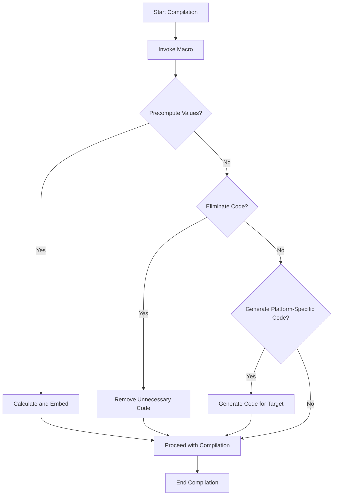

## 15.7 Macro-Based Optimizations

In the realm of software development, performance optimization is a critical aspect that can significantly impact the efficiency and scalability of applications. Haxe, with its powerful macro system, offers unique opportunities for developers to perform optimizations at compile-time, thereby enhancing runtime performance. This section delves into the concept of macro-based optimizations, exploring how Haxe macros can be leveraged to perform compile-time computations and code generation, ultimately leading to more efficient and tailored code.

### Understanding Haxe Macros

Haxe macros are a powerful feature that allows developers to manipulate the Abstract Syntax Tree (AST) during compilation. This capability enables a wide range of optimizations and code transformations that would be difficult or impossible to achieve at runtime. By operating at the compile-time level, macros can precompute values, eliminate unnecessary code paths, and generate code tailored to specific platforms or configurations.

#### Key Concepts of Haxe Macros

- **Compile-Time Computation:** Perform calculations and logic during the compilation process, reducing the need for runtime computation.
- **Code Generation:** Dynamically generate code based on compile-time conditions, allowing for flexible and optimized code structures.
- **AST Manipulation:** Directly manipulate the syntax tree of the code, enabling complex transformations and optimizations.

### Implementing Macro-Based Optimizations in Haxe

To effectively utilize macro-based optimizations, it's essential to understand how to implement them in Haxe. This involves leveraging the macro system to perform specific tasks such as precomputing values and eliminating unnecessary code.

#### Precomputing Values

One of the primary uses of macros is to precompute values during compilation. This can significantly reduce the computational overhead at runtime, as the values are already calculated and embedded in the compiled code.

**Example: Precomputing Constants**

```haxe
import haxe.macro.Context;
import haxe.macro.Expr;

class PrecomputeMacro {
    public static macro function precompute():Expr {
        // Calculate the value at compile time
        var value = Math.pow(2, 10); // 2^10 = 1024
        return macro $v{value}; // Embed the value in the code
    }
}

class Main {
    static function main() {
        var result = PrecomputeMacro.precompute();
        trace(result); // Outputs: 1024
    }
}
```

In this example, the `PrecomputeMacro` class uses a macro to calculate the power of 2 at compile time. The result is embedded directly into the compiled code, eliminating the need for runtime computation.

#### Code Elimination

Macros can also be used to eliminate unnecessary code paths, resulting in leaner and more efficient code. This is particularly useful for removing debug code or platform-specific branches that are not needed in the final build.

**Example: Conditional Code Elimination**

```haxe
import haxe.macro.Context;
import haxe.macro.Expr;

class CodeEliminationMacro {
    public static macro function eliminateDebugCode():Expr {
        #if debug
        return macro trace("Debug mode");
        #else
        return macro null;
        #end
    }
}

class Main {
    static function main() {
        CodeEliminationMacro.eliminateDebugCode();
    }
}
```

In this example, the `CodeEliminationMacro` class uses a macro to conditionally include or exclude debug code based on the compilation flag. If the `debug` flag is not set, the debug code is eliminated from the final build.

### Use Cases and Examples

Macro-based optimizations can be applied in various scenarios to enhance performance and tailor code to specific requirements. Here are some common use cases:

#### Configuration-Based Code Generation

Macros can generate code based on build parameters or configuration settings, allowing for highly customizable and optimized builds.

**Example: Configuration-Driven Code**

```haxe
import haxe.macro.Context;
import haxe.macro.Expr;

class ConfigMacro {
    public static macro function generateConfigCode(config:String):Expr {
        switch(config) {
            case "production":
                return macro trace("Production configuration");
            case "development":
                return macro trace("Development configuration");
            default:
                return macro trace("Default configuration");
        }
    }
}

class Main {
    static function main() {
        ConfigMacro.generateConfigCode("production");
    }
}
```

In this example, the `ConfigMacro` class generates different code paths based on the provided configuration string. This allows for tailored builds that can optimize for specific environments.

#### Platform-Specific Optimizations

Haxe's cross-platform capabilities can be further enhanced by using macros to tailor code to target-specific features or optimizations.

**Example: Platform-Specific Code**

```haxe
import haxe.macro.Context;
import haxe.macro.Expr;

class PlatformMacro {
    public static macro function generatePlatformCode():Expr {
        #if js
        return macro trace("JavaScript platform");
        #elseif cpp
        return macro trace("C++ platform");
        #else
        return macro trace("Other platform");
        #end
    }
}

class Main {
    static function main() {
        PlatformMacro.generatePlatformCode();
    }
}
```

In this example, the `PlatformMacro` class generates different code paths based on the target platform. This allows developers to take advantage of platform-specific features and optimizations.

### Visualizing Macro-Based Optimizations

To better understand the flow and impact of macro-based optimizations, let's visualize the process using a flowchart.



**Caption:** This flowchart illustrates the process of macro-based optimizations during Haxe compilation, highlighting the decision points for precomputing values, eliminating code, and generating platform-specific code.

### Best Practices for Macro-Based Optimizations

When implementing macro-based optimizations, it's important to follow best practices to ensure maintainability and effectiveness:

- **Keep Macros Simple:** Avoid overly complex macros that can be difficult to understand and maintain.
- **Document Macros Thoroughly:** Provide clear documentation for macros to aid understanding and usage.
- **Test Macros Rigorously:** Ensure macros are thoroughly tested to prevent unexpected behavior during compilation.
- **Use Macros Judiciously:** Only use macros when necessary, as they can increase compilation time and complexity.

### Try It Yourself

To get hands-on experience with macro-based optimizations, try modifying the code examples provided. Experiment with different configurations, platforms, and conditions to see how macros can tailor the compiled code. Consider creating your own macros to perform specific optimizations relevant to your projects.

### References and Further Reading

- [Haxe Macros Documentation](https://haxe.org/manual/macro.html)
- [Haxe Compiler API](https://api.haxe.org/haxe/macro/Context.html)
- [Understanding Abstract Syntax Trees](https://en.wikipedia.org/wiki/Abstract_syntax_tree)

### Knowledge Check

To reinforce your understanding of macro-based optimizations, consider the following questions and challenges:

1. How can macros be used to precompute values during compilation?
2. What are the benefits of eliminating unnecessary code paths with macros?
3. How can macros generate platform-specific code in Haxe?
4. What are some best practices for implementing macros in Haxe?

### Embrace the Journey

Remember, mastering macro-based optimizations is a journey that requires practice and experimentation. As you explore the power of Haxe macros, you'll discover new ways to enhance performance and tailor your code to specific needs. Keep experimenting, stay curious, and enjoy the journey!

## Quiz Time!



### What is the primary purpose of Haxe macros?

- [x] To perform compile-time computations and code generation
- [ ] To execute runtime logic
- [ ] To manage memory allocation
- [ ] To handle user input

> **Explanation:** Haxe macros are designed to perform compile-time computations and code generation, allowing for optimizations and transformations before runtime.

### How can macros help in optimizing performance?

- [x] By precomputing values during compilation
- [x] By eliminating unnecessary code paths
- [ ] By increasing runtime memory usage
- [ ] By adding more runtime checks

> **Explanation:** Macros can optimize performance by precomputing values and eliminating unnecessary code paths, reducing runtime overhead.

### What is a key feature of Haxe macros?

- [x] AST manipulation
- [ ] Dynamic typing
- [ ] Garbage collection
- [ ] Event handling

> **Explanation:** A key feature of Haxe macros is AST manipulation, which allows for complex code transformations during compilation.

### Which of the following is a use case for macros?

- [x] Configuration-based code generation
- [ ] Runtime error handling
- [ ] User interface design
- [ ] Database management

> **Explanation:** Macros can be used for configuration-based code generation, allowing for tailored and optimized builds.

### What should be avoided when writing macros?

- [x] Overly complex logic
- [ ] Thorough documentation
- [ ] Rigorous testing
- [ ] Simple expressions

> **Explanation:** Overly complex logic should be avoided in macros to maintain readability and ease of maintenance.

### How can macros tailor code for specific platforms?

- [x] By generating platform-specific code paths
- [ ] By executing platform-specific runtime logic
- [ ] By managing platform-specific memory
- [ ] By handling platform-specific user input

> **Explanation:** Macros can generate platform-specific code paths, allowing for optimizations tailored to each target platform.

### What is a best practice for using macros?

- [x] Document macros thoroughly
- [ ] Use macros for all logic
- [ ] Avoid testing macros
- [ ] Ignore macro complexity

> **Explanation:** Thorough documentation is a best practice for using macros, ensuring they are understandable and maintainable.

### What is the benefit of precomputing values with macros?

- [x] Reduced runtime computation
- [ ] Increased runtime memory usage
- [ ] More runtime checks
- [ ] Slower compilation

> **Explanation:** Precomputing values with macros reduces runtime computation, leading to more efficient code execution.

### What is the role of the Abstract Syntax Tree (AST) in macros?

- [x] It allows for code manipulation during compilation
- [ ] It manages runtime memory allocation
- [ ] It handles user input events
- [ ] It executes runtime logic

> **Explanation:** The AST allows for code manipulation during compilation, enabling macros to perform complex transformations.

### True or False: Macros can only be used for performance optimization.

- [ ] True
- [x] False

> **Explanation:** False. While macros are powerful for performance optimization, they can also be used for code generation, configuration management, and more.


