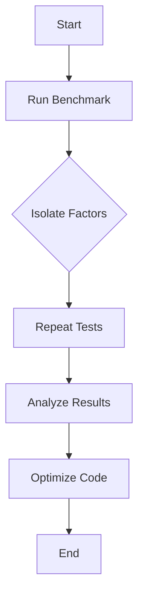

## 15.8 Performance Testing and Benchmarking

Performance testing and benchmarking are crucial components of software development, especially in cross-platform environments like Haxe. They ensure that applications run efficiently across different platforms, providing a seamless user experience. In this section, we will delve into the methodologies and tools available for performance testing and benchmarking in Haxe, offering practical insights and examples to help you optimize your applications.

### Understanding Performance Testing and Benchmarking

**Performance Testing** involves evaluating the speed, scalability, and stability of an application under various conditions. It helps identify bottlenecks and areas for improvement.

**Benchmarking** is a subset of performance testing that focuses on measuring the performance of specific code segments or algorithms. It provides a baseline for comparison and helps track improvements over time.

### Implementing Performance Testing in Haxe

#### Benchmarking Suites

To effectively measure performance in Haxe, you can utilize benchmarking suites that allow you to write tests specifically designed to measure execution time. These suites provide a framework for running and analyzing performance tests.

**Example: Using Haxe's Built-in Tools**

Haxe provides several tools and libraries that facilitate performance testing. One popular library is `haxe-benchmark`, which allows you to create and run benchmarks easily.

```haxe
import haxe.Timer;
import haxe.benchmark.Benchmark;

class PerformanceTest {
    public static function main() {
        var benchmark = new Benchmark();

        benchmark.add("Test 1", function() {
            var sum = 0;
            for (i in 0...1000) {
                sum += i;
            }
        });

        benchmark.add("Test 2", function() {
            var product = 1;
            for (i in 1...100) {
                product *= i;
            }
        });

        benchmark.run();
    }
}
```

In this example, we define two simple tests: one for summing numbers and another for calculating a product. The `Benchmark` class handles the execution and timing of these tests, providing results that can be analyzed to identify performance issues.

#### Automated Testing

Integrating benchmarks into your automated test suite ensures that performance is continuously monitored. This approach helps catch regressions early and maintains optimal performance throughout the development lifecycle.

**Example: Integrating with Continuous Integration (CI)**

You can configure your CI pipeline to run performance benchmarks alongside unit tests. This setup ensures that any performance degradation is detected immediately.

```yaml
stages:
  - test

test:
  stage: test
  script:
    - haxe build.hxml
    - neko run.n
    - neko benchmark.n
```

### Best Practices for Performance Testing

#### Isolate Factors

When conducting performance tests, it's essential to isolate the variable you are testing. This isolation ensures that the results accurately reflect the performance of the specific code segment or algorithm.

- **Use Mock Data:** Replace external dependencies with mock data to eliminate variability.
- **Control Environment:** Run tests in a controlled environment to minimize external influences.

#### Repeat Tests

Repetition is key to obtaining reliable performance data. Running tests multiple times helps ensure that results are consistent and not affected by transient factors.

- **Average Results:** Calculate the average of multiple runs to smooth out anomalies.
- **Analyze Variability:** Examine the variability in results to identify potential issues.

### Visualizing Performance Data

Visualizing performance data can provide insights that are not immediately apparent from raw numbers. Tools like charts and graphs can help identify trends and outliers.



**Diagram Description:** This flowchart illustrates the process of performance testing and benchmarking, from starting the benchmark to optimizing the code based on results.

### Advanced Techniques for Performance Optimization

#### Profiling

Profiling involves analyzing the runtime behavior of your application to identify performance bottlenecks. Profiling tools provide detailed insights into how resources are utilized, helping you pinpoint areas for optimization.

**Example: Using Haxe Profiler**

Haxe offers profiling tools that can be integrated into your development workflow. These tools provide detailed reports on CPU and memory usage.

```haxe
import haxe.Profiler;

class ProfilerExample {
    public static function main() {
        Profiler.start();
        
        // Code to profile
        var data = [];
        for (i in 0...10000) {
            data.push(Math.random());
        }
        
        Profiler.stop();
        Profiler.report();
    }
}
```

#### Memory Management

Efficient memory management is crucial for performance optimization. Techniques such as garbage collection tuning and memory profiling can help reduce memory usage and improve application responsiveness.

- **Garbage Collection:** Adjust garbage collection settings to optimize memory usage.
- **Memory Profiling:** Use memory profiling tools to identify leaks and optimize memory allocation.

### Try It Yourself

Experiment with the provided code examples by modifying the test cases or adding new ones. Try running benchmarks with different data sizes or algorithms to see how performance varies. This hands-on approach will deepen your understanding of performance testing and benchmarking in Haxe.

### References and Further Reading

- [Haxe Documentation](https://haxe.org/documentation/)
- [Haxe Benchmark Library](https://lib.haxe.org/p/haxe-benchmark/)
- [Performance Testing Best Practices](https://www.softwaretestinghelp.com/performance-testing-best-practices/)

### Knowledge Check

- What is the primary goal of performance testing?
- How can benchmarking help in performance optimization?
- Why is it important to isolate factors during performance testing?

### Embrace the Journey

Remember, performance testing and benchmarking are ongoing processes. As you refine your skills, you'll become adept at identifying and resolving performance issues, leading to more efficient and responsive applications. Keep experimenting, stay curious, and enjoy the journey!

## Quiz Time!



### What is the primary purpose of performance testing?

- [x] To evaluate the speed, scalability, and stability of an application.
- [ ] To check the correctness of the application.
- [ ] To ensure the application has no bugs.
- [ ] To verify the application's user interface.

> **Explanation:** Performance testing focuses on evaluating the speed, scalability, and stability of an application under various conditions.

### How does benchmarking differ from general performance testing?

- [x] Benchmarking measures specific code segments or algorithms.
- [ ] Benchmarking evaluates the entire application.
- [ ] Benchmarking is only for memory usage.
- [ ] Benchmarking is unrelated to performance testing.

> **Explanation:** Benchmarking is a subset of performance testing that focuses on measuring specific code segments or algorithms.

### Why is it important to isolate factors during performance testing?

- [x] To ensure results accurately reflect the performance of the specific code segment.
- [ ] To make the tests run faster.
- [ ] To reduce the number of tests needed.
- [ ] To simplify the testing process.

> **Explanation:** Isolating factors ensures that the results accurately reflect the performance of the specific code segment or algorithm being tested.

### What is a common practice to ensure reliable performance data?

- [x] Repeat tests multiple times.
- [ ] Run tests only once.
- [ ] Use different environments for each test.
- [ ] Avoid using mock data.

> **Explanation:** Repeating tests multiple times helps ensure that results are consistent and not affected by transient factors.

### Which tool can be used for profiling in Haxe?

- [x] Haxe Profiler
- [ ] Haxe Compiler
- [ ] Haxe Debugger
- [ ] Haxe Formatter

> **Explanation:** Haxe Profiler is a tool that can be used to analyze the runtime behavior of your application to identify performance bottlenecks.

### What is the benefit of visualizing performance data?

- [x] It helps identify trends and outliers.
- [ ] It makes the data look more professional.
- [ ] It reduces the need for further testing.
- [ ] It simplifies the testing process.

> **Explanation:** Visualizing performance data can provide insights that are not immediately apparent from raw numbers, helping to identify trends and outliers.

### What is a key aspect of memory management for performance optimization?

- [x] Efficient memory allocation
- [ ] Increasing memory usage
- [ ] Reducing CPU usage
- [ ] Simplifying code structure

> **Explanation:** Efficient memory allocation is crucial for performance optimization as it helps reduce memory usage and improve application responsiveness.

### What is the role of garbage collection in performance optimization?

- [x] To optimize memory usage
- [ ] To increase CPU usage
- [ ] To simplify code
- [ ] To enhance user interface

> **Explanation:** Garbage collection helps optimize memory usage by automatically reclaiming memory that is no longer in use.

### How can automated testing be integrated with performance benchmarks?

- [x] By configuring the CI pipeline to run benchmarks alongside unit tests.
- [ ] By running benchmarks manually after each code change.
- [ ] By using benchmarks only in the final testing phase.
- [ ] By avoiding benchmarks in automated testing.

> **Explanation:** Integrating benchmarks into the CI pipeline ensures that performance is continuously monitored and any degradation is detected immediately.

### True or False: Performance testing is a one-time process.

- [ ] True
- [x] False

> **Explanation:** Performance testing is an ongoing process that should be conducted regularly to ensure optimal application performance.


