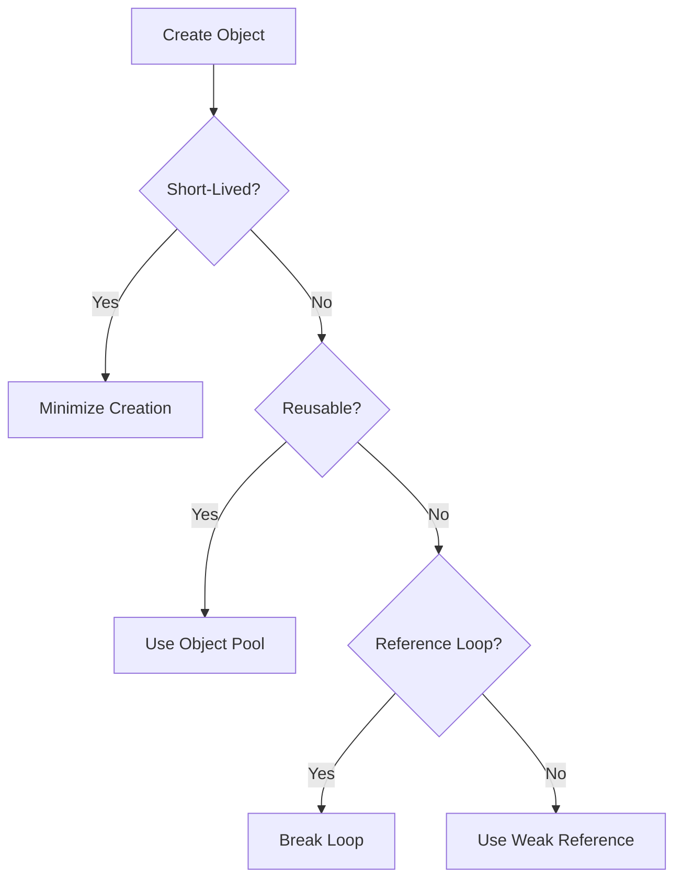

## 15.9 Managing Garbage Collection

In the realm of software development, garbage collection (GC) is a crucial process that automatically manages memory allocation and deallocation. It helps prevent memory leaks by reclaiming memory occupied by objects that are no longer in use. However, improper management of garbage collection can lead to performance bottlenecks, especially in high-performance applications like games and real-time systems. In this section, we will explore strategies for managing garbage collection effectively in Haxe, focusing on minimizing short-lived objects, utilizing object pooling, and avoiding reference loops. We will also delve into Haxe-specific implementations, such as weak references and finalization, to optimize performance.

### Understanding Garbage Collection

Before diving into strategies, let's briefly understand how garbage collection works. Garbage collectors automatically identify and reclaim memory that is no longer needed by the program. This process is essential for preventing memory leaks and ensuring efficient memory usage. However, garbage collection can introduce overhead, as it requires the system to periodically pause the application to identify and collect unused objects.

### Strategies for Managing Garbage Collection

#### Minimize Short-Lived Objects

One of the most effective strategies for managing garbage collection is to minimize the creation of short-lived objects. These are objects that are created and discarded quickly, leading to frequent garbage collection cycles. By reducing the number of short-lived objects, you can decrease the frequency of garbage collection and improve application performance.

**Example:**

```haxe
class Example {
    public static function main() {
        for (i in 0...10000) {
            var temp = new MyObject(); // Avoid creating objects in tight loops
            temp.doSomething();
        }
    }
}

class MyObject {
    public function new() {}
    public function doSomething() {
        // Perform operations
    }
}
```

**Optimization Tip:** Instead of creating new objects in a loop, consider reusing existing objects or using primitive types where possible.

#### Object Pooling

Object pooling is a technique where a set of initialized objects is kept ready for use, rather than allocating and deallocating them on demand. This can significantly reduce the overhead of garbage collection by reusing objects instead of discarding them.

**Example:**

```haxe
class ObjectPool<T> {
    private var pool:Array<T> = [];

    public function new() {}

    public function acquire():T {
        return pool.length > 0 ? pool.pop() : new T();
    }

    public function release(obj:T):Void {
        pool.push(obj);
    }
}

class Example {
    static var pool:ObjectPool<MyObject> = new ObjectPool<MyObject>();

    public static function main() {
        for (i in 0...10000) {
            var obj = pool.acquire();
            obj.doSomething();
            pool.release(obj);
        }
    }
}

class MyObject {
    public function new() {}
    public function doSomething() {
        // Perform operations
    }
}
```

**Optimization Tip:** Use object pooling for objects that are frequently created and destroyed, such as bullets in a game or database connections.

#### Avoid Reference Loops

Reference loops occur when objects reference each other, creating a cycle that prevents garbage collection. These loops can lead to memory leaks if not handled properly. Ensure that objects can be collected by breaking reference loops when they are no longer needed.

**Example:**

```haxe
class Node {
    public var next:Node;
    public var prev:Node;

    public function new() {}

    public function clearReferences():Void {
        next = null;
        prev = null;
    }
}

class Example {
    public static function main() {
        var node1 = new Node();
        var node2 = new Node();
        node1.next = node2;
        node2.prev = node1;

        // Break reference loop
        node1.clearReferences();
        node2.clearReferences();
    }
}
```

**Optimization Tip:** Regularly audit your code for potential reference loops, especially in complex data structures like graphs and linked lists.

### Implementing Garbage Collection Strategies in Haxe

#### Weak References

Weak references allow you to reference an object without preventing it from being collected by the garbage collector. This is useful for caches or observer patterns where you want to avoid strong references that can lead to memory leaks.

**Example:**

```haxe
import haxe.ds.WeakMap;

class Example {
    public static function main() {
        var cache = new WeakMap<String, MyObject>();

        var obj = new MyObject();
        cache.set("key", obj);

        // obj can be collected if no strong references exist
    }
}

class MyObject {
    public function new() {}
}
```

**Optimization Tip:** Use weak references for objects that can be recreated or are not critical to the application's operation.

#### Finalization

Finalization refers to the process of cleaning up resources before an object is collected. In Haxe, you can implement cleanup logic in destructors if the target platform supports it. However, relying on finalization can be risky, as the timing of destructor calls is not guaranteed.

**Example:**

```haxe
class MyObject {
    public function new() {}

    // Destructor for cleanup
    public function __finalize() {
        trace("Cleaning up resources");
    }
}

class Example {
    public static function main() {
        var obj = new MyObject();
        // obj will be finalized when collected
    }
}
```

**Optimization Tip:** Use finalization sparingly and prefer explicit resource management where possible.

### Use Cases and Examples

#### High-Performance Applications

In high-performance applications like games, animations, or interactive experiences, managing garbage collection is critical to maintaining smooth performance. These applications often involve frequent object creation and destruction, making it essential to implement strategies like object pooling and minimizing short-lived objects.

**Example:**

```haxe
class Game {
    static var bulletPool:ObjectPool<Bullet> = new ObjectPool<Bullet>();

    public static function main() {
        // Game loop
        while (true) {
            var bullet = bulletPool.acquire();
            bullet.shoot();
            bulletPool.release(bullet);
        }
    }
}

class Bullet {
    public function new() {}
    public function shoot() {
        // Bullet logic
    }
}
```

**Optimization Tip:** Profile your application to identify areas with high object churn and apply garbage collection strategies accordingly.

### Visualizing Garbage Collection Strategies

To better understand the flow of garbage collection strategies, let's visualize the process using a Mermaid.js diagram.



**Diagram Description:** This flowchart illustrates the decision-making process for managing garbage collection. It starts with object creation and evaluates whether the object is short-lived, reusable, or part of a reference loop, guiding the developer to appropriate strategies.

### References and Links

- [MDN Web Docs: Memory Management](https://developer.mozilla.org/en-US/docs/Web/JavaScript/Memory_Management)
- [Haxe Manual: Weak References](https://haxe.org/manual/std-WeakMap.html)
- [W3Schools: JavaScript Performance Optimization](https://www.w3schools.com/js/js_performance.asp)

### Knowledge Check

To reinforce your understanding of garbage collection management, consider the following questions:

- What are the benefits of minimizing short-lived objects in garbage collection?
- How does object pooling improve performance in high-frequency object creation scenarios?
- Why is it important to avoid reference loops in your code?
- How can weak references be used to prevent memory leaks?
- What are the limitations of using finalization for resource cleanup?

### Embrace the Journey

Remember, managing garbage collection is an ongoing process that requires careful consideration and optimization. As you continue to develop high-performance applications, keep experimenting with different strategies, stay curious, and enjoy the journey of mastering Haxe design patterns!

## Quiz Time!



### What is the primary benefit of minimizing short-lived objects in garbage collection?

- [x] Reduces the frequency of garbage collection cycles
- [ ] Increases memory usage
- [ ] Slows down application performance
- [ ] Prevents memory leaks

> **Explanation:** Minimizing short-lived objects reduces the frequency of garbage collection cycles, improving application performance.

### How does object pooling improve performance?

- [x] By reusing objects instead of creating new ones
- [ ] By increasing memory allocation
- [ ] By slowing down garbage collection
- [ ] By creating more objects

> **Explanation:** Object pooling improves performance by reusing objects, reducing the need for frequent memory allocation and deallocation.

### What is a reference loop?

- [x] A cycle where objects reference each other, preventing garbage collection
- [ ] A loop that creates objects
- [ ] A method to optimize memory usage
- [ ] A type of object pool

> **Explanation:** A reference loop occurs when objects reference each other, creating a cycle that prevents garbage collection.

### How can weak references help in garbage collection?

- [x] By allowing objects to be collected even if they are referenced
- [ ] By preventing objects from being collected
- [ ] By increasing memory usage
- [ ] By slowing down application performance

> **Explanation:** Weak references allow objects to be collected by the garbage collector even if they are still referenced, preventing memory leaks.

### What is the limitation of using finalization for resource cleanup?

- [x] The timing of destructor calls is not guaranteed
- [ ] It prevents garbage collection
- [ ] It increases memory usage
- [ ] It slows down application performance

> **Explanation:** The timing of destructor calls is not guaranteed, making finalization unreliable for resource cleanup.

### Which strategy is most effective for high-frequency object creation scenarios?

- [x] Object pooling
- [ ] Reference loops
- [ ] Weak references
- [ ] Finalization

> **Explanation:** Object pooling is most effective for high-frequency object creation scenarios, as it reuses objects instead of creating new ones.

### What should you do to avoid reference loops?

- [x] Break the loop by clearing references
- [ ] Create more objects
- [ ] Use finalization
- [ ] Increase memory allocation

> **Explanation:** To avoid reference loops, break the loop by clearing references between objects.

### When should you use weak references?

- [x] For objects that can be recreated or are not critical
- [ ] For objects that must never be collected
- [ ] For high-frequency object creation
- [ ] For finalization

> **Explanation:** Use weak references for objects that can be recreated or are not critical to the application's operation.

### What is the primary goal of managing garbage collection?

- [x] To optimize application performance and prevent memory leaks
- [ ] To increase memory usage
- [ ] To slow down application performance
- [ ] To create more objects

> **Explanation:** The primary goal of managing garbage collection is to optimize application performance and prevent memory leaks.

### True or False: Finalization is a reliable method for resource cleanup in Haxe.

- [ ] True
- [x] False

> **Explanation:** Finalization is not a reliable method for resource cleanup in Haxe, as the timing of destructor calls is not guaranteed.


