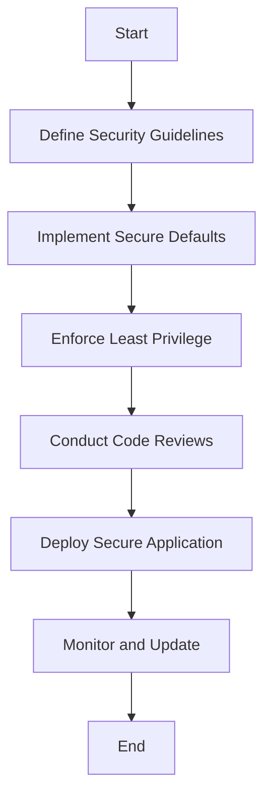

## 16.1 Secure Coding Practices

In the realm of software development, security is paramount. As developers and architects, we must ensure that our applications are resilient against potential threats and vulnerabilities. This section delves into secure coding practices specifically tailored for Haxe, a versatile language known for its cross-platform capabilities. By adopting these practices, you can safeguard your applications and protect sensitive data.

### Definition

Secure coding practices refer to the methodologies and principles applied during software development to protect applications from vulnerabilities and threats. These practices are essential for maintaining the integrity, confidentiality, and availability of software systems.

### Implementing Secure Coding Practices in Haxe

#### Code Reviews

**Explain the Importance of Code Reviews:**

Code reviews are a critical component of secure coding practices. They involve systematically examining code by one or more developers to identify potential security flaws, bugs, and areas for improvement. Regular code reviews help ensure that security standards are consistently met and that vulnerabilities are addressed early in the development process.

**Demonstrate a Code Review Process:**

1. **Establish Guidelines:** Define clear security guidelines and checklists for code reviews.
2. **Peer Review:** Encourage team members to review each other's code, fostering a culture of collaboration and knowledge sharing.
3. **Automated Tools:** Utilize automated code analysis tools to complement manual reviews and catch common security issues.

#### Least Privilege Principle

**Explain the Principle of Least Privilege:**

The principle of least privilege dictates that users and systems should have the minimum level of access necessary to perform their functions. This reduces the risk of unauthorized access and limits the potential damage from security breaches.

**Provide an Example in Haxe:**

```haxe
class SecureFileAccess {
    public static function readFile(filePath: String): String {
        // Ensure the file path is validated and access is restricted
        if (!isValidPath(filePath)) {
            throw "Access Denied: Invalid file path.";
        }
        return sys.io.File.getContent(filePath);
    }

    private static function isValidPath(filePath: String): Bool {
        // Implement path validation logic
        return filePath.startsWith("/secure/data/");
    }
}
```

**Highlight Key Points:**

- Validate inputs to ensure access is restricted to authorized resources.
- Implement checks to enforce the least privilege principle.

#### Secure Defaults

**Explain Secure Defaults:**

Secure defaults refer to configuring systems and applications with the most secure settings by default. This approach minimizes the risk of misconfiguration and ensures that security is prioritized from the outset.

**Provide an Example of Secure Defaults in Haxe:**

```haxe
class SecureServerConfig {
    public static function configureServer(): Void {
        var server = new HttpServer();
        server.setSecureDefaults();
        server.start();
    }
}

class HttpServer {
    public function new() {}

    public function setSecureDefaults(): Void {
        // Enforce HTTPS by default
        this.useHttps = true;
        // Set secure cookie attributes
        this.cookieSecure = true;
        this.cookieHttpOnly = true;
    }

    public function start(): Void {
        // Start the server with secure configurations
        trace("Server started with secure defaults.");
    }
}
```

**Key Takeaways:**

- Ensure that default configurations prioritize security.
- Regularly review and update default settings to align with best practices.

### Best Practices for Secure Coding

#### Avoid Hardcoding Credentials

**Explain the Risks of Hardcoding Credentials:**

Hardcoding credentials, such as API keys and passwords, directly into the source code is a common security pitfall. This practice exposes sensitive information to unauthorized access, especially if the code is shared or stored in version control systems.

**Provide a Secure Alternative:**

- Use environment variables or secure vaults to store sensitive information.
- Implement configuration files with restricted access to manage credentials.

**Example in Haxe:**

```haxe
class SecureConfig {
    public static function getApiKey(): String {
        // Retrieve API key from environment variable
        return Sys.getenv("API_KEY");
    }
}
```

#### Update Dependencies

**Explain the Importance of Updating Dependencies:**

Keeping libraries and frameworks up to date is crucial for mitigating known vulnerabilities. Outdated dependencies can introduce security risks and expose applications to exploits.

**Provide a Strategy for Managing Dependencies:**

1. **Regular Audits:** Conduct regular audits of dependencies to identify outdated or vulnerable packages.
2. **Automated Tools:** Use tools like `haxelib` to manage and update dependencies efficiently.
3. **Changelogs:** Review changelogs and release notes for security patches and updates.

**Example of Updating Dependencies in Haxe:**

```bash
haxelib upgrade
```

### Use Cases and Examples

#### Configuring Secure Settings

**Explain the Importance of Secure Settings:**

Configuring secure settings is essential for protecting applications from common vulnerabilities. This includes enforcing HTTPS, using secure cookies, and implementing proper session handling.

**Provide an Example of Secure Settings in Haxe:**

```haxe
class SecureWebApp {
    public static function main() {
        var app = new WebApplication();
        app.enforceHttps();
        app.configureSessionHandling();
    }
}

class WebApplication {
    public function new() {}

    public function enforceHttps(): Void {
        // Redirect all HTTP traffic to HTTPS
        trace("Enforcing HTTPS for secure communication.");
    }

    public function configureSessionHandling(): Void {
        // Implement secure session handling
        trace("Configuring secure session handling.");
    }
}
```

**Key Takeaways:**

- Enforce HTTPS to protect data in transit.
- Implement secure session handling to prevent session hijacking.

### Visualizing Secure Coding Practices

To better understand secure coding practices, let's visualize the process of implementing secure defaults and enforcing the least privilege principle using a flowchart.



**Diagram Description:**

This flowchart illustrates the process of implementing secure coding practices, starting from defining security guidelines to deploying a secure application and continuously monitoring and updating it.

### References and Links

- [OWASP Secure Coding Practices](https://owasp.org/www-project-secure-coding-practices-quick-reference-guide/)
- [Haxe Manual: Security Considerations](https://haxe.org/manual/security.html)
- [MDN Web Docs: Secure Coding Practices](https://developer.mozilla.org/en-US/docs/Web/Security/Secure_Coding_Practices)

### Knowledge Check

- What is the principle of least privilege, and why is it important?
- How can you avoid hardcoding credentials in your Haxe applications?
- What are the benefits of conducting regular code reviews?

### Embrace the Journey

Remember, secure coding is an ongoing journey. As you continue to develop applications in Haxe, keep these practices in mind and strive to build secure, resilient software. Stay curious, keep learning, and enjoy the process of creating secure applications that stand the test of time.

## Quiz Time!



### What is the primary goal of secure coding practices?

- [x] To protect applications from vulnerabilities and threats
- [ ] To improve application performance
- [ ] To enhance user interface design
- [ ] To reduce development time

> **Explanation:** Secure coding practices aim to protect applications from vulnerabilities and threats, ensuring the integrity, confidentiality, and availability of software systems.

### Which principle dictates that users should have the minimum level of access necessary?

- [x] Least Privilege Principle
- [ ] Secure Defaults Principle
- [ ] Code Review Principle
- [ ] Dependency Management Principle

> **Explanation:** The Least Privilege Principle dictates that users and systems should have the minimum level of access necessary to perform their functions, reducing the risk of unauthorized access.

### What is a common security risk associated with hardcoding credentials?

- [x] Unauthorized access to sensitive information
- [ ] Improved application performance
- [ ] Enhanced user experience
- [ ] Reduced code complexity

> **Explanation:** Hardcoding credentials exposes sensitive information to unauthorized access, especially if the code is shared or stored in version control systems.

### How can you securely store sensitive information in Haxe applications?

- [x] Use environment variables or secure vaults
- [ ] Hardcode them in the source code
- [ ] Store them in plain text files
- [ ] Share them in version control systems

> **Explanation:** Using environment variables or secure vaults is a secure way to store sensitive information, avoiding exposure in the source code.

### What is the benefit of conducting regular code reviews?

- [x] Identifying potential security flaws early
- [ ] Increasing application performance
- [x] Ensuring consistent security standards
- [ ] Reducing development time

> **Explanation:** Regular code reviews help identify potential security flaws early and ensure that security standards are consistently met.

### Why is it important to keep libraries and frameworks up to date?

- [x] To mitigate known vulnerabilities
- [ ] To improve user interface design
- [ ] To reduce code complexity
- [ ] To enhance application performance

> **Explanation:** Keeping libraries and frameworks up to date is crucial for mitigating known vulnerabilities and protecting applications from exploits.

### What is the purpose of secure defaults?

- [x] To configure systems with the most secure settings by default
- [ ] To enhance application performance
- [ ] To simplify user interface design
- [ ] To reduce development time

> **Explanation:** Secure defaults ensure that systems and applications are configured with the most secure settings by default, minimizing the risk of misconfiguration.

### How can you enforce HTTPS in a Haxe web application?

- [x] Redirect all HTTP traffic to HTTPS
- [ ] Disable HTTPS in the server configuration
- [ ] Use plain HTTP for all communications
- [ ] Store sensitive data in cookies

> **Explanation:** Enforcing HTTPS involves redirecting all HTTP traffic to HTTPS, ensuring secure communication and protecting data in transit.

### What is a key takeaway from configuring secure settings?

- [x] Enforce HTTPS and implement secure session handling
- [ ] Use plain HTTP for faster communication
- [ ] Store sensitive data in cookies
- [ ] Disable security features for simplicity

> **Explanation:** Configuring secure settings involves enforcing HTTPS and implementing secure session handling to protect applications from common vulnerabilities.

### True or False: Secure coding is a one-time task that can be completed during initial development.

- [ ] True
- [x] False

> **Explanation:** Secure coding is an ongoing journey that requires continuous monitoring, updating, and improvement to protect applications from evolving threats.


