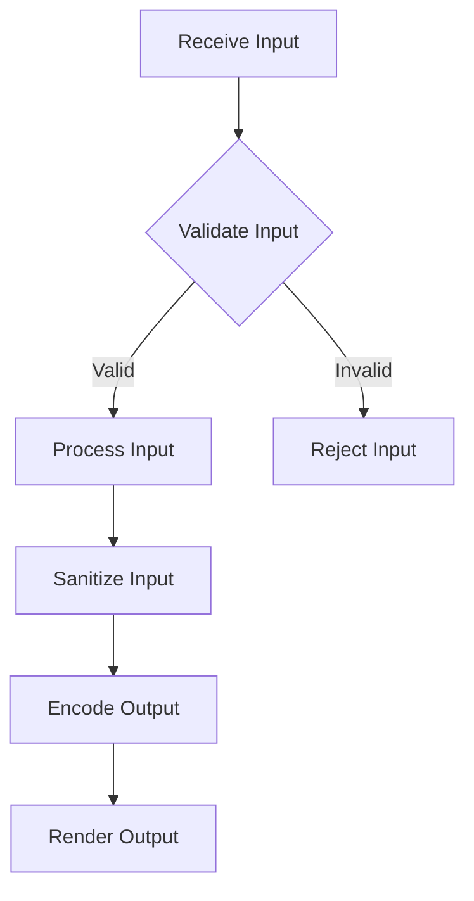

## 16.2 Input Validation and Sanitization

In the realm of software development, input validation and sanitization are paramount to ensuring the security and integrity of applications. This section delves into the importance of these practices within the Haxe programming language, providing expert guidance on implementing robust validation and sanitization mechanisms.

### Understanding Input Validation and Sanitization

**Input Validation** is the process of verifying that the data provided by users or external systems conforms to expected formats and types. This step is crucial to prevent malicious data from entering the system and causing harm.

**Sanitization**, on the other hand, involves cleaning the input data to remove or neutralize any potentially harmful elements. This is especially important for preventing injection attacks, such as SQL injection or cross-site scripting (XSS).

### Importance of Input Validation and Sanitization in Haxe

Haxe, being a cross-platform language, is often used to develop applications that run on various platforms, including web, mobile, and desktop. This diversity increases the attack surface, making input validation and sanitization even more critical. By implementing these practices, developers can ensure that their applications are secure, reliable, and resilient against attacks.

### Implementing Input Validation in Haxe

#### Validation Libraries

Haxe provides several libraries that can assist in input validation. These libraries offer pre-built functions and utilities to simplify the validation process. However, developers can also write custom validation functions tailored to their specific needs.

Here's an example of a simple validation function in Haxe:

```haxe
class InputValidator {
    public static function isEmailValid(email:String):Bool {
        // Regular expression for validating an Email
        var emailRegex = ~/^[a-zA-Z0-9._%+-]+@[a-zA-Z0-9.-]+\.[a-zA-Z]{2,}$/;
        return emailRegex.match(email);
    }
}

// Usage
var email = "example@domain.com";
if (InputValidator.isEmailValid(email)) {
    trace("Valid email address.");
} else {
    trace("Invalid email address.");
}
```

In this example, we use a regular expression to validate email addresses. This approach ensures that only properly formatted email addresses are accepted.

#### Client and Server-Side Validation

While client-side validation can enhance user experience by providing immediate feedback, it should never be relied upon as the sole validation mechanism. Server-side validation is essential for ensuring data integrity and security, as client-side validation can be bypassed by malicious users.

Here's how you can implement server-side validation in a Haxe-based web application:

```haxe
class Server {
    public function validateInput(data:String):Bool {
        // Perform server-side validation
        return InputValidator.isEmailValid(data);
    }
}

// Simulating server-side validation
var server = new Server();
var inputData = "user@domain.com";
if (server.validateInput(inputData)) {
    trace("Input is valid.");
} else {
    trace("Input is invalid.");
}
```

### Best Practices for Input Validation and Sanitization

#### Whitelist Approach

Adopting a whitelist approach involves defining what constitutes acceptable input rather than attempting to filter out bad input. This method is more secure as it explicitly specifies the criteria for valid data.

For example, when validating a username, you might allow only alphanumeric characters:

```haxe
class UsernameValidator {
    public static function isValidUsername(username:String):Bool {
        // Allow only alphanumeric characters
        var usernameRegex = ~/^[a-zA-Z0-9]+$/;
        return usernameRegex.match(username);
    }
}
```

#### Encoding Output

Encoding output is a critical step in preventing cross-site scripting (XSS) attacks. By encoding data before rendering it in views, you ensure that any potentially harmful scripts are neutralized.

Here's an example of encoding output in Haxe:

```haxe
class OutputEncoder {
    public static function encodeForHTML(input:String):String {
        return input.replace("&", "&amp;")
                    .replace("<", "&lt;")
                    .replace(">", "&gt;")
                    .replace("\"", "&quot;")
                    .replace("'", "&#x27;");
    }
}

// Usage
var userInput = "<script>alert('XSS');</script>";
var safeOutput = OutputEncoder.encodeForHTML(userInput);
trace(safeOutput); // Outputs: &lt;script&gt;alert(&#x27;XSS&#x27;);&lt;/script&gt;
```

### Use Cases and Examples

#### Form Inputs

In web applications, user-provided data through forms is a common source of input. Validating this data is crucial to prevent malicious input from being processed.

Consider a registration form where users enter their details. Each field should be validated to ensure it meets the expected criteria:

```haxe
class RegistrationForm {
    public static function validateForm(username:String, email:String, password:String):Bool {
        return UsernameValidator.isValidUsername(username) &&
               InputValidator.isEmailValid(email) &&
               password.length >= 8; // Simple password length check
    }
}

// Usage
var isValid = RegistrationForm.validateForm("user123", "user@domain.com", "securePass");
trace(isValid ? "Form is valid." : "Form is invalid.");
```

#### API Endpoints

APIs often serve as gateways for data exchange between systems. Ensuring that data received via APIs conforms to expected formats is essential for maintaining system integrity.

Here's an example of validating JSON data received through an API:

```haxe
import haxe.Json;

class API {
    public static function validateJsonData(jsonData:String):Bool {
        try {
            var data = Json.parse(jsonData);
            return data.username != null && data.email != null && data.password != null;
        } catch (e:Dynamic) {
            return false;
        }
    }
}

// Simulating API data validation
var jsonData = '{"username": "user123", "email": "user@domain.com", "password": "securePass"}';
var isJsonValid = API.validateJsonData(jsonData);
trace(isJsonValid ? "JSON data is valid." : "JSON data is invalid.");
```

### Visualizing Input Validation and Sanitization Process

To better understand the flow of input validation and sanitization, let's visualize the process using a flowchart:



**Figure 1:** Input Validation and Sanitization Process Flowchart

This flowchart illustrates the steps involved in handling input data, from initial validation to final rendering. Each step is crucial for ensuring that only safe and valid data is processed and displayed.

### References and Further Reading

- [OWASP Input Validation Cheat Sheet](https://cheatsheetseries.owasp.org/cheatsheets/Input_Validation_Cheat_Sheet.html)
- [MDN Web Docs: Data Validation](https://developer.mozilla.org/en-US/docs/Learn/Forms/Form_validation)
- [Haxe Manual: Regular Expressions](https://haxe.org/manual/std-regex.html)

### Knowledge Check

To reinforce your understanding of input validation and sanitization in Haxe, consider the following questions:

1. What is the primary purpose of input validation?
2. Why is server-side validation essential even if client-side validation is implemented?
3. How does encoding output help prevent XSS attacks?
4. What is the difference between a whitelist and a blacklist approach in input validation?
5. How can regular expressions be used in input validation?

### Embrace the Journey

Remember, mastering input validation and sanitization is a continuous journey. As you progress, you'll encounter new challenges and opportunities to apply these principles. Stay curious, keep experimenting, and enjoy the process of building secure and robust applications with Haxe!

## Quiz Time!



### What is the primary purpose of input validation?

- [x] To ensure that input data conforms to expected formats and types.
- [ ] To enhance the user interface.
- [ ] To improve application performance.
- [ ] To reduce code complexity.

> **Explanation:** Input validation ensures that data provided by users or external systems conforms to expected formats and types, preventing malicious data from entering the system.

### Why is server-side validation essential even if client-side validation is implemented?

- [x] Because client-side validation can be bypassed by malicious users.
- [ ] Because server-side validation is faster.
- [ ] Because it enhances the user experience.
- [ ] Because it reduces server load.

> **Explanation:** Server-side validation is essential because client-side validation can be bypassed by malicious users, ensuring data integrity and security.

### How does encoding output help prevent XSS attacks?

- [x] By neutralizing potentially harmful scripts before rendering them in views.
- [ ] By improving application performance.
- [ ] By reducing server load.
- [ ] By enhancing the user interface.

> **Explanation:** Encoding output neutralizes potentially harmful scripts before rendering them in views, preventing cross-site scripting (XSS) attacks.

### What is the difference between a whitelist and a blacklist approach in input validation?

- [x] A whitelist defines acceptable input criteria, while a blacklist filters out known bad inputs.
- [ ] A whitelist filters out known bad inputs, while a blacklist defines acceptable input criteria.
- [ ] Both are the same.
- [ ] Neither is used in input validation.

> **Explanation:** A whitelist approach defines acceptable input criteria, making it more secure than a blacklist, which filters out known bad inputs.

### How can regular expressions be used in input validation?

- [x] By defining patterns that input data must match to be considered valid.
- [ ] By improving application performance.
- [ ] By reducing server load.
- [ ] By enhancing the user interface.

> **Explanation:** Regular expressions define patterns that input data must match to be considered valid, making them a powerful tool for input validation.

### Which of the following is a best practice for input validation?

- [x] Using a whitelist approach.
- [ ] Relying solely on client-side validation.
- [ ] Ignoring input validation for trusted users.
- [ ] Using a blacklist approach.

> **Explanation:** Using a whitelist approach is a best practice for input validation, as it defines acceptable input criteria.

### What is sanitization in the context of input handling?

- [x] The process of cleaning input data to remove or neutralize harmful elements.
- [ ] The process of enhancing the user interface.
- [ ] The process of improving application performance.
- [ ] The process of reducing server load.

> **Explanation:** Sanitization involves cleaning input data to remove or neutralize harmful elements, preventing injection attacks.

### What role does encoding play in input handling?

- [x] It prevents XSS attacks by neutralizing harmful scripts.
- [ ] It enhances the user interface.
- [ ] It improves application performance.
- [ ] It reduces server load.

> **Explanation:** Encoding plays a crucial role in preventing XSS attacks by neutralizing harmful scripts before rendering them in views.

### Which of the following is a common use case for input validation?

- [x] Validating user-provided data in web applications.
- [ ] Enhancing the user interface.
- [ ] Improving application performance.
- [ ] Reducing server load.

> **Explanation:** Validating user-provided data in web applications is a common use case for input validation, ensuring data integrity and security.

### True or False: Input validation should only be performed on the client-side.

- [ ] True
- [x] False

> **Explanation:** Input validation should be performed on both the client-side and server-side to ensure data integrity and security, as client-side validation can be bypassed.


