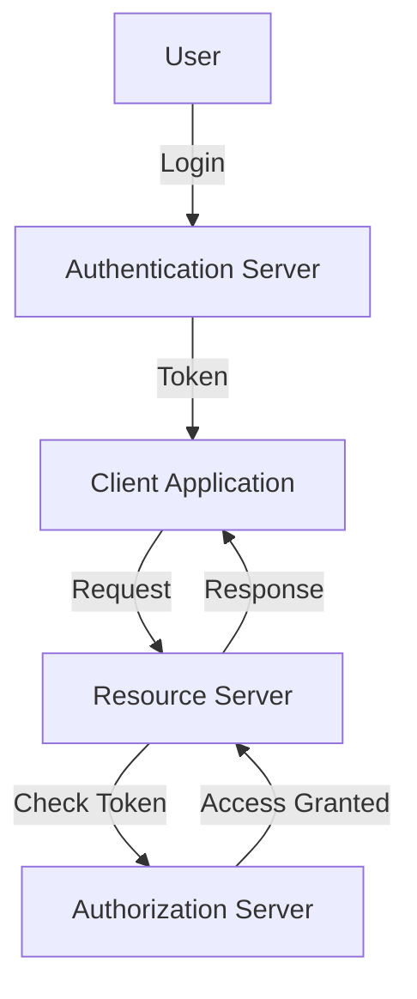

## 16.3 Authentication and Authorization Mechanisms

In the realm of software development, ensuring that only authorized users can access certain resources is paramount. This section delves into the intricacies of implementing authentication and authorization mechanisms in Haxe, a language renowned for its cross-platform capabilities. We'll explore various protocols, best practices, and provide practical examples to guide you in securing your applications.

### Understanding Authentication and Authorization

**Authentication** is the process of verifying the identity of a user or system. It answers the question, "Who are you?" Common methods include passwords, biometrics, and tokens.

**Authorization**, on the other hand, determines what an authenticated user is allowed to do. It answers the question, "What are you allowed to do?" This often involves checking permissions and roles.

### Implementing Authentication in Haxe

#### Authentication Protocols

1. **OAuth2**: A widely used protocol for authorization, OAuth2 allows third-party services to exchange information without exposing user credentials. Implementing OAuth2 in Haxe involves setting up an authorization server and handling token exchanges.

2. **JWT (JSON Web Tokens)**: JWTs are compact, URL-safe tokens that represent claims between two parties. They are ideal for stateless authentication in web applications.

3. **Custom Token-Based Authentication**: For applications with specific needs, custom token-based systems can be developed. These systems involve generating, storing, and validating tokens.

#### Code Example: JWT Authentication in Haxe

```haxe
import haxe.crypto.Base64;
import haxe.Json;

class JWTAuth {
    static var secretKey:String = "your_secret_key";

    public static function generateToken(payload:Dynamic):String {
        var header = { "alg": "HS256", "typ": "JWT" };
        var headerEncoded = Base64.encode(Json.stringify(header));
        var payloadEncoded = Base64.encode(Json.stringify(payload));
        var signature = haxe.crypto.Sha256.hmac(secretKey, headerEncoded + "." + payloadEncoded);
        return headerEncoded + "." + payloadEncoded + "." + Base64.encode(signature);
    }

    public static function verifyToken(token:String):Bool {
        var parts = token.split(".");
        if (parts.length != 3) return false;
        var signature = Base64.decode(parts[2]);
        var validSignature = haxe.crypto.Sha256.hmac(secretKey, parts[0] + "." + parts[1]);
        return signature == validSignature;
    }
}
```

**Explanation**: This example demonstrates a simple JWT generation and verification process. The `generateToken` function creates a JWT by encoding a header and payload, then signing it with a secret key. The `verifyToken` function checks the token's signature to ensure its validity.

### Implementing Authorization in Haxe

#### Access Control

1. **Role-Based Access Control (RBAC)**: This model assigns permissions to roles rather than individuals. Users are then assigned roles, simplifying permission management.

2. **Attribute-Based Access Control (ABAC)**: ABAC uses attributes (user, resource, environment) to determine access rights. It's more flexible than RBAC but also more complex.

#### Code Example: Role-Based Access Control

```haxe
class User {
    public var username:String;
    public var roles:Array<String>;

    public function new(username:String, roles:Array<String>) {
        this.username = username;
        this.roles = roles;
    }

    public function hasRole(role:String):Bool {
        return roles.indexOf(role) != -1;
    }
}

class AccessControl {
    static var permissions = {
        "admin": ["read", "write", "delete"],
        "editor": ["read", "write"],
        "viewer": ["read"]
    };

    public static function canAccess(user:User, action:String):Bool {
        for (role in user.roles) {
            if (permissions.exists(role) && permissions[role].indexOf(action) != -1) {
                return true;
            }
        }
        return false;
    }
}
```

**Explanation**: This example illustrates a simple RBAC system. The `User` class holds user information and roles, while the `AccessControl` class checks if a user can perform a specific action based on their roles.

### Best Practices for Authentication and Authorization

1. **Secure Password Storage**: Always store passwords using strong hashing algorithms like bcrypt. Avoid storing plain text passwords.

2. **Multi-Factor Authentication (MFA)**: Enhance security by requiring additional verification steps, such as SMS codes or authenticator apps.

3. **Least Privilege Principle**: Grant users the minimum level of access necessary to perform their tasks.

4. **Regular Audits**: Conduct regular security audits to identify and fix vulnerabilities.

### Use Cases and Examples

#### User Login Systems

Implementing a secure user login system is a fundamental requirement for most applications. This involves:

- **User Registration**: Collecting user information and storing hashed passwords.
- **Login Process**: Authenticating users with their credentials and issuing tokens.
- **Session Management**: Handling user sessions securely, often with JWTs.

#### Role-Based Access Control (RBAC)

RBAC is ideal for applications with distinct user roles, such as admin, editor, and viewer. It simplifies permission management and enhances security by ensuring users only have access to what they need.

### Visualizing Authentication and Authorization



**Diagram Explanation**: This flowchart illustrates the authentication and authorization process. The user logs in, receives a token from the authentication server, and uses it to access resources. The authorization server verifies the token before granting access.

### References and Links

- [OAuth2 Specification](https://oauth.net/2/)
- [JWT Introduction](https://jwt.io/introduction/)
- [Haxe Documentation](https://haxe.org/documentation/)

### Knowledge Check

To reinforce your understanding, consider the following questions:

1. What is the difference between authentication and authorization?
2. How does JWT ensure the integrity of a token?
3. Why is it important to use a strong hashing algorithm for password storage?
4. What are the benefits of implementing RBAC in an application?

### Embrace the Journey

Remember, mastering authentication and authorization is a continuous journey. As you implement these mechanisms in Haxe, you'll gain deeper insights into securing your applications. Keep experimenting, stay curious, and enjoy the journey!

## Quiz Time!



### What is the primary purpose of authentication?

- [x] To verify the identity of a user or system
- [ ] To determine what a user is allowed to do
- [ ] To encrypt user data
- [ ] To manage user sessions

> **Explanation:** Authentication is the process of verifying the identity of a user or system.

### Which protocol is commonly used for authorization in web applications?

- [ ] JWT
- [x] OAuth2
- [ ] HTTPS
- [ ] FTP

> **Explanation:** OAuth2 is a widely used protocol for authorization in web applications.

### What does JWT stand for?

- [ ] Java Web Token
- [x] JSON Web Token
- [ ] JavaScript Web Token
- [ ] Joint Web Token

> **Explanation:** JWT stands for JSON Web Token.

### In RBAC, what is assigned to users to manage permissions?

- [ ] Tokens
- [ ] Passwords
- [x] Roles
- [ ] Attributes

> **Explanation:** In Role-Based Access Control (RBAC), roles are assigned to users to manage permissions.

### What is a key benefit of using Multi-Factor Authentication (MFA)?

- [x] Enhanced security by requiring additional verification steps
- [ ] Faster login process
- [ ] Reduced password complexity
- [ ] Simplified user management

> **Explanation:** Multi-Factor Authentication (MFA) enhances security by requiring additional verification steps.

### Which algorithm is recommended for secure password storage?

- [ ] MD5
- [ ] SHA1
- [x] bcrypt
- [ ] Base64

> **Explanation:** bcrypt is recommended for secure password storage due to its strength and resistance to attacks.

### What is the principle of least privilege?

- [x] Granting users the minimum level of access necessary
- [ ] Allowing users full access to all resources
- [ ] Storing passwords in plain text
- [ ] Using a single factor for authentication

> **Explanation:** The principle of least privilege involves granting users the minimum level of access necessary to perform their tasks.

### What is the role of the authorization server in the authentication flow?

- [ ] To store user passwords
- [x] To verify tokens and grant access
- [ ] To generate user interfaces
- [ ] To encrypt data

> **Explanation:** The authorization server verifies tokens and grants access to resources.

### What is a common use case for JWT?

- [x] Stateless authentication in web applications
- [ ] Encrypting user passwords
- [ ] Managing database connections
- [ ] Designing user interfaces

> **Explanation:** JWT is commonly used for stateless authentication in web applications.

### True or False: OAuth2 is primarily used for authentication.

- [ ] True
- [x] False

> **Explanation:** OAuth2 is primarily used for authorization, not authentication.


