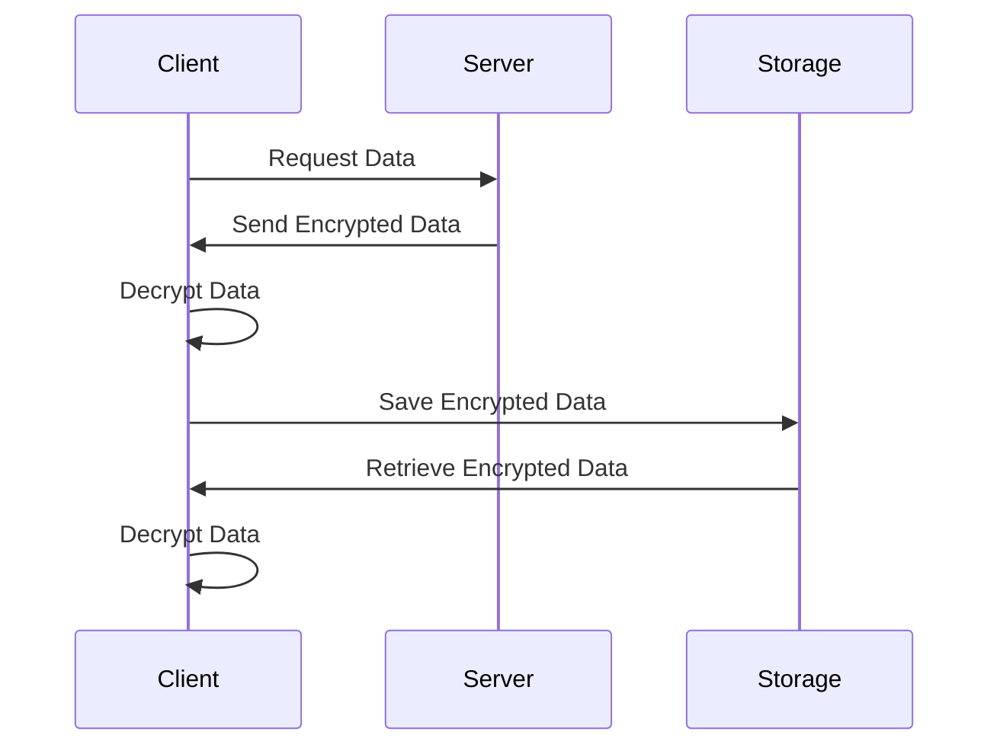

## 16.4 Data Encryption and Secure Storage

In today's digital landscape, data security is paramount. As software engineers and architects, it is our responsibility to ensure that sensitive data is protected both at rest and in transit. This section delves into the concepts of data encryption and secure storage, specifically tailored for Haxe's cross-platform capabilities. We will explore how to implement encryption in Haxe, best practices for secure data handling, and real-world use cases.

### Understanding Data Encryption

**Data Encryption** is the process of converting plaintext data into a coded form, known as ciphertext, to prevent unauthorized access. Encryption ensures that even if data is intercepted, it cannot be read without the appropriate decryption key.

#### Key Concepts in Encryption

- **Symmetric Encryption:** Uses the same key for both encryption and decryption. It is fast and suitable for encrypting large amounts of data. Examples include AES (Advanced Encryption Standard) and DES (Data Encryption Standard).
  
- **Asymmetric Encryption:** Uses a pair of keys – a public key for encryption and a private key for decryption. It is more secure but slower than symmetric encryption. RSA (Rivest-Shamir-Adleman) is a widely used asymmetric encryption algorithm.

- **Hashing:** Converts data into a fixed-size string of characters, which is typically a hash code. Hashing is used for data integrity checks and password storage. Common hashing algorithms include SHA-256 and MD5.

### Implementing Encryption in Haxe

Haxe, with its cross-platform capabilities, allows developers to implement encryption across multiple targets. Here, we will explore how to use Haxe-compatible cryptographic libraries to achieve secure data encryption.

#### Using Haxe-Compatible Cryptographic Libraries

To implement encryption in Haxe, we can utilize libraries such as [hxCrypto](https://lib.haxe.org/p/hxcrypto/) and [haxe-crypto](https://lib.haxe.org/p/haxe-crypto/). These libraries provide a range of cryptographic functions, including AES, RSA, and hashing algorithms.

**Example: Encrypting Data with AES in Haxe**

```haxe
import haxe.crypto.Aes;
import haxe.crypto.Base64;

class EncryptionExample {
    public static function main() {
        var key = "mysecretkey12345"; // 16 bytes key for AES-128
        var plaintext = "Sensitive data to encrypt";

        // Encrypt the data
        var aes = new Aes(haxe.io.Bytes.ofString(key));
        var encryptedBytes = aes.encrypt(haxe.io.Bytes.ofString(plaintext));
        var encryptedBase64 = Base64.encode(encryptedBytes);

        trace("Encrypted Data: " + encryptedBase64);

        // Decrypt the data
        var decryptedBytes = aes.decrypt(Base64.decode(encryptedBase64));
        var decryptedText = decryptedBytes.toString();

        trace("Decrypted Data: " + decryptedText);
    }
}
```

**Explanation:**

- We use the `Aes` class from the `haxe.crypto` package to encrypt and decrypt data.
- The `Base64` class is used to encode the encrypted bytes into a string format for easy storage or transmission.
- The same key is used for both encryption and decryption, demonstrating symmetric encryption.

### Secure Communication with SSL/TLS

**SSL (Secure Sockets Layer)** and **TLS (Transport Layer Security)** are protocols that provide secure communication over a network. They encrypt data in transit, ensuring that sensitive information such as login credentials and payment details are protected from eavesdropping.

#### Implementing SSL/TLS in Haxe

To implement SSL/TLS in Haxe, we can use libraries like [hxssl](https://lib.haxe.org/p/hxssl/), which provide SSL/TLS support for Haxe applications.

**Example: Establishing a Secure Connection**

```haxe
import sys.net.Socket;
import sys.ssl.Socket;

class SecureConnectionExample {
    public static function main() {
        var host = "example.com";
        var port = 443; // HTTPS port

        // Create an SSL socket
        var sslSocket = new sys.ssl.Socket();
        sslSocket.connect(host, port);

        trace("Secure connection established with " + host);

        // Send and receive data securely
        sslSocket.write("GET / HTTP/1.1\r\nHost: " + host + "\r\n\r\n");
        var response = sslSocket.readAll().toString();
        trace("Response: " + response);

        sslSocket.close();
    }
}
```

**Explanation:**

- We create an SSL socket using the `sys.ssl.Socket` class.
- The socket connects to a server over HTTPS, ensuring that data exchanged is encrypted.
- This example demonstrates a simple HTTPS request to a server.

### Best Practices for Data Encryption and Secure Storage

Implementing encryption is just one part of securing data. Here are some best practices to ensure comprehensive data protection:

#### Encrypt Sensitive Data

- **Personal Data:** Encrypt personal information such as names, addresses, and social security numbers.
- **Payment Information:** Use strong encryption for credit card numbers and bank account details.
- **Credentials:** Store passwords using secure hashing algorithms with salt.

#### Key Management

- **Secure Key Storage:** Store encryption keys in a secure location, separate from the encrypted data.
- **Regular Key Rotation:** Change encryption keys periodically to minimize the risk of key compromise.
- **Access Control:** Restrict access to encryption keys to authorized personnel only.

#### Use Cases and Examples

Let's explore some real-world use cases where data encryption and secure storage are crucial.

##### Secure File Storage

Encrypting files before saving them on disk ensures that even if the storage medium is compromised, the data remains protected.

**Example: Encrypting a File in Haxe**

```haxe
import haxe.crypto.Aes;
import haxe.io.Bytes;
import sys.io.File;

class FileEncryptionExample {
    public static function main() {
        var key = "mysecretkey12345"; // 16 bytes key for AES-128
        var filePath = "sensitive_data.txt";
        var fileContent = File.getContent(filePath);

        // Encrypt the file content
        var aes = new Aes(Bytes.ofString(key));
        var encryptedBytes = aes.encrypt(Bytes.ofString(fileContent));
        File.saveBytes(filePath + ".enc", encryptedBytes);

        trace("File encrypted and saved as " + filePath + ".enc");
    }
}
```

**Explanation:**

- We read the content of a file and encrypt it using AES.
- The encrypted content is saved to a new file with a `.enc` extension.

##### Encrypted Communications

Implementing HTTPS and secure WebSockets ensures that data exchanged between clients and servers is encrypted.

**Example: Secure WebSocket Communication**

```haxe
import js.html.WebSocket;

class SecureWebSocketExample {
    public static function main() {
        var ws = new WebSocket("wss://example.com/socket");

        ws.onopen = function(_) {
            trace("Secure WebSocket connection established");
            ws.send("Hello, secure world!");
        };

        ws.onmessage = function(event) {
            trace("Received: " + event.data);
        };

        ws.onclose = function(_) {
            trace("WebSocket connection closed");
        };
    }
}
```

**Explanation:**

- We create a WebSocket connection using the `wss` protocol, which indicates a secure WebSocket.
- Data sent and received over this connection is encrypted.

### Visualizing Encryption and Secure Storage

To better understand the flow of data encryption and secure storage, let's visualize the process using a sequence diagram.



**Diagram Explanation:**

- The client requests data from the server, which sends it in encrypted form.
- The client decrypts the data for use and saves it in encrypted form to storage.
- When retrieving data, the client decrypts it again for use.

### Knowledge Check

Before we conclude, let's reinforce our understanding with a few questions and exercises.

- **Question:** What is the difference between symmetric and asymmetric encryption?
- **Exercise:** Modify the file encryption example to use a different encryption algorithm, such as RSA.
- **Challenge:** Implement a simple key management system in Haxe that securely stores and retrieves encryption keys.

### Embrace the Journey

Remember, mastering data encryption and secure storage is a continuous journey. As you progress, you'll encounter new challenges and opportunities to enhance your skills. Keep experimenting, stay curious, and enjoy the journey!

## Quiz Time!



### What is the primary purpose of data encryption?

- [x] To convert plaintext data into a coded form to prevent unauthorized access
- [ ] To compress data for storage efficiency
- [ ] To enhance data readability
- [ ] To format data for database storage

> **Explanation:** Data encryption is used to convert plaintext data into a coded form, known as ciphertext, to prevent unauthorized access.

### Which encryption method uses the same key for both encryption and decryption?

- [x] Symmetric Encryption
- [ ] Asymmetric Encryption
- [ ] Hashing
- [ ] Public Key Infrastructure

> **Explanation:** Symmetric encryption uses the same key for both encryption and decryption, making it fast and suitable for large data.

### What is a common use case for hashing?

- [x] Data integrity checks and password storage
- [ ] Encrypting large files
- [ ] Secure communication over networks
- [ ] Compressing data for storage

> **Explanation:** Hashing is commonly used for data integrity checks and password storage due to its ability to convert data into a fixed-size hash code.

### Which protocol provides secure communication over a network?

- [x] SSL/TLS
- [ ] HTTP
- [ ] FTP
- [ ] SMTP

> **Explanation:** SSL (Secure Sockets Layer) and TLS (Transport Layer Security) are protocols that provide secure communication over a network.

### What is the purpose of key management in encryption?

- [x] To safely store and manage encryption keys
- [ ] To compress encryption keys for storage
- [ ] To enhance the speed of encryption algorithms
- [ ] To convert keys into plaintext

> **Explanation:** Key management involves safely storing and managing encryption keys to ensure data security.

### Which library can be used for cryptographic functions in Haxe?

- [x] hxCrypto
- [ ] jQuery
- [ ] Bootstrap
- [ ] React

> **Explanation:** hxCrypto is a Haxe-compatible library that provides cryptographic functions for encryption and decryption.

### What is the benefit of using HTTPS for communication?

- [x] It encrypts data exchanged between clients and servers
- [ ] It speeds up data transmission
- [ ] It reduces server load
- [ ] It formats data for database storage

> **Explanation:** HTTPS encrypts data exchanged between clients and servers, ensuring secure communication.

### What does the `wss` protocol indicate in WebSocket communication?

- [x] Secure WebSocket
- [ ] WebSocket over HTTP
- [ ] WebSocket over FTP
- [ ] WebSocket over SMTP

> **Explanation:** The `wss` protocol indicates a secure WebSocket, where data is encrypted during transmission.

### What is the role of the `Base64` class in the AES encryption example?

- [x] To encode encrypted bytes into a string format
- [ ] To compress data for storage
- [ ] To format data for database storage
- [ ] To convert data into plaintext

> **Explanation:** The `Base64` class is used to encode encrypted bytes into a string format for easy storage or transmission.

### True or False: Asymmetric encryption is faster than symmetric encryption.

- [ ] True
- [x] False

> **Explanation:** Asymmetric encryption is generally slower than symmetric encryption because it uses a pair of keys for encryption and decryption.



By understanding and implementing data encryption and secure storage, we can significantly enhance the security of our applications. This knowledge is crucial for protecting sensitive information and maintaining user trust. Keep exploring and applying these concepts to build secure, robust applications in Haxe.
