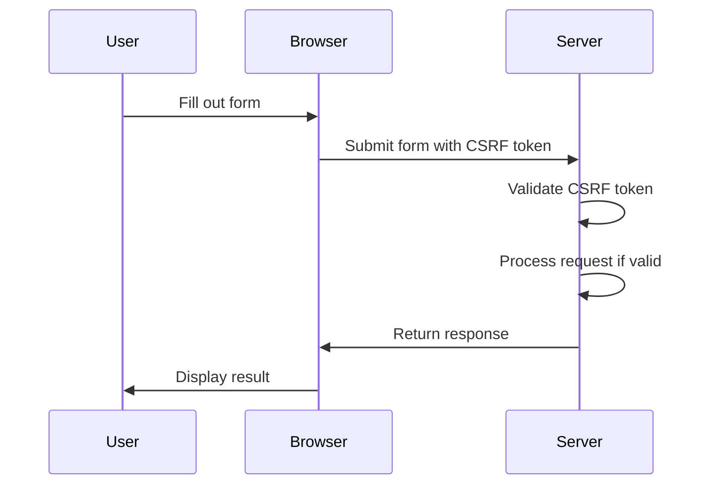

## 16.5 Protecting Against Common Vulnerabilities

In the realm of software development, security is paramount. As expert developers and architects, it is crucial to understand and mitigate common vulnerabilities that can compromise the integrity, confidentiality, and availability of your applications. This section will delve into protecting against prevalent security threats such as SQL injection, cross-site scripting (XSS), and cross-site request forgery (CSRF) within the Haxe ecosystem. We will explore practical implementation strategies, best practices, and real-world examples to fortify your applications.

### Understanding Common Vulnerabilities

Before diving into protection mechanisms, let's briefly define the vulnerabilities we aim to mitigate:

- **SQL Injection:** A code injection technique that exploits vulnerabilities in an application's software by inserting malicious SQL statements into an entry field for execution.
- **Cross-Site Scripting (XSS):** A security breach that allows an attacker to inject malicious scripts into content from otherwise trusted websites.
- **Cross-Site Request Forgery (CSRF):** An attack that tricks the victim into submitting a malicious request, exploiting the trust that a web application has in the user's browser.

### Implementing Safeguards in Haxe

#### Parameterized Queries

SQL injection remains one of the most common and dangerous vulnerabilities. To prevent SQL injection in Haxe, use parameterized queries or prepared statements. This approach ensures that user inputs are treated as data rather than executable code.

```haxe
import sys.db.Connection;
import sys.db.ResultSet;

class DatabaseHelper {
    public static function executeQuery(conn:Connection, userId:Int):ResultSet {
        // Use parameterized queries to prevent SQL injection
        var query = "SELECT * FROM users WHERE id = ?";
        return conn.request(query, [userId]);
    }
}
```

**Key Points:**
- **Avoid String Concatenation:** Never concatenate user inputs directly into SQL queries.
- **Use Prepared Statements:** Ensure that the database driver supports prepared statements for added security.

#### Content Security Policy (CSP)

To mitigate XSS attacks, implement a Content Security Policy (CSP). CSP is a security feature that helps prevent a wide range of attacks, including XSS, by controlling the resources the user agent is allowed to load for a given page.

```haxe
class CSPHelper {
    public static function applyCSP():Void {
        // Set Content Security Policy headers
        var csp = "default-src 'self'; script-src 'self' 'unsafe-inline';";
        // Assume we have a function to set HTTP headers
        setHTTPHeader("Content-Security-Policy", csp);
    }
}
```

**Key Points:**
- **Define Policies:** Specify which resources are allowed to be loaded and executed.
- **Regularly Review Policies:** Update CSP policies as your application evolves.

#### CSRF Tokens

CSRF attacks can be thwarted by implementing anti-CSRF tokens. These tokens are unique and unpredictable values that are associated with the user's session and included in requests to validate their authenticity.

```haxe
class CSRFProtection {
    public static function generateToken():String {
        // Generate a random token
        return StringTools.hex(Math.random() * 1000000);
    }

    public static function validateToken(token:String, sessionToken:String):Bool {
        // Validate the CSRF token
        return token == sessionToken;
    }
}
```

**Key Points:**
- **Token Generation:** Ensure tokens are unique and unpredictable.
- **Token Validation:** Validate tokens on the server side for every state-changing request.

### Best Practices for Security

#### Stay Informed

Security is an ever-evolving field. Stay informed about the latest vulnerabilities and mitigation strategies by following resources such as the [OWASP Top Ten](https://owasp.org/www-project-top-ten/).

#### Security Testing

Regularly test your applications for vulnerabilities using automated tools and penetration testing. Consider integrating security testing into your CI/CD pipeline to catch issues early.

- **Automated Tools:** Use tools like OWASP ZAP or Burp Suite for automated scanning.
- **Penetration Testing:** Engage with security professionals to perform thorough penetration testing.

### Use Cases and Examples

#### Web Applications

In web applications, user inputs are a common attack vector. Always validate and sanitize inputs to prevent injection attacks.

```haxe
class InputSanitizer {
    public static function sanitize(input:String):String {
        // Remove potentially harmful characters
        return StringTools.replace(input, "<", "&lt;");
    }
}
```

#### APIs

When building APIs, validate and sanitize data received from external sources. Ensure that your API endpoints are protected against common vulnerabilities.

```haxe
class APIValidator {
    public static function validateInput(data:Dynamic):Bool {
        // Perform validation checks
        return data != null && data.id != null && Std.is(data.id, Int);
    }
}
```

### Visualizing Security Measures

To better understand the flow of security measures, let's visualize the process of handling a secure form submission using a sequence diagram.



**Diagram Explanation:**
- **User Interaction:** The user fills out a form in the browser.
- **Token Validation:** The server validates the CSRF token before processing the request.
- **Response Handling:** The server processes the request and returns a response to the browser.

### Knowledge Check

Let's reinforce our understanding with some questions and exercises:

- **Question:** What is the primary purpose of a Content Security Policy (CSP)?
- **Exercise:** Implement a simple Haxe function to sanitize user inputs by removing HTML tags.

### Embrace the Journey

Remember, security is a journey, not a destination. As you progress in your development career, continue to learn and adapt to new security challenges. Stay curious, keep experimenting, and enjoy the journey of building secure applications.

## Quiz Time!



### What is SQL injection?

- [x] A technique that exploits vulnerabilities by inserting malicious SQL statements.
- [ ] A method to enhance database performance.
- [ ] A way to secure SQL databases.
- [ ] A process to optimize SQL queries.

> **Explanation:** SQL injection is a code injection technique that exploits vulnerabilities in an application's software by inserting malicious SQL statements into an entry field for execution.

### How can you prevent SQL injection in Haxe?

- [x] Use parameterized queries or prepared statements.
- [ ] Use string concatenation for SQL queries.
- [ ] Disable SQL logging.
- [ ] Use dynamic SQL generation.

> **Explanation:** Parameterized queries or prepared statements ensure that user inputs are treated as data rather than executable code, preventing SQL injection.

### What does CSP stand for?

- [x] Content Security Policy
- [ ] Cross-Site Protection
- [ ] Cyber Security Protocol
- [ ] Content Safety Program

> **Explanation:** CSP stands for Content Security Policy, a security feature that helps prevent a wide range of attacks, including XSS, by controlling the resources the user agent is allowed to load for a given page.

### What is the purpose of a CSRF token?

- [x] To validate the authenticity of requests.
- [ ] To encrypt user data.
- [ ] To optimize server performance.
- [ ] To manage user sessions.

> **Explanation:** CSRF tokens are unique and unpredictable values that are associated with the user's session and included in requests to validate their authenticity.

### Which of the following is a common vulnerability?

- [x] Cross-Site Scripting (XSS)
- [ ] Data Compression
- [ ] Load Balancing
- [ ] Caching

> **Explanation:** Cross-Site Scripting (XSS) is a security breach that allows an attacker to inject malicious scripts into content from otherwise trusted websites.

### What is the OWASP Top Ten?

- [x] A list of the most critical web application security risks.
- [ ] A ranking of the best programming languages.
- [ ] A guide to optimizing web performance.
- [ ] A list of popular web frameworks.

> **Explanation:** The OWASP Top Ten is a list of the most critical web application security risks, providing developers with insights into the most common vulnerabilities.

### How can you stay informed about security vulnerabilities?

- [x] Follow resources like the OWASP Top Ten.
- [ ] Ignore security updates.
- [ ] Focus only on performance optimization.
- [ ] Use outdated libraries.

> **Explanation:** Staying informed about the latest vulnerabilities and mitigation strategies by following resources such as the OWASP Top Ten is crucial for maintaining application security.

### What is penetration testing?

- [x] A method to evaluate the security of an application by simulating attacks.
- [ ] A process to improve application performance.
- [ ] A technique to enhance user experience.
- [ ] A way to optimize database queries.

> **Explanation:** Penetration testing is a method to evaluate the security of an application by simulating attacks, helping identify vulnerabilities before they can be exploited.

### Why is input validation important?

- [x] To prevent injection attacks and ensure data integrity.
- [ ] To improve application performance.
- [ ] To enhance user interface design.
- [ ] To reduce server load.

> **Explanation:** Input validation is crucial to prevent injection attacks and ensure data integrity by verifying that user inputs meet expected criteria.

### True or False: Security is a one-time task.

- [ ] True
- [x] False

> **Explanation:** Security is an ongoing process that requires continuous monitoring, testing, and adaptation to new threats and vulnerabilities.


