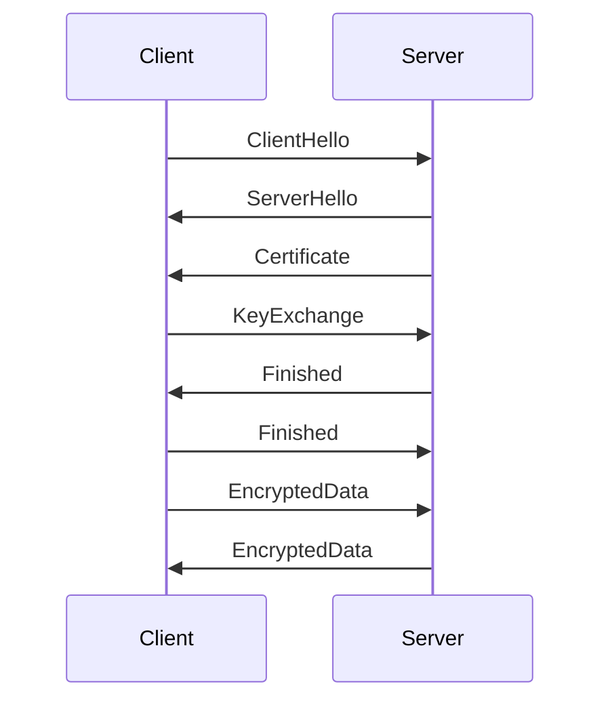

## 16.6 Secure Communication Protocols

In the realm of cross-platform software development, ensuring secure communication is paramount. As expert developers and architects, we must prioritize data integrity and confidentiality during transmission. This section delves into secure communication protocols, focusing on their implementation in Haxe, best practices, and practical use cases.

### Understanding Secure Communication Protocols

Secure communication protocols are designed to protect data as it travels across networks. They ensure that data is not intercepted, altered, or accessed by unauthorized parties. The most widely used protocols include SSL (Secure Sockets Layer) and TLS (Transport Layer Security), which provide encryption and authentication mechanisms.

#### Key Concepts

- **Encryption:** The process of converting data into a code to prevent unauthorized access.
- **Authentication:** Verifying the identity of the parties involved in communication.
- **Integrity:** Ensuring that data has not been altered during transmission.

### Implementing Secure Communication in Haxe

Haxe, with its cross-platform capabilities, allows developers to implement secure communication protocols seamlessly. Let's explore how to configure SSL/TLS and manage certificates in Haxe.

#### SSL/TLS Configuration

SSL and TLS are cryptographic protocols that provide secure communication over a computer network. TLS is the successor to SSL and offers improved security features. Implementing SSL/TLS in Haxe involves configuring secure protocols for network communication.

##### Steps to Configure SSL/TLS

1. **Install SSL/TLS Libraries:** Use libraries like `haxe.ssl` or third-party libraries to enable SSL/TLS in your Haxe projects.
2. **Configure Server and Client:** Set up your server to accept SSL/TLS connections and configure your client to initiate secure connections.
3. **Select Cipher Suites:** Choose strong cipher suites that offer robust encryption and authentication.
4. **Enable Protocols:** Ensure that only secure protocols like TLS 1.2 or TLS 1.3 are enabled.

```haxe
import sys.net.Socket;
import haxe.ssl.SecureSocket;

class SecureClient {
    public static function main() {
        var socket = new Socket();
        var secureSocket = new SecureSocket(socket);

        // Connect to the server using SSL/TLS
        secureSocket.connect("example.com", 443);

        // Send data securely
        secureSocket.write("GET / HTTP/1.1\r\nHost: example.com\r\n\r\n");
        secureSocket.flush();

        // Read response
        var response = secureSocket.readAll();
        trace(response);

        // Close the connection
        secureSocket.close();
    }
}
```

**Try It Yourself:** Modify the code to connect to a different server or use a different port. Experiment with sending different types of requests.

#### Certificate Management

Certificates are essential for establishing trust in secure communications. They verify the identity of the parties involved and ensure that data is encrypted.

##### Managing Certificates in Haxe

1. **Obtain Certificates:** Use trusted Certificate Authorities (CAs) to obtain valid certificates.
2. **Install Certificates:** Install certificates on your server and configure your client to trust them.
3. **Validate Certificates:** Ensure that certificates are valid and have not expired.

```haxe
import haxe.ssl.Certificate;
import haxe.ssl.SecureSocket;

class CertificateManager {
    public static function main() {
        var cert = Certificate.loadFromFile("path/to/certificate.pem");
        var secureSocket = new SecureSocket();

        // Set the certificate for the secure socket
        secureSocket.setCertificate(cert);

        // Connect to the server
        secureSocket.connect("example.com", 443);

        // Validate the server's certificate
        if (secureSocket.validateCertificate()) {
            trace("Certificate is valid.");
        } else {
            trace("Certificate validation failed.");
        }

        // Close the connection
        secureSocket.close();
    }
}
```

**Try It Yourself:** Load a different certificate file and observe the validation results. Experiment with invalid or expired certificates to see how the validation process handles them.

### Best Practices for Secure Communication

Adhering to best practices ensures that your secure communication implementation is robust and reliable.

#### Disable Insecure Protocols

Outdated protocols like SSLv3 are vulnerable to attacks and should be disabled. Always use the latest versions of TLS.

#### Use Strong Cipher Suites

Configure your servers to use strong encryption algorithms. Avoid weak ciphers that can be easily compromised.

#### Regularly Update Libraries

Keep your SSL/TLS libraries up to date to protect against known vulnerabilities.

#### Monitor and Audit

Regularly monitor your secure communication channels and audit them for any signs of compromise.

### Use Cases and Examples

Secure communication protocols are crucial in various scenarios. Let's explore some common use cases.

#### RESTful APIs

When developing RESTful APIs, ensure that all endpoints are accessible only over HTTPS. This prevents data interception and ensures that sensitive information is protected.

```haxe
import sys.net.Http;

class SecureAPIClient {
    public static function main() {
        var http = new Http("https://api.example.com/data");

        // Set headers for secure communication
        http.setHeader("Authorization", "Bearer YOUR_ACCESS_TOKEN");

        // Send a GET request
        http.request(true);

        // Handle the response
        http.onData = function(data) {
            trace("Received data: " + data);
        };

        http.onError = function(error) {
            trace("Error: " + error);
        };
    }
}
```

**Try It Yourself:** Modify the code to send POST requests with JSON payloads. Experiment with different API endpoints and observe the responses.

#### Real-Time Communication

Securing WebSocket connections is vital for real-time communication applications. Use `wss://` instead of `ws://` to ensure that data is encrypted.

```haxe
import sys.net.WebSocket;

class SecureWebSocketClient {
    public static function main() {
        var ws = new WebSocket("wss://example.com/socket");

        // Handle open connection
        ws.onOpen = function() {
            trace("Connection opened.");
            ws.send("Hello, server!");
        };

        // Handle incoming messages
        ws.onMessage = function(message) {
            trace("Received message: " + message);
        };

        // Handle errors
        ws.onError = function(error) {
            trace("Error: " + error);
        };

        // Handle closed connection
        ws.onClose = function() {
            trace("Connection closed.");
        };
    }
}
```

**Try It Yourself:** Connect to different WebSocket servers and send various messages. Observe how the server responds and how the connection is maintained.

### Visualizing Secure Communication

To better understand secure communication protocols, let's visualize the process using a sequence diagram.



**Diagram Description:** This sequence diagram illustrates the SSL/TLS handshake process. The client initiates the handshake with a `ClientHello` message, and the server responds with a `ServerHello` and its certificate. The client and server then exchange keys and complete the handshake, allowing encrypted data to be transmitted securely.

### References and Links

For further reading on secure communication protocols, consider the following resources:

- [MDN Web Docs: HTTPS](https://developer.mozilla.org/en-US/docs/Web/HTTP/Overview)
- [SSL/TLS Best Practices](https://www.ssl.com/faqs/ssl-best-practices/)
- [OWASP Transport Layer Protection Cheat Sheet](https://cheatsheetseries.owasp.org/cheatsheets/Transport_Layer_Protection_Cheat_Sheet.html)

### Knowledge Check

To reinforce your understanding of secure communication protocols, consider the following questions:

- What are the key differences between SSL and TLS?
- Why is it important to disable outdated protocols like SSLv3?
- How can you ensure that your certificates are valid and trusted?

### Embrace the Journey

Remember, mastering secure communication protocols is an ongoing journey. As you implement these protocols in your Haxe projects, continue to explore new techniques and stay informed about emerging security threats. Keep experimenting, stay curious, and enjoy the journey!

## Quiz Time!



### What is the primary purpose of secure communication protocols?

- [x] To ensure data integrity and confidentiality during transmission
- [ ] To increase data transmission speed
- [ ] To reduce server load
- [ ] To simplify network configuration

> **Explanation:** Secure communication protocols are designed to protect data integrity and confidentiality during transmission.

### Which protocol is the successor to SSL and offers improved security features?

- [ ] SSLv3
- [x] TLS
- [ ] HTTP
- [ ] FTP

> **Explanation:** TLS (Transport Layer Security) is the successor to SSL and provides enhanced security features.

### What is the role of certificates in secure communication?

- [x] To verify the identity of the parties involved
- [ ] To encrypt data
- [ ] To compress data
- [ ] To increase data transmission speed

> **Explanation:** Certificates verify the identity of the parties involved in secure communication.

### Which of the following is a best practice for secure communication?

- [x] Disable outdated protocols like SSLv3
- [ ] Use weak cipher suites
- [ ] Ignore certificate validation
- [ ] Enable all protocols by default

> **Explanation:** Disabling outdated protocols like SSLv3 is a best practice to enhance security.

### What should you use to secure WebSocket connections?

- [ ] ws://
- [x] wss://
- [ ] ftp://
- [ ] http://

> **Explanation:** Use `wss://` to secure WebSocket connections and ensure data encryption.

### How can you ensure that your certificates are valid?

- [x] Obtain them from trusted Certificate Authorities
- [ ] Use self-signed certificates
- [ ] Ignore expiration dates
- [ ] Use expired certificates

> **Explanation:** Obtaining certificates from trusted Certificate Authorities ensures their validity.

### What is the purpose of the SSL/TLS handshake process?

- [x] To establish a secure connection between client and server
- [ ] To compress data
- [ ] To increase data transmission speed
- [ ] To reduce server load

> **Explanation:** The SSL/TLS handshake process establishes a secure connection between client and server.

### Which of the following is a key concept in secure communication?

- [x] Encryption
- [ ] Compression
- [ ] Data redundancy
- [ ] Load balancing

> **Explanation:** Encryption is a key concept in secure communication, ensuring data confidentiality.

### What is a common use case for secure communication protocols?

- [x] Securing RESTful API endpoints
- [ ] Increasing data transmission speed
- [ ] Reducing server load
- [ ] Simplifying network configuration

> **Explanation:** Securing RESTful API endpoints is a common use case for secure communication protocols.

### True or False: Regularly updating SSL/TLS libraries is a best practice for secure communication.

- [x] True
- [ ] False

> **Explanation:** Regularly updating SSL/TLS libraries is a best practice to protect against known vulnerabilities.


