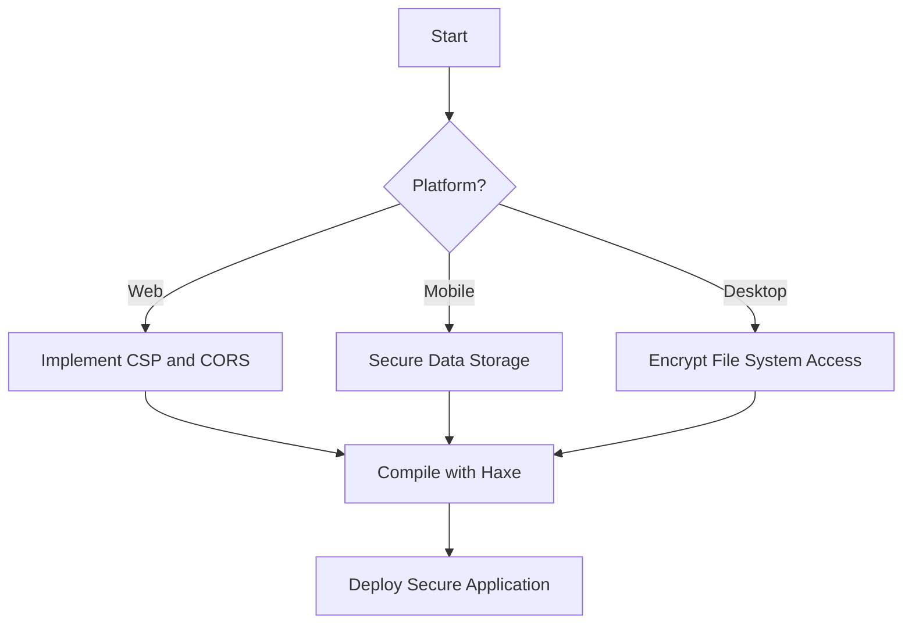

## 16.7 Security Across Different Targets

In the realm of cross-platform development, ensuring security across different targets is paramount. Haxe, with its ability to compile to multiple languages and platforms, presents unique challenges and opportunities in maintaining robust security. This section will guide you through understanding platform-specific vulnerabilities, implementing consistent security policies, and leveraging Haxe's features to secure your applications effectively.

### Understanding Platform-Specific Vulnerabilities

Each platform—be it web, mobile, or desktop—comes with its own set of security challenges. Recognizing these vulnerabilities is the first step in mitigating risks.

#### Web Security

Web applications are exposed to a wide array of threats, including:

- **Cross-Site Scripting (XSS):** Malicious scripts injected into web pages.
- **Cross-Site Request Forgery (CSRF):** Unauthorized commands transmitted from a user that the web application trusts.
- **SQL Injection:** Malicious SQL statements executed in the database.

To counter these, implement Content Security Policy (CSP) headers, Cross-Origin Resource Sharing (CORS) policies, and ensure all data inputs are sanitized.

#### Mobile Security

Mobile applications face issues such as:

- **Data Storage Permissions:** Ensuring sensitive data is stored securely.
- **Secure Local Storage:** Protecting data stored on the device from unauthorized access.

Use encryption for data storage and secure APIs for data transmission.

#### Desktop Security

Desktop applications must address:

- **File System Access:** Preventing unauthorized access to the file system.
- **Network Security:** Ensuring secure communication over networks.

Implement user authentication and data encryption to safeguard desktop applications.

### Consistent Security Policies

Implementing consistent security policies across all platforms ensures a uniform security posture. This involves:

- **Unified Authentication Mechanisms:** Use OAuth or JWT for consistent user authentication.
- **Centralized Logging and Monitoring:** Implement logging mechanisms that work across platforms to monitor for security incidents.
- **Regular Security Audits:** Conduct audits to ensure compliance with security standards.

### Implementing Security in Haxe

Haxe offers several features that facilitate the implementation of security measures tailored to each platform.

#### Conditional Compilation

Haxe's conditional compilation allows you to include platform-specific security code. Use `#if`, `#elseif`, and `#end` to manage code that should only be compiled for certain targets.

```haxe
#if js
// JavaScript-specific security code
trace("Implementing CSP headers for web security.");
#end

#if cpp
// C++ specific security code
trace("Encrypting local storage for desktop security.");
#end
```

#### Abstraction Layers

Create abstraction layers to encapsulate security functionality. This approach allows you to manage differences between platforms effectively.

```haxe
class SecurityManager {
    public function new() {}

    public function encryptData(data:String):String {
        #if js
        return encryptForWeb(data);
        #elseif cpp
        return encryptForDesktop(data);
        #end
    }

    private function encryptForWeb(data:String):String {
        // Web-specific encryption logic
        return "webEncryptedData";
    }

    private function encryptForDesktop(data:String):String {
        // Desktop-specific encryption logic
        return "desktopEncryptedData";
    }
}
```

### Use Cases and Examples

#### Mobile Security

For mobile applications, address data storage permissions and secure local storage. Use Haxe to manage permissions and encrypt data.

```haxe
class MobileSecurity {
    public function new() {}

    public function secureDataStorage(data:String):Void {
        #if android
        // Android-specific secure storage
        trace("Encrypting data for Android.");
        #elseif ios
        // iOS-specific secure storage
        trace("Encrypting data for iOS.");
        #end
    }
}
```

#### Web Security

Implement CORS policies, CSP headers, and HTTPS for web applications. Use Haxe to manage these configurations.

```haxe
class WebSecurity {
    public function new() {}

    public function configureSecurity():Void {
        #if js
        // JavaScript-specific security configurations
        trace("Setting up CORS and CSP for web.");
        #end
    }
}
```

### Visualizing Security Implementation

To better understand how security measures are implemented across different platforms, let's visualize the process using a flowchart.



**Diagram Description:** This flowchart illustrates the decision-making process for implementing security measures based on the target platform. It shows how different security strategies are applied for web, mobile, and desktop applications, all leading to the deployment of a secure application.

### References and Links

For further reading on platform-specific security practices, consider the following resources:

- [OWASP Web Security Testing Guide](https://owasp.org/www-project-web-security-testing-guide/)
- [Android Security Best Practices](https://developer.android.com/topic/security/best-practices)
- [iOS Security Guide](https://developer.apple.com/security/)
- [Microsoft Security Development Lifecycle](https://www.microsoft.com/en-us/securityengineering/sdl/)

### Knowledge Check

To reinforce your understanding, consider the following questions:

- What are the key security challenges for web applications?
- How can Haxe's conditional compilation be used to implement platform-specific security measures?
- Why is it important to have consistent security policies across different platforms?

### Embrace the Journey

Remember, mastering security across different targets is a continuous journey. As you progress, you'll encounter new challenges and opportunities to enhance your skills. Keep experimenting, stay curious, and enjoy the journey!

## Quiz Time!



### What is a common security threat for web applications?

- [x] Cross-Site Scripting (XSS)
- [ ] Data Storage Permissions
- [ ] File System Access
- [ ] Network Security

> **Explanation:** Cross-Site Scripting (XSS) is a common threat for web applications, where malicious scripts are injected into web pages.

### Which Haxe feature allows for platform-specific code inclusion?

- [x] Conditional Compilation
- [ ] Abstraction Layers
- [ ] Unified Authentication
- [ ] Centralized Logging

> **Explanation:** Conditional Compilation in Haxe allows for the inclusion of platform-specific code using directives like `#if`, `#elseif`, and `#end`.

### What is a key security concern for mobile applications?

- [ ] Cross-Site Scripting (XSS)
- [x] Data Storage Permissions
- [ ] File System Access
- [ ] Network Security

> **Explanation:** Data Storage Permissions are a key concern for mobile applications, ensuring that sensitive data is stored securely.

### How can abstraction layers help in security implementation?

- [x] By encapsulating security functionality to manage platform differences
- [ ] By providing a unified authentication mechanism
- [ ] By centralizing logging and monitoring
- [ ] By conducting regular security audits

> **Explanation:** Abstraction layers encapsulate security functionality, allowing developers to manage differences between platforms effectively.

### What should be implemented for consistent security policies?

- [x] Unified Authentication Mechanisms
- [ ] Platform-Specific Vulnerabilities
- [ ] Conditional Compilation
- [ ] Abstraction Layers

> **Explanation:** Unified Authentication Mechanisms should be implemented for consistent security policies across platforms.

### Which security measure is crucial for web applications?

- [x] Implementing CSP headers
- [ ] Encrypting local storage
- [ ] Secure file system access
- [ ] Data storage permissions

> **Explanation:** Implementing CSP headers is crucial for web applications to prevent XSS attacks.

### What is a benefit of centralized logging and monitoring?

- [x] Monitoring for security incidents across platforms
- [ ] Encrypting data storage
- [ ] Implementing CORS policies
- [ ] Conducting security audits

> **Explanation:** Centralized logging and monitoring help in tracking security incidents across different platforms.

### Which directive is used in Haxe for conditional compilation?

- [x] #if
- [ ] #else
- [ ] #endif
- [ ] #define

> **Explanation:** The `#if` directive is used in Haxe for conditional compilation to include platform-specific code.

### What is a key security concern for desktop applications?

- [ ] Cross-Site Scripting (XSS)
- [ ] Data Storage Permissions
- [x] File System Access
- [ ] CORS Policies

> **Explanation:** File System Access is a key security concern for desktop applications, preventing unauthorized access.

### True or False: Haxe can compile to multiple languages and platforms.

- [x] True
- [ ] False

> **Explanation:** True. Haxe is designed to compile to multiple languages and platforms, making it versatile for cross-platform development.


