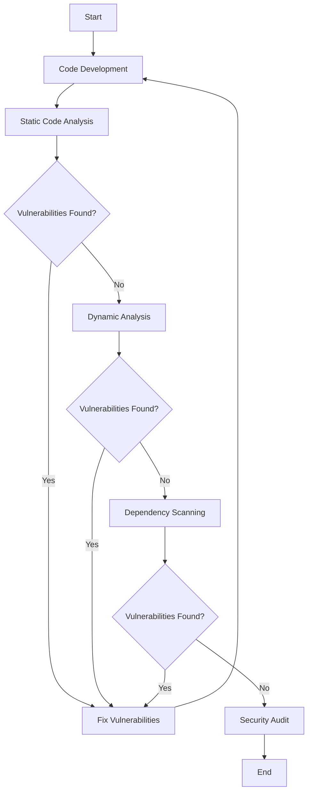

## 16.8 Security Testing and Auditing

In the realm of cross-platform development, ensuring the security of your applications is paramount. Security testing and auditing are systematic processes that help identify vulnerabilities and ensure compliance with security standards. In this section, we will delve into the methodologies and tools available for security testing and auditing in Haxe applications. We will explore how to integrate these practices into your development workflow, ensuring your applications are robust and secure.

### Understanding Security Testing and Auditing

**Security Testing** involves evaluating an application to identify potential vulnerabilities that could be exploited by attackers. This includes testing for common security issues such as SQL injection, cross-site scripting (XSS), and insecure data storage.

**Security Auditing** is a comprehensive review of your application's code and configurations to ensure compliance with security standards and best practices. This process often involves both automated tools and manual code reviews.

### Implementing Security Testing in Haxe

#### Automated Security Tests

Automated security testing is an essential component of modern software development. By integrating security tests into your continuous integration (CI) pipelines, you can ensure that security checks are performed consistently and efficiently.

- **Static Code Analysis:** Use tools that analyze your Haxe code for potential security vulnerabilities without executing the program. These tools can identify issues such as insecure coding practices and potential injection points.
  
- **Dynamic Analysis:** This involves testing the application in a runtime environment to identify vulnerabilities that may not be apparent in static analysis. Tools like OWASP ZAP can be used to perform dynamic analysis on Haxe applications.

- **Dependency Scanning:** Regularly scan your project's dependencies for known vulnerabilities. Tools like Snyk or OWASP Dependency-Check can be integrated into your CI pipeline to automate this process.

#### Code Analysis Tools

Static analysis tools are invaluable for identifying vulnerabilities early in the development process. They analyze the source code to detect potential security issues.

- **Haxe-Specific Tools:** While there are fewer tools specifically tailored for Haxe, you can leverage general static analysis tools and customize them for Haxe projects. Consider using tools like SonarQube, which can be configured to analyze Haxe code.

- **Linting Tools:** Use linters to enforce coding standards and detect potential security issues. Haxe's static typing and type inference can be leveraged to catch errors at compile time, reducing runtime vulnerabilities.

### Best Practices for Security Testing and Auditing

#### Regular Audits

Conduct regular security audits to ensure that your application remains secure over time. This involves reviewing both the code and the configurations of your application.

- **Code Reviews:** Implement a process for regular code reviews, focusing on security aspects. Peer reviews can help identify potential security issues that automated tools might miss.

- **Configuration Audits:** Regularly review your application's configuration settings to ensure they adhere to security best practices. This includes checking for secure default settings and ensuring sensitive data is not exposed.

#### Third-Party Assessments

Consider engaging external security experts to perform penetration testing or security audits. Third-party assessments can provide an unbiased view of your application's security posture.

- **Penetration Testing:** Hire security professionals to simulate attacks on your application. This can help identify vulnerabilities that may not be apparent through automated testing or internal reviews.

- **Compliance Audits:** If your application needs to comply with specific security standards (e.g., PCI DSS, GDPR), consider hiring experts to ensure compliance.

### Use Cases and Examples

#### Compliance Requirements

Many industries require applications to comply with specific security standards. Security testing and auditing are crucial for meeting these requirements.

- **PCI DSS Compliance:** If your application processes credit card information, it must comply with the Payment Card Industry Data Security Standard (PCI DSS). Regular security testing and auditing are essential for maintaining compliance.

- **GDPR Compliance:** For applications handling personal data of EU citizens, compliance with the General Data Protection Regulation (GDPR) is mandatory. Security audits can help ensure that your application meets GDPR requirements.

#### Vulnerability Management

Effective vulnerability management involves rapidly identifying and patching security flaws. Security testing and auditing play a critical role in this process.

- **Vulnerability Scanning:** Regularly scan your application for vulnerabilities using automated tools. This helps identify potential issues before they can be exploited.

- **Patch Management:** Implement a process for promptly applying security patches to your application and its dependencies. This reduces the window of opportunity for attackers.

### Code Example: Integrating Security Testing in Haxe

Let's explore a simple example of integrating security testing into a Haxe project using a static analysis tool. We'll use a hypothetical tool called `HaxeSecAnalyzer` for demonstration purposes.

```haxe
// Sample Haxe code with potential security vulnerabilities
class User {
    public var username:String;
    public var password:String;

    public function new(username:String, password:String) {
        this.username = username;
        this.password = password;
    }

    public function login():Bool {
        // Potential SQL Injection vulnerability
        var query = "SELECT * FROM users WHERE username = '" + username + "' AND password = '" + password + "'";
        return Database.execute(query);
    }
}

// Integrating HaxeSecAnalyzer into the CI pipeline
class SecurityTest {
    public static function main() {
        // Run static analysis on the User class
        var issues = HaxeSecAnalyzer.analyze(User);
        if (issues.length > 0) {
            trace("Security issues found:");
            for (issue in issues) {
                trace(issue);
            }
        } else {
            trace("No security issues found.");
        }
    }
}
```

In this example, the `HaxeSecAnalyzer` tool is used to analyze the `User` class for potential security vulnerabilities, such as SQL injection. Integrating such tools into your CI pipeline ensures that security checks are performed automatically with each build.

### Visualizing Security Testing Workflow

To better understand the security testing workflow, let's visualize the process using a flowchart.



**Description:** This flowchart illustrates the security testing workflow, starting from code development and progressing through static and dynamic analysis, dependency scanning, and security auditing.

### References and Links

- [OWASP ZAP](https://www.zaproxy.org/): A popular open-source tool for dynamic application security testing.
- [SonarQube](https://www.sonarqube.org/): A platform for continuous inspection of code quality, including security vulnerabilities.
- [Snyk](https://snyk.io/): A tool for finding and fixing vulnerabilities in open source dependencies.
- [OWASP Dependency-Check](https://owasp.org/www-project-dependency-check/): A tool for identifying project dependencies and checking for known vulnerabilities.

### Knowledge Check

To reinforce your understanding of security testing and auditing, consider the following questions:

1. What are the key differences between static and dynamic analysis in security testing?
2. How can automated security tests be integrated into a CI pipeline?
3. Why are third-party security assessments important for application security?
4. What role do security audits play in compliance with standards like PCI DSS and GDPR?
5. How can dependency scanning help in vulnerability management?

### Embrace the Journey

Security testing and auditing are ongoing processes that require vigilance and dedication. As you continue to develop cross-platform applications with Haxe, remember that security is not a one-time task but a continuous journey. Keep learning, stay informed about the latest security threats, and strive to build secure and resilient applications.

## Quiz Time!



### What is the primary goal of security testing?

- [x] To identify potential vulnerabilities in an application
- [ ] To improve application performance
- [ ] To enhance user interface design
- [ ] To increase application scalability

> **Explanation:** Security testing aims to identify potential vulnerabilities that could be exploited by attackers.

### Which tool is commonly used for dynamic application security testing?

- [ ] SonarQube
- [x] OWASP ZAP
- [ ] Snyk
- [ ] HaxeSecAnalyzer

> **Explanation:** OWASP ZAP is a popular open-source tool for dynamic application security testing.

### Why is static code analysis important in security testing?

- [x] It helps identify vulnerabilities without executing the program
- [ ] It improves application performance
- [ ] It enhances user interface design
- [ ] It increases application scalability

> **Explanation:** Static code analysis helps identify potential security vulnerabilities in the source code without executing the program.

### What is the purpose of dependency scanning in security testing?

- [x] To identify known vulnerabilities in project dependencies
- [ ] To improve application performance
- [ ] To enhance user interface design
- [ ] To increase application scalability

> **Explanation:** Dependency scanning identifies known vulnerabilities in project dependencies, helping manage security risks.

### How can security audits help in compliance with standards like PCI DSS and GDPR?

- [x] By ensuring the application meets security requirements
- [ ] By improving application performance
- [ ] By enhancing user interface design
- [ ] By increasing application scalability

> **Explanation:** Security audits help ensure that the application meets the security requirements of standards like PCI DSS and GDPR.

### What is a key benefit of integrating security tests into a CI pipeline?

- [x] Consistent and efficient security checks
- [ ] Improved application performance
- [ ] Enhanced user interface design
- [ ] Increased application scalability

> **Explanation:** Integrating security tests into a CI pipeline ensures consistent and efficient security checks with each build.

### Why are third-party security assessments valuable?

- [x] They provide an unbiased view of the application's security posture
- [ ] They improve application performance
- [ ] They enhance user interface design
- [ ] They increase application scalability

> **Explanation:** Third-party security assessments provide an unbiased view of the application's security posture, identifying vulnerabilities that internal reviews might miss.

### What is the role of penetration testing in security auditing?

- [x] Simulating attacks to identify vulnerabilities
- [ ] Improving application performance
- [ ] Enhancing user interface design
- [ ] Increasing application scalability

> **Explanation:** Penetration testing involves simulating attacks on the application to identify vulnerabilities.

### What is a common outcome of a security audit?

- [x] Identification of security vulnerabilities and compliance issues
- [ ] Improved application performance
- [ ] Enhanced user interface design
- [ ] Increased application scalability

> **Explanation:** A security audit typically results in the identification of security vulnerabilities and compliance issues.

### True or False: Security testing is a one-time task that can be completed during the initial development phase.

- [ ] True
- [x] False

> **Explanation:** Security testing is an ongoing process that requires continuous attention throughout the application's lifecycle.



Remember, security is a journey, not a destination. Keep learning, stay vigilant, and build secure applications that stand the test of time.
