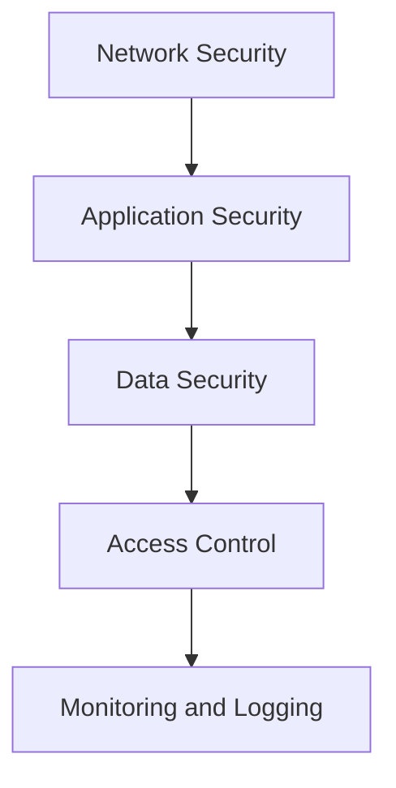

## 16.9 Best Practices for Building Secure Applications

In today's digital landscape, building secure applications is paramount. As Haxe developers, we have the unique challenge and opportunity to create cross-platform applications that are not only functional but also secure. This section will guide you through the best practices for building secure applications using Haxe, focusing on defense in depth, security by design, and avoiding common pitfalls.

### Defense in Depth

Defense in depth is a security strategy that involves implementing multiple layers of security controls throughout an application. This approach ensures that if one layer is compromised, others remain intact to protect the application.

#### Implementing Defense in Depth

1. **Network Security:** Use firewalls and intrusion detection systems to protect your network. Ensure that your application communicates over secure protocols such as HTTPS.

2. **Application Security:** Implement input validation and output encoding to prevent injection attacks. Use secure coding practices to minimize vulnerabilities.

3. **Data Security:** Encrypt sensitive data both at rest and in transit. Use strong encryption algorithms and manage encryption keys securely.

4. **Access Control:** Implement role-based access control (RBAC) to restrict access to sensitive parts of your application. Ensure that users have the minimum necessary permissions.

5. **Monitoring and Logging:** Continuously monitor your application for suspicious activity. Implement logging to track access and changes to sensitive data.

#### Code Example: Input Validation

```haxe
class InputValidator {
    public static function validateEmail(email: String): Bool {
        // Simple regex for email validation
        var emailRegex = ~/^[a-zA-Z0-9._%+-]+@[a-zA-Z0-9.-]+\.[a-zA-Z]{2,}$/;
        return emailRegex.match(email);
    }
}

// Usage
var email = "user@example.com";
if (InputValidator.validateEmail(email)) {
    trace("Valid email address.");
} else {
    trace("Invalid email address.");
}
```

### Security by Design

Security by design means integrating security considerations into every stage of the software development lifecycle. This proactive approach helps prevent vulnerabilities from being introduced into the application.

#### Key Principles of Security by Design

1. **Threat Modeling:** Identify potential threats and vulnerabilities early in the development process. Use threat modeling tools to assess risks and design mitigations.

2. **Secure Architecture:** Design your application architecture with security in mind. Use secure design patterns and principles such as least privilege and separation of duties.

3. **Code Reviews:** Conduct regular code reviews to identify and fix security vulnerabilities. Use automated tools to assist with static code analysis.

4. **Security Testing:** Perform security testing throughout the development process. Use tools for static and dynamic analysis, penetration testing, and vulnerability scanning.

5. **Continuous Improvement:** Stay informed about the latest security trends and threats. Regularly update your security practices and tools to address new challenges.

#### Code Example: Secure Architecture

```haxe
class SecureService {
    private var apiKey: String;

    public function new(apiKey: String) {
        this.apiKey = apiKey;
    }

    public function fetchData(): Void {
        // Use HTTPS for secure communication
        var url = "https://api.example.com/data?apiKey=" + this.apiKey;
        // Fetch data securely
        // ...
    }
}

// Usage
var service = new SecureService("your-secure-api-key");
service.fetchData();
```

### Common Pitfalls to Avoid

Avoiding common security pitfalls is crucial for building secure applications. Here are some pitfalls to watch out for:

#### Overlooking Error Handling

Improper error handling can leak sensitive information to attackers. Ensure that exceptions are handled gracefully and do not expose internal details.

#### Code Example: Secure Error Handling

```haxe
try {
    // Code that may throw an exception
    var result = riskyOperation();
} catch (e: Dynamic) {
    // Log the error without exposing sensitive information
    trace("An error occurred. Please try again later.");
}
```

#### Ignoring Dependencies

Third-party libraries can introduce vulnerabilities into your application. Regularly monitor and update your dependencies to address security issues.

#### Code Example: Managing Dependencies

```haxe
// Use Haxelib to manage dependencies
// Regularly update dependencies to the latest secure versions
haxelib install my-library
haxelib update my-library
```

### Resources

Utilizing existing security frameworks and staying informed about security trends are essential for building secure applications.

#### Security Frameworks

- **OWASP:** The Open Web Application Security Project provides resources and tools for building secure applications.
- **CWE:** The Common Weakness Enumeration is a list of software weaknesses that can help you identify and mitigate vulnerabilities.

#### Education and Training

- **Security Conferences:** Attend security conferences and workshops to learn about the latest threats and defenses.
- **Online Courses:** Take online courses on secure coding practices and application security.

### Visualizing Security Layers

To better understand the concept of defense in depth, let's visualize the security layers using a Mermaid.js diagram.



**Diagram Description:** This diagram illustrates the layers of defense in depth, showing how network security, application security, data security, access control, and monitoring and logging work together to protect an application.

### Try It Yourself

Experiment with the code examples provided in this section. Try modifying the input validation regex to handle different types of input, or implement additional security measures in the `SecureService` class. Consider how you might integrate security testing into your development workflow.

### Knowledge Check

Before moving on, let's reinforce what we've learned with a few questions:

- What is defense in depth, and why is it important?
- How can you integrate security by design into your development process?
- What are some common security pitfalls to avoid?

### Embrace the Journey

Remember, building secure applications is an ongoing process. As you continue to develop your skills, stay curious and keep learning about new security challenges and solutions. By following best practices and staying informed, you'll be well-equipped to build secure applications that protect your users and data.

## Quiz Time!



### What is the primary goal of defense in depth?

- [x] To implement multiple layers of security controls
- [ ] To focus on a single security measure
- [ ] To reduce the number of security controls
- [ ] To eliminate the need for security testing

> **Explanation:** Defense in depth involves implementing multiple layers of security controls to protect an application.

### Which principle is NOT part of security by design?

- [ ] Threat Modeling
- [ ] Secure Architecture
- [x] Ignoring Dependencies
- [ ] Code Reviews

> **Explanation:** Ignoring dependencies is a common pitfall, not a principle of security by design.

### What is a common pitfall in error handling?

- [ ] Logging errors securely
- [x] Exposing sensitive information
- [ ] Using try-catch blocks
- [ ] Handling exceptions gracefully

> **Explanation:** Exposing sensitive information through error messages is a common pitfall in error handling.

### How can you manage third-party dependencies securely?

- [x] Regularly update dependencies
- [ ] Ignore dependency updates
- [ ] Use outdated libraries
- [ ] Avoid using any third-party libraries

> **Explanation:** Regularly updating dependencies helps address security issues in third-party libraries.

### What is the role of monitoring and logging in defense in depth?

- [x] To track access and changes to sensitive data
- [ ] To eliminate the need for encryption
- [ ] To reduce network security measures
- [ ] To replace application security

> **Explanation:** Monitoring and logging help track access and changes to sensitive data as part of defense in depth.

### Which of the following is a security framework?

- [x] OWASP
- [ ] HTML
- [ ] CSS
- [ ] JavaScript

> **Explanation:** OWASP is a security framework that provides resources for building secure applications.

### What is the benefit of role-based access control (RBAC)?

- [x] It restricts access to sensitive parts of an application
- [ ] It eliminates the need for encryption
- [ ] It allows unrestricted access to all users
- [ ] It replaces network security

> **Explanation:** RBAC restricts access to sensitive parts of an application by assigning roles to users.

### What should you do if a security vulnerability is found in a dependency?

- [x] Update the dependency to a secure version
- [ ] Ignore the vulnerability
- [ ] Remove the dependency without replacement
- [ ] Use an older version of the dependency

> **Explanation:** Updating the dependency to a secure version addresses the security vulnerability.

### What is the purpose of threat modeling?

- [x] To identify potential threats and vulnerabilities
- [ ] To ignore security risks
- [ ] To focus solely on performance
- [ ] To eliminate the need for code reviews

> **Explanation:** Threat modeling helps identify potential threats and vulnerabilities early in the development process.

### True or False: Security testing should only be performed at the end of the development process.

- [ ] True
- [x] False

> **Explanation:** Security testing should be performed throughout the development process, not just at the end.


