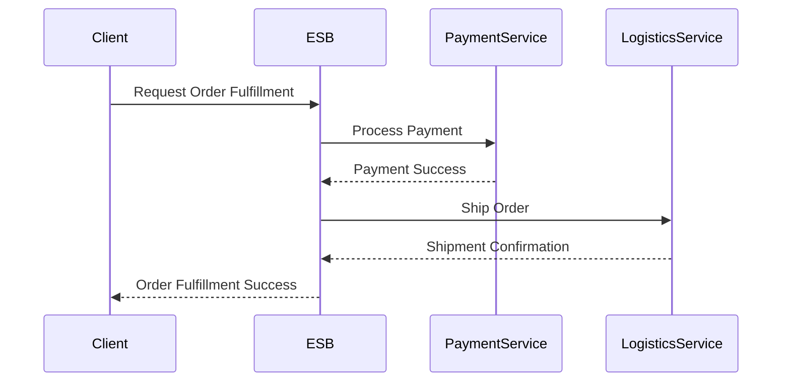

## 17.2 Enterprise Service Bus (ESB)

In today's interconnected world, integrating diverse applications and services is crucial for building robust enterprise systems. The Enterprise Service Bus (ESB) is an architectural model designed to facilitate this integration by providing a bus-like infrastructure that connects various components seamlessly. In this section, we will explore how to implement ESB patterns in Haxe, focusing on defining service interfaces, creating adapters, and leveraging Haxe's cross-platform capabilities for effective integration.

### Understanding the Enterprise Service Bus (ESB)

**Definition:** An Enterprise Service Bus (ESB) is an architectural pattern that enables communication between different applications and services within an enterprise. It acts as a middleware layer that provides a standardized way to connect, mediate, and orchestrate services, facilitating interoperability and scalability.

#### Key Characteristics of ESB

- **Decoupling:** ESB decouples services from each other, allowing them to communicate without being directly connected. This promotes flexibility and scalability.
- **Mediation:** It provides mediation capabilities such as message transformation, routing, and protocol conversion, enabling seamless communication between heterogeneous systems.
- **Orchestration:** ESB can orchestrate complex business processes by coordinating multiple services, ensuring that they work together to achieve a common goal.
- **Standardization:** It enforces standard communication protocols and data formats, reducing the complexity of integration.

### Implementing ESB Patterns in Haxe

Haxe, with its cross-platform capabilities and powerful language features, is well-suited for implementing ESB patterns. Let's delve into how we can leverage Haxe to define service interfaces, create adapters, and facilitate cross-platform integration.

#### Service Interfaces

**Service Interfaces** are crucial in an ESB architecture as they define the contract between services. They specify the operations that a service offers and the data it expects and returns. In Haxe, we can define service interfaces using classes and interfaces, ensuring type safety and consistency.

```haxe
// Define a service interface for a payment service
interface IPaymentService {
    function processPayment(amount: Float, currency: String): Bool;
    function refundPayment(transactionId: String): Bool;
}
```

In this example, we define an `IPaymentService` interface with two methods: `processPayment` and `refundPayment`. This interface can be implemented by any payment service, ensuring that all services adhere to the same contract.

#### Adapters

**Adapters** are essential components in an ESB architecture, enabling communication between the ESB and external systems. In Haxe, we can create adapters to connect to various systems, transforming data and protocols as needed.

```haxe
// Adapter for a third-party payment gateway
class PaymentGatewayAdapter implements IPaymentService {
    public function new() {}

    public function processPayment(amount: Float, currency: String): Bool {
        // Convert Haxe data to the format required by the payment gateway
        var requestData = { "amount": amount, "currency": currency };
        // Call the payment gateway API
        return callPaymentGatewayAPI(requestData);
    }

    public function refundPayment(transactionId: String): Bool {
        // Convert Haxe data to the format required by the payment gateway
        var requestData = { "transactionId": transactionId };
        // Call the payment gateway API
        return callRefundAPI(requestData);
    }

    private function callPaymentGatewayAPI(data: Dynamic): Bool {
        // Simulate API call
        trace("Calling payment gateway API with data: " + data);
        return true; // Simulate successful payment
    }

    private function callRefundAPI(data: Dynamic): Bool {
        // Simulate API call
        trace("Calling refund API with data: " + data);
        return true; // Simulate successful refund
    }
}
```

In this example, the `PaymentGatewayAdapter` implements the `IPaymentService` interface and provides concrete implementations for the `processPayment` and `refundPayment` methods. It converts Haxe data into the format required by the payment gateway and simulates API calls.

### Use Cases and Examples

#### Cross-Platform Integration

One of the primary use cases for ESB is cross-platform integration, where Haxe's ability to compile to multiple targets shines. By defining service interfaces and creating adapters, we can connect Haxe applications with other enterprise systems, regardless of the underlying platform.

**Example:** Integrating a Haxe-based inventory management system with a third-party logistics provider.

```haxe
// Define a service interface for logistics
interface ILogisticsService {
    function shipOrder(orderId: String, address: String): Bool;
}

// Adapter for a third-party logistics provider
class LogisticsProviderAdapter implements ILogisticsService {
    public function new() {}

    public function shipOrder(orderId: String, address: String): Bool {
        // Convert Haxe data to the format required by the logistics provider
        var requestData = { "orderId": orderId, "address": address };
        // Call the logistics provider API
        return callLogisticsAPI(requestData);
    }

    private function callLogisticsAPI(data: Dynamic): Bool {
        // Simulate API call
        trace("Calling logistics provider API with data: " + data);
        return true; // Simulate successful shipment
    }
}
```

In this example, the `LogisticsProviderAdapter` connects the Haxe-based inventory system with a third-party logistics provider, enabling seamless order shipment.

#### Business Process Automation

ESB can also be used to automate business processes by orchestrating services. Haxe's powerful macro system and static typing make it ideal for defining complex workflows and ensuring that services work together efficiently.

**Example:** Automating an order fulfillment process using Haxe and ESB.

```haxe
// Define a service interface for order processing
interface IOrderProcessingService {
    function fulfillOrder(orderId: String): Bool;
}

// Implementation of the order processing service
class OrderProcessingService implements IOrderProcessingService {
    private var paymentService: IPaymentService;
    private var logisticsService: ILogisticsService;

    public function new(paymentService: IPaymentService, logisticsService: ILogisticsService) {
        this.paymentService = paymentService;
        this.logisticsService = logisticsService;
    }

    public function fulfillOrder(orderId: String): Bool {
        // Simulate order processing workflow
        trace("Processing order: " + orderId);
        var paymentSuccess = paymentService.processPayment(100.0, "USD");
        if (paymentSuccess) {
            return logisticsService.shipOrder(orderId, "123 Main St");
        }
        return false;
    }
}
```

In this example, the `OrderProcessingService` orchestrates the order fulfillment process by coordinating the payment and logistics services. It demonstrates how Haxe can be used to automate workflows in an ESB architecture.

### Visualizing ESB Architecture

To better understand the ESB architecture and its components, let's visualize the interaction between services, adapters, and the ESB using a sequence diagram.



**Diagram Description:** This sequence diagram illustrates the interaction between a client, the ESB, and two services (PaymentService and LogisticsService) during an order fulfillment process. The ESB coordinates the services to ensure successful order processing.

### Design Considerations

When implementing ESB patterns in Haxe, consider the following design considerations:

- **Scalability:** Ensure that the ESB architecture can handle increasing loads and scale horizontally as needed.
- **Fault Tolerance:** Implement error handling and retry mechanisms to ensure reliability in case of service failures.
- **Security:** Secure communication between services using encryption and authentication mechanisms.
- **Performance:** Optimize data transformation and routing to minimize latency and improve throughput.

### Differences and Similarities

ESB is often compared to other integration patterns such as microservices and service-oriented architecture (SOA). While they share similarities in promoting service reuse and interoperability, ESB focuses on providing a centralized bus for communication, whereas microservices emphasize decentralized, independent services.

### Try It Yourself

To deepen your understanding of ESB patterns in Haxe, try modifying the code examples provided:

- **Experiment with Different Services:** Create additional service interfaces and adapters to simulate a more complex integration scenario.
- **Implement Error Handling:** Add error handling and logging to the adapters to improve fault tolerance.
- **Optimize Data Transformation:** Explore ways to optimize data transformation in the adapters for better performance.

### References and Further Reading

- [Enterprise Integration Patterns](https://www.enterpriseintegrationpatterns.com/)
- [Haxe Documentation](https://haxe.org/documentation/)
- [Service-Oriented Architecture (SOA)](https://www.ibm.com/cloud/learn/soa)

### Knowledge Check

Before we conclude, let's reinforce what we've learned with a few questions and exercises.

## Quiz Time!



### What is the primary role of an Enterprise Service Bus (ESB)?

- [x] To facilitate communication between different applications and services
- [ ] To store data in a centralized database
- [ ] To provide user authentication and authorization
- [ ] To manage network traffic

> **Explanation:** An ESB acts as a middleware layer that enables communication between different applications and services within an enterprise.

### Which Haxe feature is particularly useful for defining service interfaces in an ESB architecture?

- [x] Static typing
- [ ] Dynamic typing
- [ ] Reflection
- [ ] Garbage collection

> **Explanation:** Haxe's static typing ensures type safety and consistency when defining service interfaces.

### What is the purpose of an adapter in an ESB architecture?

- [x] To enable communication between the ESB and external systems
- [ ] To store configuration settings
- [ ] To manage user sessions
- [ ] To provide encryption for data

> **Explanation:** Adapters are used to connect the ESB with external systems, transforming data and protocols as needed.

### How does Haxe's cross-platform capability benefit ESB implementation?

- [x] It allows integration with systems on different platforms
- [ ] It improves the performance of the ESB
- [ ] It reduces the need for adapters
- [ ] It simplifies the user interface design

> **Explanation:** Haxe's ability to compile to multiple targets facilitates integration with systems on different platforms.

### What is a key characteristic of ESB that promotes flexibility and scalability?

- [x] Decoupling
- [ ] Centralization
- [ ] Redundancy
- [ ] Encryption

> **Explanation:** Decoupling services from each other allows them to communicate without being directly connected, promoting flexibility and scalability.

### Which of the following is NOT a typical feature of an ESB?

- [ ] Mediation
- [ ] Orchestration
- [ ] Standardization
- [x] Data storage

> **Explanation:** An ESB does not typically handle data storage; it focuses on communication and integration.

### What is the role of mediation in an ESB?

- [x] To transform messages and convert protocols
- [ ] To store user credentials
- [ ] To manage network connections
- [ ] To provide user interfaces

> **Explanation:** Mediation involves message transformation and protocol conversion to enable seamless communication between heterogeneous systems.

### How can Haxe's macro system be utilized in ESB implementation?

- [x] To define complex workflows and automate processes
- [ ] To manage memory allocation
- [ ] To handle user input
- [ ] To encrypt data

> **Explanation:** Haxe's macro system can be used to define complex workflows and automate processes in an ESB architecture.

### What is a common use case for ESB in enterprise systems?

- [x] Cross-platform integration
- [ ] User interface design
- [ ] Data encryption
- [ ] Network monitoring

> **Explanation:** ESB is commonly used for cross-platform integration, connecting diverse systems within an enterprise.

### True or False: ESB and microservices are identical architectural patterns.

- [ ] True
- [x] False

> **Explanation:** While ESB and microservices share similarities, they are distinct patterns. ESB focuses on providing a centralized bus for communication, whereas microservices emphasize decentralized, independent services.



Remember, mastering ESB patterns in Haxe is just the beginning. As you continue to explore and experiment, you'll unlock new possibilities for integrating and orchestrating services in your enterprise systems. Keep pushing the boundaries, stay curious, and enjoy the journey!
