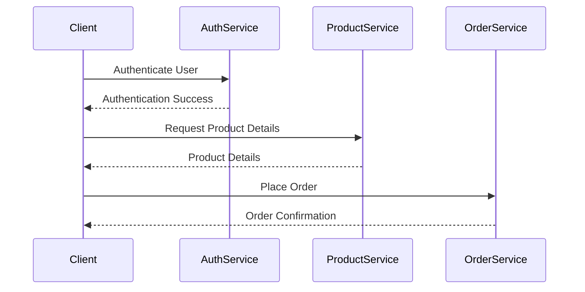

## 17.3 Service-Oriented Architecture with Haxe

Service-Oriented Architecture (SOA) is a design paradigm that structures software as a collection of interoperable services. These services communicate over a network to provide functionality, often using standardized interfaces and protocols. SOA is particularly beneficial in cross-platform development, where different systems need to interact seamlessly. In this section, we will explore how to implement SOA using Haxe, leveraging its unique features to create robust, scalable, and maintainable applications.

### Understanding Service-Oriented Architecture

**Definition:** SOA is an architectural pattern where software components are designed as services. Each service is a discrete unit of functionality that can be accessed independently. Services communicate with each other using well-defined interfaces and protocols, such as HTTP, REST, or SOAP.

**Key Characteristics of SOA:**

- **Interoperability:** Services can be consumed by different clients, regardless of their underlying technology.
- **Reusability:** Services are designed to be reused across different applications and contexts.
- **Scalability:** Services can be scaled independently to handle varying loads.
- **Loose Coupling:** Services interact through interfaces, minimizing dependencies and allowing for independent evolution.

### Implementing SOA in Haxe

Haxe is a versatile language that compiles to multiple targets, making it an excellent choice for implementing SOA. Let's explore how to create web services and compose them into higher-level functionalities using Haxe.

#### Web Services in Haxe

Web services are the backbone of SOA, providing a way for services to communicate over the internet. In Haxe, you can develop both RESTful and SOAP-based services.

**RESTful Services:**

REST (Representational State Transfer) is a popular architectural style for designing networked applications. It uses HTTP methods like GET, POST, PUT, and DELETE to perform operations on resources.

```haxe
import haxe.Http;

class RestService {
    public static function getResource(url: String): Void {
        var http = new Http(url);
        http.onData = function(data: String) {
            trace("Received data: " + data);
        };
        http.onError = function(error: String) {
            trace("Error: " + error);
        };
        http.request(true);
    }
}

// Usage
RestService.getResource("https://api.example.com/resource");
```

**SOAP Services:**

SOAP (Simple Object Access Protocol) is a protocol for exchanging structured information in web services. Haxe can interact with SOAP services using XML.

```haxe
import haxe.xml.Parser;

class SoapService {
    public static function callSoapService(url: String, xmlRequest: String): Void {
        var http = new Http(url);
        http.setHeader("Content-Type", "text/xml");
        http.onData = function(data: String) {
            var response = Parser.parse(data);
            trace("SOAP Response: " + response);
        };
        http.onError = function(error: String) {
            trace("Error: " + error);
        };
        http.request(true, xmlRequest);
    }
}

// Usage
var xmlRequest = "<soap:Envelope xmlns:soap='http://schemas.xmlsoap.org/soap/envelope/'><soap:Body>...</soap:Body></soap:Envelope>";
SoapService.callSoapService("https://api.example.com/soap", xmlRequest);
```

#### Service Composition

Service composition involves combining multiple services to create higher-level functionality. This is a key aspect of SOA, allowing for modular and flexible application design.

**Example: Composing Services in Haxe**

Consider a scenario where you have separate services for user authentication, product management, and order processing. You can compose these services to create a complete e-commerce application.

```haxe
class AuthService {
    public function authenticate(user: String, password: String): Bool {
        // Authentication logic
        return true;
    }
}

class ProductService {
    public function getProductDetails(productId: Int): String {
        // Fetch product details
        return "Product Details";
    }
}

class OrderService {
    public function placeOrder(userId: Int, productId: Int): Bool {
        // Order processing logic
        return true;
    }
}

class ECommerceService {
    var authService: AuthService;
    var productService: ProductService;
    var orderService: OrderService;

    public function new() {
        authService = new AuthService();
        productService = new ProductService();
        orderService = new OrderService();
    }

    public function processOrder(user: String, password: String, productId: Int): Bool {
        if (authService.authenticate(user, password)) {
            var productDetails = productService.getProductDetails(productId);
            return orderService.placeOrder(1, productId);
        }
        return false;
    }
}

// Usage
var ecommerceService = new ECommerceService();
var success = ecommerceService.processOrder("user", "pass", 101);
trace("Order processed: " + success);
```

### Use Cases and Examples

#### Modular Applications

SOA is ideal for building modular applications composed of loosely coupled services. Each service can be developed, deployed, and scaled independently, allowing for greater flexibility and maintainability.

**Example: Building a Modular Application**

Imagine a content management system (CMS) where different services handle content creation, user management, and analytics. Each service can be updated or replaced without affecting the others.

```haxe
class ContentService {
    public function createContent(title: String, body: String): Int {
        // Content creation logic
        return 1; // Content ID
    }
}

class UserService {
    public function createUser(username: String, email: String): Int {
        // User creation logic
        return 1; // User ID
    }
}

class AnalyticsService {
    public function trackEvent(event: String): Void {
        // Event tracking logic
    }
}

class CMS {
    var contentService: ContentService;
    var userService: UserService;
    var analyticsService: AnalyticsService;

    public function new() {
        contentService = new ContentService();
        userService = new UserService();
        analyticsService = new AnalyticsService();
    }

    public function createContentAndUser(title: String, body: String, username: String, email: String): Void {
        var contentId = contentService.createContent(title, body);
        var userId = userService.createUser(username, email);
        analyticsService.trackEvent("ContentCreated");
    }
}

// Usage
var cms = new CMS();
cms.createContentAndUser("Title", "Body", "Username", "Email");
```

#### Integration with Legacy Systems

SOA can also be used to integrate with legacy systems by exposing existing functionality as services. This allows for gradual modernization without disrupting existing operations.

**Example: Exposing Legacy Functionality as a Service**

Suppose you have a legacy system that processes financial transactions. You can expose this functionality as a web service, allowing new applications to interact with it.

```haxe
class LegacySystem {
    public function processTransaction(amount: Float): Bool {
        // Legacy transaction processing logic
        return true;
    }
}

class TransactionService {
    var legacySystem: LegacySystem;

    public function new() {
        legacySystem = new LegacySystem();
    }

    public function processTransaction(amount: Float): Bool {
        return legacySystem.processTransaction(amount);
    }
}

// Usage
var transactionService = new TransactionService();
var success = transactionService.processTransaction(100.0);
trace("Transaction processed: " + success);
```

### Visualizing SOA with Haxe

To better understand how services interact in an SOA environment, let's visualize the architecture using a sequence diagram.



**Diagram Description:** This sequence diagram illustrates the interaction between a client and various services in an e-commerce application. The client first authenticates with the `AuthService`, retrieves product details from the `ProductService`, and finally places an order through the `OrderService`.

### Key Considerations for SOA in Haxe

When implementing SOA in Haxe, consider the following:

- **Service Granularity:** Determine the appropriate level of granularity for your services. Too fine-grained services can lead to excessive communication overhead, while too coarse-grained services may reduce flexibility.
- **Versioning:** Plan for service versioning to accommodate changes without breaking existing clients.
- **Security:** Implement robust security measures, such as authentication, authorization, and encryption, to protect your services.
- **Error Handling:** Design services to handle errors gracefully and provide meaningful error messages to clients.
- **Performance:** Optimize service performance by minimizing latency and ensuring efficient resource utilization.

### Differences and Similarities with Other Patterns

SOA shares similarities with microservices architecture, but there are key differences:

- **Microservices:** Focuses on small, independently deployable services, often using lightweight protocols like REST. Microservices are a subset of SOA.
- **SOA:** Encompasses a broader range of service types and protocols, including SOAP and message queues.

### Try It Yourself

To deepen your understanding of SOA with Haxe, try the following exercises:

1. **Modify the ECommerceService:** Add a new service for handling payment processing and integrate it into the existing workflow.
2. **Create a New RESTful Service:** Develop a simple RESTful service that manages a list of tasks, allowing clients to add, update, and delete tasks.
3. **Expose a Legacy System:** Identify a legacy system in your organization and expose its functionality as a web service using Haxe.

### Further Reading

For more information on SOA and related topics, consider the following resources:

- [Service-Oriented Architecture on Wikipedia](https://en.wikipedia.org/wiki/Service-oriented_architecture)
- [RESTful Web Services](https://restfulapi.net/)
- [SOAP Web Services](https://www.w3schools.com/xml/xml_soap.asp)

### Embrace the Journey

Implementing SOA with Haxe is a rewarding journey that empowers you to build scalable, flexible, and maintainable applications. Remember, this is just the beginning. As you progress, you'll discover new ways to leverage Haxe's cross-platform capabilities to create innovative solutions. Keep experimenting, stay curious, and enjoy the journey!

## Quiz Time!



### What is the primary goal of Service-Oriented Architecture (SOA)?

- [x] To design software as a collection of interoperable services
- [ ] To create monolithic applications
- [ ] To focus solely on user interface design
- [ ] To eliminate the need for web services

> **Explanation:** SOA aims to design software as a collection of interoperable services that communicate over a network.

### Which protocol is commonly used in RESTful services?

- [x] HTTP
- [ ] FTP
- [ ] SMTP
- [ ] SNMP

> **Explanation:** RESTful services commonly use HTTP to perform operations on resources.

### What is a key characteristic of SOA?

- [x] Loose coupling
- [ ] Tight coupling
- [ ] Single-threaded execution
- [ ] Direct database access

> **Explanation:** SOA emphasizes loose coupling, allowing services to interact through interfaces with minimal dependencies.

### How does Haxe facilitate cross-platform development in SOA?

- [x] By compiling to multiple targets
- [ ] By using a single programming paradigm
- [ ] By limiting service interactions
- [ ] By enforcing strict typing

> **Explanation:** Haxe facilitates cross-platform development by compiling to multiple targets, enabling services to run on various platforms.

### What is the role of service composition in SOA?

- [x] To combine services into higher-level functionality
- [ ] To isolate services from each other
- [ ] To reduce the number of services
- [ ] To enforce strict service boundaries

> **Explanation:** Service composition involves combining multiple services to create higher-level functionality.

### Which of the following is a benefit of using SOA?

- [x] Scalability
- [ ] Increased complexity
- [ ] Reduced interoperability
- [ ] Tight coupling

> **Explanation:** SOA provides scalability by allowing services to be scaled independently.

### What is a common use case for SOA?

- [x] Integration with legacy systems
- [ ] Creating tightly coupled applications
- [ ] Eliminating web services
- [ ] Focusing solely on user interfaces

> **Explanation:** SOA is often used to integrate with legacy systems by exposing existing functionality as services.

### What is a key difference between SOA and microservices?

- [x] SOA encompasses a broader range of service types and protocols
- [ ] Microservices focus on large, monolithic services
- [ ] SOA eliminates the need for service versioning
- [ ] Microservices use SOAP exclusively

> **Explanation:** SOA encompasses a broader range of service types and protocols, while microservices focus on small, independently deployable services.

### What should be considered when designing services in SOA?

- [x] Service granularity
- [ ] Ignoring security measures
- [ ] Eliminating error handling
- [ ] Direct database access

> **Explanation:** Service granularity should be considered to balance communication overhead and flexibility.

### True or False: SOA is only suitable for web-based applications.

- [ ] True
- [x] False

> **Explanation:** SOA is suitable for a wide range of applications, not just web-based ones.


