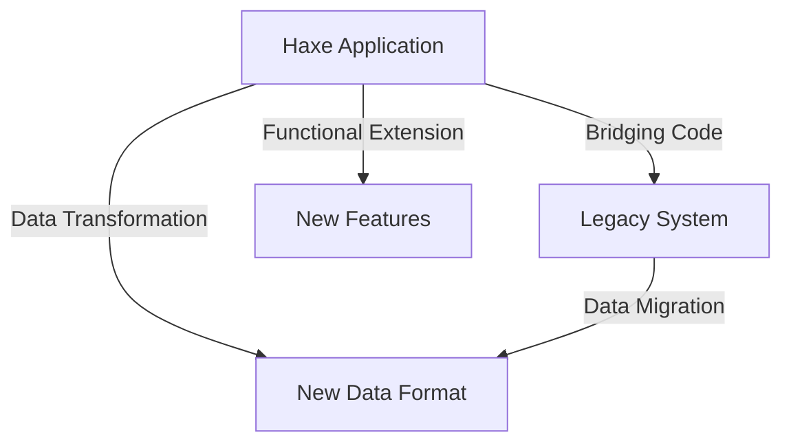

## 17.4 Integration with Legacy Systems

In the ever-evolving landscape of software development, integrating new technologies with existing legacy systems is a common challenge. Legacy systems, often built on outdated technologies, still hold critical business data and processes. As software engineers and architects, our task is to bridge the gap between these old systems and modern applications, leveraging Haxe's cross-platform capabilities to extend functionality or migrate data efficiently.

### Understanding Legacy Systems

**Legacy Systems** are outdated computing software or hardware that are still in use. Despite their age, they are often mission-critical and deeply embedded in the business processes of an organization. Integrating with these systems can be challenging due to:

- **Obsolete Technologies:** Many legacy systems are built on outdated technologies that may not be compatible with modern software.
- **Lack of Documentation:** Often, legacy systems lack comprehensive documentation, making integration difficult.
- **Complex Architectures:** Legacy systems may have complex and monolithic architectures that are hard to modify or extend.

### Why Integrate with Legacy Systems?

Before diving into the integration strategies, let's explore why integrating with legacy systems is essential:

- **Preserve Investment:** Organizations have invested heavily in legacy systems, and replacing them entirely can be cost-prohibitive.
- **Data Retention:** Legacy systems often contain valuable historical data that needs to be retained and accessed by new applications.
- **Business Continuity:** Ensuring that new systems can communicate with legacy systems is crucial for maintaining business operations without disruption.

### Implementing Integration in Haxe

Haxe, with its cross-platform capabilities, provides several strategies for integrating with legacy systems. Let's explore some of these strategies:

#### Bridging Code

**Bridging Code** involves creating interfaces between Haxe applications and legacy systems. This can be achieved using Haxe externs or native interfaces like JNI (Java Native Interface) or NDLL (Native Dynamic Link Libraries).

- **Haxe Externs:** Haxe externs allow you to define external libraries or APIs in Haxe, enabling seamless integration with existing codebases. This is particularly useful when dealing with legacy systems that expose APIs.

```haxe
// Example of Haxe externs for a legacy Java library
@:native("com.legacy.Library")
extern class LegacyLibrary {
    public static function initialize():Void;
    public static function getData():String;
}
```

- **JNI/NDLL:** For more complex integrations, you can use JNI or NDLL to call native code directly from Haxe. This approach is suitable when dealing with legacy systems written in languages like C++ or Java.

```haxe
// Example of using JNI in Haxe
class LegacyIntegration {
    public static function callLegacyMethod():Void {
        var result = untyped __call__("LegacyLibrary_getData");
        trace("Data from legacy system: " + result);
    }
}
```

#### Data Transformation

**Data Transformation** is crucial when integrating with legacy systems, as data formats may differ significantly. Haxe's adapter patterns can be employed to convert data formats, ensuring compatibility between systems.

- **Adapter Pattern:** The adapter pattern allows you to convert the interface of a class into another interface that a client expects. This is particularly useful for transforming data formats between Haxe applications and legacy systems.

```haxe
// Example of Adapter Pattern for data transformation
class LegacyDataAdapter {
    private var legacyData:LegacyData;

    public function new(legacyData:LegacyData) {
        this.legacyData = legacyData;
    }

    public function getTransformedData():NewDataFormat {
        // Transform legacy data to new format
        return new NewDataFormat(legacyData.field1, legacyData.field2);
    }
}
```

### Use Cases and Examples

Let's explore some practical use cases and examples of integrating Haxe with legacy systems:

#### Data Migration

**Data Migration** involves moving data from old systems to new Haxe applications. This is often necessary when transitioning to a new platform while retaining historical data.

- **Scenario:** A company is migrating its customer data from a legacy CRM system to a new Haxe-based application. The legacy system stores data in a proprietary format, which needs to be transformed into a modern format compatible with the new application.

```haxe
// Example of data migration from legacy system
class DataMigration {
    public static function migrateData():Void {
        var legacyData = LegacyLibrary.getData();
        var adapter = new LegacyDataAdapter(legacyData);
        var newData = adapter.getTransformedData();
        // Save newData to the new Haxe application
    }
}
```

#### Functional Extension

**Functional Extension** involves adding new features to a system without altering the legacy code. This is achieved by building new functionalities in Haxe and interfacing them with the legacy system.

- **Scenario:** A company wants to add a new reporting feature to its legacy accounting system. Instead of modifying the legacy code, they build the reporting feature in Haxe and integrate it with the existing system.

```haxe
// Example of functional extension
class ReportingFeature {
    public static function generateReport():Void {
        // Fetch data from legacy system
        var legacyData = LegacyLibrary.getData();
        // Process data and generate report
        var report = ReportGenerator.generate(legacyData);
        // Output report
        trace(report);
    }
}
```

### Visualizing Integration with Legacy Systems

To better understand the integration process, let's visualize the architecture using a Mermaid.js diagram:



**Diagram Description:** This diagram illustrates the integration of a Haxe application with a legacy system. Bridging code connects the Haxe application to the legacy system, while data transformation ensures compatibility. Data migration moves data to a new format, and functional extension adds new features.

### Challenges and Considerations

Integrating with legacy systems is not without its challenges. Here are some considerations to keep in mind:

- **Compatibility Issues:** Ensure that the Haxe application can communicate effectively with the legacy system, considering differences in data formats and protocols.
- **Performance Concerns:** Legacy systems may not be optimized for modern performance standards. Consider performance implications when integrating new features.
- **Security Risks:** Legacy systems may have outdated security measures. Ensure that the integration does not expose vulnerabilities.

### Best Practices for Integration

To ensure a successful integration, follow these best practices:

- **Thorough Testing:** Test the integration thoroughly to ensure that data is transferred accurately and new features work as expected.
- **Incremental Approach:** Integrate incrementally, starting with small features or data sets to minimize risk.
- **Documentation:** Maintain comprehensive documentation of the integration process, including any changes made to the legacy system.

### Try It Yourself

To solidify your understanding, try modifying the code examples provided:

- **Experiment with Haxe Externs:** Create your own Haxe externs for a simple legacy library and test the integration.
- **Implement an Adapter Pattern:** Write an adapter pattern to transform data from a legacy format to a new format.
- **Extend Functionality:** Add a new feature to a legacy system using Haxe and test its integration.

### Further Reading and Resources

For more information on integrating with legacy systems, consider the following resources:

- [MDN Web Docs on Legacy Systems](https://developer.mozilla.org/en-US/docs/Web)
- [Haxe Manual on Externs](https://haxe.org/manual/lf-externs.html)
- [Java Native Interface (JNI) Documentation](https://docs.oracle.com/javase/8/docs/technotes/guides/jni/)

### Conclusion

Integrating Haxe with legacy systems is a critical skill for software engineers and architects. By leveraging Haxe's cross-platform capabilities, we can extend the functionality of legacy systems, migrate data efficiently, and ensure business continuity. Remember, this is just the beginning. As you progress, you'll build more complex integrations and tackle new challenges. Keep experimenting, stay curious, and enjoy the journey!

## Quiz Time!



### What is a legacy system?

- [x] An outdated computing software or hardware still in use
- [ ] A modern software system
- [ ] A new programming language
- [ ] A type of database

> **Explanation:** A legacy system is an outdated computing software or hardware that is still in use, often critical to business operations.

### Why is integrating with legacy systems important?

- [x] To preserve investment and maintain business continuity
- [ ] To replace old systems entirely
- [ ] To eliminate historical data
- [ ] To reduce software complexity

> **Explanation:** Integrating with legacy systems is important to preserve investment, retain valuable data, and ensure business continuity.

### What is the purpose of bridging code in Haxe?

- [x] To create interfaces between Haxe applications and legacy systems
- [ ] To replace legacy systems
- [ ] To delete old data
- [ ] To simplify code

> **Explanation:** Bridging code is used to create interfaces between Haxe applications and legacy systems, enabling communication and integration.

### How can data transformation be achieved in Haxe?

- [x] Using adapter patterns to convert data formats
- [ ] By deleting old data
- [ ] By rewriting legacy code
- [ ] By ignoring data formats

> **Explanation:** Data transformation in Haxe can be achieved using adapter patterns to convert data formats, ensuring compatibility between systems.

### What is a use case for data migration?

- [x] Moving data from old systems to new Haxe applications
- [ ] Deleting old data
- [ ] Rewriting legacy code
- [ ] Ignoring data formats

> **Explanation:** Data migration involves moving data from old systems to new Haxe applications, often necessary when transitioning to a new platform.

### What is functional extension?

- [x] Adding new features to a system without altering the legacy code
- [ ] Replacing legacy systems
- [ ] Deleting old data
- [ ] Simplifying code

> **Explanation:** Functional extension involves adding new features to a system without altering the legacy code, leveraging Haxe's capabilities.

### What is a challenge of integrating with legacy systems?

- [x] Compatibility issues
- [ ] Simplified code
- [ ] Reduced complexity
- [ ] Increased security

> **Explanation:** Compatibility issues are a challenge when integrating with legacy systems due to differences in data formats and protocols.

### What is a best practice for integration?

- [x] Thorough testing
- [ ] Ignoring documentation
- [ ] Deleting old data
- [ ] Rewriting legacy code

> **Explanation:** Thorough testing is a best practice for integration to ensure data is transferred accurately and new features work as expected.

### What is the adapter pattern used for?

- [x] Converting the interface of a class into another interface
- [ ] Deleting old data
- [ ] Rewriting legacy code
- [ ] Ignoring data formats

> **Explanation:** The adapter pattern is used to convert the interface of a class into another interface, facilitating data transformation between systems.

### True or False: Integrating with legacy systems is unnecessary.

- [ ] True
- [x] False

> **Explanation:** Integrating with legacy systems is necessary to preserve investment, retain valuable data, and ensure business continuity.


