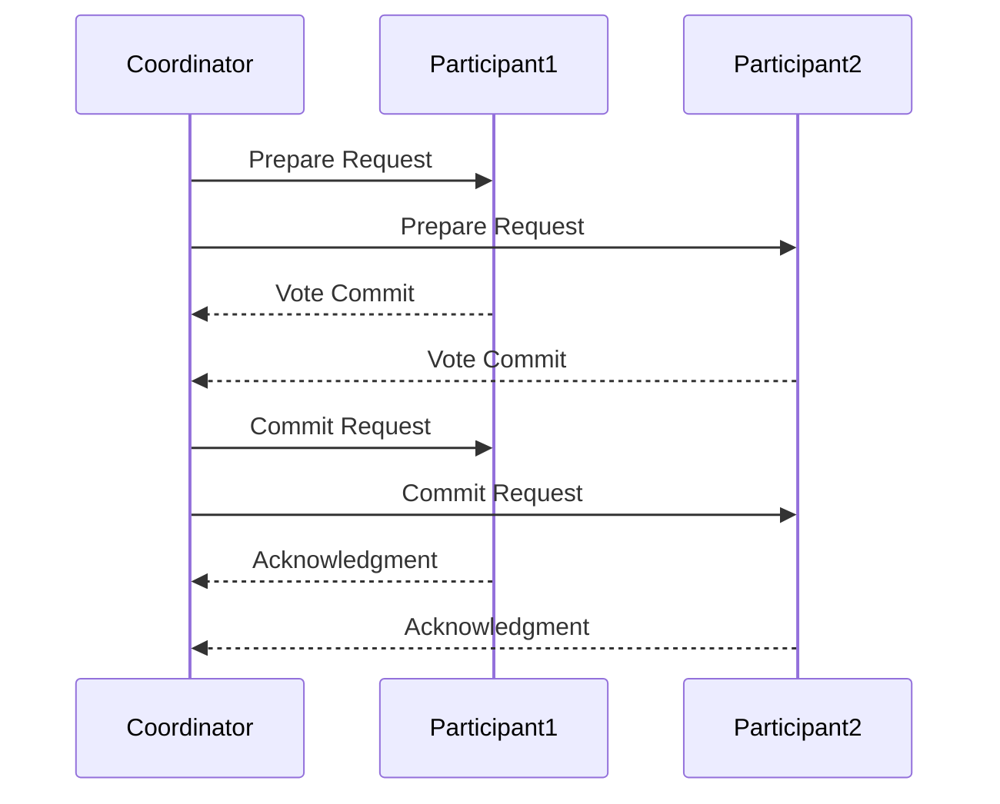

## 17.5 Transaction Management in Distributed Systems

In the realm of distributed systems, transaction management is a critical component that ensures data integrity and consistency across multiple systems. This section delves into the complexities of managing transactions in distributed environments using Haxe, a language renowned for its cross-platform capabilities. We will explore key concepts such as the Two-Phase Commit Protocol and Compensation Transactions, and provide practical examples to illustrate their implementation.

### Understanding Transaction Management

**Transaction Management** in distributed systems involves coordinating operations that span across multiple services or databases to ensure that they either complete successfully or are rolled back entirely. This is crucial in maintaining data consistency and integrity, especially in systems where operations are interdependent.

#### Key Concepts

- **Atomicity:** Ensures that all parts of a transaction are completed successfully. If any part fails, the entire transaction is rolled back.
- **Consistency:** Guarantees that a transaction brings the system from one valid state to another.
- **Isolation:** Ensures that transactions are executed independently without interference.
- **Durability:** Guarantees that once a transaction is committed, it remains so, even in the event of a system failure.

### Implementing Transaction Management in Haxe

Haxe's versatility and cross-platform nature make it an excellent choice for implementing transaction management in distributed systems. Let's explore two primary strategies: the Two-Phase Commit Protocol and Compensation Transactions.

#### Two-Phase Commit Protocol

The **Two-Phase Commit Protocol (2PC)** is a distributed algorithm that coordinates all the processes involved in a distributed transaction to ensure that they either all commit or all abort. It involves two phases: the prepare phase and the commit phase.

**Phase 1: Prepare**

1. **Coordinator sends a prepare request** to all participants.
2. **Participants execute the transaction** and prepare to commit, but do not make changes permanent.
3. **Participants respond** with a vote: commit or abort.

**Phase 2: Commit**

1. If all participants vote to commit, the coordinator sends a commit request.
2. If any participant votes to abort, the coordinator sends an abort request.
3. Participants commit or abort the transaction based on the coordinator's decision.

```haxe
class TwoPhaseCommit {
    var participants: Array<Participant>;

    public function new(participants: Array<Participant>) {
        this.participants = participants;
    }

    public function executeTransaction() {
        if (preparePhase()) {
            commitPhase();
        } else {
            abortPhase();
        }
    }

    private function preparePhase(): Bool {
        for (participant in participants) {
            if (!participant.prepare()) {
                return false;
            }
        }
        return true;
    }

    private function commitPhase() {
        for (participant in participants) {
            participant.commit();
        }
    }

    private function abortPhase() {
        for (participant in participants) {
            participant.abort();
        }
    }
}

class Participant {
    public function prepare(): Bool {
        // Prepare transaction logic
        return true; // or false if preparation fails
    }

    public function commit() {
        // Commit transaction logic
    }

    public function abort() {
        // Abort transaction logic
    }
}
```

**Try It Yourself:** Modify the `prepare` method to simulate a failure in one of the participants and observe how the transaction is aborted.

#### Compensation Transactions

**Compensation Transactions** are used when it's not feasible to lock resources for the duration of a transaction, or when a transaction spans multiple systems that do not support distributed transactions. Instead of rolling back, a compensating action is performed to undo the effects of a completed transaction.

**Example Use Case:** In a travel booking system, if a hotel reservation fails after a flight booking has been confirmed, a compensation transaction would cancel the flight booking.

```haxe
class CompensationTransaction {
    var actions: Array<Action>;

    public function new(actions: Array<Action>) {
        this.actions = actions;
    }

    public function execute() {
        for (action in actions) {
            if (!action.perform()) {
                compensate();
                break;
            }
        }
    }

    private function compensate() {
        for (action in actions) {
            action.compensate();
        }
    }
}

class Action {
    public function perform(): Bool {
        // Perform action logic
        return true; // or false if action fails
    }

    public function compensate() {
        // Compensate action logic
    }
}
```

**Try It Yourself:** Implement a scenario where one of the actions fails and observe how the compensation logic is triggered.

### Use Cases and Examples

Transaction management is pivotal in various domains, particularly in financial applications and order processing systems.

#### Financial Applications

In financial systems, transactions often involve multiple steps, such as debiting one account and crediting another. Ensuring atomicity and consistency is crucial to prevent issues like double spending or data corruption.

**Example:** Handling a bank transfer across different banking systems.

```haxe
class BankTransfer {
    var sourceAccount: Account;
    var destinationAccount: Account;
    var amount: Float;

    public function new(source: Account, destination: Account, amount: Float) {
        this.sourceAccount = source;
        this.destinationAccount = destination;
        this.amount = amount;
    }

    public function execute() {
        if (sourceAccount.debit(amount)) {
            if (!destinationAccount.credit(amount)) {
                sourceAccount.credit(amount); // Compensate
            }
        }
    }
}

class Account {
    var balance: Float;

    public function new(initialBalance: Float) {
        this.balance = initialBalance;
    }

    public function debit(amount: Float): Bool {
        if (balance >= amount) {
            balance -= amount;
            return true;
        }
        return false;
    }

    public function credit(amount: Float): Bool {
        balance += amount;
        return true;
    }
}
```

**Try It Yourself:** Simulate a failure in the `credit` method and observe how the compensation logic is applied.

#### Order Processing Systems

In e-commerce, order processing involves multiple steps, such as inventory check, payment processing, and shipping. Each step may involve different systems, making transaction management essential.

**Example:** Managing a multi-step order fulfillment process.

```haxe
class OrderProcessor {
    var steps: Array<OrderStep>;

    public function new(steps: Array<OrderStep>) {
        this.steps = steps;
    }

    public function processOrder() {
        for (step in steps) {
            if (!step.execute()) {
                rollback();
                break;
            }
        }
    }

    private function rollback() {
        for (step in steps) {
            step.rollback();
        }
    }
}

class OrderStep {
    public function execute(): Bool {
        // Execute step logic
        return true; // or false if step fails
    }

    public function rollback() {
        // Rollback step logic
    }
}
```

**Try It Yourself:** Implement a scenario where one of the steps fails and observe how the rollback logic is triggered.

### Visualizing Transaction Management

To better understand the flow of transaction management in distributed systems, let's visualize the Two-Phase Commit Protocol using a sequence diagram.



**Diagram Description:** This sequence diagram illustrates the Two-Phase Commit Protocol, where the coordinator sends prepare requests to participants, collects their votes, and then sends commit requests based on the votes.

### References and Further Reading

- [Distributed Systems: Principles and Paradigms](https://www.amazon.com/Distributed-Systems-Principles-Andrew-Tanenbaum/dp/0132392273)
- [Haxe Documentation](https://haxe.org/documentation/)
- [Two-Phase Commit Protocol](https://en.wikipedia.org/wiki/Two-phase_commit_protocol)

### Knowledge Check

- **What is the primary goal of transaction management in distributed systems?**
- **Explain the Two-Phase Commit Protocol and its phases.**
- **How do Compensation Transactions differ from traditional rollback mechanisms?**
- **Provide an example of a use case where transaction management is critical.**

### Embrace the Journey

Remember, mastering transaction management in distributed systems is a journey. As you progress, you'll encounter more complex scenarios and challenges. Keep experimenting, stay curious, and enjoy the journey!

## Quiz Time!



### What is the primary goal of transaction management in distributed systems?

- [x] Ensuring data integrity and consistency
- [ ] Improving system performance
- [ ] Reducing network latency
- [ ] Enhancing user interface design

> **Explanation:** The primary goal of transaction management in distributed systems is to ensure data integrity and consistency across multiple systems.

### Which protocol is commonly used for coordinating transactions in distributed systems?

- [x] Two-Phase Commit Protocol
- [ ] HTTP Protocol
- [ ] FTP Protocol
- [ ] SMTP Protocol

> **Explanation:** The Two-Phase Commit Protocol is commonly used for coordinating transactions in distributed systems to ensure atomicity and consistency.

### What is a key feature of Compensation Transactions?

- [x] They perform compensating actions to undo completed transactions
- [ ] They lock resources for the duration of a transaction
- [ ] They increase transaction speed
- [ ] They are used only in financial systems

> **Explanation:** Compensation Transactions perform compensating actions to undo the effects of completed transactions when traditional rollback is not feasible.

### In the Two-Phase Commit Protocol, what happens if any participant votes to abort?

- [x] The coordinator sends an abort request to all participants
- [ ] The transaction is committed
- [ ] The transaction is ignored
- [ ] The transaction is retried

> **Explanation:** If any participant votes to abort, the coordinator sends an abort request to all participants to ensure the transaction is not committed.

### Which of the following is an example of a use case for transaction management?

- [x] Financial applications handling transfers
- [ ] Image processing
- [ ] Video streaming
- [ ] Text editing

> **Explanation:** Financial applications handling transfers across systems are a common use case for transaction management to ensure data integrity.

### What is the first phase in the Two-Phase Commit Protocol?

- [x] Prepare Phase
- [ ] Commit Phase
- [ ] Abort Phase
- [ ] Execution Phase

> **Explanation:** The first phase in the Two-Phase Commit Protocol is the Prepare Phase, where participants prepare to commit the transaction.

### What is the role of the coordinator in the Two-Phase Commit Protocol?

- [x] To coordinate the transaction and make the final commit or abort decision
- [ ] To execute all transaction steps
- [ ] To handle user authentication
- [ ] To manage network connections

> **Explanation:** The coordinator's role is to coordinate the transaction by collecting votes from participants and making the final commit or abort decision.

### How does Haxe facilitate transaction management in distributed systems?

- [x] By providing cross-platform capabilities and versatile language features
- [ ] By offering built-in transaction management libraries
- [ ] By simplifying user interface design
- [ ] By enhancing graphics rendering

> **Explanation:** Haxe facilitates transaction management in distributed systems through its cross-platform capabilities and versatile language features, allowing developers to implement custom solutions.

### What is a common challenge in transaction management for distributed systems?

- [x] Ensuring atomicity and consistency across multiple systems
- [ ] Designing user-friendly interfaces
- [ ] Reducing code complexity
- [ ] Enhancing visual effects

> **Explanation:** A common challenge in transaction management for distributed systems is ensuring atomicity and consistency across multiple systems, which requires careful coordination and handling of transactions.

### True or False: Compensation Transactions are only used in financial systems.

- [ ] True
- [x] False

> **Explanation:** False. Compensation Transactions can be used in various systems where traditional rollback is not feasible, not just in financial systems.


