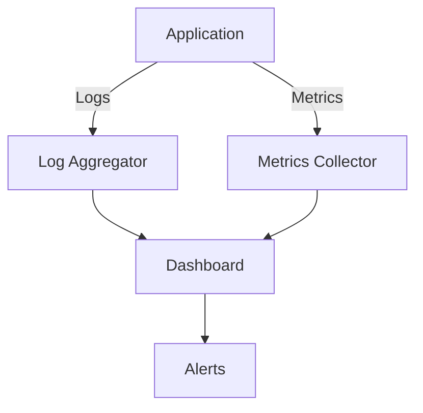

## 17.6 Logging, Monitoring, and Observability

In the realm of software engineering, particularly in cross-platform development with Haxe, ensuring the reliability and performance of applications is paramount. This is where logging, monitoring, and observability come into play. These practices are essential for tracking application behavior, diagnosing issues, and maintaining system health. In this section, we will delve into the concepts of logging, monitoring, and observability, explore how to implement them in Haxe, and discuss best practices and real-world use cases.

### Understanding Logging, Monitoring, and Observability

**Logging** is the process of recording information about an application's execution. This can include error messages, user actions, system events, and more. Logs are crucial for debugging and understanding the flow of an application.

**Monitoring** involves tracking the performance and health of an application in real-time. This can include metrics such as CPU usage, memory consumption, response times, and error rates. Monitoring systems often provide dashboards and alerting mechanisms to notify developers of potential issues.

**Observability** is a broader concept that encompasses both logging and monitoring. It refers to the ability to infer the internal state of a system based on its external outputs. Observability is achieved by collecting and analyzing logs, metrics, and traces to gain insights into system behavior.

### Implementing Logging in Haxe

#### Logging Frameworks

To implement logging in Haxe, you can use existing logging libraries or develop custom solutions tailored to your needs. Some popular logging frameworks compatible with Haxe include:

- **Log4Haxe**: A port of the popular Log4j library, providing a flexible and powerful logging system.
- **HaxeLog**: A simple and lightweight logging library designed specifically for Haxe applications.

Here's a basic example of implementing logging using a hypothetical Haxe logging library:

```haxe
import haxelog.Logger;
import haxelog.LogLevel;

class Main {
    static var logger:Logger = new Logger();

    static function main() {
        logger.setLevel(LogLevel.INFO);

        logger.info("Application started");
        try {
            // Simulate some processing
            var result = processData();
            logger.debug("Processing result: " + result);
        } catch (e:Dynamic) {
            logger.error("An error occurred: " + e);
        }
    }

    static function processData():Int {
        // Simulate a process that could throw an error
        if (Math.random() > 0.5) {
            throw "Random error";
        }
        return 42;
    }
}
```

In this example, we define a `Logger` instance and set its logging level to `INFO`. We then log messages at different levels (`info`, `debug`, `error`) to capture various events in the application.

#### Structured Logging

Structured logging involves formatting log messages in a way that makes them easy to parse and analyze. JSON is a common format for structured logs, as it allows for rich data representation.

```haxe
import haxelog.Logger;
import haxelog.LogLevel;
import haxe.Json;

class Main {
    static var logger:Logger = new Logger();

    static function main() {
        logger.setLevel(LogLevel.INFO);

        var logData = {
            timestamp: Date.now().toString(),
            level: "INFO",
            message: "Application started"
        };
        logger.info(Json.stringify(logData));
    }
}
```

By using structured logging, you can easily integrate with log analysis tools and services that can parse JSON data.

### Monitoring and Metrics Collection

Monitoring involves collecting metrics that provide insights into the performance and health of your application. In Haxe, you can instrument your code to collect metrics such as response times, error rates, and resource usage.

#### Instrumenting Code for Metrics

Instrumentation involves adding code to your application to collect metrics. This can be done manually or by using libraries that provide instrumentation capabilities.

```haxe
class Metrics {
    public static var requestCount:Int = 0;
    public static var errorCount:Int = 0;

    public static function recordRequest(success:Bool):Void {
        requestCount++;
        if (!success) {
            errorCount++;
        }
    }

    public static function getMetrics():String {
        return "Requests: " + requestCount + ", Errors: " + errorCount;
    }
}

class Main {
    static function main() {
        for (i in 0...10) {
            var success = Math.random() > 0.2;
            Metrics.recordRequest(success);
        }
        trace(Metrics.getMetrics());
    }
}
```

In this example, we define a `Metrics` class to track the number of requests and errors. We then simulate requests and record metrics accordingly.

### Best Practices for Logging, Monitoring, and Observability

#### Centralized Logging

Centralized logging involves aggregating logs from different services and components into a single location for unified analysis. This can be achieved using log aggregation tools and services such as ELK Stack (Elasticsearch, Logstash, Kibana) or cloud-based solutions like AWS CloudWatch.

#### Real-Time Monitoring and Alerting

Real-time monitoring involves setting up dashboards that display key performance indicators and system health metrics. Tools like Grafana and Prometheus can be used to create visualizations and set up alerting systems that notify developers of anomalies or threshold breaches.

#### Observability Best Practices

- **Correlate Logs and Metrics**: Ensure that logs and metrics can be correlated to provide a comprehensive view of system behavior.
- **Use Tracing**: Implement distributed tracing to track requests across different services and components.
- **Automate Alerts**: Set up automated alerts for critical metrics and events to ensure timely response to issues.

### Use Cases and Examples

#### Real-Time Monitoring Dashboards

Real-time monitoring dashboards provide a visual representation of system health and performance metrics. These dashboards can display information such as CPU usage, memory consumption, request rates, and error rates.



*Diagram: Real-Time Monitoring Architecture*

#### Alerting Systems

Alerting systems are designed to notify developers of potential issues based on predefined thresholds or anomalies. These systems can send notifications via email, SMS, or messaging platforms like Slack.

### Try It Yourself

To get hands-on experience with logging, monitoring, and observability in Haxe, try modifying the code examples provided. Experiment with different logging levels, structured logging formats, and metrics collection techniques. Set up a simple monitoring dashboard using tools like Grafana to visualize your application's performance metrics.

### References and Further Reading

- [Log4j Documentation](https://logging.apache.org/log4j/2.x/)
- [Grafana Documentation](https://grafana.com/docs/)
- [Prometheus Documentation](https://prometheus.io/docs/)
- [ELK Stack Overview](https://www.elastic.co/what-is/elk-stack)

### Knowledge Check

To reinforce your understanding of logging, monitoring, and observability in Haxe, consider the following questions and exercises.

## Quiz Time!



### What is the primary purpose of logging in software applications?

- [x] To record information about an application's execution
- [ ] To visualize system performance metrics
- [ ] To automate deployment processes
- [ ] To manage application dependencies

> **Explanation:** Logging is primarily used to record information about an application's execution, which is crucial for debugging and understanding the flow of an application.

### Which format is commonly used for structured logging?

- [ ] XML
- [x] JSON
- [ ] CSV
- [ ] YAML

> **Explanation:** JSON is a common format for structured logging because it allows for rich data representation and is easily parsed by log analysis tools.

### What is the role of a monitoring dashboard?

- [ ] To deploy applications
- [x] To display key performance indicators and system health metrics
- [ ] To manage user authentication
- [ ] To compile source code

> **Explanation:** Monitoring dashboards are used to display key performance indicators and system health metrics, providing a visual representation of system performance.

### What is observability in the context of software systems?

- [ ] The process of compiling code
- [x] The ability to infer the internal state of a system based on its external outputs
- [ ] The act of deploying applications to production
- [ ] The method of encrypting data

> **Explanation:** Observability refers to the ability to infer the internal state of a system based on its external outputs, achieved through the collection and analysis of logs, metrics, and traces.

### Which tool is commonly used for log aggregation?

- [ ] Docker
- [ ] Kubernetes
- [x] ELK Stack
- [ ] Jenkins

> **Explanation:** The ELK Stack (Elasticsearch, Logstash, Kibana) is commonly used for log aggregation, allowing for centralized logging and analysis.

### What is the benefit of centralized logging?

- [x] Unified analysis of logs from different services
- [ ] Faster code compilation
- [ ] Improved user interface design
- [ ] Enhanced data encryption

> **Explanation:** Centralized logging allows for the unified analysis of logs from different services, making it easier to diagnose issues and understand system behavior.

### How can you correlate logs and metrics for better observability?

- [ ] By using different logging formats
- [x] By ensuring logs and metrics can be correlated
- [ ] By deploying applications in different environments
- [ ] By encrypting all log data

> **Explanation:** Correlating logs and metrics provides a comprehensive view of system behavior, enhancing observability.

### What is the purpose of alerting systems in monitoring?

- [ ] To compile source code
- [ ] To manage user sessions
- [x] To notify developers of potential issues
- [ ] To encrypt sensitive data

> **Explanation:** Alerting systems are designed to notify developers of potential issues based on predefined thresholds or anomalies, ensuring timely response to issues.

### Which of the following is a best practice for observability?

- [x] Use tracing to track requests across services
- [ ] Deploy applications without testing
- [ ] Ignore error logs
- [ ] Disable all alerts

> **Explanation:** Using tracing to track requests across services is a best practice for observability, as it provides insights into request flows and potential bottlenecks.

### True or False: Observability only involves collecting logs.

- [ ] True
- [x] False

> **Explanation:** Observability involves more than just collecting logs; it also includes collecting metrics and traces to gain insights into system behavior.



Remember, mastering logging, monitoring, and observability is crucial for ensuring the reliability and performance of your Haxe applications. Keep experimenting, stay curious, and enjoy the journey!
