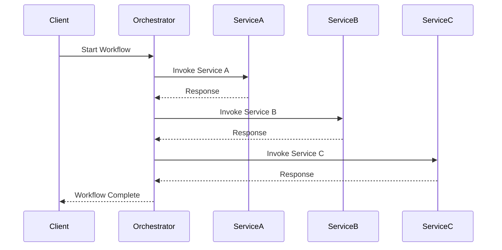
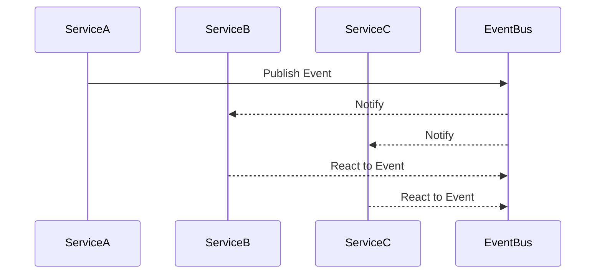

## 17.7 Orchestration and Choreography

In the realm of distributed systems, managing the coordination and sequencing of services is crucial for ensuring seamless operations. This section delves into the concepts of orchestration and choreography, two pivotal patterns in enterprise integration, and how they can be effectively implemented using Haxe. By understanding these patterns, you can design systems that are both robust and flexible, capable of adapting to the dynamic nature of modern software environments.

### Understanding Orchestration and Choreography

**Orchestration** and **choreography** are two approaches to managing interactions between services in a distributed system. While they share the common goal of coordinating service interactions, they differ in their methodologies and applications.

- **Orchestration** involves a central controller, often referred to as an orchestration engine, that manages and directs the interactions between services. It is akin to a conductor leading an orchestra, where each service is a musician playing its part according to the conductor's instructions.

- **Choreography**, on the other hand, is a decentralized approach where each service is aware of its role and responsibilities. Services interact with each other based on predefined rules and events, much like dancers in a ballet who perform their routines independently yet in harmony with one another.

### Key Differences

| Aspect          | Orchestration                             | Choreography                               |
|-----------------|-------------------------------------------|--------------------------------------------|
| Control         | Centralized                               | Decentralized                              |
| Complexity      | Managed by a central entity               | Distributed across services                |
| Flexibility     | Easier to change centrally                | Requires changes in multiple services      |
| Scalability     | May become a bottleneck                   | Scales well with distributed architecture  |
| Fault Tolerance | Central point of failure                  | More resilient due to distributed nature   |

### Implementing Orchestration in Haxe

To implement orchestration in Haxe, you can leverage orchestration engines such as Apache Camel or integrate with other workflow management tools. These engines provide the necessary infrastructure to define, execute, and monitor workflows.

#### Example: Using Apache Camel with Haxe

Apache Camel is a versatile integration framework that can be used to implement orchestration. It allows you to define routes and workflows using a domain-specific language (DSL).

```haxe
// Define a simple orchestration workflow using Apache Camel
class OrchestrationExample {
    public static function main() {
        // Create a Camel context
        var context = new CamelContext();

        // Define a route
        context.addRoute(new RouteBuilder() {
            override public function configure() {
                from("direct:start")
                    .to("serviceA")
                    .to("serviceB")
                    .to("serviceC");
            }
        });

        // Start the context
        context.start();

        // Send a message to start the orchestration
        context.createProducerTemplate().sendBody("direct:start", "Start Orchestration");
    }
}
```

In this example, we define a simple orchestration workflow where a message is sent through a series of services (serviceA, serviceB, and serviceC). The orchestration engine manages the sequence and ensures that each service is invoked in the correct order.

### Implementing Choreography in Haxe

Choreography relies on services reacting to events independently. This pattern is well-suited for event-driven architectures where services publish and subscribe to events.

#### Example: Event-Driven Choreography

Consider a scenario where multiple services need to react to a user registration event. Each service performs its task independently, such as sending a welcome email, updating a CRM system, or logging the event.

```haxe
// Define a simple event-driven choreography
class ChoreographyExample {
    public static function main() {
        // Event bus for publishing and subscribing to events
        var eventBus = new EventBus();

        // Define services that react to the user registration event
        eventBus.subscribe("UserRegistered", function(event) {
            trace("Service A: Sending welcome email to " + event.data.email);
        });

        eventBus.subscribe("UserRegistered", function(event) {
            trace("Service B: Updating CRM with user " + event.data.name);
        });

        eventBus.subscribe("UserRegistered", function(event) {
            trace("Service C: Logging registration event for user " + event.data.id);
        });

        // Publish a user registration event
        eventBus.publish("UserRegistered", {id: 1, name: "John Doe", email: "john.doe@example.com"});
    }
}
```

In this example, we use an event bus to publish a `UserRegistered` event. Each service subscribes to this event and performs its task independently, demonstrating the decentralized nature of choreography.

### Use Cases and Examples

#### Business Process Management

Orchestration is often used in business process management (BPM) to automate complex workflows. By defining the sequence of tasks and managing their execution, orchestration ensures that business processes are carried out efficiently and consistently.

**Example:** Automating an order processing workflow where tasks such as order validation, payment processing, and shipment are orchestrated by a central controller.

#### Event-Driven Systems

Choreography is ideal for event-driven systems where services need to respond autonomously to events. This pattern enables services to be loosely coupled and highly scalable.

**Example:** A microservices architecture where services publish and subscribe to events, allowing them to react independently to changes in the system.

### Design Considerations

When choosing between orchestration and choreography, consider the following factors:

- **Complexity:** Orchestration is suitable for complex workflows that require centralized control, while choreography is better for simpler, event-driven interactions.
- **Scalability:** Choreography scales well with distributed architectures, whereas orchestration may become a bottleneck if not managed properly.
- **Fault Tolerance:** Choreography offers greater resilience due to its decentralized nature, reducing the risk of a single point of failure.
- **Flexibility:** Orchestration allows for easier changes to workflows, as modifications can be made centrally. Choreography requires changes to be propagated across multiple services.

### Visualizing Orchestration and Choreography

To better understand the flow of orchestration and choreography, let's visualize these patterns using Mermaid.js diagrams.

#### Orchestration Diagram



#### Choreography Diagram



### Try It Yourself

Experiment with the provided code examples by modifying the services involved or the events being published. Try adding new services or events to see how the orchestration and choreography patterns adapt to changes.

### Further Reading

For more information on orchestration and choreography, consider exploring the following resources:

- [Apache Camel Documentation](https://camel.apache.org/manual/latest/index.html)
- [Enterprise Integration Patterns](https://www.enterpriseintegrationpatterns.com/)
- [Event-Driven Architecture](https://martinfowler.com/articles/201701-event-driven.html)

### Knowledge Check

To reinforce your understanding of orchestration and choreography, consider the following questions and exercises:

- What are the key differences between orchestration and choreography?
- How would you implement a fault-tolerant system using choreography?
- Design a simple workflow using orchestration for a business process in your domain.

### Embrace the Journey

Remember, mastering orchestration and choreography is just the beginning. As you continue to explore these patterns, you'll gain deeper insights into designing distributed systems that are both efficient and resilient. Keep experimenting, stay curious, and enjoy the journey!

## Quiz Time!



### What is the primary difference between orchestration and choreography?

- [x] Orchestration uses a central controller, while choreography is decentralized.
- [ ] Orchestration is decentralized, while choreography uses a central controller.
- [ ] Both use a central controller.
- [ ] Both are decentralized.

> **Explanation:** Orchestration involves a central controller managing interactions, whereas choreography allows services to interact independently.

### Which pattern is more suitable for event-driven systems?

- [ ] Orchestration
- [x] Choreography
- [ ] Both are equally suitable
- [ ] Neither is suitable

> **Explanation:** Choreography is ideal for event-driven systems as it allows services to respond autonomously to events.

### What is a potential drawback of orchestration?

- [x] It can become a bottleneck.
- [ ] It is too decentralized.
- [ ] It lacks control.
- [ ] It is difficult to implement.

> **Explanation:** Orchestration can become a bottleneck due to its centralized nature.

### Which pattern offers greater fault tolerance?

- [ ] Orchestration
- [x] Choreography
- [ ] Both offer the same level of fault tolerance
- [ ] Neither offers fault tolerance

> **Explanation:** Choreography offers greater fault tolerance due to its decentralized nature, reducing the risk of a single point of failure.

### In which scenario would you prefer orchestration over choreography?

- [x] When managing complex workflows
- [ ] In event-driven systems
- [ ] When services need to be highly autonomous
- [ ] In systems with no central control

> **Explanation:** Orchestration is preferred for managing complex workflows that require centralized control.

### What tool can be used in Haxe for orchestration?

- [x] Apache Camel
- [ ] Event Bus
- [ ] Haxe Compiler
- [ ] HaxeFlixel

> **Explanation:** Apache Camel is a versatile integration framework that can be used for orchestration in Haxe.

### How does choreography handle service interactions?

- [ ] Through a central controller
- [x] By allowing services to react to events independently
- [ ] By using a single service to manage all interactions
- [ ] By ignoring service interactions

> **Explanation:** Choreography allows services to react to events independently, without a central controller.

### What is a benefit of using choreography?

- [x] It scales well with distributed architectures.
- [ ] It requires a central controller.
- [ ] It is less flexible.
- [ ] It is more complex to implement.

> **Explanation:** Choreography scales well with distributed architectures due to its decentralized nature.

### Which pattern allows for easier changes to workflows?

- [x] Orchestration
- [ ] Choreography
- [ ] Both allow for easy changes
- [ ] Neither allows for easy changes

> **Explanation:** Orchestration allows for easier changes to workflows as modifications can be made centrally.

### True or False: Choreography is more resilient to failures than orchestration.

- [x] True
- [ ] False

> **Explanation:** Choreography is more resilient to failures due to its decentralized nature, reducing the risk of a single point of failure.



---
