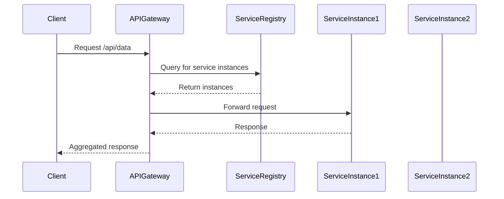

## 17.8 API Gateway and Service Discovery

In the realm of modern software architecture, particularly in microservices and distributed systems, the concepts of API Gateway and Service Discovery play pivotal roles. They are essential for managing communication, ensuring scalability, and maintaining the robustness of applications. In this section, we will delve into these concepts, explore their implementation in Haxe, and provide practical examples to illustrate their use.

### Understanding API Gateway

An API Gateway acts as a single entry point for all client requests to a system's backend services. It is responsible for routing requests, enforcing security policies, managing traffic, and aggregating responses. This centralization simplifies client interactions and abstracts the complexity of the underlying services.

#### Key Functions of an API Gateway

1. **Request Routing:** Directs incoming requests to the appropriate service based on the request path, headers, or other criteria.
2. **Authentication and Authorization:** Ensures that only authenticated and authorized requests reach the backend services.
3. **Rate Limiting and Throttling:** Controls the number of requests a client can make in a given time period to prevent abuse.
4. **Load Balancing:** Distributes incoming requests across multiple instances of a service to ensure even load distribution.
5. **Response Aggregation:** Combines responses from multiple services into a single response for the client.

### Implementing API Gateway in Haxe

Haxe, with its cross-platform capabilities, can be used to develop or integrate with existing API Gateway solutions. While Haxe does not have a built-in API Gateway, it can interface with popular gateways like Kong, NGINX, or AWS API Gateway through its ability to compile to multiple languages.

#### Example: Integrating with an API Gateway

Let's consider a scenario where we need to integrate a Haxe application with an existing API Gateway. We will use Haxe's ability to compile to JavaScript to interact with a Node.js-based API Gateway.

```haxe
// Import necessary libraries
import js.node.Http;

// Define a simple Haxe service
class MyService {
    public static function main() {
        var server = Http.createServer((req, res) -> {
            // Handle incoming requests
            if (req.url == "/api/data") {
                res.writeHead(200, {'Content-Type': 'application/json'});
                res.end(JSON.stringify({message: "Hello from Haxe!"}));
            } else {
                res.writeHead(404, {'Content-Type': 'text/plain'});
                res.end("Not Found");
            }
        });

        // Listen on port 3000
        server.listen(3000, () -> {
            trace("Haxe service running on http://localhost:3000");
        });
    }
}
```

In this example, we create a simple HTTP server using Haxe compiled to JavaScript. This server can be registered with an API Gateway, which will handle routing and other gateway functions.

### Service Discovery

Service Discovery is the process of automatically detecting services in a network. In a microservices architecture, where services are dynamic and can scale up or down, service discovery is crucial for maintaining connectivity and communication between services.

#### Types of Service Discovery

1. **Client-Side Discovery:** The client is responsible for determining the location of service instances. It queries a service registry to obtain the service's address.
2. **Server-Side Discovery:** The client sends requests to a load balancer or API Gateway, which queries the service registry and routes the request to an appropriate service instance.

### Implementing Service Discovery in Haxe

Haxe can be used to implement service discovery by interfacing with service registries like Consul, etcd, or Eureka. These registries maintain a list of available services and their instances.

#### Example: Using Consul for Service Discovery

Let's explore how to register and discover services using Consul in a Haxe application.

```haxe
// Import necessary libraries
import haxe.Http;

// Define a function to register a service with Consul
function registerService(serviceName: String, servicePort: Int) {
    var url = "http://localhost:8500/v1/agent/service/register";
    var data = {
        "Name": serviceName,
        "Port": servicePort
    };

    var http = new Http(url);
    http.setHeader("Content-Type", "application/json");
    http.request(true, JSON.stringify(data));
}

// Define a function to discover services from Consul
function discoverService(serviceName: String): Void {
    var url = "http://localhost:8500/v1/catalog/service/" + serviceName;
    var http = new Http(url);
    http.onData = function(data) {
        var services = JSON.parse(data);
        trace("Discovered services: " + services);
    };
    http.request();
}

// Register and discover a service
registerService("my-haxe-service", 3000);
discoverService("my-haxe-service");
```

In this example, we use Haxe's HTTP client to interact with Consul's API. We register a service with Consul and then query Consul to discover available instances of the service.

### Use Cases and Examples

#### Microservices Architecture

In a microservices architecture, API Gateway and Service Discovery are indispensable. They manage the complexity of service interactions and ensure that services can scale independently.

- **API Gateway:** Acts as a facade for microservices, providing a unified API for clients.
- **Service Discovery:** Ensures that services can find and communicate with each other dynamically.

#### Load Balancing

Load balancing is a critical component of distributed systems. It ensures that incoming requests are evenly distributed across service instances, preventing any single instance from becoming a bottleneck.

- **API Gateway:** Can perform load balancing by routing requests to different service instances.
- **Service Discovery:** Provides the necessary information about available service instances for effective load balancing.

### Visualizing API Gateway and Service Discovery

To better understand the flow of requests and the role of API Gateway and Service Discovery, let's visualize the architecture using Mermaid.js.



This diagram illustrates the interaction between a client, an API Gateway, a service registry, and service instances. The API Gateway queries the service registry to find available instances and forwards the client's request to one of them.

### Design Considerations

When implementing API Gateway and Service Discovery, consider the following:

- **Scalability:** Ensure that the API Gateway can handle the expected load and scale as needed.
- **Security:** Implement robust authentication and authorization mechanisms at the gateway level.
- **Fault Tolerance:** Design the system to handle failures gracefully, with fallback mechanisms in place.
- **Latency:** Minimize latency by optimizing the routing and discovery processes.

### Differences and Similarities

API Gateway and Service Discovery are often used together but serve different purposes:

- **API Gateway:** Focuses on managing client requests and interactions with backend services.
- **Service Discovery:** Focuses on locating and connecting services within the network.

Both are essential for building scalable and resilient distributed systems.

### Try It Yourself

To deepen your understanding, try modifying the code examples provided:

- **Experiment with different service registries** like etcd or Eureka.
- **Implement additional API Gateway features** such as caching or logging.
- **Simulate a microservices environment** by creating multiple Haxe services and managing them with an API Gateway and Service Discovery.

### References and Links

- [Consul Documentation](https://www.consul.io/docs)
- [NGINX API Gateway](https://www.nginx.com/products/nginx-api-gateway/)
- [AWS API Gateway](https://aws.amazon.com/api-gateway/)
- [Haxe HTTP Library](https://api.haxe.org/haxe/Http.html)

### Knowledge Check

- **What are the main functions of an API Gateway?**
- **How does Service Discovery facilitate communication in a microservices architecture?**
- **What are the differences between client-side and server-side service discovery?**

### Embrace the Journey

Remember, mastering API Gateway and Service Discovery is a journey. As you explore these concepts, you'll gain insights into building robust, scalable, and efficient distributed systems. Keep experimenting, stay curious, and enjoy the journey!

## Quiz Time!



### What is the primary role of an API Gateway?

- [x] To act as a single entry point for client requests
- [ ] To store data for backend services
- [ ] To compile Haxe code to JavaScript
- [ ] To manage database connections

> **Explanation:** An API Gateway acts as a single entry point for client requests, managing routing, security, and other functions.

### Which of the following is a function of Service Discovery?

- [x] Automatically detecting services in a network
- [ ] Compiling code to multiple languages
- [ ] Managing client-side caching
- [ ] Providing a user interface for services

> **Explanation:** Service Discovery is responsible for automatically detecting services in a network, facilitating communication between them.

### What is client-side service discovery?

- [x] The client determines the location of service instances
- [ ] The server determines the location of service instances
- [ ] The API Gateway determines the location of service instances
- [ ] The database determines the location of service instances

> **Explanation:** In client-side service discovery, the client queries a service registry to determine the location of service instances.

### How does an API Gateway contribute to security?

- [x] By enforcing authentication and authorization
- [ ] By storing user passwords
- [ ] By compiling code securely
- [ ] By encrypting all data

> **Explanation:** An API Gateway contributes to security by enforcing authentication and authorization policies for incoming requests.

### What is a key benefit of using Service Discovery in microservices?

- [x] Dynamic service location and connectivity
- [ ] Static service configuration
- [ ] Manual service updates
- [ ] Centralized data storage

> **Explanation:** Service Discovery allows for dynamic service location and connectivity, which is essential in a microservices architecture.

### Which protocol is commonly used for Service Discovery?

- [x] Consul
- [ ] HTTP
- [ ] FTP
- [ ] SMTP

> **Explanation:** Consul is a commonly used protocol for Service Discovery, providing a service registry and health checking.

### What is the role of load balancing in an API Gateway?

- [x] Distributing requests across multiple service instances
- [ ] Storing client data
- [ ] Compiling Haxe code
- [ ] Managing database transactions

> **Explanation:** Load balancing in an API Gateway involves distributing incoming requests across multiple service instances to ensure even load distribution.

### What is the difference between API Gateway and Service Discovery?

- [x] API Gateway manages client requests; Service Discovery locates services
- [ ] API Gateway stores data; Service Discovery compiles code
- [ ] API Gateway encrypts data; Service Discovery manages databases
- [ ] API Gateway provides UI; Service Discovery handles caching

> **Explanation:** API Gateway manages client requests and interactions, while Service Discovery focuses on locating and connecting services.

### What is a common use case for API Gateway?

- [x] Microservices architecture
- [ ] Data encryption
- [ ] User interface design
- [ ] Database management

> **Explanation:** A common use case for API Gateway is managing communication in a microservices architecture.

### True or False: Service Discovery is only used in monolithic architectures.

- [ ] True
- [x] False

> **Explanation:** False. Service Discovery is primarily used in microservices and distributed architectures to manage dynamic service locations.


