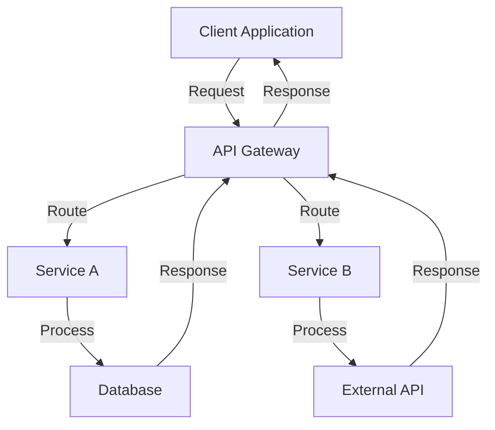

## 17.9 Best Practices for Enterprise Integration

In the realm of enterprise software development, integration is a critical component that ensures disparate systems can communicate and work together seamlessly. As organizations grow, they often accumulate a variety of software solutions, each serving specific needs. The challenge lies in integrating these systems to function as a cohesive unit. In this section, we will explore best practices for enterprise integration using Haxe, focusing on loose coupling, standardization, scalability, and avoiding common pitfalls.

### Understanding Enterprise Integration

Enterprise integration involves connecting different software applications and systems within an organization to enable data exchange and process automation. This integration is essential for achieving operational efficiency, improving data accuracy, and enhancing decision-making processes.

#### Key Concepts

- **Loose Coupling:** Minimize dependencies between systems to allow for flexibility and ease of maintenance.
- **Standardization:** Use common data formats and protocols to ensure compatibility and interoperability.
- **Scalability:** Design systems to handle increased loads and expand horizontally as needed.

### Best Practices for Enterprise Integration

#### Loose Coupling

Loose coupling is a design principle that reduces the interdependencies between systems, allowing them to operate independently. This approach enhances flexibility, making it easier to update or replace components without affecting the entire system.

- **Use Interfaces and Abstractions:** Define clear interfaces for communication between systems. This allows you to change the implementation without affecting other components.
- **Event-Driven Architecture:** Implement an event-driven architecture where systems communicate through events. This decouples the sender and receiver, allowing them to evolve independently.
- **Service-Oriented Architecture (SOA):** Adopt SOA principles to create reusable services that can be composed to build complex applications.

#### Standardization

Standardization involves using common data formats and protocols to ensure seamless communication between systems. This practice reduces complexity and enhances interoperability.

- **Adopt Industry Standards:** Use widely accepted standards such as REST, SOAP, and JSON for data exchange.
- **Define Data Contracts:** Establish clear data contracts that specify the structure and format of data exchanged between systems.
- **Use Middleware:** Implement middleware solutions to handle data transformation and protocol translation.

#### Scalability

Scalability is the ability of a system to handle increased loads by adding resources. Designing for scalability ensures that your integration solution can grow with your organization.

- **Horizontal Scaling:** Design systems to scale horizontally by adding more instances rather than increasing the capacity of a single instance.
- **Load Balancing:** Use load balancers to distribute traffic evenly across multiple servers.
- **Caching:** Implement caching strategies to reduce the load on backend systems and improve response times.

### Common Pitfalls to Avoid

#### Over-Engineering

Over-engineering occurs when a solution is more complex than necessary. This can lead to increased costs, longer development times, and difficulty in maintenance.

- **Keep It Simple:** Focus on solving the problem at hand without adding unnecessary features.
- **Iterative Development:** Use an iterative approach to development, allowing you to refine the solution based on feedback.

#### Security Oversights

Security is a critical aspect of enterprise integration. Failing to address security concerns can lead to data breaches and other vulnerabilities.

- **Implement Authentication and Authorization:** Ensure that only authorized users and systems can access your integration solution.
- **Encrypt Data:** Use encryption to protect data in transit and at rest.
- **Regular Security Audits:** Conduct regular security audits to identify and address vulnerabilities.

### Use Cases and Examples

#### Cross-Department Applications

In large organizations, different departments often use specialized software solutions. Integrating these applications allows for seamless data exchange and process automation.

- **Example:** An HR system integrated with a payroll system to automatically update employee records and process payroll.

#### Vendor Integration

Organizations often need to integrate with external vendors or partners. This requires a robust integration solution that can handle different data formats and protocols.

- **Example:** Integrating with a third-party logistics provider to track shipments and update inventory levels in real-time.

### Code Examples

Let's explore some code examples to illustrate these concepts in Haxe.

#### Loose Coupling with Interfaces

```haxe
// Define an interface for a payment processor
interface PaymentProcessor {
    function processPayment(amount: Float): Bool;
}

// Implement the interface for a specific payment gateway
class PayPalProcessor implements PaymentProcessor {
    public function processPayment(amount: Float): Bool {
        // Logic to process payment with PayPal
        trace("Processing payment with PayPal: $" + amount);
        return true;
    }
}

// Use the interface in your application
class PaymentService {
    private var processor: PaymentProcessor;

    public function new(processor: PaymentProcessor) {
        this.processor = processor;
    }

    public function makePayment(amount: Float): Bool {
        return processor.processPayment(amount);
    }
}

// Example usage
class Main {
    static function main() {
        var paypal = new PayPalProcessor();
        var paymentService = new PaymentService(paypal);
        paymentService.makePayment(100.0);
    }
}
```

#### Standardization with JSON

```haxe
import haxe.Json;

// Define a data structure
typedef Employee = {
    var id: Int;
    var name: String;
    var department: String;
}

// Serialize an object to JSON
var employee: Employee = { id: 1, name: "John Doe", department: "HR" };
var jsonString: String = Json.stringify(employee);
trace("Serialized JSON: " + jsonString);

// Deserialize JSON to an object
var json: String = '{"id":2,"name":"Jane Smith","department":"Finance"}';
var employeeObj: Employee = Json.parse(json);
trace("Deserialized Employee: " + employeeObj.name);
```

#### Scalability with Load Balancing

```haxe
// Example of a simple load balancer
class LoadBalancer {
    private var servers: Array<String>;
    private var currentIndex: Int;

    public function new(servers: Array<String>) {
        this.servers = servers;
        this.currentIndex = 0;
    }

    public function getNextServer(): String {
        var server = servers[currentIndex];
        currentIndex = (currentIndex + 1) % servers.length;
        return server;
    }
}

// Example usage
class Main {
    static function main() {
        var servers = ["Server1", "Server2", "Server3"];
        var loadBalancer = new LoadBalancer(servers);

        for (i in 0...10) {
            trace("Request " + i + " routed to: " + loadBalancer.getNextServer());
        }
    }
}
```

### Visualizing Enterprise Integration

To better understand the flow of data and interactions in an enterprise integration scenario, let's visualize a typical architecture using Mermaid.js.



**Diagram Description:** This flowchart represents a typical enterprise integration architecture where a client application communicates with an API gateway. The gateway routes requests to different services, which may interact with databases or external APIs. Responses are then sent back to the client.

### Try It Yourself

Experiment with the code examples provided. Try modifying the `PaymentProcessor` interface to add new methods or implement additional payment gateways. Explore different data formats by serializing and deserializing XML instead of JSON. Implement additional load balancing strategies, such as round-robin or least connections.

### References and Links

- [MDN Web Docs: REST](https://developer.mozilla.org/en-US/docs/Glossary/REST)
- [W3Schools: JSON](https://www.w3schools.com/js/js_json_intro.asp)
- [Haxe Manual: Interfaces](https://haxe.org/manual/types-interfaces.html)

### Knowledge Check

- What is the primary benefit of loose coupling in enterprise integration?
- How does standardization improve interoperability between systems?
- What are some common pitfalls to avoid in enterprise integration?

### Embrace the Journey

Remember, mastering enterprise integration is a journey. As you progress, you'll encounter new challenges and opportunities to refine your skills. Keep experimenting, stay curious, and enjoy the journey!

## Quiz Time!



### What is the primary benefit of loose coupling in enterprise integration?

- [x] Flexibility and ease of maintenance
- [ ] Increased complexity
- [ ] Faster data processing
- [ ] Reduced security risks

> **Explanation:** Loose coupling minimizes dependencies between systems, allowing for flexibility and ease of maintenance.

### Which of the following is a common data format used for standardization?

- [x] JSON
- [ ] XML
- [x] REST
- [ ] SOAP

> **Explanation:** JSON and XML are common data formats used for standardization, while REST and SOAP are protocols.

### What is a key consideration when designing for scalability?

- [x] Horizontal scaling
- [ ] Vertical scaling
- [ ] Single server architecture
- [ ] Manual load distribution

> **Explanation:** Horizontal scaling involves adding more instances to handle increased loads, which is a key consideration for scalability.

### What is a common pitfall in enterprise integration?

- [x] Over-engineering
- [ ] Under-engineering
- [ ] Simplification
- [ ] Standardization

> **Explanation:** Over-engineering can lead to unnecessary complexity and increased costs.

### Which practice enhances interoperability between systems?

- [x] Standardization
- [ ] Custom protocols
- [ ] Proprietary data formats
- [ ] Manual data entry

> **Explanation:** Standardization involves using common data formats and protocols, enhancing interoperability.

### What is a benefit of using an event-driven architecture?

- [x] Decoupling of sender and receiver
- [ ] Increased complexity
- [ ] Synchronous communication
- [ ] Manual event handling

> **Explanation:** An event-driven architecture decouples the sender and receiver, allowing them to evolve independently.

### What should be implemented to ensure only authorized users access the integration solution?

- [x] Authentication and Authorization
- [ ] Data encryption
- [ ] Load balancing
- [ ] Caching

> **Explanation:** Authentication and authorization ensure that only authorized users and systems can access the integration solution.

### What is a common use case for enterprise integration?

- [x] Cross-department applications
- [ ] Single-user applications
- [ ] Standalone systems
- [ ] Manual data processing

> **Explanation:** Cross-department applications often require integration to enable seamless data exchange and process automation.

### What is a key benefit of using middleware in enterprise integration?

- [x] Data transformation and protocol translation
- [ ] Increased complexity
- [ ] Manual data handling
- [ ] Reduced security

> **Explanation:** Middleware handles data transformation and protocol translation, simplifying integration.

### True or False: Over-engineering is a recommended practice in enterprise integration.

- [ ] True
- [x] False

> **Explanation:** Over-engineering is not recommended as it can lead to unnecessary complexity and increased costs.


