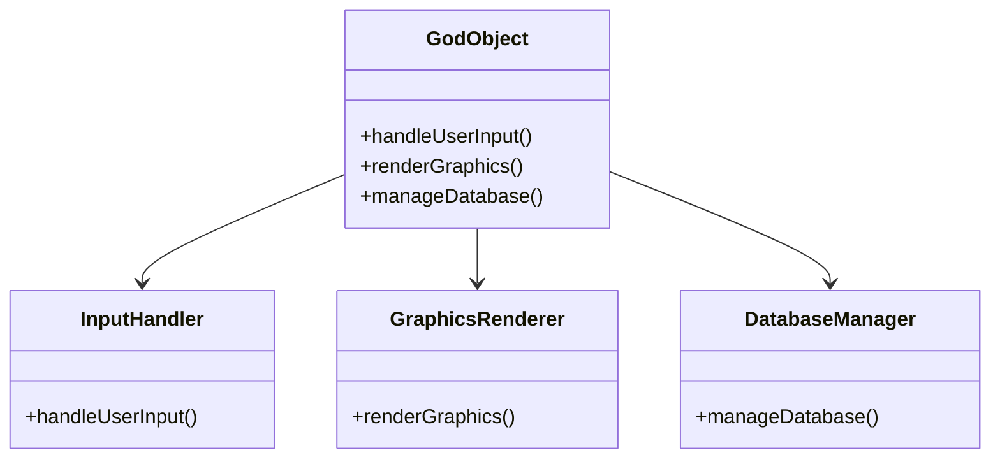

## 18.1 Understanding Anti-Patterns

In the realm of software development, the concept of anti-patterns is as crucial as understanding design patterns. While design patterns provide time-tested solutions to common problems, anti-patterns represent the pitfalls that developers often fall into, leading to inefficient, unmaintainable, or error-prone code. In this section, we will delve into the world of anti-patterns, particularly within the context of Haxe development, and explore how recognizing and addressing these can lead to more robust and maintainable software.

### What Are Anti-Patterns?

**Definition:** Anti-patterns are common responses to recurring problems that are ineffective and counterproductive. They are the "bad habits" of software design that can lead to technical debt and hinder the scalability and maintainability of a project.

#### Importance of Recognizing Anti-Patterns

- **Recognition:** Identifying anti-patterns is the first step to resolving them. By understanding what constitutes an anti-pattern, developers can avoid these pitfalls and choose more effective solutions.
- **Improvement:** Recognizing anti-patterns encourages better design choices and practices, leading to cleaner, more efficient codebases.

### Common Anti-Patterns in Haxe Development

Let's explore some of the most common anti-patterns encountered in Haxe development and how they can be addressed.

#### 1. The God Object

**Description:** A God Object is an object that knows too much or does too much. It is a single class that handles many responsibilities, making it difficult to maintain and extend.

**Consequences:** This anti-pattern leads to tightly coupled code, making it hard to test and refactor. Changes in one part of the code can have unpredictable effects elsewhere.

**Solution:** Apply the Single Responsibility Principle (SRP) by breaking down the God Object into smaller, more focused classes. Use design patterns like the Facade or Mediator to manage interactions between these classes.

**Example:**

```haxe
// Before: God Object
class GodObject {
    public function new() {}
    
    public function handleUserInput() {
        // Handle user input
    }
    
    public function renderGraphics() {
        // Render graphics
    }
    
    public function manageDatabase() {
        // Manage database operations
    }
}

// After: Refactored with SRP
class InputHandler {
    public function new() {}
    public function handleUserInput() {
        // Handle user input
    }
}

class GraphicsRenderer {
    public function new() {}
    public function renderGraphics() {
        // Render graphics
    }
}

class DatabaseManager {
    public function new() {}
    public function manageDatabase() {
        // Manage database operations
    }
}
```

#### 2. Spaghetti Code

**Description:** Spaghetti code is a tangled web of code with little structure, making it difficult to follow and maintain. It often results from a lack of planning or adherence to coding standards.

**Consequences:** This anti-pattern leads to high maintenance costs and increased likelihood of bugs due to the complexity and lack of clarity in the code.

**Solution:** Adopt a clear architecture and coding standards. Use design patterns like MVC (Model-View-Controller) to separate concerns and improve code organization.

**Example:**

```haxe
// Before: Spaghetti Code
class Game {
    public function new() {}
    
    public function update() {
        // Update game logic
        if (/* some condition */) {
            // Do something
        } else {
            // Do something else
        }
    }
    
    public function render() {
        // Render game
    }
}

// After: Using MVC
class GameModel {
    public function new() {}
    public function updateLogic() {
        // Update game logic
    }
}

class GameView {
    public function new() {}
    public function render() {
        // Render game
    }
}

class GameController {
    public function new() {}
    public function update() {
        // Update game logic through GameModel
    }
}
```

#### 3. Lava Flow

**Description:** Lava Flow refers to code that is difficult to remove or refactor because it is intertwined with other parts of the system. It often results from code that was hastily written and never cleaned up.

**Consequences:** This anti-pattern leads to increased technical debt and makes it difficult to implement new features or fix bugs.

**Solution:** Regularly refactor and clean up code. Use version control to track changes and ensure that only necessary code is retained.

**Example:**

```haxe
// Before: Lava Flow
class OldFeature {
    public function new() {}
    public function doSomething() {
        // Old logic that is no longer used
    }
}

// After: Refactored
class NewFeature {
    public function new() {}
    public function doSomething() {
        // Updated logic
    }
}
```

#### 4. Copy-Paste Programming

**Description:** Copy-paste programming occurs when developers duplicate code instead of reusing existing code or creating reusable components.

**Consequences:** This anti-pattern leads to code duplication, making it difficult to maintain and prone to errors when changes are needed.

**Solution:** Use functions, classes, and modules to encapsulate reusable code. Apply the DRY (Don't Repeat Yourself) principle to minimize duplication.

**Example:**

```haxe
// Before: Copy-Paste Programming
class Example {
    public function new() {}
    
    public function calculateArea(width:Float, height:Float):Float {
        return width * height;
    }
    
    public function calculateVolume(width:Float, height:Float, depth:Float):Float {
        return width * height * depth;
    }
}

// After: Refactored with DRY
class Geometry {
    public function new() {}
    
    public function calculateArea(width:Float, height:Float):Float {
        return width * height;
    }
    
    public function calculateVolume(width:Float, height:Float, depth:Float):Float {
        return calculateArea(width, height) * depth;
    }
}
```

### Visualizing Anti-Patterns

To better understand the impact of anti-patterns, let's visualize the concept of a God Object using a class diagram.



**Diagram Description:** The diagram illustrates how a God Object can be broken down into smaller, more focused classes, each handling a specific responsibility.

### Try It Yourself

To solidify your understanding of anti-patterns, try refactoring a piece of code you have written recently. Identify any potential anti-patterns and apply the solutions discussed above. Experiment with breaking down large classes, reducing code duplication, and organizing your code using design patterns.

### References and Further Reading

- [Refactoring: Improving the Design of Existing Code](https://martinfowler.com/books/refactoring.html) by Martin Fowler
- [Design Patterns: Elements of Reusable Object-Oriented Software](https://www.oreilly.com/library/view/design-patterns-elements/0201633612/) by Erich Gamma, Richard Helm, Ralph Johnson, and John Vlissides
- [AntiPatterns: Refactoring Software, Architectures, and Projects in Crisis](https://www.amazon.com/AntiPatterns-Refactoring-Software-Architectures-Projects/dp/0471197130) by William J. Brown et al.

### Knowledge Check

- What is an anti-pattern, and why is it important to recognize them?
- How does the God Object anti-pattern affect code maintainability?
- What strategies can be used to refactor spaghetti code?
- Why is copy-paste programming considered an anti-pattern?

### Embrace the Journey

Remember, recognizing and addressing anti-patterns is a crucial step in becoming a more effective software engineer. By continuously improving your code and design practices, you'll create more maintainable and scalable software. Keep experimenting, stay curious, and enjoy the journey of mastering Haxe design patterns!

## Quiz Time!



### What is an anti-pattern?

- [x] A common response to recurring problems that is ineffective and counterproductive
- [ ] A design pattern that solves a specific problem
- [ ] A type of algorithm used in software development
- [ ] A tool used for debugging code

> **Explanation:** An anti-pattern is a common response to recurring problems that is ineffective and counterproductive, leading to poor design choices.

### Why is it important to recognize anti-patterns?

- [x] To improve design choices and practices
- [ ] To increase code complexity
- [ ] To make code harder to maintain
- [ ] To introduce more bugs

> **Explanation:** Recognizing anti-patterns helps improve design choices and practices, leading to cleaner and more maintainable code.

### What is a God Object?

- [x] An object that knows too much or does too much
- [ ] An object that is used for testing purposes
- [ ] An object that is only used in game development
- [ ] An object that is part of the Haxe standard library

> **Explanation:** A God Object is an object that knows too much or does too much, leading to tightly coupled code that is difficult to maintain.

### How can you refactor a God Object?

- [x] By breaking it down into smaller, more focused classes
- [ ] By adding more methods to it
- [ ] By using it in multiple projects
- [ ] By ignoring it

> **Explanation:** Refactoring a God Object involves breaking it down into smaller, more focused classes that adhere to the Single Responsibility Principle.

### What is spaghetti code?

- [x] Code with little structure, making it difficult to follow and maintain
- [ ] Code that is well-organized and easy to read
- [ ] Code that is only used in web development
- [ ] Code that is written in a specific programming language

> **Explanation:** Spaghetti code is tangled and unstructured, making it difficult to follow and maintain.

### How can you address spaghetti code?

- [x] By adopting a clear architecture and coding standards
- [ ] By adding more comments to the code
- [ ] By using more global variables
- [ ] By increasing the code's complexity

> **Explanation:** Addressing spaghetti code involves adopting a clear architecture and coding standards to improve organization and maintainability.

### What is the Lava Flow anti-pattern?

- [x] Code that is difficult to remove or refactor because it is intertwined with other parts of the system
- [ ] Code that is easy to refactor and maintain
- [ ] Code that is only used in legacy systems
- [ ] Code that is part of the Haxe standard library

> **Explanation:** Lava Flow refers to code that is difficult to remove or refactor because it is intertwined with other parts of the system, leading to increased technical debt.

### How can you address the Lava Flow anti-pattern?

- [x] By regularly refactoring and cleaning up code
- [ ] By adding more features to the code
- [ ] By ignoring it
- [ ] By using it in multiple projects

> **Explanation:** Addressing the Lava Flow anti-pattern involves regularly refactoring and cleaning up code to reduce technical debt.

### What is copy-paste programming?

- [x] Duplicating code instead of reusing existing code or creating reusable components
- [ ] Writing code from scratch for every new feature
- [ ] Using third-party libraries in your code
- [ ] Writing code that is only used once

> **Explanation:** Copy-paste programming involves duplicating code instead of reusing existing code or creating reusable components, leading to code duplication and maintenance challenges.

### How can you avoid copy-paste programming?

- [x] By using functions, classes, and modules to encapsulate reusable code
- [ ] By duplicating code across multiple files
- [ ] By writing code that is specific to one project
- [ ] By ignoring code duplication

> **Explanation:** Avoiding copy-paste programming involves using functions, classes, and modules to encapsulate reusable code and applying the DRY principle.


