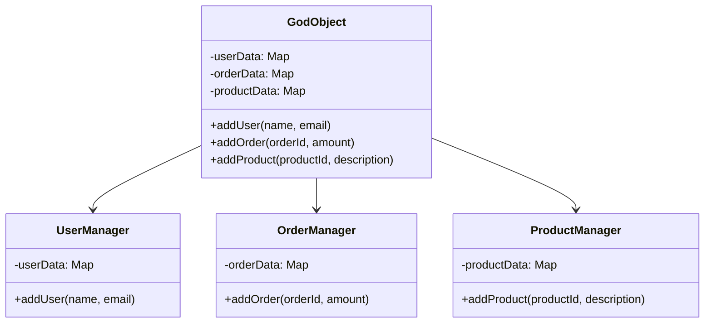

## 18.2 Common Anti-Patterns in Haxe Development

In the world of software development, anti-patterns are recurring solutions to common problems that are ineffective and counterproductive. In Haxe development, these anti-patterns can lead to code that is difficult to maintain, scale, and debug. Understanding these pitfalls is crucial for expert developers and architects who aim to write clean, efficient, and cross-platform code. In this section, we will explore some of the most common anti-patterns in Haxe development, their impacts, and strategies for refactoring them.

### Understanding Anti-Patterns

Anti-patterns are the opposite of design patterns. While design patterns provide proven solutions to common problems, anti-patterns are ineffective approaches that may initially seem beneficial but ultimately lead to negative consequences. Recognizing these patterns in your code is the first step toward improving your software's quality.

### Common Anti-Patterns in Haxe Development

#### 1. God Object

**Concept:** The God Object anti-pattern occurs when a single class takes on too many responsibilities, becoming a monolithic entity that knows too much or does too much. This leads to a lack of cohesion and makes the class difficult to maintain and extend.

**Impact:** 
- **Maintainability Issues:** Changes in one part of the class can have unintended consequences elsewhere.
- **Scalability Problems:** Adding new features becomes cumbersome as the class grows in complexity.

**Example:**

```haxe
class GodObject {
    public var userData:Map<String, String>;
    public var orderData:Map<String, Float>;
    public var productData:Map<String, String>;

    public function new() {
        userData = new Map();
        orderData = new Map();
        productData = new Map();
    }

    public function addUser(name:String, email:String):Void {
        userData.set(name, email);
    }

    public function addOrder(orderId:String, amount:Float):Void {
        orderData.set(orderId, amount);
    }

    public function addProduct(productId:String, description:String):Void {
        productData.set(productId, description);
    }

    // Many more unrelated methods...
}
```

**Refactoring Strategy:** Apply the Single Responsibility Principle (SRP) by breaking down the God Object into smaller, more focused classes.

```haxe
class UserManager {
    private var userData:Map<String, String>;

    public function new() {
        userData = new Map();
    }

    public function addUser(name:String, email:String):Void {
        userData.set(name, email);
    }
}

class OrderManager {
    private var orderData:Map<String, Float>;

    public function new() {
        orderData = new Map();
    }

    public function addOrder(orderId:String, amount:Float):Void {
        orderData.set(orderId, amount);
    }
}

class ProductManager {
    private var productData:Map<String, String>;

    public function new() {
        productData = new Map();
    }

    public function addProduct(productId:String, description:String):Void {
        productData.set(productId, description);
    }
}
```

#### 2. Spaghetti Code

**Concept:** Spaghetti Code is characterized by a lack of structure, with tangled and convoluted logic that makes the codebase difficult to follow and maintain.

**Impact:**
- **Maintainability Issues:** The code becomes hard to read and understand, making debugging and enhancements challenging.
- **Scalability Problems:** Adding new features or fixing bugs becomes increasingly difficult.

**Example:**

```haxe
function processOrder(orderId:String):Void {
    if (orderId != null) {
        // Fetch order details
        // Validate order
        // Process payment
        // Update inventory
        // Send confirmation email
        // Log transaction
    } else {
        // Handle error
    }
}
```

**Refactoring Strategy:** Use functions or methods to encapsulate distinct tasks, improving readability and maintainability.

```haxe
function processOrder(orderId:String):Void {
    if (orderId == null) {
        handleError();
        return;
    }

    fetchOrderDetails(orderId);
    if (!validateOrder(orderId)) return;
    processPayment(orderId);
    updateInventory(orderId);
    sendConfirmationEmail(orderId);
    logTransaction(orderId);
}

function fetchOrderDetails(orderId:String):Void {
    // Implementation
}

function validateOrder(orderId:String):Bool {
    // Implementation
    return true;
}

function processPayment(orderId:String):Void {
    // Implementation
}

function updateInventory(orderId:String):Void {
    // Implementation
}

function sendConfirmationEmail(orderId:String):Void {
    // Implementation
}

function logTransaction(orderId:String):Void {
    // Implementation
}

function handleError():Void {
    // Implementation
}
```

#### 3. Copy-Paste Programming

**Concept:** Copy-Paste Programming involves duplicating code instead of abstracting common functionality into reusable components. This leads to code duplication and inconsistency.

**Impact:**
- **Maintainability Issues:** Changes need to be made in multiple places, increasing the risk of errors.
- **Scalability Problems:** The codebase becomes bloated and difficult to manage.

**Example:**

```haxe
function calculateDiscountA(price:Float):Float {
    return price * 0.9;
}

function calculateDiscountB(price:Float):Float {
    return price * 0.85;
}

// More similar functions...
```

**Refactoring Strategy:** Use abstraction to create a single, reusable function.

```haxe
function calculateDiscount(price:Float, discountRate:Float):Float {
    return price * discountRate;
}

// Usage
var discountA = calculateDiscount(100, 0.9);
var discountB = calculateDiscount(100, 0.85);
```

### Visualizing Anti-Patterns

To better understand the relationships and impacts of these anti-patterns, let's visualize them using Mermaid.js diagrams.



**Diagram Explanation:** This diagram illustrates the transition from a God Object to a more modular design with separate classes for managing users, orders, and products.

### Impacts of Anti-Patterns

Anti-patterns can severely impact the quality and performance of your Haxe applications. Here are some of the key impacts:

- **Maintainability Issues:** Anti-patterns make code difficult to understand, modify, and extend. This increases the time and effort required for maintenance.
- **Scalability Problems:** As the codebase grows, anti-patterns hinder the ability to scale and adapt to new requirements.
- **Performance Degradation:** Inefficient code structures can lead to performance bottlenecks.
- **Increased Bug Risk:** Complex and tangled code increases the likelihood of introducing bugs.

### Strategies for Refactoring Anti-Patterns

Refactoring is the process of restructuring existing code without changing its external behavior. Here are some strategies for refactoring common anti-patterns:

1. **Identify Code Smells:** Look for signs of anti-patterns, such as large classes, duplicated code, and complex methods.
2. **Apply Design Principles:** Use principles like SOLID, DRY (Don't Repeat Yourself), and KISS (Keep It Simple, Stupid) to guide your refactoring efforts.
3. **Use Design Patterns:** Replace anti-patterns with appropriate design patterns that provide proven solutions.
4. **Incremental Refactoring:** Make small, incremental changes to improve the codebase gradually.
5. **Test Thoroughly:** Ensure that refactoring does not introduce new bugs by writing and running tests.

### Try It Yourself

To solidify your understanding of these concepts, try refactoring a piece of code in your own projects. Identify any anti-patterns and apply the strategies discussed to improve the code's structure and maintainability.

### References and Further Reading

- [Refactoring: Improving the Design of Existing Code](https://martinfowler.com/books/refactoring.html) by Martin Fowler
- [Design Patterns: Elements of Reusable Object-Oriented Software](https://www.oreilly.com/library/view/design-patterns-elements/0201633612/) by Erich Gamma et al.
- [Haxe Manual](https://haxe.org/manual/)

### Knowledge Check

- What is an anti-pattern, and how does it differ from a design pattern?
- How can the God Object anti-pattern be refactored using the Single Responsibility Principle?
- What are the impacts of Spaghetti Code on a codebase?
- How can Copy-Paste Programming be avoided in Haxe development?

### Embrace the Journey

Remember, recognizing and refactoring anti-patterns is a continuous process. As you gain experience, you'll become more adept at identifying these pitfalls and applying effective solutions. Keep experimenting, stay curious, and enjoy the journey of mastering Haxe development!

## Quiz Time!



### What is an anti-pattern?

- [x] A recurring solution to a common problem that is ineffective and counterproductive
- [ ] A proven solution to a common problem
- [ ] A design pattern used in Haxe
- [ ] A type of algorithm used in software development

> **Explanation:** An anti-pattern is a recurring solution to a common problem that is ineffective and counterproductive, unlike design patterns, which provide effective solutions.

### Which of the following is a characteristic of the God Object anti-pattern?

- [x] A class that knows too much or does too much
- [ ] A class with a single responsibility
- [ ] A class that is highly cohesive
- [ ] A class that is loosely coupled

> **Explanation:** The God Object anti-pattern occurs when a single class takes on too many responsibilities, becoming a monolithic entity.

### How can Spaghetti Code impact a codebase?

- [x] It makes the code difficult to read and understand
- [ ] It improves the code's performance
- [ ] It enhances the code's scalability
- [ ] It simplifies debugging

> **Explanation:** Spaghetti Code is characterized by a lack of structure, making the codebase difficult to follow and maintain.

### What is a common consequence of Copy-Paste Programming?

- [x] Code duplication and inconsistency
- [ ] Improved code readability
- [ ] Enhanced code performance
- [ ] Reduced risk of errors

> **Explanation:** Copy-Paste Programming involves duplicating code instead of abstracting common functionality, leading to duplication and inconsistency.

### Which principle can help refactor the God Object anti-pattern?

- [x] Single Responsibility Principle
- [ ] Open/Closed Principle
- [ ] Liskov Substitution Principle
- [ ] Interface Segregation Principle

> **Explanation:** The Single Responsibility Principle helps refactor the God Object by breaking it down into smaller, more focused classes.

### What is the main goal of refactoring?

- [x] Restructuring existing code without changing its external behavior
- [ ] Adding new features to the code
- [ ] Improving code performance
- [ ] Reducing code size

> **Explanation:** Refactoring involves restructuring existing code to improve its design without altering its external behavior.

### Which design principle emphasizes avoiding code duplication?

- [x] DRY (Don't Repeat Yourself)
- [ ] KISS (Keep It Simple, Stupid)
- [ ] YAGNI (You Aren't Gonna Need It)
- [ ] SOLID

> **Explanation:** The DRY principle emphasizes avoiding code duplication by abstracting common functionality.

### What is a key benefit of applying design patterns?

- [x] They provide proven solutions to common problems
- [ ] They increase code complexity
- [ ] They reduce code readability
- [ ] They introduce new bugs

> **Explanation:** Design patterns provide proven solutions to common problems, improving code quality and maintainability.

### How can incremental refactoring be beneficial?

- [x] It allows for gradual improvement of the codebase
- [ ] It requires rewriting the entire codebase
- [ ] It introduces significant changes at once
- [ ] It eliminates the need for testing

> **Explanation:** Incremental refactoring involves making small, gradual changes to improve the codebase over time.

### True or False: Anti-patterns are always easy to identify in a codebase.

- [ ] True
- [x] False

> **Explanation:** Anti-patterns can be difficult to identify, especially in large or complex codebases, and require careful analysis and understanding.


