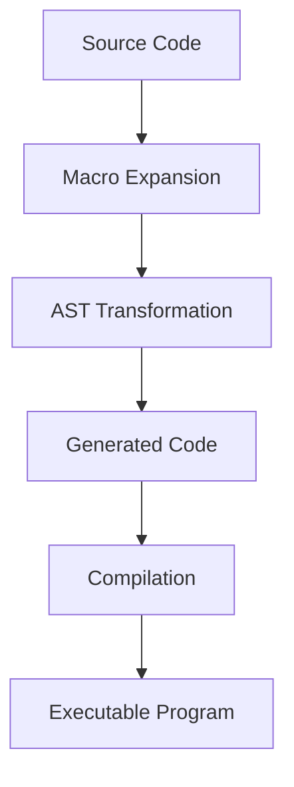

## 18.3 Overuse of Macros and Meta-Programming

In the realm of Haxe development, macros and meta-programming offer powerful tools for code generation and transformation. However, with great power comes great responsibility. Overusing these features can lead to code that is difficult to read, maintain, and debug. In this section, we will explore the potential pitfalls of excessive macro usage and provide best practices to harness their power effectively.

### Understanding Macros and Meta-Programming in Haxe

Macros in Haxe are a form of meta-programming that allows developers to manipulate the Abstract Syntax Tree (AST) during compile time. This capability enables the generation of code, which can lead to more concise and flexible implementations. However, it also introduces complexity that can obscure the logic of the program.

#### Key Concepts

- **Abstract Syntax Tree (AST):** A tree representation of the syntactic structure of source code. Macros operate on this structure to transform code.
- **Compile-Time Code Generation:** The process of generating code during the compilation phase, rather than at runtime.
- **Meta-Programming:** Writing programs that write or manipulate other programs or themselves.

### The Pitfalls of Overusing Macros

While macros can be beneficial, their overuse can lead to several issues:

#### 1. Increased Complexity

Macros can significantly increase the complexity of a codebase. They introduce an additional layer of abstraction that developers must understand to effectively work with the code. This complexity can lead to a higher cognitive load, making it difficult for developers to grasp the overall logic of the application.

#### 2. Debugging Challenges

Errors in macro-generated code can be particularly challenging to trace. Since the code is generated at compile time, traditional debugging tools may not provide clear insights into the source of the problem. This can lead to increased time spent on debugging and a higher likelihood of introducing bugs.

#### 3. Reduced Readability

Macros can obscure the intent of the code, making it harder for developers to understand what the code is doing at a glance. This can be especially problematic in large codebases where multiple developers are working together.

#### 4. Maintenance Difficulties

As the codebase evolves, maintaining macro-heavy code can become a daunting task. Changes to the underlying logic may require updates to the macros, which can be error-prone and time-consuming.

### Best Practices for Using Macros in Haxe

To mitigate the risks associated with macro overuse, consider the following best practices:

#### 1. Use Macros Judiciously

Apply macros only where they add significant value. Consider whether the benefits of using a macro outweigh the potential downsides in terms of complexity and maintainability.

#### 2. Prioritize Readability

Ensure that the generated code is as readable as possible. Use clear and descriptive names for macros and provide comments to explain their purpose and functionality.

#### 3. Document Macro Usage

Clearly document where and why macros are used in the codebase. This documentation should include explanations of the macro's purpose, how it works, and any potential side effects.

#### 4. Test Generated Code

Thoroughly test the code generated by macros to ensure it behaves as expected. Consider using unit tests to validate the functionality of the generated code.

#### 5. Limit Macro Scope

Limit the scope of macros to specific, well-defined tasks. Avoid using macros for general-purpose code generation, as this can lead to unnecessary complexity.

#### 6. Provide Fallbacks

Where possible, provide fallback implementations that do not rely on macros. This can help ensure that the code remains functional even if the macros need to be disabled or modified.

### Code Example: Using Macros Wisely

Let's explore a simple example of using macros in Haxe to generate boilerplate code for a data class.

```haxe
import haxe.macro.Context;
import haxe.macro.Expr;

class DataClassMacro {
    public static macro function generateDataClass(fields:Array<String>):Expr {
        var fieldExprs = fields.map(function(field) {
            return macro public var $field:String;
        });
        
        return macro class {
            $fieldExprs;
            
            public function new() {
                // Initialize fields
                $fields.map(function(field) {
                    return macro this.$field = "";
                });
            }
        }
    }
}

// Usage
class Main {
    static function main() {
        var dataClass = DataClassMacro.generateDataClass(["name", "email"]);
        trace(dataClass);
    }
}
```

In this example, we define a macro `generateDataClass` that generates a class with specified fields. The macro is used to create a class with `name` and `email` fields. While this macro simplifies the creation of data classes, it is important to document its usage and ensure that the generated code is tested.

### Visualizing Macro Usage

To better understand how macros interact with the AST, let's visualize the process using a Mermaid.js diagram.



**Diagram Description:** This diagram illustrates the flow of macro usage in Haxe. The source code undergoes macro expansion, transforming the AST. The transformed AST is then compiled into the final executable program.

### Recommendations for Avoiding Macro Overuse

To avoid the pitfalls of macro overuse, consider the following recommendations:

- **Evaluate Alternatives:** Before using macros, evaluate whether alternative solutions, such as functions or classes, could achieve the same result with less complexity.
- **Encourage Code Reviews:** Conduct regular code reviews to ensure that macro usage is appropriate and well-documented.
- **Foster a Culture of Simplicity:** Encourage a culture of simplicity within the development team, where the focus is on writing clear and maintainable code.

### Conclusion

Macros and meta-programming in Haxe offer powerful capabilities for code generation and transformation. However, their overuse can lead to increased complexity, debugging challenges, and maintenance difficulties. By following best practices and using macros judiciously, developers can harness their power while maintaining code readability and debuggability. Remember, the key to successful macro usage is balance—leveraging their strengths without succumbing to their potential pitfalls.

## Quiz Time!



### What is a macro in Haxe?

- [x] A form of meta-programming that manipulates the AST during compile time.
- [ ] A runtime code execution feature.
- [ ] A tool for debugging Haxe applications.
- [ ] A library for handling HTTP requests.

> **Explanation:** Macros in Haxe are a form of meta-programming that allows developers to manipulate the Abstract Syntax Tree (AST) during compile time.

### What is one of the main challenges of using macros excessively?

- [x] Increased complexity and cognitive load.
- [ ] Improved code readability.
- [ ] Faster runtime performance.
- [ ] Easier debugging.

> **Explanation:** Excessive use of macros can lead to increased complexity and cognitive load, making the code harder to understand and maintain.

### How can developers mitigate the risks of macro overuse?

- [x] Use macros judiciously and document their usage.
- [ ] Avoid using macros altogether.
- [ ] Use macros for all code generation tasks.
- [ ] Rely on macros for debugging.

> **Explanation:** Developers should use macros judiciously and document their usage to mitigate the risks of overuse.

### What is the role of the Abstract Syntax Tree (AST) in macro usage?

- [x] It represents the syntactic structure of source code that macros manipulate.
- [ ] It is a runtime data structure for handling HTTP requests.
- [ ] It is a tool for optimizing code performance.
- [ ] It is a library for managing database connections.

> **Explanation:** The Abstract Syntax Tree (AST) is a tree representation of the syntactic structure of source code that macros manipulate during compile time.

### Why is it important to test macro-generated code?

- [x] To ensure it behaves as expected and is free of errors.
- [ ] To improve runtime performance.
- [ ] To simplify the codebase.
- [ ] To reduce the need for documentation.

> **Explanation:** Testing macro-generated code is important to ensure it behaves as expected and is free of errors.

### What is a recommended practice when using macros?

- [x] Limit the scope of macros to specific, well-defined tasks.
- [ ] Use macros for all code generation tasks.
- [ ] Avoid documenting macro usage.
- [ ] Rely on macros for debugging.

> **Explanation:** Limiting the scope of macros to specific, well-defined tasks helps reduce complexity and maintainability issues.

### How can developers ensure the readability of macro-generated code?

- [x] Use clear and descriptive names for macros and provide comments.
- [ ] Avoid using comments in the code.
- [ ] Use macros for all code generation tasks.
- [ ] Rely on macros for debugging.

> **Explanation:** Using clear and descriptive names for macros and providing comments helps ensure the readability of macro-generated code.

### What is a potential consequence of not documenting macro usage?

- [x] Increased difficulty in understanding and maintaining the code.
- [ ] Improved code readability.
- [ ] Faster runtime performance.
- [ ] Easier debugging.

> **Explanation:** Not documenting macro usage can lead to increased difficulty in understanding and maintaining the code.

### What is the purpose of providing fallback implementations for macros?

- [x] To ensure the code remains functional even if macros need to be disabled or modified.
- [ ] To improve runtime performance.
- [ ] To simplify the codebase.
- [ ] To reduce the need for documentation.

> **Explanation:** Providing fallback implementations for macros ensures the code remains functional even if macros need to be disabled or modified.

### True or False: Macros should be used for all code generation tasks in Haxe.

- [ ] True
- [x] False

> **Explanation:** Macros should not be used for all code generation tasks. They should be applied judiciously where they add significant value and do not introduce unnecessary complexity.



Remember, mastering the use of macros and meta-programming in Haxe is a journey. As you continue to explore these powerful features, keep experimenting, stay curious, and enjoy the process of learning and growing as a developer!
