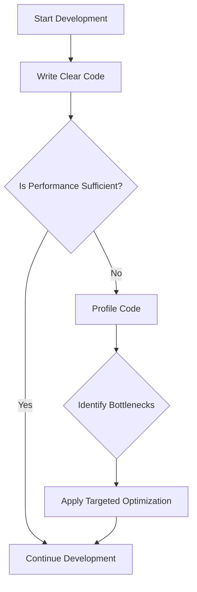

## 18.4 Premature Optimization Pitfalls

In the world of software development, the phrase "premature optimization is the root of all evil" is often quoted. This concept, introduced by Donald Knuth, emphasizes the dangers of focusing on optimization too early in the development process. In this section, we will explore the pitfalls of premature optimization, particularly in the context of Haxe development, and provide strategies to avoid these common mistakes.

### Understanding Premature Optimization

**Definition:** Premature optimization refers to the practice of trying to improve the performance of a program before it is necessary, often at the expense of code clarity and correctness.

#### Key Concepts

- **Optimization:** The process of making a system or application run more efficiently by improving its performance, reducing resource consumption, or both.
- **Premature:** Acting before the appropriate time or before sufficient information is available.

### Consequences of Premature Optimization

Premature optimization can lead to several negative outcomes, which can hinder the development process and the quality of the final product.

#### Wasted Effort

One of the most significant consequences of premature optimization is the waste of time and resources. Developers may spend countless hours optimizing parts of the code that do not significantly impact the overall performance of the application.

#### Reduced Readability

Optimized code can often become complex and difficult to read. This complexity can make it harder for other developers (or even the original author) to understand and maintain the code, leading to increased chances of introducing bugs.

#### Compromised Design

Focusing on optimization too early can lead to design compromises. Developers might choose less optimal design patterns or architectures to achieve performance gains, which can result in a less flexible and scalable system.

### Recommendations for Avoiding Premature Optimization

To avoid the pitfalls of premature optimization, developers should follow these best practices:

#### Profile First

Before optimizing, it's crucial to gather actual performance data. Use profiling tools to identify the parts of the code that are genuine bottlenecks. This data-driven approach ensures that optimization efforts are focused on areas that will have the most significant impact.

#### Maintain Clean Design

Prioritize writing clear and maintainable code. A clean design makes it easier to identify performance issues and apply optimizations when necessary. It also ensures that the codebase remains flexible and scalable.

#### Embrace Iterative Development

Adopt an iterative development process where optimization is considered a later stage. Focus on building a working solution first, then refine and optimize based on real-world usage and feedback.

#### Use Haxe's Features Wisely

Leverage Haxe's unique features, such as its powerful macro system and static typing, to write efficient code without sacrificing clarity. These features can help you achieve performance gains without resorting to premature optimization.

### Code Examples

Let's explore some code examples to illustrate the concept of premature optimization and how to avoid it in Haxe.

#### Example 1: Premature Optimization

```haxe
class PrematureOptimization {
    public static function main() {
        // Prematurely optimized loop
        var result = 0;
        for (i in 0...1000000) {
            // Using bitwise operations for optimization
            result += (i & 1) == 0 ? i : 0;
        }
        trace(result);
    }
}
```

In this example, the developer uses bitwise operations to optimize the loop. While this might improve performance slightly, it reduces code readability and may not be necessary if the loop is not a performance bottleneck.

#### Example 2: Profiling and Targeted Optimization

```haxe
class TargetedOptimization {
    public static function main() {
        // Simple loop without premature optimization
        var result = 0;
        for (i in 0...1000000) {
            if (i % 2 == 0) {
                result += i;
            }
        }
        trace(result);
    }
}
```

In this example, the code is straightforward and easy to understand. Once profiling identifies this loop as a bottleneck, targeted optimizations can be applied based on actual data.

### Visualizing the Impact of Premature Optimization

To better understand the impact of premature optimization, let's visualize the process using a flowchart.



**Figure 1:** This flowchart illustrates the recommended approach to optimization. Start by writing clear code, profile to identify bottlenecks, and then apply targeted optimizations.

### References and Further Reading

- [Donald Knuth's Quote on Premature Optimization](https://en.wikipedia.org/wiki/Program_optimization#When_to_optimize)
- [MDN Web Docs on Code Optimization](https://developer.mozilla.org/en-US/docs/Web/Performance/Optimizing_your_site)
- [Profiling Tools for Haxe](https://haxe.org/manual/debugging-profiling.html)

### Knowledge Check

To reinforce your understanding of premature optimization, consider the following questions:

- What are the main consequences of premature optimization?
- Why is it important to profile code before optimizing?
- How can maintaining a clean design help avoid premature optimization pitfalls?

### Embrace the Journey

Remember, optimization is a journey, not a destination. By focusing on writing clear and maintainable code, you lay the foundation for a robust and scalable application. As you progress, you'll learn to identify genuine performance bottlenecks and apply optimizations effectively. Keep experimenting, stay curious, and enjoy the journey!

### Quiz Time!



### What is premature optimization?

- [x] Optimizing code before it's necessary
- [ ] Optimizing code after profiling
- [ ] Writing clear and maintainable code
- [ ] Using design patterns effectively

> **Explanation:** Premature optimization refers to optimizing code before it's necessary, often without profiling.

### What is a common consequence of premature optimization?

- [x] Reduced code readability
- [ ] Improved code clarity
- [ ] Increased maintainability
- [ ] Faster development time

> **Explanation:** Premature optimization often leads to reduced code readability due to complex and unnecessary optimizations.

### Why is profiling important before optimization?

- [x] To identify actual performance bottlenecks
- [ ] To make code more complex
- [ ] To improve code readability
- [ ] To reduce development time

> **Explanation:** Profiling helps identify actual performance bottlenecks, ensuring optimization efforts are focused on areas that matter.

### What should be prioritized over premature optimization?

- [x] Clear and maintainable code
- [ ] Complex algorithms
- [ ] Early optimization
- [ ] Bitwise operations

> **Explanation:** Clear and maintainable code should be prioritized to ensure the codebase remains flexible and scalable.

### How can Haxe's features help avoid premature optimization?

- [x] By leveraging macros and static typing
- [ ] By using complex algorithms
- [ ] By focusing on early optimization
- [ ] By avoiding profiling

> **Explanation:** Haxe's features like macros and static typing can help write efficient code without premature optimization.

### What is the first step in the recommended optimization process?

- [x] Write clear code
- [ ] Apply bitwise operations
- [ ] Optimize loops
- [ ] Use complex algorithms

> **Explanation:** The first step is to write clear code, which lays the foundation for effective optimization later.

### What should be done if performance is insufficient?

- [x] Profile the code
- [ ] Apply premature optimization
- [ ] Use complex algorithms
- [ ] Ignore the issue

> **Explanation:** If performance is insufficient, profiling the code helps identify genuine bottlenecks for targeted optimization.

### What is the benefit of maintaining a clean design?

- [x] Easier identification of performance issues
- [ ] Increased complexity
- [ ] Reduced flexibility
- [ ] Faster development time

> **Explanation:** A clean design makes it easier to identify performance issues and apply optimizations when necessary.

### What is the impact of premature optimization on design?

- [x] Compromised design
- [ ] Improved flexibility
- [ ] Enhanced scalability
- [ ] Increased maintainability

> **Explanation:** Premature optimization can lead to design compromises, affecting flexibility and scalability.

### True or False: Premature optimization should be the focus from the start of development.

- [ ] True
- [x] False

> **Explanation:** False. Premature optimization should not be the focus from the start; instead, focus on clear and maintainable code first.



By understanding and avoiding the pitfalls of premature optimization, you can ensure that your Haxe applications are both efficient and maintainable. Keep these principles in mind as you continue your journey in mastering Haxe design patterns.
