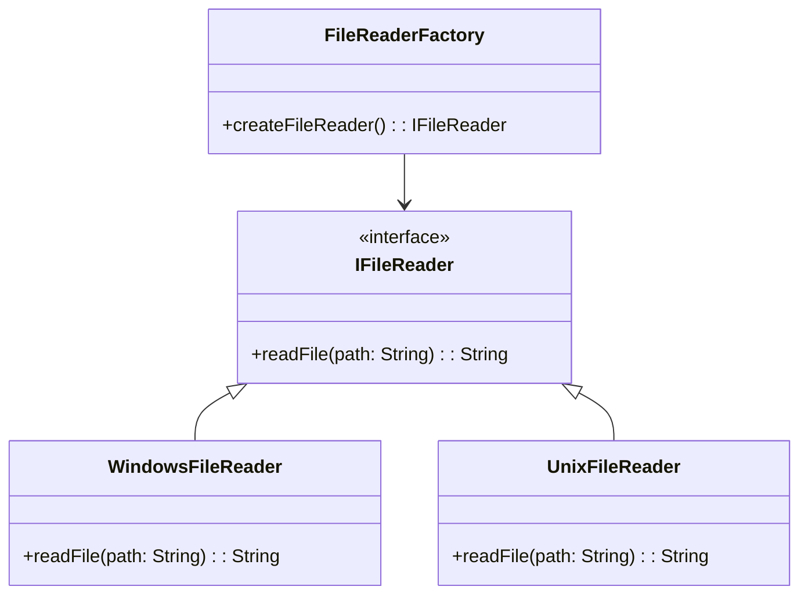

## 18.5 Ignoring Cross-Platform Considerations

In the realm of software development, especially when using a versatile language like Haxe, cross-platform development is both a boon and a challenge. Haxe's ability to compile to multiple targets such as JavaScript, C++, C#, Java, and Python makes it a powerful tool for developers aiming to reach a wide audience. However, this capability comes with its own set of challenges. Ignoring cross-platform considerations can lead to significant issues, including runtime errors, increased maintenance costs, and ultimately, a poor user experience.

### Understanding Cross-Platform Development

Cross-platform development refers to the practice of writing code that can be executed on multiple operating systems or platforms without modification. This approach is crucial for maximizing the reach of an application and ensuring a consistent user experience across different environments.

#### Key Concepts

- **Portability:** The ease with which software can be transferred from one environment to another.
- **Compatibility:** The ability of software to run on different platforms without modification.
- **Abstraction:** The process of hiding the complex reality while exposing only the necessary parts.

### Consequences of Ignoring Cross-Platform Considerations

Ignoring cross-platform considerations can have several detrimental effects on your software project:

#### Runtime Errors

When platform-specific differences are not accounted for, runtime errors can occur. These errors may arise from differences in how platforms handle certain operations, such as file I/O, threading, or even basic data types.

#### Increased Maintenance

Without proper cross-platform considerations, developers may find themselves writing platform-specific code, leading to a fragmented codebase. This fragmentation increases the complexity and cost of maintaining the software, as changes need to be replicated across multiple platform-specific implementations.

#### User Experience Discrepancies

A lack of cross-platform consistency can lead to a varied user experience, where the application behaves differently on different platforms. This inconsistency can frustrate users and damage the application's reputation.

### Recommendations for Cross-Platform Development

To mitigate the risks associated with ignoring cross-platform considerations, developers should adopt several best practices:

#### Test on All Targets

Regular testing on each supported platform is crucial. Automated testing frameworks can help streamline this process, ensuring that platform-specific issues are identified and resolved early in the development cycle.

#### Abstract Differences

Using interfaces and abstractions can help manage platform-specific code. By encapsulating platform-specific logic within well-defined interfaces, developers can isolate changes and reduce the impact on the overall codebase.

#### Code Example: Abstracting Platform Differences

Let's consider a simple example where we abstract file reading operations, which can differ across platforms:

```haxe
interface IFileReader {
    function readFile(path: String): String;
}

class WindowsFileReader implements IFileReader {
    public function new() {}

    public function readFile(path: String): String {
        // Windows-specific file reading logic
        return "Reading file on Windows: " + path;
    }
}

class UnixFileReader implements IFileReader {
    public function new() {}

    public function readFile(path: String): String {
        // Unix-specific file reading logic
        return "Reading file on Unix: " + path;
    }
}

class FileReaderFactory {
    public static function createFileReader(): IFileReader {
        #if windows
        return new WindowsFileReader();
        #elseif unix
        return new UnixFileReader();
        #else
        throw "Unsupported platform";
        #end
    }
}

class Main {
    static function main() {
        var fileReader = FileReaderFactory.createFileReader();
        trace(fileReader.readFile("example.txt"));
    }
}
```

In this example, we define an `IFileReader` interface and two implementations for Windows and Unix platforms. The `FileReaderFactory` class uses conditional compilation to select the appropriate implementation based on the target platform.

### Visualizing Cross-Platform Abstraction

To better understand how abstraction can help manage platform-specific differences, let's visualize the architecture using a class diagram:



This diagram illustrates how the `IFileReader` interface abstracts the file reading functionality, allowing different implementations for Windows and Unix platforms.

### Try It Yourself

Experiment with the provided code example by adding a new platform-specific implementation, such as for macOS. Modify the `FileReaderFactory` to include this new implementation and test the code on a macOS environment.

### Knowledge Check

- **Question:** What are the potential consequences of ignoring cross-platform considerations in Haxe development?
- **Question:** How can abstraction help manage platform-specific differences?
- **Question:** Why is regular testing on all target platforms important?

### Embrace the Journey

Remember, cross-platform development is an ongoing journey. As you continue to build and refine your applications, keep experimenting with different strategies to manage platform-specific differences. Stay curious, and enjoy the process of creating robust, portable software.

### References and Further Reading

- [MDN Web Docs: Cross-Browser Testing](https://developer.mozilla.org/en-US/docs/Learn/Tools_and_testing/Cross_browser_testing)
- [W3Schools: Responsive Web Design](https://www.w3schools.com/css/css_rwd_intro.asp)

## Quiz Time!



### What is a key consequence of ignoring cross-platform considerations?

- [x] Runtime errors
- [ ] Faster development
- [ ] Improved user experience
- [ ] Reduced maintenance

> **Explanation:** Ignoring cross-platform considerations can lead to runtime errors due to platform-specific differences.

### How can abstraction help in cross-platform development?

- [x] By encapsulating platform-specific logic
- [ ] By increasing code duplication
- [ ] By reducing code readability
- [ ] By making code platform-dependent

> **Explanation:** Abstraction helps manage platform-specific differences by encapsulating logic within interfaces.

### What is the role of the `FileReaderFactory` in the provided code example?

- [x] To create platform-specific file reader instances
- [ ] To read files directly
- [ ] To write files
- [ ] To handle user input

> **Explanation:** The `FileReaderFactory` creates instances of platform-specific file readers based on the target platform.

### Why is regular testing on all target platforms important?

- [x] To identify platform-specific issues early
- [ ] To increase development time
- [ ] To reduce code quality
- [ ] To avoid using abstractions

> **Explanation:** Regular testing helps identify and resolve platform-specific issues early in the development cycle.

### What is the purpose of the `IFileReader` interface in the code example?

- [x] To define a common interface for file reading
- [ ] To implement file writing
- [ ] To handle network requests
- [ ] To manage user sessions

> **Explanation:** The `IFileReader` interface defines a common interface for file reading across different platforms.

### Which of the following is NOT a consequence of ignoring cross-platform considerations?

- [ ] Runtime errors
- [ ] Increased maintenance
- [x] Improved performance
- [ ] User experience discrepancies

> **Explanation:** Ignoring cross-platform considerations does not improve performance; it can lead to runtime errors and increased maintenance.

### What is a benefit of using conditional compilation in Haxe?

- [x] To include platform-specific code only when needed
- [ ] To increase code size
- [ ] To reduce code readability
- [ ] To make code platform-dependent

> **Explanation:** Conditional compilation allows including platform-specific code only when needed, reducing unnecessary code.

### What is the main challenge of cross-platform development?

- [x] Managing platform-specific differences
- [ ] Writing code for a single platform
- [ ] Reducing code complexity
- [ ] Improving user experience

> **Explanation:** The main challenge is managing platform-specific differences to ensure consistent behavior across platforms.

### How does the `FileReaderFactory` determine which file reader to create?

- [x] Using conditional compilation
- [ ] By user input
- [ ] By file size
- [ ] By file type

> **Explanation:** The `FileReaderFactory` uses conditional compilation to determine which file reader to create based on the target platform.

### True or False: Cross-platform development is only important for mobile applications.

- [ ] True
- [x] False

> **Explanation:** Cross-platform development is important for any application that targets multiple platforms, not just mobile applications.


