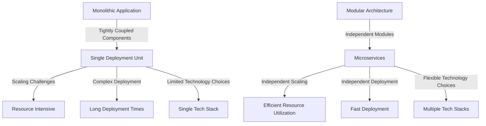

## 18.6 Tight Coupling and Monolithic Architecture

In the realm of software engineering, the concepts of tight coupling and monolithic architecture often surface as significant challenges. These anti-patterns can hinder the flexibility, scalability, and maintainability of software systems. In this section, we will delve into these concepts, explore their consequences, and provide strategies for refactoring and adopting a more modular approach using Haxe.

### Understanding Tight Coupling

**Tight Coupling** refers to a scenario where components in a system are highly dependent on each other. This dependency can manifest in various forms, such as shared data structures, direct method calls, or reliance on specific implementations. While some level of coupling is inevitable, excessive coupling can lead to several issues.

#### Consequences of Tight Coupling

1. **Reduced Flexibility:** When components are tightly coupled, making changes to one component often necessitates changes to others. This interdependency makes it challenging to modify or replace individual parts without affecting the entire system.

2. **Scaling Challenges:** Tight coupling can impede the ability to scale individual components independently. As a result, scaling the system often requires scaling all components, leading to inefficient resource utilization.

3. **Increased Complexity:** The intricate dependencies between components can increase the complexity of the system, making it harder to understand, maintain, and debug.

4. **Limited Reusability:** Tightly coupled components are often specific to a particular context, limiting their reusability in other projects or systems.

### Exploring Monolithic Architecture

**Monolithic Architecture** is a design approach where all components of a software application are integrated into a single, cohesive unit. While this approach can simplify initial development, it often leads to significant challenges as the system grows.

#### Consequences of Monolithic Architecture

1. **Difficulty in Scaling:** Scaling a monolithic application often involves scaling the entire application, which can be resource-intensive and inefficient.

2. **Complex Deployment:** Deploying a monolithic application requires deploying the entire system, even for small changes, leading to longer deployment times and increased risk of downtime.

3. **Limited Technology Choices:** In a monolithic architecture, all components must use the same technology stack, limiting the ability to adopt new technologies or frameworks for specific parts of the system.

4. **Reduced Agility:** The tightly integrated nature of monolithic applications can slow down development and deployment cycles, reducing the team's ability to respond to changing requirements.

### Recommendations for Addressing Tight Coupling and Monolithic Architecture

To mitigate the challenges posed by tight coupling and monolithic architecture, consider the following strategies:

#### Apply SOLID Principles

The SOLID principles are a set of design guidelines that promote loose coupling and high cohesion. Let's explore how these principles can be applied in Haxe:

1. **Single Responsibility Principle (SRP):** Ensure that each class or module has a single responsibility, reducing dependencies and making the system easier to understand and modify.

2. **Open/Closed Principle (OCP):** Design components to be open for extension but closed for modification. This approach allows new functionality to be added without altering existing code, reducing the risk of introducing bugs.

3. **Liskov Substitution Principle (LSP):** Ensure that derived classes can be substituted for their base classes without affecting the correctness of the program. This principle promotes the use of interfaces and abstract classes to reduce coupling.

4. **Interface Segregation Principle (ISP):** Design interfaces to be specific to the needs of the client, avoiding large, monolithic interfaces that force clients to depend on methods they do not use.

5. **Dependency Inversion Principle (DIP):** Depend on abstractions rather than concrete implementations. This principle encourages the use of dependency injection to reduce coupling between components.

#### Modular Design

Modular design involves breaking the application into independent, interchangeable modules. This approach can enhance flexibility, scalability, and maintainability. Here are some strategies for achieving modular design in Haxe:

1. **Use Packages and Modules:** Organize code into packages and modules to encapsulate functionality and reduce dependencies between components.

2. **Adopt Microservices Architecture:** Consider breaking the application into smaller, independently deployable services. Each service can be developed, deployed, and scaled independently, enhancing flexibility and scalability.

3. **Implement Design Patterns:** Utilize design patterns such as the Adapter, Facade, and Observer patterns to decouple components and promote modularity.

4. **Leverage Haxe's Cross-Platform Capabilities:** Haxe's ability to compile to multiple targets allows for the separation of platform-specific code from core logic, promoting modularity and reducing coupling.

### Code Example: Refactoring a Tightly Coupled System

Let's explore a code example to illustrate how to refactor a tightly coupled system into a more modular design using Haxe.

#### Initial Tightly Coupled Code

```haxe
class OrderProcessor {
    public function processOrder(order: Order): Void {
        var paymentService = new PaymentService();
        paymentService.processPayment(order.amount);
        
        var shippingService = new ShippingService();
        shippingService.shipOrder(order);
    }
}

class PaymentService {
    public function processPayment(amount: Float): Void {
        // Process payment logic
    }
}

class ShippingService {
    public function shipOrder(order: Order): Void {
        // Ship order logic
    }
}
```

In this example, the `OrderProcessor` class is tightly coupled with the `PaymentService` and `ShippingService` classes. Any changes to these services would require changes to the `OrderProcessor`.

#### Refactored Modular Code

```haxe
interface IPaymentService {
    function processPayment(amount: Float): Void;
}

interface IShippingService {
    function shipOrder(order: Order): Void;
}

class OrderProcessor {
    private var paymentService: IPaymentService;
    private var shippingService: IShippingService;

    public function new(paymentService: IPaymentService, shippingService: IShippingService) {
        this.paymentService = paymentService;
        this.shippingService = shippingService;
    }

    public function processOrder(order: Order): Void {
        paymentService.processPayment(order.amount);
        shippingService.shipOrder(order);
    }
}

class PaymentService implements IPaymentService {
    public function processPayment(amount: Float): Void {
        // Process payment logic
    }
}

class ShippingService implements IShippingService {
    public function shipOrder(order: Order): Void {
        // Ship order logic
    }
}
```

In the refactored code, we introduce interfaces `IPaymentService` and `IShippingService` to decouple the `OrderProcessor` from the concrete implementations of the services. This approach allows us to easily swap out implementations without modifying the `OrderProcessor`.

### Visualizing the Transition from Monolithic to Modular Architecture

To better understand the transition from a monolithic to a modular architecture, let's visualize the process using a diagram.



**Diagram Description:** This diagram illustrates the transition from a monolithic application with tightly coupled components to a modular architecture with independent modules. The modular approach offers benefits such as independent scaling, deployment, and flexible technology choices.

### Try It Yourself

To reinforce your understanding, try modifying the refactored code example:

1. **Add a New Service:** Implement a new service, such as a `NotificationService`, and integrate it into the `OrderProcessor` using the same interface-based approach.

2. **Swap Implementations:** Create a mock implementation of the `PaymentService` for testing purposes and swap it with the real implementation in the `OrderProcessor`.

3. **Experiment with Dependency Injection:** Use a dependency injection framework or pattern to manage the dependencies in the `OrderProcessor`.

### Knowledge Check

To ensure you've grasped the key concepts, consider the following questions:

1. What are the main challenges associated with tight coupling in software design?
2. How does monolithic architecture impact the scalability of a system?
3. What are the SOLID principles, and how do they promote loose coupling?
4. How can modular design enhance the flexibility and maintainability of a system?
5. What role do interfaces play in decoupling components in Haxe?

### Embrace the Journey

Remember, transitioning from a tightly coupled, monolithic architecture to a modular design is a journey. As you progress, you'll gain a deeper understanding of design principles and patterns that promote flexibility and scalability. Keep experimenting, stay curious, and enjoy the journey!

## Quiz Time!



### What is tight coupling in software design?

- [x] A scenario where components are highly dependent on each other
- [ ] A scenario where components are loosely connected
- [ ] A design pattern for modular architecture
- [ ] A method for scaling applications

> **Explanation:** Tight coupling occurs when components are highly dependent on each other, making changes difficult.

### What is a consequence of monolithic architecture?

- [x] Difficulty in scaling
- [ ] Increased flexibility
- [ ] Simplified deployment
- [ ] Unlimited technology choices

> **Explanation:** Monolithic architecture often leads to difficulty in scaling, as the entire application must be scaled together.

### Which principle promotes loose coupling by depending on abstractions?

- [x] Dependency Inversion Principle
- [ ] Single Responsibility Principle
- [ ] Liskov Substitution Principle
- [ ] Interface Segregation Principle

> **Explanation:** The Dependency Inversion Principle promotes loose coupling by encouraging dependencies on abstractions rather than concrete implementations.

### What is a benefit of modular design?

- [x] Independent scaling of components
- [ ] Increased complexity
- [ ] Longer deployment times
- [ ] Single technology stack

> **Explanation:** Modular design allows for independent scaling of components, enhancing flexibility and resource utilization.

### How can interfaces help in decoupling components?

- [x] By providing a contract for interaction without specifying implementation
- [ ] By forcing components to use the same implementation
- [ ] By increasing dependencies between components
- [ ] By reducing the need for abstraction

> **Explanation:** Interfaces provide a contract for interaction, allowing components to interact without depending on specific implementations.

### What is a key characteristic of monolithic architecture?

- [x] All components are integrated into a single unit
- [ ] Components are independently deployable
- [ ] Components use different technology stacks
- [ ] Components are loosely coupled

> **Explanation:** In monolithic architecture, all components are integrated into a single unit, leading to challenges in scaling and deployment.

### Which design pattern can help decouple components?

- [x] Adapter Pattern
- [ ] Singleton Pattern
- [ ] Monolithic Pattern
- [ ] Tight Coupling Pattern

> **Explanation:** The Adapter Pattern can help decouple components by allowing incompatible interfaces to work together.

### What is a disadvantage of tight coupling?

- [x] Reduced flexibility
- [ ] Increased reusability
- [ ] Simplified maintenance
- [ ] Enhanced scalability

> **Explanation:** Tight coupling reduces flexibility, making it difficult to modify or replace components without affecting the entire system.

### What does the Single Responsibility Principle advocate?

- [x] Each class or module should have a single responsibility
- [ ] Classes should have multiple responsibilities
- [ ] Modules should be tightly coupled
- [ ] Components should be monolithic

> **Explanation:** The Single Responsibility Principle advocates that each class or module should have a single responsibility, reducing dependencies and complexity.

### True or False: Monolithic architecture allows for independent deployment of components.

- [ ] True
- [x] False

> **Explanation:** False. Monolithic architecture requires deploying the entire system, even for small changes, leading to longer deployment times.




