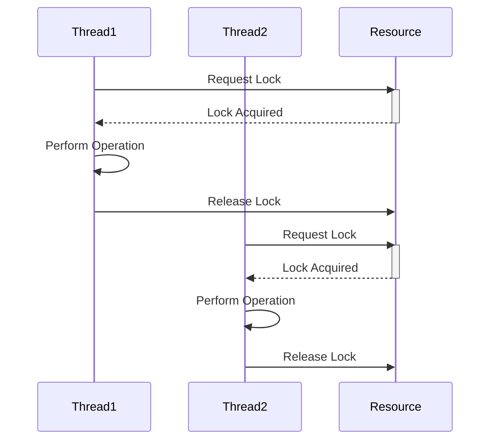

## 18.7 Concurrency Mismanagement

Concurrency is a powerful tool in software development, allowing applications to perform multiple operations simultaneously. However, improper handling of concurrent operations can lead to significant issues such as race conditions, deadlocks, and data corruption. In this section, we will delve into the common pitfalls of concurrency mismanagement in Haxe and explore strategies to mitigate these issues.

### Understanding Concurrency Mismanagement

Concurrency mismanagement occurs when concurrent operations are not properly synchronized, leading to unpredictable behavior and potential data corruption. Let's explore some of the key issues that arise from concurrency mismanagement:

- **Race Conditions:** Occur when two or more threads access shared data simultaneously, and the outcome depends on the order of execution. This can lead to inconsistent or incorrect application states.
- **Deadlocks:** Happen when two or more threads are blocked forever, each waiting for the other to release a resource. This can halt the entire application.
- **Data Corruption:** Results from unsynchronized access to shared data, leading to inconsistent or incorrect data being processed or stored.

### Consequences of Concurrency Mismanagement

The consequences of concurrency mismanagement can be severe, impacting both the functionality and reliability of your application:

- **Unpredictable Behavior:** Bugs that are difficult to reproduce and diagnose, leading to increased development and maintenance costs.
- **Data Corruption:** Inconsistent or incorrect application state, potentially leading to data loss or incorrect results.
- **Performance Degradation:** Inefficient use of resources, resulting in slower application performance.

### Recommendations for Managing Concurrency

To effectively manage concurrency in Haxe, consider the following recommendations:

#### 1. Thread Safety

Ensure that your code is thread-safe by using synchronization mechanisms appropriately. This includes:

- **Locks and Mutexes:** Use locks to ensure that only one thread can access a critical section of code at a time.
- **Atomic Operations:** Use atomic operations for simple data manipulations to avoid the need for locks.
- **Volatile Variables:** Use volatile variables to ensure visibility of changes across threads.

#### 2. Immutable Data Structures

Reduce the need for locks by using immutable data structures. Immutable objects cannot be modified after they are created, eliminating the risk of concurrent modifications. This approach simplifies concurrency management and improves code reliability.

#### 3. Avoiding Deadlocks

To prevent deadlocks, follow these strategies:

- **Resource Ordering:** Always acquire resources in a consistent order to avoid circular dependencies.
- **Timeouts:** Implement timeouts for acquiring locks to prevent indefinite waiting.
- **Deadlock Detection:** Use algorithms to detect and resolve deadlocks dynamically.

#### 4. Using Concurrency Patterns

Leverage concurrency patterns to manage concurrent operations effectively:

- **Producer-Consumer Pattern:** Use this pattern to manage the flow of data between producers and consumers, ensuring that data is processed efficiently.
- **Actor Model:** Use the actor model to encapsulate state and behavior, allowing for safe concurrent execution without shared state.
- **Fork/Join Framework:** Use this framework to divide tasks into smaller subtasks, which can be processed concurrently and then combined.

### Code Examples

Let's explore some code examples to illustrate these concepts in Haxe.

#### Example 1: Using Locks for Thread Safety

```haxe
import sys.thread.Mutex;

class Counter {
    private var count:Int = 0;
    private var mutex:Mutex = new Mutex();

    public function increment():Void {
        mutex.lock();
        try {
            count++;
        } finally {
            mutex.unlock();
        }
    }

    public function getCount():Int {
        return count;
    }
}

class Main {
    static function main() {
        var counter = new Counter();
        // Simulate concurrent access
        for (i in 0...10) {
            sys.thread.Thread.create(() -> counter.increment());
        }
        // Wait for threads to complete
        sys.thread.Thread.sleep(1000);
        trace("Final count: " + counter.getCount());
    }
}
```

In this example, we use a `Mutex` to ensure that only one thread can increment the counter at a time, preventing race conditions.

#### Example 2: Using Immutable Data Structures

```haxe
class ImmutablePoint {
    public final x:Int;
    public final y:Int;

    public function new(x:Int, y:Int) {
        this.x = x;
        this.y = y;
    }

    public function move(dx:Int, dy:Int):ImmutablePoint {
        return new ImmutablePoint(x + dx, y + dy);
    }
}

class Main {
    static function main() {
        var point = new ImmutablePoint(0, 0);
        var movedPoint = point.move(5, 10);
        trace("Original Point: (" + point.x + ", " + point.y + ")");
        trace("Moved Point: (" + movedPoint.x + ", " + movedPoint.y + ")");
    }
}
```

Here, `ImmutablePoint` is an immutable data structure, ensuring that its state cannot be modified after creation.

### Visualizing Concurrency Concepts

To better understand concurrency concepts, let's visualize a common scenario using a Mermaid.js diagram.



**Diagram Description:** This sequence diagram illustrates how two threads acquire and release a lock on a shared resource, ensuring that only one thread can access the resource at a time.

### References and Further Reading

For more information on concurrency and synchronization, consider the following resources:

- [MDN Web Docs: Concurrency](https://developer.mozilla.org/en-US/docs/Web/JavaScript/EventLoop)
- [W3Schools: JavaScript Concurrency](https://www.w3schools.com/js/js_concurrency.asp)

### Knowledge Check

Let's test your understanding of concurrency mismanagement with some questions and challenges.

1. **What is a race condition, and how can it be prevented?**
2. **Explain the concept of deadlock and how to avoid it.**
3. **Why are immutable data structures beneficial in concurrent programming?**
4. **What is the producer-consumer pattern, and how does it help manage concurrency?**

### Embrace the Journey

Remember, mastering concurrency is a journey. As you progress, you'll build more robust and efficient applications. Keep experimenting, stay curious, and enjoy the journey!

### Quiz Time!



### What is a race condition?

- [x] A situation where the outcome depends on the order of execution of threads
- [ ] A situation where threads are blocked indefinitely
- [ ] A situation where data is always consistent
- [ ] A situation where threads never access shared data

> **Explanation:** A race condition occurs when the outcome of a program depends on the sequence or timing of uncontrollable events, such as thread execution order.

### How can deadlocks be avoided?

- [x] By acquiring resources in a consistent order
- [ ] By using more threads
- [ ] By ignoring resource dependencies
- [ ] By using mutable data structures

> **Explanation:** Acquiring resources in a consistent order helps prevent circular dependencies, which can lead to deadlocks.

### What is the benefit of using immutable data structures?

- [x] They eliminate the risk of concurrent modifications
- [ ] They require more locks
- [ ] They are always faster
- [ ] They are mutable

> **Explanation:** Immutable data structures cannot be modified after creation, reducing the need for locks and preventing concurrent modifications.

### What is the producer-consumer pattern?

- [x] A pattern that manages the flow of data between producers and consumers
- [ ] A pattern that increases the number of threads
- [ ] A pattern that eliminates the need for synchronization
- [ ] A pattern that blocks all threads

> **Explanation:** The producer-consumer pattern helps manage the flow of data between producers and consumers, ensuring efficient data processing.

### What is an atomic operation?

- [x] An operation that completes in a single step without interruption
- [ ] An operation that requires multiple locks
- [ ] An operation that is always slow
- [ ] An operation that modifies multiple variables

> **Explanation:** An atomic operation is one that completes in a single step without the possibility of interference from other operations.

### What is a mutex used for?

- [x] To ensure exclusive access to a resource
- [ ] To increase the number of threads
- [ ] To make data mutable
- [ ] To eliminate the need for synchronization

> **Explanation:** A mutex is used to ensure that only one thread can access a resource at a time, preventing race conditions.

### How can timeouts help prevent deadlocks?

- [x] By preventing indefinite waiting for a resource
- [ ] By increasing the number of threads
- [ ] By making data mutable
- [ ] By eliminating the need for synchronization

> **Explanation:** Timeouts can prevent threads from waiting indefinitely for a resource, reducing the risk of deadlocks.

### What is a volatile variable?

- [x] A variable that ensures visibility of changes across threads
- [ ] A variable that is always mutable
- [ ] A variable that requires multiple locks
- [ ] A variable that is always slow

> **Explanation:** A volatile variable ensures that changes made by one thread are visible to other threads, preventing stale data.

### What is the actor model?

- [x] A model that encapsulates state and behavior for safe concurrent execution
- [ ] A model that increases the number of threads
- [ ] A model that eliminates the need for synchronization
- [ ] A model that blocks all threads

> **Explanation:** The actor model encapsulates state and behavior, allowing for safe concurrent execution without shared state.

### True or False: Immutable data structures require more locks.

- [ ] True
- [x] False

> **Explanation:** Immutable data structures do not require locks because they cannot be modified after creation, reducing the need for synchronization.


