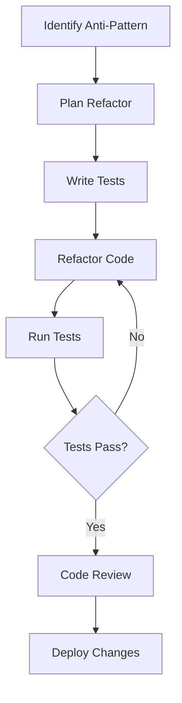

## 18.8 Strategies for Refactoring Anti-Patterns

In the journey of software development, encountering anti-patterns is inevitable. These are common responses to recurring problems that are ineffective and counterproductive. In this section, we will explore strategies for refactoring anti-patterns in Haxe, focusing on incremental changes, automated testing, and code reviews to enhance code quality.

### Understanding Anti-Patterns

Before diving into refactoring strategies, it's crucial to understand what anti-patterns are. Anti-patterns are poor solutions to common design problems. They often arise from a lack of understanding of design principles or from taking shortcuts. Over time, they can lead to code that is difficult to maintain, understand, and extend.

### Common Anti-Patterns in Haxe

Let's briefly discuss some common anti-patterns you might encounter in Haxe development:

- **Spaghetti Code:** Code with a complex and tangled control structure, making it difficult to follow.
- **God Object:** A single class that knows too much or does too much, violating the Single Responsibility Principle.
- **Copy-Paste Programming:** Reusing code by copying and pasting, leading to duplication and inconsistency.
- **Magic Numbers:** Using hard-coded numbers in code, which can be unclear and error-prone.

### Strategies for Refactoring Anti-Patterns

Refactoring anti-patterns involves transforming poor design choices into more efficient and maintainable code. Here are some strategies to achieve this:

#### Incremental Refactoring

**Approach:** Make small, manageable changes.

Incremental refactoring is about making small, manageable changes to the codebase. This approach minimizes risk and allows for continuous improvement. Here's how to implement it:

1. **Identify the Anti-Pattern:** Use static analysis tools to identify code smells and anti-patterns.
2. **Plan the Refactor:** Break down the refactoring process into small, achievable tasks.
3. **Refactor in Small Steps:** Make one change at a time, ensuring each step is tested and verified.

**Example:**

Let's refactor a simple example of a God Object in Haxe:

```haxe
class GodObject {
    public var name:String;
    public var age:Int;
    public var address:String;
    public var salary:Float;

    public function new(name:String, age:Int, address:String, salary:Float) {
        this.name = name;
        this.age = age;
        this.address = address;
        this.salary = salary;
    }

    public function printDetails():Void {
        trace("Name: " + name);
        trace("Age: " + age);
        trace("Address: " + address);
        trace("Salary: " + salary);
    }

    public function calculateBonus():Float {
        return salary * 0.1;
    }
}
```

**Refactored Version:**

```haxe
class Person {
    public var name:String;
    public var age:Int;
    public var address:String;

    public function new(name:String, age:Int, address:String) {
        this.name = name;
        this.age = age;
        this.address = address;
    }

    public function printDetails():Void {
        trace("Name: " + name);
        trace("Age: " + age);
        trace("Address: " + address);
    }
}

class Employee extends Person {
    public var salary:Float;

    public function new(name:String, age:Int, address:String, salary:Float) {
        super(name, age, address);
        this.salary = salary;
    }

    public function calculateBonus():Float {
        return salary * 0.1;
    }
}
```

**Explanation:** We split the GodObject into two classes: `Person` and `Employee`, adhering to the Single Responsibility Principle.

#### Automated Testing

**Approach:** Ensure functionality remains consistent.

Automated testing is crucial when refactoring code. It ensures that changes do not introduce new bugs. Here's how to integrate automated testing into your refactoring process:

1. **Write Tests Before Refactoring:** Ensure you have comprehensive test coverage before making changes.
2. **Run Tests Frequently:** Run tests after each small change to verify functionality.
3. **Use Continuous Integration:** Automate the testing process with CI tools to catch issues early.

**Example:**

Let's write a simple test for the `calculateBonus` method:

```haxe
import haxe.unit.TestCase;

class EmployeeTest extends TestCase {
    public function testCalculateBonus():Void {
        var employee = new Employee("John Doe", 30, "123 Main St", 50000);
        assertEquals(5000, employee.calculateBonus());
    }
}
```

**Explanation:** This test ensures that the `calculateBonus` method returns the correct bonus amount.

#### Code Reviews

**Approach:** Collaborate with team members to improve code quality.

Code reviews are an effective way to catch anti-patterns and improve code quality. They provide an opportunity for developers to share knowledge and learn from each other. Here's how to conduct effective code reviews:

1. **Establish Guidelines:** Set clear guidelines for what to look for in a code review.
2. **Focus on the Code, Not the Developer:** Provide constructive feedback focused on the code, not the person.
3. **Encourage Discussion:** Use code reviews as an opportunity to discuss design decisions and alternatives.

**Example:**

During a code review, a team member might suggest replacing magic numbers with constants:

```haxe
class Constants {
    public static final BONUS_PERCENTAGE:Float = 0.1;
}

class Employee {
    // ...
    public function calculateBonus():Float {
        return salary * Constants.BONUS_PERCENTAGE;
    }
}
```

**Explanation:** Using constants improves code readability and maintainability.

#### Tools for Refactoring

Utilizing the right tools can significantly ease the refactoring process. Here are some tools and techniques to consider:

- **Refactoring Tools:** Many IDEs offer built-in refactoring tools that automate common tasks like renaming variables or extracting methods.
- **Static Analysis:** Tools like SonarQube can identify code smells and anti-patterns, providing a starting point for refactoring.

**Example:**

Using a refactoring tool, you can easily rename a variable across the entire codebase without manually searching and replacing.

#### Visualizing the Refactoring Process

To better understand the refactoring process, let's visualize it using a flowchart:



**Explanation:** This flowchart illustrates the iterative process of identifying, planning, testing, refactoring, and reviewing code changes.

### Try It Yourself

Now that we've covered the strategies for refactoring anti-patterns, it's time to try it yourself. Take a piece of code that you suspect contains an anti-pattern and apply the strategies we've discussed. Experiment with different refactoring techniques and see how they improve the code.

### Knowledge Check

To reinforce your understanding, consider the following questions:

- What are the benefits of incremental refactoring?
- How can automated testing help during refactoring?
- Why are code reviews important in the refactoring process?
- What tools can assist in identifying anti-patterns?

### Embrace the Journey

Remember, refactoring is an ongoing process. As you continue to develop your skills, you'll become more adept at identifying and addressing anti-patterns. Keep experimenting, stay curious, and enjoy the journey!

## Quiz Time!



### What is an anti-pattern?

- [x] A poor solution to a common design problem
- [ ] A well-established design pattern
- [ ] A type of software bug
- [ ] A programming language feature

> **Explanation:** An anti-pattern is a poor solution to a common design problem that is ineffective and counterproductive.

### What is the first step in incremental refactoring?

- [x] Identify the anti-pattern
- [ ] Write tests
- [ ] Refactor the code
- [ ] Deploy changes

> **Explanation:** The first step in incremental refactoring is to identify the anti-pattern in the code.

### How does automated testing help during refactoring?

- [x] Ensures functionality remains consistent
- [ ] Increases code complexity
- [ ] Eliminates the need for code reviews
- [ ] Reduces the need for documentation

> **Explanation:** Automated testing ensures that functionality remains consistent during refactoring by catching any issues early.

### What is a benefit of code reviews?

- [x] Improves code quality through collaboration
- [ ] Eliminates the need for testing
- [ ] Increases development time
- [ ] Reduces team communication

> **Explanation:** Code reviews improve code quality by allowing team members to collaborate and share knowledge.

### Which tool can identify code smells and anti-patterns?

- [x] Static analysis tools
- [ ] Text editors
- [ ] Compilers
- [ ] Debuggers

> **Explanation:** Static analysis tools can identify code smells and anti-patterns, providing a starting point for refactoring.

### What is a common anti-pattern in Haxe?

- [x] God Object
- [ ] Singleton Pattern
- [ ] Factory Method
- [ ] Observer Pattern

> **Explanation:** A God Object is a common anti-pattern where a single class knows too much or does too much.

### Why is it important to write tests before refactoring?

- [x] To ensure existing functionality is preserved
- [ ] To increase code complexity
- [ ] To eliminate the need for code reviews
- [ ] To reduce development time

> **Explanation:** Writing tests before refactoring ensures that existing functionality is preserved and any changes do not introduce new bugs.

### What is the purpose of using constants instead of magic numbers?

- [x] To improve code readability and maintainability
- [ ] To increase code complexity
- [ ] To reduce code size
- [ ] To eliminate the need for documentation

> **Explanation:** Using constants instead of magic numbers improves code readability and maintainability by making the code clearer and less error-prone.

### What is the role of continuous integration in refactoring?

- [x] Automates the testing process to catch issues early
- [ ] Increases code complexity
- [ ] Eliminates the need for code reviews
- [ ] Reduces team communication

> **Explanation:** Continuous integration automates the testing process, allowing issues to be caught early during refactoring.

### True or False: Refactoring is a one-time process.

- [ ] True
- [x] False

> **Explanation:** Refactoring is an ongoing process that involves continuously improving code quality over time.




