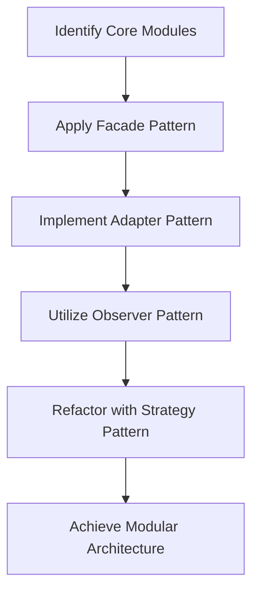

## 18.9 Lessons from Real-World Examples

In this section, we delve into real-world examples that illustrate the practical application of Haxe design patterns. By examining case studies and extracting insights, we aim to provide you with a deeper understanding of how these patterns can be leveraged to solve complex software engineering challenges. Let's explore two significant case studies: the transformation of a legacy system and performance tuning in a Haxe application. Additionally, we'll discuss insights into cultural change and continuous improvement within development teams.

### Case Studies

#### Legacy System Overhaul: Transforming a Monolithic Application into a Modular System

Legacy systems often pose significant challenges due to their monolithic architecture, which can hinder scalability, maintainability, and adaptability. In this case study, we explore how a Haxe-based legacy system was transformed into a modular system using design patterns.

**Background:**

The legacy system in question was a large-scale enterprise application developed over a decade ago. It was built using a monolithic architecture, which made it difficult to introduce new features, fix bugs, and scale the application to meet growing demands. The system's complexity had increased over time, leading to a tangled codebase that was challenging to maintain.

**Challenges:**

1. **Tight Coupling:** The monolithic architecture resulted in tightly coupled components, making it difficult to isolate and modify specific parts of the system.
2. **Scalability Issues:** As the user base grew, the system struggled to handle increased load, leading to performance bottlenecks.
3. **Maintenance Overhead:** The complexity of the codebase made it challenging for developers to understand and modify the system, leading to increased maintenance costs.

**Solution:**

To address these challenges, the development team embarked on a journey to refactor the legacy system into a modular architecture using Haxe design patterns. The key steps in this transformation included:

1. **Identifying Core Modules:** The team began by identifying core modules within the monolithic system. These modules represented distinct functionalities that could be isolated and refactored independently.

2. **Applying the Facade Pattern:** The Facade pattern was used to create a simplified interface for each module, hiding the complexity of the underlying implementation. This allowed the team to decouple modules and reduce dependencies.

3. **Implementing the Adapter Pattern:** The Adapter pattern was employed to ensure compatibility between the refactored modules and existing components. This pattern facilitated the integration of new modules without disrupting the overall system.

4. **Utilizing the Observer Pattern:** The Observer pattern was introduced to enable communication between modules. This pattern allowed modules to subscribe to events and react to changes, promoting loose coupling and enhancing scalability.

5. **Refactoring with the Strategy Pattern:** The Strategy pattern was used to encapsulate algorithms and business logic within modules. This approach allowed the team to easily swap out and modify strategies without affecting other parts of the system.

**Outcome:**

The transformation of the legacy system into a modular architecture resulted in several benefits:

- **Improved Scalability:** The modular design allowed the system to scale more effectively, handling increased user load without performance degradation.
- **Enhanced Maintainability:** The decoupled modules made it easier for developers to understand and modify the system, reducing maintenance overhead.
- **Faster Feature Development:** The modular architecture enabled the team to introduce new features more rapidly, improving time-to-market.

#### Performance Tuning: Addressing Premature Optimization and Focusing on Critical Bottlenecks

Performance optimization is a crucial aspect of software development, but it can often lead to premature optimization, where developers focus on optimizing non-critical parts of the codebase. In this case study, we explore how a Haxe application was optimized by addressing critical bottlenecks.

**Background:**

The application in question was a cross-platform game developed using Haxe. While the game performed well on most platforms, it experienced performance issues on certain devices, leading to a suboptimal user experience.

**Challenges:**

1. **Identifying Bottlenecks:** The development team struggled to pinpoint the exact areas of the codebase that were causing performance issues.
2. **Premature Optimization:** Initial attempts to optimize the application focused on non-critical parts of the code, leading to wasted effort and minimal performance gains.

**Solution:**

To effectively optimize the application, the team adopted a systematic approach to performance tuning:

1. **Profiling the Application:** The team used profiling tools to analyze the application's performance and identify critical bottlenecks. This step was crucial in understanding which parts of the codebase required optimization.

2. **Applying the Flyweight Pattern:** The Flyweight pattern was used to reduce memory consumption by sharing common data across multiple objects. This pattern was particularly useful in optimizing the rendering of game assets.

3. **Implementing Lazy Initialization:** Lazy initialization was employed to defer the creation of expensive objects until they were needed. This approach reduced the application's startup time and improved overall performance.

4. **Optimizing Algorithms:** The team focused on optimizing algorithms that were identified as bottlenecks. This involved refining data structures and improving the efficiency of key operations.

5. **Caching and Memoization:** Caching and memoization techniques were used to store and reuse results of expensive computations, reducing redundant processing and improving performance.

**Outcome:**

The performance tuning efforts resulted in significant improvements:

- **Enhanced Performance:** The application experienced a noticeable boost in performance, particularly on devices that previously struggled to run the game smoothly.
- **Efficient Resource Utilization:** The use of design patterns such as Flyweight and Lazy Initialization led to more efficient use of system resources.
- **Targeted Optimization:** By focusing on critical bottlenecks, the team achieved meaningful performance gains without unnecessary optimization efforts.

### Insights

#### Cultural Change: Encouraging Best Practices Requires Team Alignment

Implementing design patterns and best practices in a development team often requires a cultural shift. Here are some insights into fostering a culture of best practices:

1. **Promote Knowledge Sharing:** Encourage team members to share their knowledge and experiences with design patterns. This can be achieved through regular workshops, code reviews, and collaborative discussions.

2. **Lead by Example:** Team leaders and senior developers should lead by example, demonstrating the benefits of using design patterns and best practices in their own work.

3. **Provide Training and Resources:** Offer training sessions and provide resources such as books, articles, and online courses to help team members understand and apply design patterns effectively.

4. **Foster a Collaborative Environment:** Create an environment where team members feel comfortable discussing and experimenting with design patterns. Encourage open communication and collaboration to drive innovation and improvement.

#### Continuous Improvement: Regularly Revisiting and Refining Codebases

Continuous improvement is essential for maintaining a high-quality codebase. Here are some strategies for fostering continuous improvement:

1. **Conduct Regular Code Reviews:** Regular code reviews provide an opportunity to identify areas for improvement and ensure that design patterns are applied consistently across the codebase.

2. **Embrace Refactoring:** Encourage developers to refactor code regularly to improve its structure and maintainability. Refactoring should be seen as an ongoing process rather than a one-time task.

3. **Set Clear Goals and Metrics:** Define clear goals and metrics for code quality and performance. Use these metrics to track progress and identify areas for improvement.

4. **Encourage Experimentation:** Allow developers to experiment with new design patterns and techniques. Encourage them to explore innovative solutions and share their findings with the team.

5. **Celebrate Successes:** Recognize and celebrate successes in applying design patterns and improving the codebase. This helps to reinforce the importance of continuous improvement and motivates the team to strive for excellence.

### Visualizing the Transformation Process

To better understand the transformation process of a legacy system into a modular architecture, let's visualize the key steps using a Mermaid.js diagram.

**Diagram Description:** This flowchart illustrates the transformation process of a legacy system into a modular architecture. It highlights the key steps involved, including identifying core modules, applying the Facade pattern, implementing the Adapter pattern, utilizing the Observer pattern, and refactoring with the Strategy pattern to achieve a modular architecture.

### Try It Yourself

To reinforce your understanding of the concepts discussed in this section, try experimenting with the following exercises:

1. **Refactor a Monolithic Application:** Take a small monolithic application and refactor it into a modular architecture using the design patterns discussed in this section. Focus on decoupling components and improving scalability.

2. **Optimize a Haxe Application:** Identify a Haxe application that could benefit from performance optimization. Use profiling tools to pinpoint bottlenecks and apply design patterns such as Flyweight and Lazy Initialization to improve performance.

3. **Conduct a Code Review:** Organize a code review session with your team to identify areas for improvement in your codebase. Discuss how design patterns can be applied to enhance maintainability and scalability.

### References and Links

- [MDN Web Docs: Design Patterns](https://developer.mozilla.org/en-US/docs/Web/JavaScript/Guide/Design_Patterns)
- [Refactoring Guru: Design Patterns](https://refactoring.guru/design-patterns)
- [Haxe Manual: Patterns](https://haxe.org/manual/lf-patterns.html)

### Knowledge Check

To test your understanding of the concepts covered in this section, try answering the following questions:

## Quiz Time!



### Which pattern is used to create a simplified interface for a module?

- [x] Facade Pattern
- [ ] Adapter Pattern
- [ ] Observer Pattern
- [ ] Strategy Pattern

> **Explanation:** The Facade pattern is used to create a simplified interface for a module, hiding the complexity of the underlying implementation.

### What is the primary benefit of using the Flyweight pattern?

- [x] Reducing memory consumption
- [ ] Improving algorithm efficiency
- [ ] Enhancing communication between modules
- [ ] Simplifying interface design

> **Explanation:** The Flyweight pattern reduces memory consumption by sharing common data across multiple objects.

### Which pattern facilitates communication between modules in a modular architecture?

- [ ] Facade Pattern
- [ ] Adapter Pattern
- [x] Observer Pattern
- [ ] Strategy Pattern

> **Explanation:** The Observer pattern facilitates communication between modules by allowing them to subscribe to events and react to changes.

### What is the main goal of lazy initialization?

- [x] Deferring the creation of expensive objects
- [ ] Simplifying interface design
- [ ] Enhancing algorithm efficiency
- [ ] Reducing memory consumption

> **Explanation:** Lazy initialization defers the creation of expensive objects until they are needed, reducing startup time and improving performance.

### Which of the following is a key strategy for fostering continuous improvement?

- [x] Conducting regular code reviews
- [ ] Focusing on premature optimization
- [ ] Ignoring refactoring
- [ ] Avoiding experimentation

> **Explanation:** Conducting regular code reviews is a key strategy for fostering continuous improvement by identifying areas for enhancement and ensuring consistent application of design patterns.

### What is a common challenge when transforming a monolithic application into a modular system?

- [x] Tight coupling of components
- [ ] Lack of design patterns
- [ ] Excessive memory consumption
- [ ] Simplified interface design

> **Explanation:** A common challenge in transforming a monolithic application into a modular system is the tight coupling of components, which makes it difficult to isolate and modify specific parts of the system.

### How can team leaders encourage the use of design patterns?

- [x] Leading by example
- [ ] Avoiding knowledge sharing
- [ ] Focusing on non-critical parts of the code
- [ ] Discouraging experimentation

> **Explanation:** Team leaders can encourage the use of design patterns by leading by example and demonstrating their benefits in their own work.

### What is the primary focus of performance tuning in a Haxe application?

- [x] Addressing critical bottlenecks
- [ ] Optimizing non-critical parts of the code
- [ ] Simplifying interface design
- [ ] Enhancing communication between modules

> **Explanation:** The primary focus of performance tuning in a Haxe application is addressing critical bottlenecks to achieve meaningful performance gains.

### Which pattern is used to ensure compatibility between refactored modules and existing components?

- [ ] Facade Pattern
- [x] Adapter Pattern
- [ ] Observer Pattern
- [ ] Strategy Pattern

> **Explanation:** The Adapter pattern is used to ensure compatibility between refactored modules and existing components, facilitating integration without disrupting the overall system.

### True or False: Continuous improvement involves regularly revisiting and refining codebases.

- [x] True
- [ ] False

> **Explanation:** Continuous improvement involves regularly revisiting and refining codebases to maintain high quality and adapt to changing requirements.



Remember, this is just the beginning. As you progress, you'll build more complex and efficient systems using Haxe design patterns. Keep experimenting, stay curious, and enjoy the journey!
