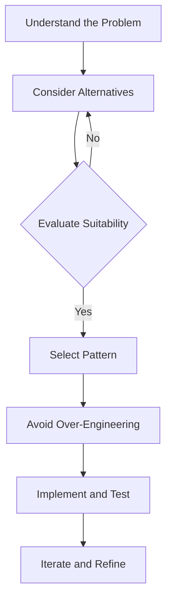

## 19.1 Selecting Appropriate Design Patterns

In the realm of software development, design patterns serve as time-tested solutions to common problems. For Haxe developers, selecting the right design pattern is crucial for building efficient, maintainable, and scalable cross-platform applications. This section will guide you through the process of selecting appropriate design patterns, emphasizing the unique features of Haxe and how they can be leveraged to enhance your software architecture.

### Understanding the Problem

Before diving into the selection of a design pattern, it is imperative to thoroughly understand the problem at hand. This involves:

- **Analyzing Requirements:** Break down the problem into smaller components and understand the specific requirements. Consider both functional and non-functional requirements.
- **Identifying Constraints:** Determine any constraints such as performance, scalability, or platform-specific limitations.
- **Defining Objectives:** Clearly outline the objectives you aim to achieve with the design pattern, such as code reusability, flexibility, or simplicity.

#### Example Scenario

Imagine you are developing a cross-platform mobile application with Haxe. The application needs to manage user sessions, handle different user interfaces for various platforms, and ensure data consistency across devices. Understanding these requirements will guide you in selecting the right design patterns.

### Consider Alternatives

Once you have a clear understanding of the problem, consider multiple design patterns that could potentially address the issue. Evaluate each pattern based on:

- **Suitability:** How well does the pattern fit the problem? Does it address the core issues effectively?
- **Complexity:** Is the pattern overly complex for the problem at hand? Simplicity is often key.
- **Flexibility:** Does the pattern allow for future changes or extensions without significant rework?
- **Performance:** Consider the performance implications of the pattern, especially in resource-constrained environments.

#### Example Patterns

For the mobile application scenario, you might consider the following patterns:

- **Singleton Pattern:** To manage a single instance of the user session across the application.
- **Adapter Pattern:** To handle different user interfaces for various platforms.
- **Observer Pattern:** To ensure data consistency by notifying all parts of the application when data changes.

### Avoid Over-Engineering

One of the common pitfalls in design pattern selection is over-engineering. This occurs when developers force patterns into their designs unnecessarily, leading to increased complexity and reduced maintainability. To avoid this:

- **Use Patterns Judiciously:** Only apply patterns where they provide clear benefits.
- **Prioritize Simplicity:** Favor simple solutions over complex ones unless complexity is justified.
- **Iterate and Refine:** Start with a simple design and iterate based on feedback and evolving requirements.

### Resources for Selecting Design Patterns

To aid in the selection of appropriate design patterns, leverage the following resources:

- **Pattern Catalogs:** Refer to well-known pattern catalogs such as the Gang of Four book or online repositories like [Refactoring.Guru](https://refactoring.guru/design-patterns).
- **Community Input:** Engage with the Haxe community through forums, meetups, or online platforms to gain insights and advice from experienced developers.
- **Expert Consultation:** Seek guidance from software architects or experts who have experience with similar projects.

### Key Considerations for Haxe Developers

Haxe's unique features, such as its powerful macro system, static typing, and multi-paradigm support, offer distinct advantages when implementing design patterns. Consider the following:

- **Macros for Code Generation:** Use Haxe macros to automate repetitive tasks and generate boilerplate code for patterns like the Factory Method or Builder.
- **Static Typing for Safety:** Leverage Haxe's static typing to ensure type safety and reduce runtime errors when implementing patterns.
- **Cross-Platform Capabilities:** Design patterns should be chosen with cross-platform compatibility in mind, ensuring that the solution works seamlessly across different targets.

### Sample Code Snippet

Let's explore a simple example of the Singleton pattern in Haxe. This pattern ensures that a class has only one instance and provides a global point of access to it.

```haxe
class Singleton {
    private static var instance:Singleton;

    // Private constructor to prevent instantiation
    private function new() {}

    public static function getInstance():Singleton {
        if (instance == null) {
            instance = new Singleton();
        }
        return instance;
    }

    public function doSomething():Void {
        trace("Singleton instance is doing something!");
    }
}

// Usage
class Main {
    static function main() {
        var singleton = Singleton.getInstance();
        singleton.doSomething();
    }
}
```

In this example, the `Singleton` class has a private constructor and a static method `getInstance()` that returns the single instance of the class. This ensures that only one instance of the `Singleton` class is created.

### Try It Yourself

Encourage experimentation by modifying the code example. Try adding a method to the `Singleton` class that tracks how many times the instance has been accessed. This will help reinforce the concept of maintaining a single instance.

### Visualizing Design Pattern Selection

To better understand the process of selecting design patterns, let's visualize it using a flowchart.



This flowchart illustrates the iterative process of selecting and implementing design patterns, emphasizing the importance of understanding the problem, evaluating alternatives, and avoiding over-engineering.

### Knowledge Check

To reinforce your understanding, consider the following questions:

- What are the key factors to consider when selecting a design pattern?
- How can Haxe's unique features be leveraged when implementing design patterns?
- Why is it important to avoid over-engineering when applying design patterns?

### Embrace the Journey

Remember, selecting the right design pattern is an art as much as it is a science. As you gain experience, you'll develop an intuition for choosing the most appropriate patterns for different scenarios. Keep experimenting, stay curious, and enjoy the journey of mastering Haxe design patterns!

## Quiz Time!



### What is the first step in selecting an appropriate design pattern?

- [x] Understanding the problem
- [ ] Implementing the pattern
- [ ] Evaluating performance
- [ ] Consulting with peers

> **Explanation:** The first step is to thoroughly understand the problem to ensure the selected pattern addresses the core issues effectively.

### Why is it important to consider multiple design patterns?

- [x] To evaluate suitability and flexibility
- [ ] To increase complexity
- [ ] To ensure over-engineering
- [ ] To avoid simplicity

> **Explanation:** Considering multiple patterns allows you to evaluate their suitability, complexity, and flexibility for the problem at hand.

### What is a common pitfall when selecting design patterns?

- [x] Over-engineering
- [ ] Under-engineering
- [ ] Ignoring performance
- [ ] Avoiding simplicity

> **Explanation:** Over-engineering occurs when patterns are forced into designs unnecessarily, leading to increased complexity.

### Which Haxe feature can be leveraged for code generation in design patterns?

- [x] Macros
- [ ] Interfaces
- [ ] Enums
- [ ] Abstract types

> **Explanation:** Haxe's powerful macro system can be used for code generation, automating repetitive tasks and generating boilerplate code.

### What is the purpose of the Singleton pattern?

- [x] To ensure a class has only one instance
- [ ] To create multiple instances of a class
- [ ] To provide a global point of access to a class
- [ ] To encapsulate object creation

> **Explanation:** The Singleton pattern ensures that a class has only one instance and provides a global point of access to it.

### How can Haxe's static typing benefit design pattern implementation?

- [x] By ensuring type safety and reducing runtime errors
- [ ] By increasing code complexity
- [ ] By allowing dynamic typing
- [ ] By enabling runtime polymorphism

> **Explanation:** Haxe's static typing ensures type safety, reducing runtime errors and enhancing the reliability of design pattern implementations.

### What should be prioritized when selecting a design pattern?

- [x] Simplicity
- [ ] Complexity
- [ ] Over-engineering
- [ ] Performance

> **Explanation:** Simplicity should be prioritized to avoid unnecessary complexity and ensure maintainability.

### Which resource can be used to aid in design pattern selection?

- [x] Pattern catalogs
- [ ] Code obfuscators
- [ ] Debugging tools
- [ ] Version control systems

> **Explanation:** Pattern catalogs, such as the Gang of Four book, provide a comprehensive list of design patterns and their applications.

### What is the role of community input in design pattern selection?

- [x] To gain insights and advice from experienced developers
- [ ] To increase project complexity
- [ ] To avoid peer review
- [ ] To ensure over-engineering

> **Explanation:** Community input provides valuable insights and advice from experienced developers, aiding in the selection of appropriate design patterns.

### True or False: Over-engineering is beneficial when applying design patterns.

- [ ] True
- [x] False

> **Explanation:** Over-engineering is not beneficial as it leads to increased complexity and reduced maintainability.


