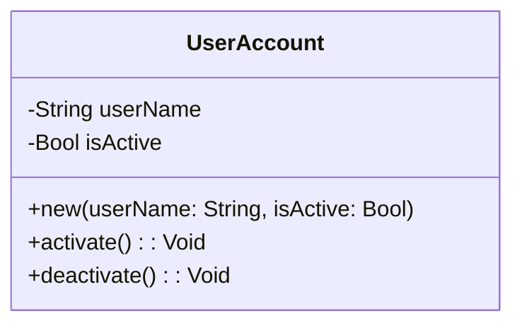

## 19.2 Writing Clean and Maintainable Code

In the realm of software development, writing clean and maintainable code is not just a best practice—it's a necessity. As expert developers and architects working with Haxe, a language renowned for its cross-platform capabilities, we must ensure our code is not only functional but also easy to read, understand, and modify. This section delves into the principles and practices that underpin clean and maintainable code, providing you with the tools to write code that stands the test of time.

### Principles of Clean Code

#### Readability

**Readability** is the cornerstone of clean code. Code that is easy to read is easier to understand, debug, and extend. To achieve readability, consider the following:

- **Use Descriptive Names:** Choose names that convey the purpose of variables, functions, and classes. Avoid abbreviations unless they are widely understood.
- **Structure Code Logically:** Organize code in a way that follows the logical flow of the program. Group related functions and classes together.
- **Limit Line Length:** Keep lines of code to a reasonable length to avoid horizontal scrolling and improve readability.

#### Consistency

**Consistency** in coding style helps maintain a uniform look and feel across the codebase, making it easier for developers to navigate and understand the code. To maintain consistency:

- **Adopt a Style Guide:** Use a coding standard or style guide, such as the [Haxe Coding Standards](https://haxe.org/manual/style-guide.html), to ensure uniformity.
- **Use Consistent Naming Conventions:** Stick to a naming convention for variables, functions, and classes throughout the project.
- **Format Code Uniformly:** Use consistent indentation, spacing, and brace placement.

#### Comments and Documentation

**Comments and documentation** provide context and explanations for complex or non-obvious code. They are essential for maintainability:

- **Comment Sparingly:** Use comments to explain why code exists, not what it does. The code should be self-explanatory.
- **Document Public APIs:** Provide documentation for public functions and classes, detailing their purpose, parameters, and return values.
- **Update Comments Regularly:** Ensure comments remain accurate and relevant as the code evolves.

### Practices for Maintainable Code

#### Refactoring

**Refactoring** is the process of restructuring existing code without changing its external behavior. It improves code readability and reduces complexity:

- **Identify Code Smells:** Look for signs of poor design, such as duplicated code, long methods, and large classes.
- **Apply Refactoring Techniques:** Use techniques like extracting methods, renaming variables, and simplifying conditional expressions.
- **Refactor Regularly:** Make refactoring a regular part of the development process to keep the codebase clean and manageable.

#### Naming Conventions

**Naming conventions** are crucial for clarity and understanding. They help convey the purpose and usage of code elements:

- **Use CamelCase for Functions and Variables:** For example, `calculateTotal` or `userName`.
- **Use PascalCase for Classes and Enums:** For example, `UserAccount` or `PaymentStatus`.
- **Prefix Boolean Variables with 'is' or 'has':** For example, `isActive` or `hasPermission`.

### Code Examples

Let's explore some code examples that demonstrate these principles and practices in action.

#### Example 1: Readability and Consistency

```haxe
class UserAccount {
    private var userName: String;
    private var isActive: Bool;

    public function new(userName: String, isActive: Bool) {
        this.userName = userName;
        this.isActive = isActive;
    }

    public function activate(): Void {
        if (!isActive) {
            isActive = true;
            trace('User account activated.');
        }
    }

    public function deactivate(): Void {
        if (isActive) {
            isActive = false;
            trace('User account deactivated.');
        }
    }
}
```

**Explanation:**

- **Descriptive Names:** The class `UserAccount`, variables `userName` and `isActive`, and methods `activate` and `deactivate` have clear, descriptive names.
- **Consistent Naming:** CamelCase is used for function and variable names, while PascalCase is used for the class name.
- **Logical Structure:** The class is structured logically, with related methods grouped together.

#### Example 2: Comments and Documentation

```haxe
/**
 * Represents a bank account with basic operations.
 */
class BankAccount {
    private var balance: Float;

    /**
     * Initializes a new bank account with a given balance.
     * @param initialBalance The starting balance of the account.
     */
    public function new(initialBalance: Float) {
        balance = initialBalance;
    }

    /**
     * Deposits an amount into the account.
     * @param amount The amount to deposit.
     */
    public function deposit(amount: Float): Void {
        balance += amount;
        trace('Deposited: ' + amount);
    }

    /**
     * Withdraws an amount from the account.
     * @param amount The amount to withdraw.
     * @throws String if the balance is insufficient.
     */
    public function withdraw(amount: Float): Void {
        if (amount > balance) {
            throw 'Insufficient balance';
        }
        balance -= amount;
        trace('Withdrew: ' + amount);
    }
}
```

**Explanation:**

- **Class Documentation:** The class `BankAccount` is documented with a brief description of its purpose.
- **Method Documentation:** Each method includes a description, parameter details, and any exceptions thrown.
- **Sparingly Used Comments:** Comments are used to provide context and explain non-obvious code.

### Visualizing Code Structure

To further enhance understanding, let's visualize the structure of the `UserAccount` class using a class diagram.



**Description:** This class diagram illustrates the `UserAccount` class, showing its private variables and public methods.

### Try It Yourself

Now that we've covered the principles and practices of writing clean and maintainable code, it's time to put them into practice. Try modifying the `BankAccount` class to include a method for transferring funds between accounts. Consider how you can apply the principles of readability, consistency, and documentation.

### References and Links

For further reading on clean code and maintainability, consider the following resources:

- [Clean Code: A Handbook of Agile Software Craftsmanship by Robert C. Martin](https://www.oreilly.com/library/view/clean-code-a/9780136083238/)
- [Haxe Coding Standards](https://haxe.org/manual/style-guide.html)
- [Refactoring: Improving the Design of Existing Code by Martin Fowler](https://www.oreilly.com/library/view/refactoring-improving-the/9780134757681/)

### Knowledge Check

Let's reinforce what we've learned with some questions and exercises:

1. **What is the primary goal of readability in code?**
2. **Why is consistency important in a codebase?**
3. **How can comments and documentation improve code maintainability?**
4. **What are some common refactoring techniques?**
5. **How do naming conventions contribute to clean code?**

### Embrace the Journey

Remember, writing clean and maintainable code is a journey, not a destination. As you continue to develop your skills, you'll find new ways to improve your code and make it more efficient and scalable. Keep experimenting, stay curious, and enjoy the process!

## Quiz Time!



### What is the primary goal of readability in code?

- [x] To make code easy to understand
- [ ] To make code run faster
- [ ] To reduce the number of lines of code
- [ ] To increase code complexity

> **Explanation:** Readability is about making code easy to understand, which aids in maintenance and collaboration.

### Why is consistency important in a codebase?

- [x] It helps maintain a uniform look and feel
- [ ] It makes the code run faster
- [ ] It reduces the need for comments
- [ ] It increases the number of lines of code

> **Explanation:** Consistency helps maintain a uniform look and feel, making it easier for developers to navigate and understand the code.

### How can comments and documentation improve code maintainability?

- [x] By providing context and explanations for complex code
- [ ] By reducing the number of lines of code
- [ ] By making the code run faster
- [ ] By increasing code complexity

> **Explanation:** Comments and documentation provide context and explanations, making it easier to understand and maintain the code.

### What are some common refactoring techniques?

- [x] Extracting methods, renaming variables, simplifying conditionals
- [ ] Adding more comments, increasing line length, using more loops
- [ ] Removing all comments, using shorter variable names, increasing complexity
- [ ] Adding more classes, using longer variable names, increasing line length

> **Explanation:** Common refactoring techniques include extracting methods, renaming variables, and simplifying conditionals to improve code structure.

### How do naming conventions contribute to clean code?

- [x] By providing clarity and understanding
- [ ] By making the code run faster
- [ ] By reducing the number of lines of code
- [ ] By increasing code complexity

> **Explanation:** Naming conventions provide clarity and understanding, helping convey the purpose and usage of code elements.

### What is the purpose of refactoring?

- [x] To improve code readability and reduce complexity
- [ ] To make the code run faster
- [ ] To add more features
- [ ] To increase the number of lines of code

> **Explanation:** Refactoring improves code readability and reduces complexity without changing its external behavior.

### Which naming convention is recommended for classes in Haxe?

- [x] PascalCase
- [ ] camelCase
- [ ] snake_case
- [ ] kebab-case

> **Explanation:** PascalCase is recommended for classes and enums in Haxe to maintain consistency and readability.

### What should comments focus on explaining?

- [x] Why code exists
- [ ] What the code does
- [ ] How to write code
- [ ] The history of the code

> **Explanation:** Comments should focus on explaining why code exists, providing context rather than describing what the code does.

### What is a code smell?

- [x] A sign of poor design in the code
- [ ] A feature that makes code run faster
- [ ] A technique for writing more code
- [ ] A method for reducing code lines

> **Explanation:** A code smell is a sign of poor design in the code, indicating areas that may need refactoring.

### True or False: Consistent formatting is not important for code readability.

- [ ] True
- [x] False

> **Explanation:** Consistent formatting is crucial for code readability, as it helps maintain a uniform look and feel across the codebase.


