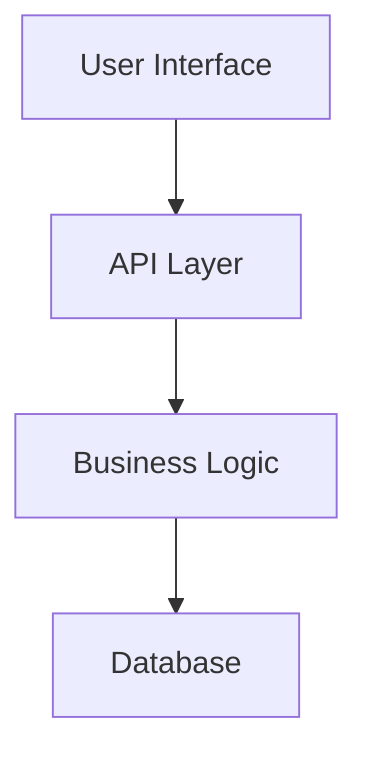
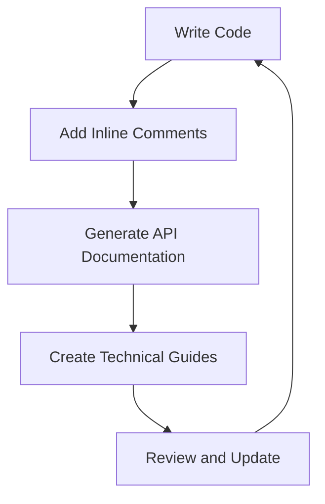

## 19.3 Effective Documentation and Commenting

In the realm of software development, effective documentation and commenting are as crucial as the code itself. They serve as the bridge between the developer's intent and the user's understanding, ensuring that the software is maintainable, scalable, and comprehensible. In this section, we will explore the various types of documentation, the tools available for Haxe developers, and best practices to follow for effective documentation and commenting.

### Types of Documentation

Documentation can be categorized into several types, each serving a distinct purpose. Understanding these categories will help you decide what kind of documentation is necessary for your project.

#### Inline Comments

Inline comments are brief explanations within the code that clarify complex logic or highlight important sections. They are essential for making the code more readable and understandable to others (or even to yourself in the future).

**Example:**

```haxe
class Calculator {
    // Adds two numbers and returns the result
    public static function add(a: Int, b: Int): Int {
        return a + b; // Simple addition
    }
}
```

In this example, the inline comment explains the purpose of the `add` function and the operation performed within it.

#### API Documentation

API documentation provides detailed descriptions of public interfaces, including classes, methods, and properties. It is crucial for users who interact with your code, as it explains how to use the API effectively.

**Example:**

```haxe
/**
 * Represents a simple calculator.
 */
class Calculator {
    /**
     * Adds two numbers.
     * @param a The first number.
     * @param b The second number.
     * @return The sum of the two numbers.
     */
    public static function add(a: Int, b: Int): Int {
        return a + b;
    }
}
```

Here, the API documentation includes a class description and detailed information about the `add` method, its parameters, and its return value.

#### Technical Guides

Technical guides provide overviews of system architecture and design decisions. They are invaluable for onboarding new team members and for maintaining a coherent understanding of the system as it evolves.

**Example:**

A technical guide might include a diagram of the system architecture, explaining how different components interact and the rationale behind certain design choices.



*Diagram: System Architecture Overview*

### Tools for Documentation

Several tools can assist in creating and maintaining documentation for Haxe projects. These tools help automate the generation of documentation and ensure consistency across the project.

#### Documentation Generators

Documentation generators like `dox` are specifically designed for Haxe code. They parse the codebase and generate HTML documentation from comments and annotations.

- **Dox**: A documentation generator for Haxe that produces clean, readable HTML documentation. It supports Markdown and can be customized to fit your project's needs.

#### Markdown Files

Markdown files are a versatile format for creating README files and additional documentation. They are easy to write and read, and they can be rendered in various environments, including GitHub and other version control platforms.

**Example:**

```markdown

## Overview
This project is a simple calculator application developed in Haxe.

## Features
- Addition
- Subtraction
- Multiplication
- Division

## Installation
1. Clone the repository.
2. Run `haxe build.hxml` to compile the project.
```

### Best Practices for Documentation

Effective documentation is not just about writing; it's about maintaining and ensuring that it serves its purpose throughout the project's lifecycle.

#### Keep It Updated

Documentation should always reflect the current state of the code. Outdated documentation can be misleading and counterproductive.

- **Regular Reviews**: Schedule regular reviews of your documentation to ensure it remains accurate and relevant.
- **Version Control**: Use version control systems to track changes in documentation alongside code changes.

#### Focus on Why

While it's important to document what the code does, it's equally important to explain why certain decisions were made. This context can be invaluable for future developers who need to understand the rationale behind the code.

- **Decision Logs**: Maintain a log of significant design decisions and the reasons behind them.
- **Contextual Comments**: Include comments that explain the purpose and reasoning behind complex logic.

### Code Examples

Let's explore some code examples that demonstrate effective documentation and commenting practices in Haxe.

**Example 1: Inline Comments**

```haxe
class MathOperations {
    // Multiplies two numbers and returns the result
    public static function multiply(a: Int, b: Int): Int {
        return a * b; // Multiplication operation
    }
}
```

**Example 2: API Documentation**

```haxe
/**
 * Provides mathematical operations.
 */
class MathOperations {
    /**
     * Multiplies two numbers.
     * @param a The first number.
     * @param b The second number.
     * @return The product of the two numbers.
     */
    public static function multiply(a: Int, b: Int): Int {
        return a * b;
    }
}
```

**Example 3: Technical Guide**

```markdown

## Overview
The MathOperations module provides basic mathematical operations such as addition, subtraction, multiplication, and division.

## Design Decisions
- **Immutability**: All operations are performed on immutable data to ensure thread safety.
- **Error Handling**: Division by zero is handled gracefully by returning an `Option` type.
```

### Try It Yourself

To solidify your understanding of effective documentation and commenting, try the following exercises:

1. **Add Comments**: Take a piece of code you've written recently and add inline comments to explain its logic.
2. **Create API Documentation**: Write API documentation for a class or module in your project.
3. **Write a Technical Guide**: Draft a technical guide for a component of your system, including a diagram of its architecture.

### Visualizing Documentation Workflow

To better understand the workflow of creating and maintaining documentation, let's visualize it using a flowchart.



*Diagram: Documentation Workflow*

### References and Links

For further reading on effective documentation and commenting, consider the following resources:

- [Haxe Documentation](https://haxe.org/documentation/)
- [Markdown Guide](https://www.markdownguide.org/)
- [Dox Documentation Generator](https://github.com/HaxeFoundation/dox)

### Knowledge Check

To reinforce your understanding of effective documentation and commenting, consider the following questions:

- What are the different types of documentation, and what purpose does each serve?
- How can tools like `dox` and Markdown files aid in documentation?
- Why is it important to keep documentation updated and focus on the "why"?

### Embrace the Journey

Remember, effective documentation and commenting are ongoing processes. As you continue to develop and maintain your projects, keep experimenting with different documentation styles and tools. Stay curious, and enjoy the journey of creating software that is not only functional but also understandable and maintainable.

## Quiz Time!



### What is the primary purpose of inline comments?

- [x] To clarify complex logic within the code
- [ ] To provide an overview of system architecture
- [ ] To generate HTML documentation
- [ ] To explain the reasoning behind design decisions

> **Explanation:** Inline comments are used to clarify complex logic within the code, making it more readable and understandable.

### Which tool is specifically designed for generating documentation from Haxe code?

- [ ] Markdown
- [x] Dox
- [ ] Javadoc
- [ ] Sphinx

> **Explanation:** Dox is a documentation generator specifically designed for Haxe code, producing clean, readable HTML documentation.

### Why is it important to keep documentation updated?

- [x] To ensure it reflects the current state of the code
- [ ] To increase the file size of the project
- [ ] To make the code more complex
- [ ] To reduce the need for inline comments

> **Explanation:** Keeping documentation updated ensures that it accurately reflects the current state of the code, preventing confusion and errors.

### What should API documentation include?

- [x] Detailed descriptions of public interfaces
- [ ] Only inline comments
- [ ] A list of all variables
- [ ] The entire source code

> **Explanation:** API documentation should include detailed descriptions of public interfaces, such as classes, methods, and properties.

### What is a benefit of using Markdown files for documentation?

- [x] They are easy to write and read
- [ ] They require special software to view
- [ ] They are only compatible with Haxe
- [ ] They cannot be rendered on GitHub

> **Explanation:** Markdown files are easy to write and read, and they can be rendered in various environments, including GitHub.

### What is the focus of technical guides?

- [x] Overviews of system architecture and design decisions
- [ ] Detailed descriptions of public interfaces
- [ ] Brief explanations within the code
- [ ] Generating HTML documentation

> **Explanation:** Technical guides provide overviews of system architecture and design decisions, helping maintain a coherent understanding of the system.

### What is the purpose of decision logs?

- [x] To maintain a log of significant design decisions and the reasons behind them
- [ ] To list all variables in the code
- [ ] To generate HTML documentation
- [ ] To provide inline comments

> **Explanation:** Decision logs maintain a record of significant design decisions and the reasons behind them, providing valuable context for future developers.

### What is a key practice for maintaining effective documentation?

- [x] Regular reviews to ensure accuracy
- [ ] Writing as much documentation as possible
- [ ] Avoiding the use of tools
- [ ] Keeping documentation separate from the code

> **Explanation:** Regular reviews of documentation help ensure its accuracy and relevance, maintaining its effectiveness.

### What should be included in a technical guide?

- [x] Diagrams of system architecture
- [ ] Only inline comments
- [ ] A list of all variables
- [ ] The entire source code

> **Explanation:** Technical guides should include diagrams of system architecture to provide a clear overview of how different components interact.

### True or False: Effective documentation is only necessary during the initial development phase.

- [ ] True
- [x] False

> **Explanation:** Effective documentation is an ongoing process that is necessary throughout the entire lifecycle of a project, not just during the initial development phase.


